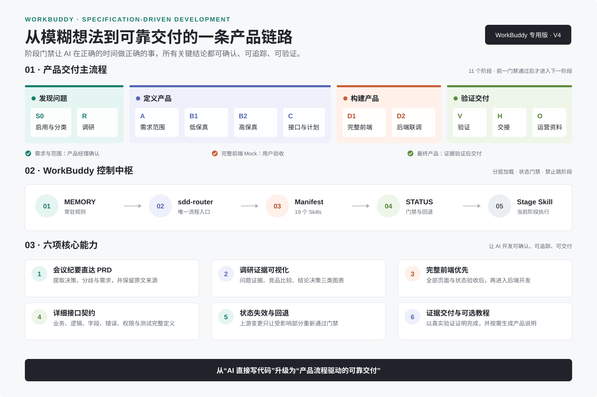

# WorkBuddy SDD V4：让 AI 开发从“直接写代码”变成可确认、可追踪、可交付的产品流程

当团队使用 AI 辅助开发时，真正困难的往往不是代码生成，而是如何保证 AI 理解了真实问题、没有跳过关键设计、前后端遵守同一份契约，并且能够用证据说明功能已经完成。

WorkBuddy SDD V4 正是为解决这些问题而设计的一套规格驱动开发规范。它以产品经理的工作视角组织整个开发过程，把调研、需求、设计、接口、前端、后端、验证、交接和运营资料串成一条明确的交付链路，并通过 WorkBuddy 的 Memory、Skills、Router 和状态文件约束 AI 在正确的阶段做正确的事情。



## 它解决什么问题

没有规范时，AI 开发很容易出现以下情况：

- 用户只说了一个模糊想法，AI 就直接开始搭建项目。
- PRD、原型、前端 Mock 和后端接口使用不同的数据结构。
- 页面只覆盖正常状态，遗漏加载、空数据、错误、无权限和禁用状态。
- 前端全部完成后才发现接口逻辑和业务规则无法支持页面。
- 测试没有实际运行，但进度已经被标记为完成。
- 会话中断后，新 Agent 只能依赖聊天记录重新猜测项目状态。
- 产品开发完成后，没有可交付给真实使用者的操作说明。

WorkBuddy SDD V4 用阶段门禁、唯一信息来源、状态回退和验证证据解决这些问题。它不会让 AI 变慢，而是把原本会在联调、返工和交接时付出的成本提前消化。

## 一条以产品为中心的主流程

这套 SDD 使用以下完整流程：

```text
S0 启用与任务分类
→ R 问题调研与竞品调研
→ A 产品需求与范围确认
→ B1 低保真设计
→ B2 高保真设计
→ C 详细接口设计与开发计划
→ D1 完整前端 Mock 产品与用户验收
→ D2 后端开发与真实接口联调
→ V 验证
→ H 交付与交接
→ O 可选运营资料
```

每个阶段都有明确输入、输出和确认条件。上一个阶段没有完成时，WorkBuddy 不会直接跳到后续编码阶段。

## 会议纪要可以直接转成产品需求

在 R 阶段，使用者既可以描述产品愿景，也可以直接上传会议纪要、访谈记录、需求讨论或会议转写稿。

WorkBuddy 会从材料中提取：

- 用户、场景与真实问题；
- 已经明确的会议决策；
- 候选方案与个人观点；
- 功能范围、业务约束和权限边界；
- 数据要求、风险和验收信号；
- 分歧、冲突与待确认事项。

系统会立即生成非空的调研报告和 PRD 草案，并为关键需求保留文件名、页码、章节、时间戳或原文片段等来源信息。这样既减少重复沟通，也避免把会议中的讨论建议误写成已经确认的需求。

## 调研结果不仅有文字，还有可视化

调研报告必须包含真实来源，并至少提供三类可视化：

1. 问题证据图，用来说明问题、原因、用户路径或数据趋势；
2. 竞品比较图，用来展示定位、流程、功能和能力差异；
3. 结论与决策图，用来说明证据如何导向最终产品范围。

有可靠数据时使用柱状图、折线图或分布图；没有可靠数值时使用问题树、用户旅程、比较矩阵或决策流程。规范明确禁止为了视觉效果虚构评分、市场规模、百分比和排名。

## 产品经理可以先看到完整前端

WorkBuddy SDD V4 保留“完整前端优先”的开发方式。

在 D1 阶段，前端会根据已经确认的高保真设计和接口契约，完成全部 MVP 页面、公共组件、导航、交互和集中式 Mock 数据。加载、空数据、失败、无权限、禁用和移动端状态也必须纳入实现。

产品经理可以先完整体验产品界面和业务流程。只有全部前端页面与 Mock 流程通过用户验收，项目才能进入 D2 后端开发。

后端阶段则按照数据和能力依赖逐功能推进。每完成一个后端能力，就立即将对应前端 Mock 切换为真实接口并进行联调，避免后端完成后前端仍停留在模拟状态。

## 接口文档可以直接指导开发和测试

C 阶段交付的不是简单接口清单，而是一份详细接口设计文档。每个接口至少包含：

- 接口编号和接口名称；
- 接口业务说明；
- 完整接口执行逻辑；
- 请求方法、路径和字段规则；
- 成功响应和字段含义；
- 错误码、触发条件和前端处理；
- 权限、数据隔离和敏感信息；
- 数据变化、事务和其他副作用；
- 幂等、并发与重复提交规则；
- 完整成功和失败示例；
- 验收与测试要点。

这份文档同时服务于前端 Mock、后端实现和接口测试，是前后端唯一的接口事实来源。

## WorkBuddy 如何保证流程稳定触发

V4 不是把大量规则全部塞进上下文，而是采用分层结构：

```text
MEMORY.md
→ sdd-router
→ skills-manifest.yaml
→ 项目与功能 STATUS
→ 当前阶段的主 Skill
→ 必要的质量与验证 Skill
```

MEMORY 只保存必须始终生效的短规则。`sdd-router` 是唯一流程入口，负责识别任务和当前阶段；Manifest 定义 20 个 Skills 的触发条件、前置条件、输出和允许的后继 Skill；STATUS 则记录项目实际进度和门禁。

即使 WorkBuddy 通过语义直接匹配到了某个下游 Skill，该 Skill 仍然需要检查 Router 和状态前置条件，不能自行跳过产品、设计或验证阶段。

## 状态不只会前进，也会正确回退

很多流程系统只会把状态从“未完成”改为“完成”，但真实产品开发会不断发生变化。

WorkBuddy SDD V4 定义了状态失效规则：

- PRD 范围变化后，受影响的设计、接口、计划和验证重新确认；
- 低保真主流程变化后，对应高保真和前端验收失效；
- 接口字段或业务逻辑变化后，对应 Mock、后端和验证失效；
- 实现代码发生行为变化后，相关功能重新进入未验证状态。

状态回退只影响实际受影响的部分，并记录原因、日期、相关文件和重新通过门禁所需动作。

## 完成必须有证据

所有“完成、修复、通过”结论都必须有新鲜验证证据。实际执行的命令、操作步骤、输出、截图和未覆盖原因会写入功能 EVIDENCE 文档。

自动化测试可以由 Agent 执行，但最终产品验收由用户完成。这样既保留了自动化效率，也保证产品经理对最终结果拥有决定权。

## 开发结束后可选生成完整教程

产品完成验证和交接后，WorkBuddy 会提示一次是否生成完整产品使用说明和操作教程。

这是可选运营能力，不影响开发交付。使用者选择生成后，系统会基于实际运行产品、最终界面和验证证据，输出安装启动、账号权限、产品导航、快速入门、核心功能操作、异常处理、安全说明、FAQ 和故障排查。UI 产品使用脱敏后的实际截图，API 或 CLI 产品使用可复制命令和真实输出。

## 交付文档可以发布到 zyplayer-doc Wiki

V4.1 新增 `wiki-publish` Skill。产品验证后，使用者可以要求把 PRD、接口契约、交接、启动或产品教程等 Markdown 发布到 zyplayer-doc Wiki。Skill 会检查官方 `zy-cli`、完成用户交互式设备绑定、逐级定位可编辑空间和目录、检查精确同名冲突，并在获得外部写入的明确授权后执行发布。创建或更新后必须回读文档详情和目标目录，不能仅凭上传响应声称完成。

Wiki 认证配置、设备码和私钥始终保留在用户本机，不写入项目、产物、测试或分发压缩包；如果源文档之后变化，既有发布证据自动过期，重新发布前仍需新的明确授权。

## 适合哪些使用者

这套 SDD 特别适合：

- 希望使用 AI 推进完整产品的产品经理；
- 需要先确认完整界面再进入后端开发的团队；
- 希望减少前后端联调返工的项目；
- 需要把会议材料快速转成规范需求的团队；
- 需要多次会话或多人接力开发的项目；
- 对测试证据、交接和使用教程有明确要求的产品。

## 如何开始

接收者只需要：

1. 解压 `WorkBuddy_SDD_V4.zip`；
2. 用 WorkBuddy 打开解压后的顶层文件夹；
3. 在首次对话中引用 `WORKBUDDY_START.md`；
4. 描述产品愿景，或者直接上传会议纪要。

WorkBuddy 会报告当前版本、阶段、功能、门禁和下一步，然后按 SDD 流程开始工作。

## 总结

WorkBuddy SDD V4 的核心不是增加更多文档，而是让每份文档都有唯一职责，让每个阶段都有明确完成条件，让 AI 的每次行动都能被用户确认、被后续实现追踪、被测试证据验证。

它把 AI 从一个“快速写代码的助手”，转变成一个遵守产品流程、能够持续交付和可靠交接的开发协作者。
