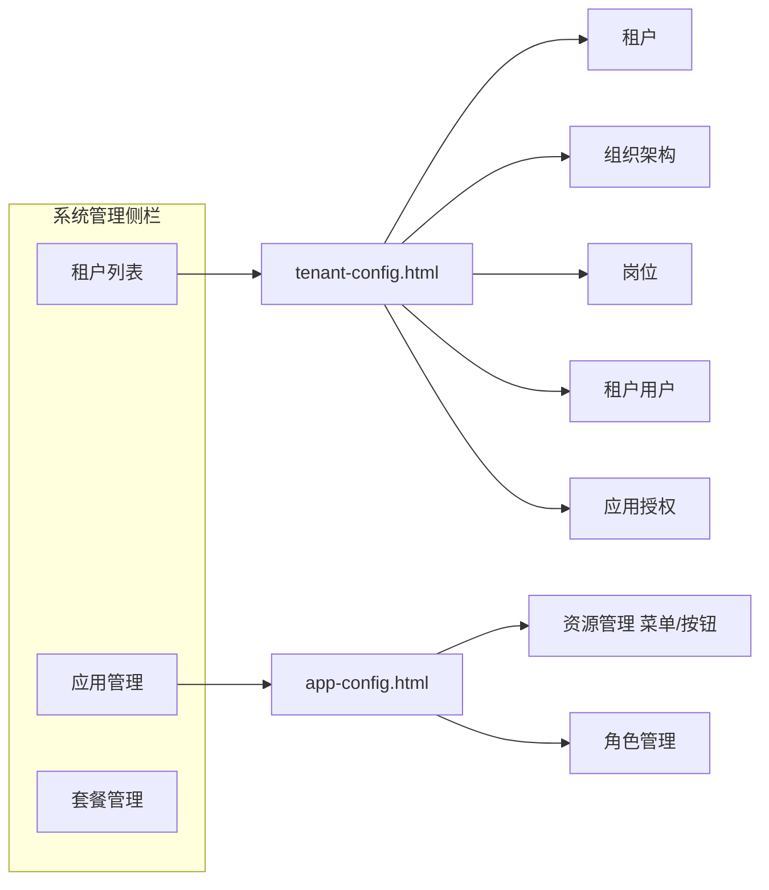

# 租户与应用管理层级调整

## 目标信息架构

**已确认决策：**
- 模板角色并入每个应用的「角色管理」（平台定义该应用内置角色；租户自建角色仍在商家后台）
- 配置页为唯一入口；列表「查看」进入配置页「租户」分页；`tenant-detail.html` 重定向到配置页

**范围：** 仅改运营后台原型（`prototype/ops/` + [`ops-shell.js`](prototype/assets/js/ops-shell.js)）；不改商家后台；PRD 文档本轮不改。

---

## 1. 侧栏导航精简

改 [`prototype/assets/js/ops-shell.js`](prototype/assets/js/ops-shell.js)：

- **租户管理** 组仅保留：`租户列表` → `tenants.html`
- 删除：`租户用户` / `租户角色` / `租户模板角色`
- **租户应用与资源** 组改为 **应用管理**，仅保留：`应用管理` → `apps.html`（去掉 `租户资源管理`）
- **套餐管理** 不变
- 同步精简 `assistCopy.tenant` 文案，指向「列表 → 配置」「应用 → 资源/角色」

---

## 2. 租户列表 → 配置入口

改 [`prototype/ops/tenants.html`](prototype/ops/tenants.html)：

- 行操作与名称链接统一为 `tenant-config.html?id=…`（默认 Tab=`tenant`）
- 操作文案：**配置**（替代「查看」）；保留资料管理 / 编辑 / 续费 / 进入商家后台
- 操作列加宽以容纳新入口

---

## 3. 新建统一配置页 `tenant-config.html`

新建 [`prototype/ops/tenant-config.html`](prototype/ops/tenant-config.html)，复用现有 `.tabs` 样式（同 [`invoices.html`](prototype/ops/invoices.html)）。

页头：返回租户列表 + 当前租户名/编码/状态；`data-nav="tenants"`。

| Tab（顺序） | 内容来源 | 要点 |
|---|---|---|
| 租户 | 吸收 [`tenant-detail.html`](prototype/ops/tenant-detail.html) | 基本信息、续费/编辑/停用；去掉跨页「用户管理→」 |
| 组织架构 | 吸收 [`tenant-depts.html`](prototype/ops/tenant-depts.html) | 去掉「切换租户」筛选，固定当前租户三级树 |
| 岗位 | **新建** | 岗位名称/编码/排序/状态；CRUD 弹窗；供用户表「职位」选用 |
| 租户用户 | 吸收 [`users.html`](prototype/ops/users.html) | 去掉跨租户筛选；角色选项改为已授权应用下的平台角色 |
| 应用授权 | 吸收 [`apps.html`](prototype/ops/apps.html) 授权弹窗 | 当前租户的应用授权表：套餐默认 / 单独授权 / 试用 / 取消 |

Tab 切换支持 `?tab=`，便于外链与重定向。

---

## 4. 应用管理改造

改 [`prototype/ops/apps.html`](prototype/ops/apps.html)：

- 标题/面包屑/侧栏一致为 **应用管理**
- 行操作：去掉跨租户「授权管理」；改为 **资源配置**、**角色管理** → `app-config.html?id=APP_xxx&tab=resources|roles`
- 保留编辑 / 版本 / 上架下架

新建 [`prototype/ops/app-config.html`](prototype/ops/app-config.html)：

| Tab | 内容来源 | 要点 |
|---|---|---|
| 资源管理 | 吸收 [`resources.html`](prototype/ops/resources.html) | 仅当前应用的资源树；类型突出 **菜单 / 按钮**（可保留接口）；去掉「所属应用」筛选项 |
| 角色管理 | 吸收 [`template-roles.html`](prototype/ops/template-roles.html) | 该应用的平台内置/模板角色；草稿→已发布→已下线；权限勾选限定本应用资源树 |

页头展示应用名称与标识；`data-nav="apps"`。

---

## 5. 旧页处理与外链

| 文件 | 处理 |
|---|---|
| `tenant-detail.html` | 改为跳转 `tenant-config.html?tab=tenant`（保留文件避免外链 404） |
| `users.html` / `tenant-depts.html` / `tenant-roles.html` / `template-roles.html` / `resources.html` | 分别重定向到配置页对应用户/组织 Tab，或 `apps.html` / `app-config`；侧栏已无入口 |
| `user-detail.html` | 「查看租户」→ `tenant-config.html`；返回链到配置页用户 Tab |
| `data.html` / `orders.html` / `recon.html` / `dashboard.html` / `audit-records.html` | 租户名链接改为 `tenant-config.html?id=…` |

不物理删除旧 HTML，以免评审书签断裂；内容以新页为准。

---

## 6. 实现节奏

1. 改 `ops-shell.js` 导航与 assist 文案  
2. 新建 `tenant-config.html`（五 Tab）并改 `tenants.html` 入口  
3. 新建 `app-config.html`（两 Tab）并改 `apps.html` 入口  
4. 旧页重定向 + 外链批量替换  
5. 浏览器点检：侧栏、租户配置五 Tab、应用配置两 Tab、旧 URL 跳转

## 非本轮

- 不改商家后台 `admin/user-roles.html` 等  
- 不更新 PRD Markdown（若需同步可另开任务）  
- 不做真实持久化（仍为原型 toast）
