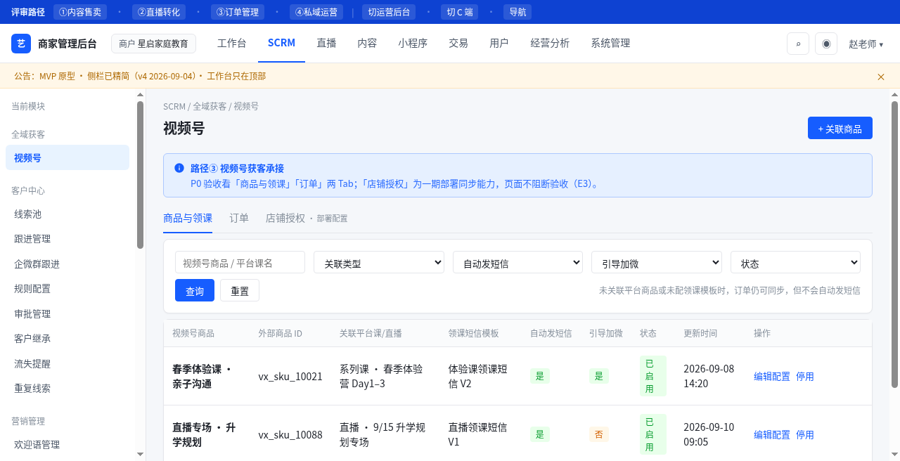
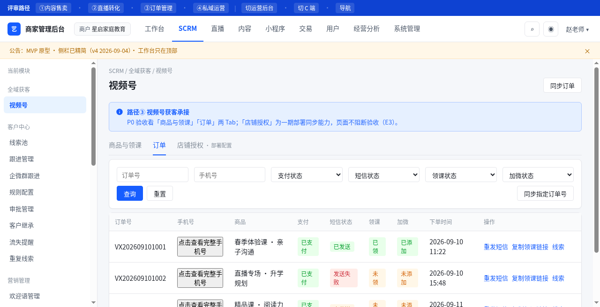
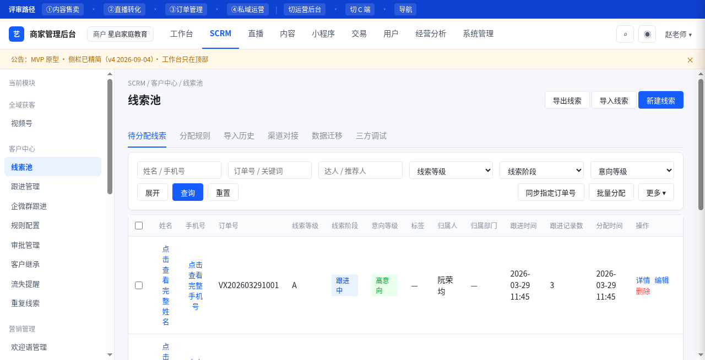
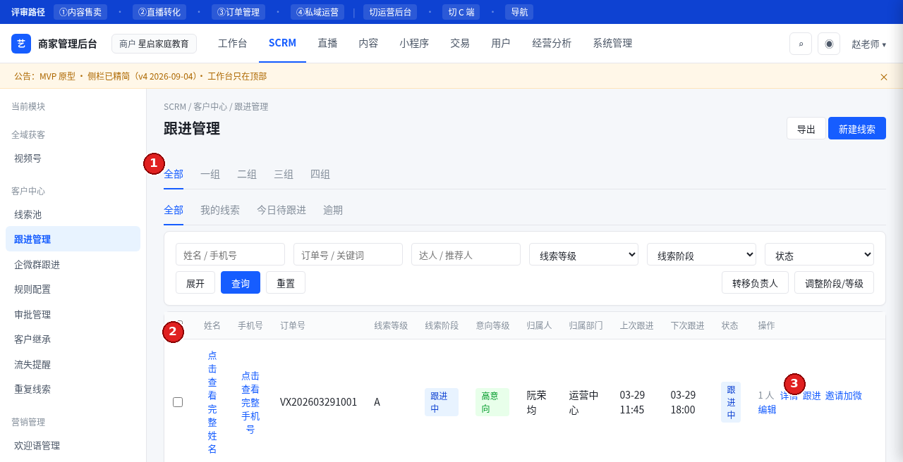
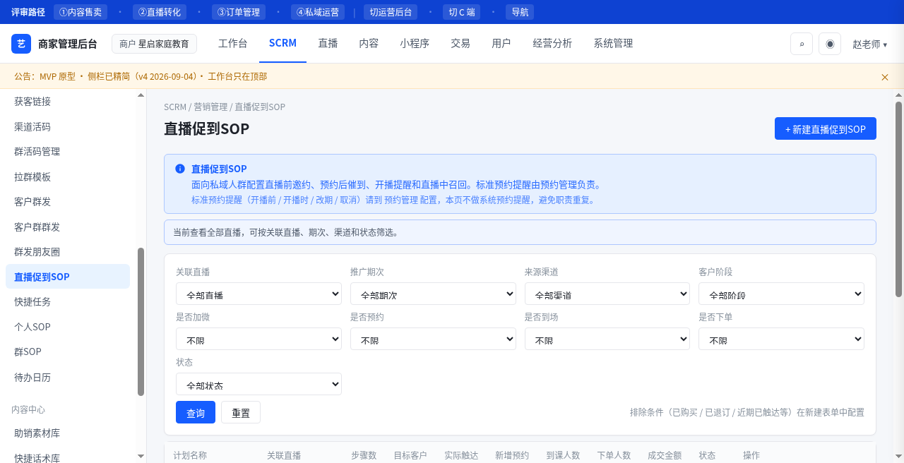
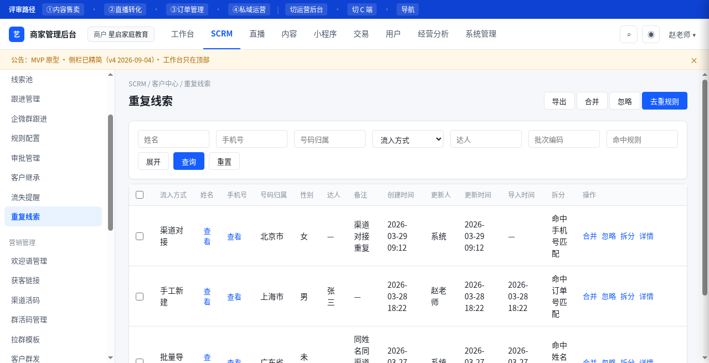

# 艺博教育 To-B · SCRM 手册级 PRD 样板（路径阻断 P0）

| 项 | 内容 |
|----|------|
| 文档编号 | ToB-PRD-01-SCRM-手册样板 |
| 版本 | **v0.6-draft** |
| 状态 | 产品总监条件通过后修订（S-3 **已冻结**；六张截图已烧录 ①②③） |
| 日期 | 2026-09-11 |
| 上游 | `ToB-PRD-00-总册.md` §5.3–5.4；`ToB-PRD-01-商家端-SCRM.md` v0.4；`ToB-PRD-待决策与P0冻结表.md` |
| 原型 | `prototype/admin/` · 视频号已对齐三 Tab |
| 截图目录 | `docs-out/manual-shots/`（已嵌入；图内含 ①②③；未标注备份见 `manual-shots/raw/`） |
| 真源顺序 | 决策 > 本样板（手册层）> 产品主文 > 研发支撑 > 原型 |

> **本文范围**：仅 5 个**路径阻断 P0**页面的手册体例。  
> **不展开**：欢迎语 / 获客链接 / 活码 / 群发 / 素材话术 / 快捷任务等 → 明确标为 **P0-lite（后置出手册）**。

---

## 变更记录

| 版本 | 日期 | 变更摘要 | 作者 |
|------|------|----------|------|
| v0.6-draft | 2026-09-11 | 条件通过 must-fix：跟进页去「艺博士」+ 组名通用化；重拍 03；六张图烧录 ①②③；S-3 **已冻结**；§10 列出嵌入截图；总册补 AC-④-06 | 产品经理执行稿 |
| v0.5-draft | 2026-09-11 | v0.5.1：嵌入六张原型实拍图；P0 阻断 vs P0-lite；S-3 拍板建议；跨模块 AC-④-04；5 页固定结构；开放问题 Owner 表 | 产品经理执行稿 |

---

## 0. 如何使用本样板

每页固定五段（产品总监要求）：

1. **截图（关键控件标注）** — 实拍原型图 + ①②③ **已烧录到图片内**（图注对照；未标注备份 `manual-shots/raw/`）  
2. **谁在什么场景用**  
3. **逐步操作（1.2.3.）**  
4. **空态 / 失败**  
5. **对应 AC 编号**

评审时优先确认：§1 对照表、§2 S-3、§3 跨模块打标、§4 Owner，再翻页面章节。

---

## 1. P0 阻断 vs P0-lite 对照表

> 回应总监必须改①：验收与手册节奏拆开——**路径走不通就阻断**；菜单可在但非最短闭环的能力后置出手册。

| 层级 | 定义 | 本期范围 | 手册节奏 | 验收 |
|------|------|----------|----------|------|
| **路径阻断 P0** | 没有则路径③或④无法演示闭环 | ① 视频号（商品+订单）② 线索池 ③ 跟进管理 ④ 直播促到 SOP ⑤ 重复线索 | **本手册样板覆盖** | 进发布检查清单 |
| **P0-lite（后置出手册）** | 主路径常用配置/助销工具；可并行开发，不挡最短闭环演示 | 欢迎语、获客链接、渠道活码、客户群发（基础）、助销素材、快捷话术、快捷任务；以及推广期次/分配规则在线索池 Tab 内可完成的配置、渠道管理、简化规则配置 | **后置单独手册**（不阻塞本样板评审） | 仍可标 P0 能力，但**不作为本样板截图验收门禁** |
| **P1 / 不做** | 菜单可在（D5=B）或不做 | 企微群跟进/审批/继承/流失、群活码/拉群模板/朋友圈/SOP 深页等；**小店/企微授权配置页不做验收**（E3 部署同步） | 不进本手册 | 不进主路径验收 |

### 1.1 五页路径阻断清单（本样板）

| # | 页面 | 原型 | 阻断哪条路径 |
|---|------|------|--------------|
| 1 | 视频号（商品与领课 + 订单） | `videos.html` | ③ |
| 2 | 线索池 | `leads.html` | ④ 前段（入库/分配） |
| 3 | 跟进管理 | `follow-ups.html` | ④ 日常跟进 |
| 4 | 直播促到 SOP | `live-invite.html` | ④ 促到触达 |
| 5 | 重复线索 | `leads-dup.html` | ④ 数据质量（合并） |

### 1.2 明确列为 P0-lite（后置出手册）

- 欢迎语（`welcome.html`）  
- 获客链接（`acquire-links.html`）  
- 渠道活码（`channel-livecode.html`）  
- 客户群发（`mass-customer.html` 等基础群发）  
- 助销素材 / 快捷话术（`material.html` / `phrases.html`）  
- 快捷任务（`quick-tasks.html`）  

> 说明：推广期次 + 分配规则能力仍为路径④ P0，但**手册截图以线索池「分配规则」Tab 可完成为准**（见开放问题 S-4）；不另开独立手册页于本样板。

---

## 2. S-3 线索主状态机（**已冻结**）

| 项 | 冻结结论 |
|----|----------|
| 议题 | 线索「主状态机」vs「加微 / 领课」是否互斥枚举 |
| **冻结结论** | **Lead 主状态**走：`新建 → 已分配 → 跟进中 → 已转化 / 已流失`（无效/合并为旁路终态，细则见研发支撑）。**`加微状态`与`领课状态`为并行属性字段**，展示在列表/详情列中，**不作为主状态互斥枚举**。 |
| 理由 | 同一线索可同时「跟进中 + 已领课 + 未加微」；若把加微/领课塞进主状态，列表筛选与看板口径会互相打架，且与订单侧并行字段不一致（R-SCRM-010）。 |
| UI 约定 | 列表至少三列语义：主状态（或线索阶段映射）、加微状态、领课状态；筛选可独立组合。 |
| 对研发 | 主状态机迁移表不含 `wecom_added` / `lesson_claimed` 作为主状态节点；二者写在属性字段与事件回写。 |
| 状态 | **已冻结**（2026-09-11，用户 + 产品总监）。研发按本结论实现列表与接口。 |

**冻结文案**：

> S-3（已冻结）：线索主状态机为「新建→已分配→跟进中→已转化/已流失」；加微状态、领课状态为并行属性，不进入主状态互斥枚举。

---

## 3. 跨模块 AC：AC-④-04 打标

| 项 | 内容 |
|----|------|
| AC 编号 | **AC-④-04**（延续总册 / SCRM 主文编号） |
| Given | 用户模块「标签」能力可用（标签字典已配置，线索/用户可挂载） |
| When | 助教/管理员在跟进详情或用户详情执行手动打标 |
| Then | 同一标签在线索视图与用户视图一致可见；刷新后仍在；无权限用户不可改他人标签（权限细则跟用户模块） |

### 3.1 阻塞依赖

若 **用户模块标签能力未交付**，则 AC-④-04 标为 **阻塞依赖（Blocked）**，不得伪造成「本模块已验收」。

### 3.2 临时方案（本模块）

| 临时方案 | 说明 |
|----------|------|
| 只读展示 | SCRM 跟进/线索详情仅展示**已有标签**（只读 chips），不提供「新增/编辑标签」入口 |
| 文案 | 空标签时提示：「标签能力由用户模块提供，当前只读」 |
| 解阻条件 | 用户模块交付打标写接口后，去掉只读限制，按 AC-④-04 回归 |

---

## 4. 开放问题 Owner 表

> 不要全「待定」——用**角色 +「待指定姓名」**，便于拉会时点名。

| ID | 问题 | 建议 / 假设 | Owner 建议 |
|----|------|-------------|------------|
| **S-1** | 领课链接是否过期及默认时长 | 可配置，默认 7 天；过期可重发新链 | **产品经理（待指定姓名）** + 研发评审链接签发 |
| **S-2** | 「已转化」口径 | 假设：关联任一有效付费订单即已转化 | **业务（待指定姓名）** 拍口径；产品经理落状态映射 |
| **S-3** | 主状态 vs 加微/领课并行 | **已冻结**（§2）：主状态机 + 并行属性 | 用户 + 产品总监（2026-09-11） |
| **S-5** | 战败/无效申请是否进 P0 | **P0 有权直接变更**；申请流 P1 | **产品经理（待指定姓名）**；若业务强要审批则升级评估 |
| **D5** | SCRM 菜单保留粒度 | **B**：菜单可在，验收只认路径阻断 P0 + 约定 P0-lite | **产品经理（待指定姓名）** 对齐估期；业务知情 |
| **E2** | 企微服务商 / 第三方应用身份 | 未落实 → 企业内部应用边界 | **业务（待指定姓名）** 跟进资质；研发按边界降级 |
| **E3** | 视频号小店授权方式 | 一期**部署同步**；配置页不阻断验收 | **研发（待指定姓名）** 部署方案；产品不验收授权 Tab |
| **E5** | 短信（及外呼）供应商 | 促到 P0 以短信为主；外呼额度 P1 | **业务（待指定姓名）** 选商；研发对接；产品验收失败重发 |

---

## 5. 页面手册 · ① 视频号（`videos.html`）

### 5.1 截图（关键控件标注）

**图注 · 图内已标注**

| 标注 | 控件 |
|------|------|
| ① | 商品 Tab「商品与领课」（默认） |
| ② | 「+ 关联商品」与表格行「编辑配置」 |
| ③ | 商品表格 |

**图注 · 图内已标注**

| 标注 | 控件 |
|------|------|
| ① | 订单 Tab |
| ② | 行操作「重发短信」 |
| ③ | 订单表 |

> 「店铺授权」Tab 截图**非本手册验收必拍**；若拍，须在图上注明「非路径阻断」。

### 5.2 谁在什么场景用

| 角色 | 场景 |
|------|------|
| 商户管理员 | 视频号新商品上架后，关联平台课/直播并配领课短信；日常看订单短信/领课/加微，失败重发或复制链接给人肉触达 |
| 助教 / 销售 | 一般只读订单或从线索跳入；不改全局商品配置（按权限） |

### 5.3 逐步操作

**商品与领课**

1. 进入 SCRM → 全域获客 → **视频号**（默认落在「商品与领课」）。  
2. 点击「+ 关联商品」（或行内「关联」）→ 选择视频号商品、平台课/直播 → 填写领课短信模板（含链接占位）→ 设置是否自动发短信 / 引导加微 → 保存。  
3. Toast「配置已保存」；列表出现「已启用」。

**订单**

1. 切到 Tab「订单」。  
2. 确认同步订单可见：订单号、脱敏手机、商品、支付、短信、领课、加微。  
3. 若短信失败/未发送 →「重发短信」→ 状态更新或再次失败留痕。  
4. 需人肉触达 →「复制领课链接」→ Toast「已复制」。  
5. 需要跟进 →「线索」跳转线索池/详情。

### 5.4 空态 / 失败

| 情况 | 系统表现 |
|------|----------|
| 无关联商品 | 空表 + 引导「先关联商品并配置领课模板」 |
| 未配模板的订单同步 | 订单可见；**不自动发短信**；提示去配置（R-SCRM-007） |
| 短信发送失败 | badge「发送失败」；可重发；留痕 |
| 领课链接过期（S-1） | 复制/打开提示过期；后台可重发新链 |
| 重复领课 | C 端幂等「已领取」；后台仍为已领（R-SCRM-009） |
| 授权未做 | **不阻断**本页商品/订单操作；授权 Tab 仅部署示意 |

### 5.5 对应 AC 编号

| AC | 摘要 |
|----|------|
| **AC-③-01** | 订单视图可见订单号/脱敏手机/商品/支付/短信/领课/加微（不依赖授权页） |
| **AC-③-02** | 重发短信后状态或失败原因符合规则 |
| **AC-③-03** | 领课成功回写订单+线索，可跳转线索 |
| **AC-③-04** | 商品关联+模板配置后，新订单可走领课链路 |
| AC-SCRM-301 | 未配置模板时不自动发短信且提示配置 |

---

## 6. 页面手册 · ② 线索池（`leads.html`）

### 6.1 截图（关键控件标注）

**图注 · 图内已标注**

| 标注 | 控件 |
|------|------|
| ① | Tab 区「待分配线索 / 分配规则 / …」 |
| ② | 筛选条 |
| ③ | 列表 / 分配（含批量分配与行操作） |

### 6.2 谁在什么场景用

| 角色 | 场景 |
|------|------|
| 商户管理员 | 视频号/导入线索入库后，看待分配、配分配规则（渠×品×期次）、批量指派、新建/导入 |
| 助教 | 通常在「跟进管理」看名下线索；线索池以管理员操作为主 |

### 6.3 逐步操作

1. 进入 SCRM → 客户中心 → **线索池** → Tab「待分配线索」。  
2. 按手机号/订单号/等级/阶段等筛选 → 查询。  
3. 勾选多条 →「批量分配」→ 选择归属人/部门 → 确认；线索进入已分配（衔接到跟进）。  
4. （可选）Tab「分配规则」：新建规则（渠道 × 商品 × 期次 → 成员/轮询或人均上限）→ 启用。  
5. （可选）「新建线索」或「导入线索」补数据；导出按权限。

### 6.4 空态 / 失败

| 情况 | 系统表现 |
|------|----------|
| 无线索 | 空态引导「配置视频号商品或导入线索」 |
| 未命中规则 / 无人可分 | 留在待分配；可手工批量分配 |
| 手机号缺失（视频号同步） | 仍入库，标数据质量问题，不阻断同步 |
| 无勾选点批量分配 | 按钮 disabled |
| 脱敏 | 默认掩码；点击按权限查看完整信息 |

### 6.5 对应 AC 编号

| AC | 摘要 |
|----|------|
| **AC-④-01** | 期次+规则匹配后自动分配或进入待分配/轮询 |
| （支撑）R-SCRM-004/005 | 分配策略 P0 仅轮询与人均上限 |

---

## 7. 页面手册 · ③ 跟进管理（`follow-ups.html`）

### 7.1 截图（关键控件标注）

**图注 · 图内已标注**

| 标注 | 控件 |
|------|------|
| ① | 分组 / Tab（全部 · 一组 / 二组 / 三组 / 四组；二级：全部 / 我的线索 / 今日待跟进 / 逾期） |
| ② | 待跟进列表 |
| ③ | 跟进操作（详情 / 跟进 / 邀请加微 / 编辑；**无「艺博士」**） |

### 7.2 谁在什么场景用

| 角色 | 场景 |
|------|------|
| 助教 / 销售 | 每日打开「今日待跟进 / 逾期」，写跟进、调意向、看领课加微，推进转化 |
| 商户管理员 | 抽查全部线索、转移负责人、调整阶段/等级（P0 直接变更，S-5） |

### 7.3 逐步操作

1. 进入 SCRM → 客户中心 → **跟进管理**。  
2. 切到「今日待跟进」（或「我的线索」）。  
3. 打开某条线索 → 填写跟进方式 / 内容 / 下次跟进时间 / 意向 → 保存。  
4. 列表「上次跟进 / 下次跟进」更新；主状态可由「已分配」进入「跟进中」（S-3）。  
5. 若用户模块可用 → 手动打标（AC-④-04）；否则仅只读已有标签（§3.2）。

### 7.4 空态 / 失败

| 情况 | 系统表现 |
|------|----------|
| 今日无待跟进 | 空态「暂无待跟进，可切换全部/我的线索」 |
| 保存跟进校验失败 | 必填项提示，不关闭表单 |
| 无权限改他人线索 | 操作隐藏或 Toast 无权限 |
| 标签模块未交付 | 打标入口隐藏；只读展示（阻塞 AC-④-04） |
| 标无效/战败 | P0 直接变更并填原因；申请流不验收（S-5） |

### 7.5 对应 AC 编号

| AC | 摘要 |
|----|------|
| **AC-④-02** | 写跟进后最近跟进时间更新，状态可到跟进中 |
| **AC-④-04** | 手动打标在线索与用户视图一致（依赖用户模块；否则阻塞+只读临时方案） |

---

## 8. 页面手册 · ④ 直播促到 SOP（`live-invite.html`）

### 8.1 截图（关键控件标注）

**图注 · 图内已标注**

| 标注 | 控件 |
|------|------|
| ① | 计划列表 |
| ② | 「+ 新建直播促到SOP」 |
| ③ | 触达步骤（表头「步数」；创建弹窗内配置短信步骤） |

### 8.2 谁在什么场景用

| 角色 | 场景 |
|------|------|
| 商户管理员 | 下场直播审核通过后，建促到计划：圈未到课/未加微等人群，配置开播前短信步骤并启动 |
| 助教 | 查看触达结果与未到课名单，回到跟进继续私聊 |

### 8.3 逐步操作

1. 进入 SCRM → 营销管理 → **直播促到 SOP**。  
2. 点击「+ 新建」→ 填计划名称、关联直播、推广期次、人群条件（如未加微/未到课）、排除条件。  
3. 添加步骤：触发时机（如开播前 1 小时）→ 通道选**短信**（P0）→ 选/填短信模板 → 保存。  
4. 启动计划 → 到点执行（或手工触发示意）。  
5. 查看执行结果：成功/失败数；打开未到课名单示意 → 可跳转跟进。

### 8.4 空态 / 失败

| 情况 | 系统表现 |
|------|----------|
| 无计划 | 空态「暂无促到 SOP，点击右上角新建」 |
| 已结束场次 | 不可新建/启动；仅可查看 |
| 短信失败 | 结果中计失败；可按供应商规则重试（E5）；外呼不进 P0 |
| 未选直播/无模板 | 保存拦截并提示 |
| 与预约管理职责 | 标准预约提醒走预约管理；本页不做系统预约提醒重复配置 |

### 8.5 对应 AC 编号

| AC | 摘要 |
|----|------|
| **AC-④-03** | 已选直播与人群创建促到计划；短信执行后可见成功/失败及未到课示意 |
| （支撑）R-SCRM-013 | 促到 P0 通道为短信 |

---

## 9. 页面手册 · ⑤ 重复线索（`leads-dup.html`）

### 9.1 截图（关键控件标注）

**图注 · 图内已标注**

| 标注 | 控件 |
|------|------|
| ① | 重复列表 |
| ② | 合并操作（抽屉「确认合并」） |
| ③ | 保留线索选择（主线索单选） |

### 9.2 谁在什么场景用

| 角色 | 场景 |
|------|------|
| 商户管理员 | 导入与视频号等同号线索并存时，确认主从并合并，避免重复分配与跟进分裂 |
| 助教 | 一般不操作合并；发现重复可提报管理员 |

### 9.3 逐步操作

1. 进入 SCRM → 客户中心 → **重复线索**。  
2. 按手机号或命中规则筛选疑似组。  
3. 点「合并」→ 在抽屉中选择**主线索** → 选合并策略（主线索字段优先等）→ 确认合并。  
4. 从线索归档/关闭且不可再分配；跟进记录挂到主线索。  
5. （可选）对误报点「忽略」；或在「去重规则」调整识别规则（基础）。

### 9.4 空态 / 失败

| 情况 | 系统表现 |
|------|----------|
| 无重复组 | 空态「暂无命中重复规则的线索」 |
| 未选主线索 | 确认按钮不可用或提示必选 |
| 合并冲突字段 | 以主线索优先；可提示合并后编辑 |
| 无权限 | 隐藏合并或 Toast |

### 9.5 对应 AC 编号

| AC | 摘要 |
|----|------|
| **AC-④-06** | 重复线索合并成功后只保留一条主线索、跟进人/期次不丢、可追溯合并记录（总册路径④；页面 `leads-dup.html`） |

---

## 10. 已嵌入截图清单（v0.6 · 图内含 ①②③）

静态服务（本机）：`python3 -m http.server 8765`（cwd = `prototype/`）  
标注图：`docs-out/manual-shots/` · 未标注备份：`docs-out/manual-shots/raw/`

| 嵌入文件 | URL | 图内标注 |
|----------|-----|----------|
| `manual-shots/01-videos-goods.png` | http://127.0.0.1:8765/admin/videos.html | ①商品 Tab ②关联/配置 ③商品表格 |
| `manual-shots/01b-videos-orders.png` | http://127.0.0.1:8765/admin/videos.html（订单 Tab） | ①订单 Tab ②重发短信 ③订单表 |
| `manual-shots/02-leads.png` | http://127.0.0.1:8765/admin/leads.html | ①Tab 区 ②筛选 ③列表/分配 |
| `manual-shots/03-follow-ups.png` | http://127.0.0.1:8765/admin/follow-ups.html | ①分组/Tab ②待跟进列表 ③跟进操作（无艺博士） |
| `manual-shots/04-live-invite.png` | http://127.0.0.1:8765/admin/live-invite.html | ①计划列表 ②创建计划 ③触达步骤 |
| `manual-shots/05-leads-dup.png` | http://127.0.0.1:8765/admin/leads-dup.html（合并抽屉） | ①重复列表 ②合并操作 ③保留线索选择 |

---

## 11. 附录 · 编号连续性说明

本样板延续：

- 总册路径 AC：`AC-③-01` … `AC-③-04`，`AC-④-01` … `AC-④-06`  
- SCRM 主文补充：`AC-SCRM-301` 等  
- 已写入总册：`AC-④-06` 重复线索合并（`leads-dup.html`）  
- 规则引用：`R-SCRM-007/008/009/010/013/020`（见研发支撑）

---

**文档结束（SCRM 手册样板 v0.6-draft）** · S-3 已冻结；六张标注截图已嵌入；请优先确认 §1–§4 与各页 AC。
