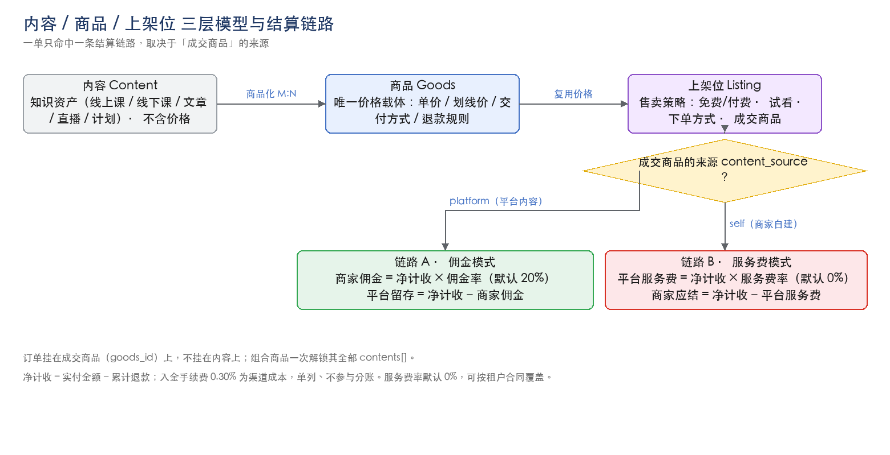
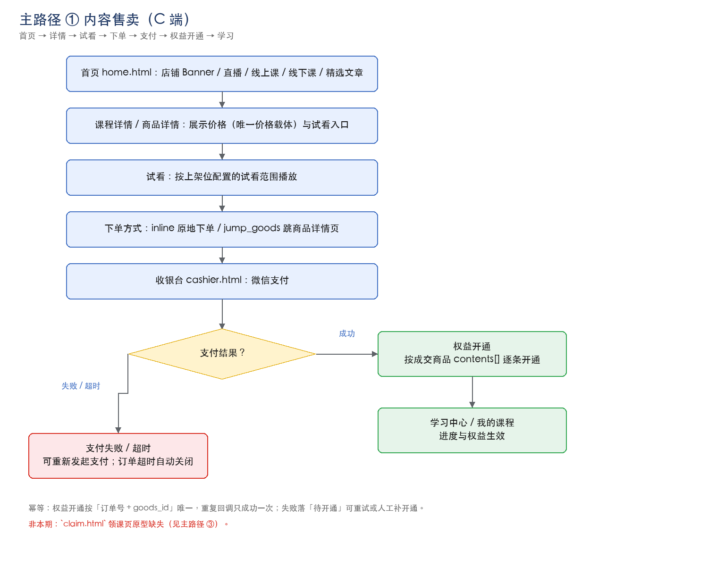
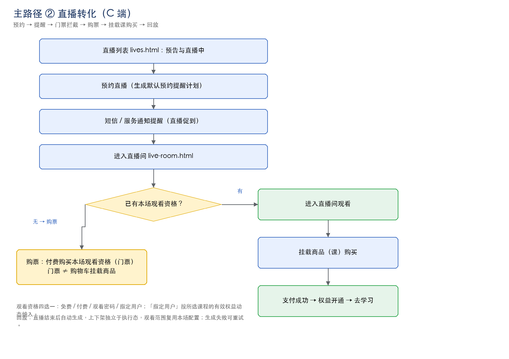
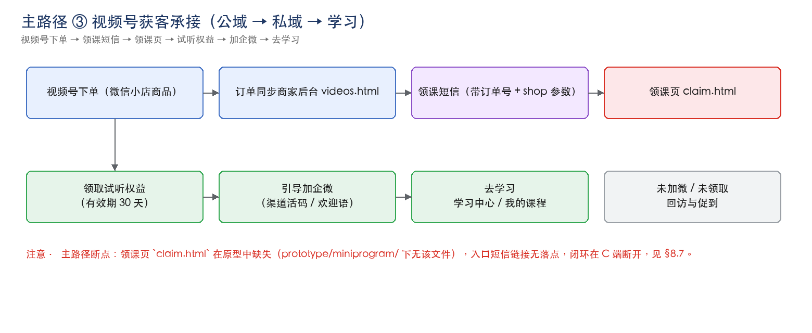
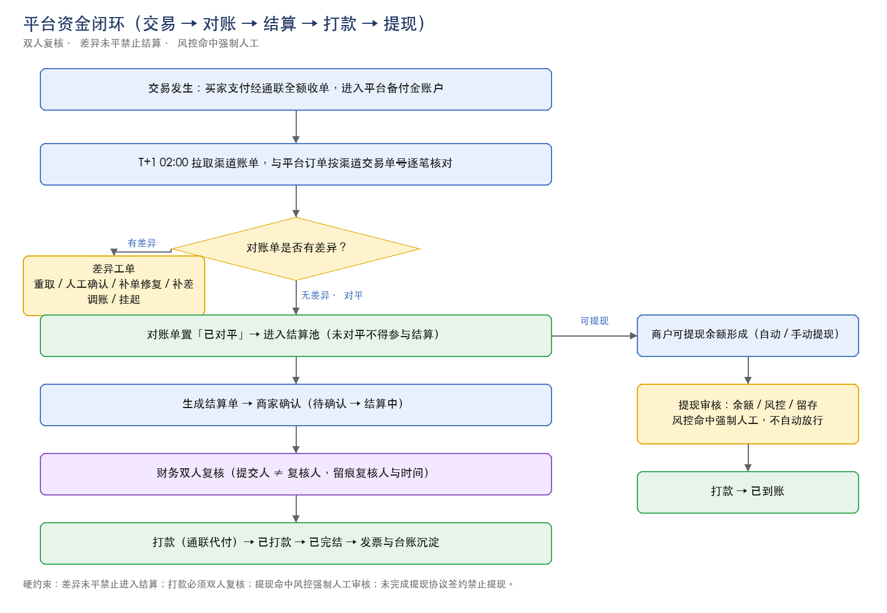
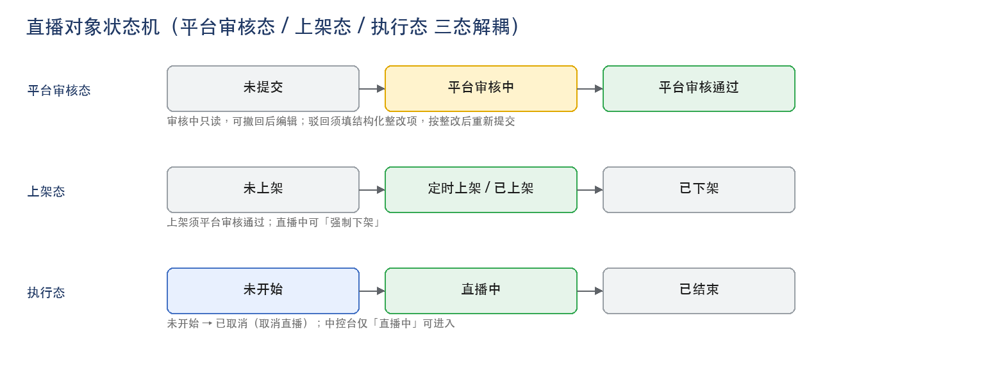
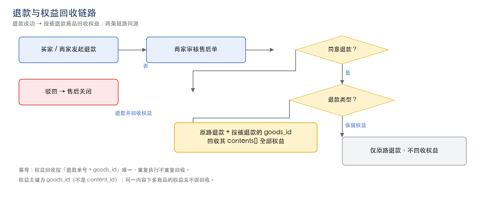
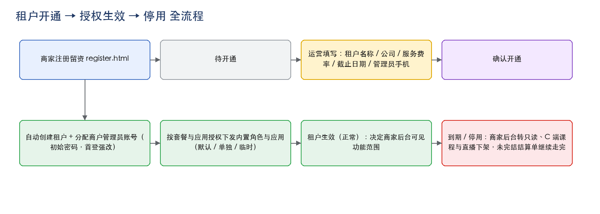

# 艺博教育 To-B 获客整体解决方案 · 产品需求文档（一期 MVP）

- **文档编号**：ToB-PRD-V3.0
- **版本**：V3.0（**一期 MVP 整合版**）
- **日期**：2026-10-03
- **适用范围**：商家管理后台 · 平台运营后台 · C 端 To-B 小程序
- **文档状态**：待评审
- **范围口径**：**本文只覆盖一期（MVP）范围**。二期能力不在本文正文范围内，仅在 §7.3 列出名单。
- **原型基线**：`tob-solution-main/prototype`（商家端 141 页 / 运营端 80 页 / C 端 22 页 / 入口 3 页，共 246 页）
- **本文详述页面**：本期 118 个页面块（商家端 67 / 运营端 27 / C 端 21 + 入口 3），逐页给出字段说明。

---

## 文档修订记录

- **V3.0（2026-10-03）** — 按评审意见收敛为**一期 MVP 版**：① 全文只保留一期内容，二期整体移出正文（§7.3 仅留名单）；② **功能清单改为表格**，并新增三端功能地图；③ 复杂逻辑补 **8 张流程图**；④ SCRM 约 90% 复用现网，正文**只详写用户列表、标签管理、期次管理**三处新增/改造项；⑤ **服务费率默认口径统一为 0%**（可按租户合同覆盖）。
- **V2.0（2026-10-03）** — 版式与内容密度重构：正文除「页面字段说明表」外不再使用表格；逐页新增字段说明（位置 / 来源 / 类型与限制 / 计算规则）；压缩前部章节。字段回归原型 HTML 复核。
- **V1.0（2026-10-03）** — 首次整合：以参考 PRD（全渠道 CRM 一系）结构为骨架，合并原总册、三端分册、附录与交易口径文档。
- **上游依据** — `docs/交易口径-费率与分账基准.md`（唯一费率口径）；`prototype/assets/js/phase2-config.js`（一期/二期唯一事实源，2026-10-02）；`docs/phase2-checklist.md`；`docs/ToB-PRD-00-总册.md`；`docs/ToB-PRD-01-商家端.md`；`docs/ToB-PRD-02-C端小程序.md`；`docs/ToB-PRD-03-运营后台.md`；`docs/运营后台-交易与结算域-详细设计.md`；`docs/数据看板-口径与改版.md`。

---

## 目录

- 文档修订记录
- 1 文档说明
  - 1.1 文档目的与读者
  - 1.2 参考文档与原型地址
  - 1.3 术语与缩写
  - 1.4 本版阅读约定
  - 1.5 事实来源与冲突取舍
- 2 产品概述
  - 2.1 产品定位
  - 2.2 产品目标
  - 2.3 用户与角色
  - 2.4 总体业务流程
- 3 产品结构与全局约定
  - 3.1 三端关系与多租户隔离
  - 3.2 功能清单（一期）
  - 3.3 功能地图
  - 3.4 内容 / 商品 / 上架三层模型
  - 3.5 全局交互约定
  - 3.6 角色权限与数据范围
- 4 端到端主路径与验收
  - 4.1 五条主路径
  - 4.2 验收方式
- 5 产品功能性需求
  - 5.1.1 工作台
  - 5.1.2 SCRM
  - 5.1.3 直播
  - 5.1.4 内容
  - 5.1.5 交易
  - 5.1.6 数据
  - 5.1.7 系统管理
  - 5.1.8 小程序配置（店铺装修与页面配置）
  - 5.2.1 工作台
  - 5.2.2 财务
  - 5.2.3 数据
  - 5.2.4 系统管理（含租户管理）
  - 5.3.1 导航与多租户隔离
  - 5.3.2 首页与店铺门面
  - 5.3.3 课程与内容消费
  - 5.3.4 学习与学习中心
  - 5.3.5 直播与回放
  - 5.3.6 领课与加微
  - 5.3.7 下单与支付
  - 5.3.8 我的
  - 5.3.9 测评与定制化计划
  - 5.3.10 入口页
- 6 非功能性需求
  - 6.1 性能
  - 6.2 兼容性
  - 6.3 安全与合规
  - 6.4 可用性与可观测
  - 6.5 数据一致性
- 7 本期范围与迭代路线
  - 7.1 范围口径
  - 7.2 本期范围（按端）
  - 7.3 非本期（二期）名单
  - 7.4 与完整方案的差异
  - 7.5 里程碑与发布策略
  - 7.6 开放问题与风险
- 8 附录
  - 8.1 跨端状态机索引
  - 8.2 权限与敏感操作
  - 8.3 核心数据实体与关键字段
  - 8.4 指标口径索引
  - 8.5 费率与分账基准
  - 8.6 本期页面索引
  - 8.7 待补清单汇总

---

## 1 文档说明

### 1.1 文档目的与读者

本文档定义「艺博教育 To-B 获客整体解决方案」**一期（MVP）**的功能范围、页面内容、字段定义、交互逻辑、业务规则与验收标准。

- **产品 / 设计**：确认页面范围、字段与交互是否覆盖业务诉求。
- **研发**：以第 5 章的页面字段表为数据结构与表单校验依据。
- **测试**：以第 5 章字段限制与 §4.1 主路径为用例来源。
- **运营 / 业务**：确认一期范围与开放问题。

本文档同时承担两项职责：**范围裁决**（P0 / P1）与**字段裁决**（每个字段的来源、类型与计算规则）。二期不在本文裁决范围。

### 1.2 参考文档与原型地址

- 三端原型入口：`prototype/index.html`
- 商家管理后台：`prototype/admin/dashboard.html`
- 平台运营后台：`prototype/ops/dashboard.html`
- C 端 To-B 小程序：`prototype/miniprogram/home.html`
- 商家注册留资：`prototype/register.html`；登录页：`prototype/login.html`
- 一期 / 二期判定：`prototype/assets/js/phase2-config.js` 与 `docs/phase2-checklist.md`
- 费率与分账：`docs/交易口径-费率与分账基准.md`

原型为**静态假数据**，按钮以 Toast 反馈为主，用于评审对齐，**不代表后端已实现**。

### 1.3 术语与缩写

- **租户 / 商户**：一家入驻机构，拥有独立数据域，是商家后台与 C 端店铺的唯一归属主体。
- **期次**：招生 / 推广经营周期，含名称、起止时间、负责人与目标；生命周期为 未开始 → 进行中 → 已结束。
- **内容（Content）**：知识资产本体（线上课 / 线下课 / 文章 / 直播），**不承载价格**。
- **商品（Goods）**：**唯一价格载体**，含定价、划线价、交付方式、退款规则、审核态；`contents[]` 是内容↔商品关系的权威源（M:N）。
- **组合商品**：1 个商品交付 N 个内容；购买一次解锁全部交付内容，退款时按该商品的 `contents[]` 一并回收。
- **上架位（Listing）**：内容在小程序模块中的**售卖策略**：免费 / 付费 → 试看范围 → 下单方式 → 默认成交商品；同一内容可在多个模块各有独立上架位。
- **下单方式 `order_mode`**：`jump_goods` = 跳转商品详情页下单；`inline` = 不跳转，直接在内容页按成交商品金额下单。
- **商品来源 `content_source`**：**成交商品**的来源，取值 `platform`（平台）/ `self`（商家自建），决定走链路 A 还是链路 B。
- **`goods_source`**：微信小店商品的微信侧分发场景（视频号 / 直播），**与分账无关**，与上一条同名不同义。
- **链路 A / 链路 B**：平台内容订单（平台留存佣金）/ 商家自建内容订单（平台收服务费）。
- **领课**：视频号订单买家经短信链接兑换试听权益的动作。
- **促到**：直播前 / 中对未到场用户的 SOP 召回触达，区别于标准预约提醒。
- **进件**：通联云商通会员开通（企业 / 个人两类会员主体）。
- **提现签约**：会员—平台—通联三方电子协议；未签约禁止提现。
- **双人复核**：结算打款须第二人复核，**提交人 ≠ 复核人**。
- **P0 / P1**：优先级。P0 = 本期必做、进验收；P1 = 本期原型范围、可点，不阻塞试点上线，单独排期。
- **SCRM**：社会化客户关系管理，本方案中约 90% 复用现网已有能力。

### 1.4 本版阅读约定

第 5 章每个页面按固定六段展开：**页面说明 → 页面结构 → 主路径 → 字段说明 → 业务规则 → 验收标准**。其中「字段说明」是本文档的字段裁决依据，读法如下：

- **字段**：一律使用原型界面上显示的中文名；原型只有控件没有中文名的，标注控件 id。
- **位置**：取值如 `筛选区`、`列表列`、`详情信息`、`新建弹窗`、`编辑弹窗`、`导入弹窗`、`卡片`、`Tab`、`顶部统计`。
- **来源**：只能是以下六个词之一：
  - **新建** — 本页是该字段的首次产生地，研发需按本页的类型与限制建字段；
  - **录入** — 用户在本页填写，但字段归属其他实体（如跟进记录里的备注）；
  - **系统生成** — 系统自动写入，如主键 ID、创建时间、操作人、流水号；
  - **计算得出** — 由其他字段算出，「说明 / 计算规则」列一定给出公式；
  - **引用** — 来自其他页面或端，说明列写清来源页面 + 来源字段 + 生效时机；
  - **外部同步** — 来自外部系统（微信小店、视频号、企业微信、通联云商通、短信通道），说明列写清同步来源与触发时机。
- **类型与限制**：数据类型、长度、是否必填、枚举取值、格式、唯一性、默认值、可否编辑。**只有标「新建」的字段必须写全**。
- **说明 / 计算规则**：字段的由来，或引用来源，或计算公式与统计口径。

其余约定：

- 全文表格只用于两处：**页面字段说明表**与**功能清单表**；其余内容（页面结构、主路径、业务规则、验收标准）一律条目化。
- 业务规则以 `R-<模块>-<序号>` 编号，便于测试用例引用。
- 页面块标题格式为「页面名（`文件名.html` · P0 / P1）」，文件名相对 `prototype/<端>/` 目录。

### 1.5 事实来源与冲突取舍

事实来源优先级如下，冲突时按顺序取舍：

1. `prototype/**/*.html` —— 页面与字段层的唯一事实源（页面 module / nav / title 属性、「二期」整页标记也取自原型）。
2. `prototype/assets/js/{admin-shell,ops-shell,mp-shell}.js` —— 模块、分组、菜单归属的唯一事实源。
3. `prototype/assets/js/phase2-config.js` + `docs/phase2-checklist.md` —— 一期 / 二期判定的唯一事实源。
4. `docs/*.md` —— 业务规则、状态机、费率与指标口径的来源。

凡源材料中无法确认的内容，文中标注「**待补（缺来源）**」并在 §8.7 汇总，不做推测。

---

## 2 产品概述

### 2.1 产品定位

艺博从 B2C 家庭教育服务升级为 **B2B2C 行业赋能平台**：把技术、内容与获客方法论打包输出给家庭教育机构与从业者（IP），通过三端协同完成「公域获客 → 私域转化 → 内容交付 → 资金结算」的完整经营闭环。

- **商家管理后台**：入驻机构（KOL / 机构）在租户内经营，负责获客、转化、交付、结算。
- **平台运营后台**：艺博平台方治理，负责租户开通、内容与直播审核、交易与结算、全局数据。
- **C 端 To-B 小程序**：家长 / 学员消费与学习，由商家配置驱动、按租户隔离展示。

### 2.2 产品目标

- **业务目标**：试点 IP 快速上线可用，跑通「开通租户 → 上架内容 / 开播 → 获客承接 → 私域转化 → 交易与结算」的最短经营闭环。
- **交付目标**：三端可评审、可开发、可测试；一期范围与字段定义明确，非本期能力留痕。
- **平台目标**：形成可复制的租户治理与资金结算能力（通联云商通进件、备付金分账、T+1 对账、双人复核结算）。

### 2.3 用户与角色

**商家端（租户内）**：商户管理员（租户内最高权限）、助教 / 销售（线索跟进、促到执行、私域运营，数据范围限本人或本部门）、内容运营（内容生产、上架）、财务（退款审核、结算确认、提现发起）、主播 / 助播（直播中控台、大屏）。

**运营端（平台方）**：超级管理员（全平台权限）、结算专员（对账、结算确认、打款、提现审核、发票台账）、数据专员（全局数据查看与导出）、值班运营（租户开通与日常运营、消息配置）。

**C 端**：家长 / 学员（看课、进直播、购买、领课、学习）；同一用户可来自不同租户店铺，跨店数据不可见。

> 首批试点 IP 名单与上线窗口属业务待补事项，见 §8.7。

### 2.4 总体业务流程

三端协同关系：

- 运营后台（平台治理）→ 开通 / 授权 / 结算 → 商家管理后台（租户经营）→ 配置透出 → C 端小程序（消费学习）。
- 反向回流：C 端交易与行为数据、线索数据回流至商家端看板，交易与资金数据回流至运营端看板。

三条基本闭环：

1. **内容侧**：创建内容 → 建商品并定价 → 在上架位配置售卖策略 → C 端可见 → 学员购买 → 权益开通 → 学习 / 进直播间。
2. **获客侧**：视频号小店订单 / 手工导入 → 用户与线索 → 领课与加微 → 转化回流订单。
3. **平台侧**：租户开通 → 内容与直播审核（非本期）→ 交易发生 → T+1 对账（差异处置）→ 商家确认 → 财务双人复核 → 打款 → 提现审核 → 发票与台账。

---

## 3 产品结构与全局约定

### 3.1 三端关系与多租户隔离

- 三端通过**租户 ID** 与**订单 / 权益 / 用户**三类主数据串联。
- 商家端与运营端均为后台形态，共用顶栏模块 + 侧栏分组 + 内容区的壳结构；C 端为独立小程序，底部 3 Tab。
- **多租户隔离**：C 端带参进店 `?shop={tenant_id}`，店铺上下文贯穿整个会话；跨店数据不可见；商家端所有数据均限本租户；运营端可见全租户并支持按租户筛选。
- 停用租户的表现为：商家后台只读 + C 端课程与直播下架 + 未完结结算单继续走完。

### 3.2 功能清单（一期）

以下按端列出本期全部功能菜单与其页面文件。**「本文详述」= 第 5 章有独立页面块与字段说明；「复用」= 沿用现网 SCRM 能力，本文不展开。**

| 端 | 模块 | 分组 | 功能菜单 | 页面文件 |
|---|---|---|---|---|
| admin | 5.1.1 工作台 | 概览 | 工作台 | `dashboard.html` |
| admin | 5.1.2 SCRM | 用户运营 | 用户列表 | `users.html` |
| admin | 5.1.2 SCRM | 用户运营 | 用户详情 | `user-detail.html` |
| admin | 5.1.2 SCRM | 用户运营 | 标签管理 | `user-tags.html` |
| admin | 5.1.2 SCRM | 业务设置 | 期次管理 | `term-mgmt.html` |
| admin | 5.1.3 直播 | 直播 | 直播列表 | `lives.html` |
| admin | 5.1.3 直播 | 直播 | 创建 / 编辑 / 查看直播 | `live-edit.html` |
| admin | 5.1.3 直播 | 直播 | 直播中控台 | `live-control.html` |
| admin | 5.1.3 直播 | 直播 | 直播大屏 | `live-screen.html` |
| admin | 5.1.3 直播 | 直播 | 直播促到 | `live-booking.html` |
| admin | 5.1.3 直播 | 直播 | 直播回放 | `live-replay.html` |
| admin | 5.1.3 直播 | 直播 | 直播预告页 | `live-preview.html` |
| admin | 5.1.3 直播 | 直播 | 分享邀请 | `live-share.html` |
| admin | 5.1.3 直播 | 直播 | 场次数据 | `live-stats.html` |
| admin | 5.1.4 内容 | 内容资产 | 线上课 | `content-video.html` |
| admin | 5.1.4 内容 | 内容资产 · 线上课 | 线上课详情 | `content-video-detail.html` |
| admin | 5.1.4 内容 | 内容资产 · 线上课 | 编辑线上课 | `content-video-edit.html` |
| admin | 5.1.4 内容 | 内容资产 · 线上课 | 章节管理 | `content-video-outline.html` |
| admin | 5.1.4 内容 | 内容资产 | 线下课 | `content-offline.html` |
| admin | 5.1.4 内容 | 内容资产 · 线下课 | 编辑线下课 | `content-offline-edit.html` |
| admin | 5.1.4 内容 | 内容资产 · 线下课 | 线下课参与记录 | `content-offline-signups.html` |
| admin | 5.1.4 内容 | 内容资产 | 文章 | `content-article.html` |
| admin | 5.1.4 内容 | 内容资产 · 文章 | 文章详情 | `content-article-detail.html` |
| admin | 5.1.4 内容 | 内容资产 · 文章 | 编辑文章 | `content-article-edit.html` |
| admin | 5.1.4 内容 | 内容资产 | 内容标签 | `content-tags.html` |
| admin | 5.1.4 内容 | 内容资产 | 讲师管理 | `content-teachers.html` |
| admin | 5.1.5 交易 | 订单管理 | 订单列表 | `orders.html` |
| admin | 5.1.5 交易 | 订单管理 | 订单详情 | `order-detail.html` |
| admin | 5.1.5 交易 | 订单管理 | 权益开通记录 | `entitlement.html` |
| admin | 5.1.5 交易 | 商品管理 | 商品列表 | `goods.html` |
| admin | 5.1.5 交易 | 商品管理 | 新建商品 | `goods-edit.html` |
| admin | 5.1.5 交易 | 商品管理 | 商品类目 | `goods-category.html` |
| admin | 5.1.5 交易 | 商品管理 | 商品标签 | `goods-tags.html` |
| admin | 5.1.5 交易 | 商品管理 | 微信小店商品 | `wxshop-goods.html` |
| admin | 5.1.5 交易 | 商品管理 | 平台商品 | `platform-goods.html` |
| admin | 5.1.5 交易 | 售后管理 | 退款与权益回收 | `aftersales.html` |
| admin | 5.1.5 交易 | 售后管理 | 售后单详情 | `aftersale-detail.html` |
| admin | 5.1.5 交易 | 售后管理 | 订单退款 | `refunds.html` |
| admin | 5.1.5 交易 | 资产管理 | 营销额度 | `quota.html` |
| admin | 5.1.5 交易 | 资产管理 | 支付流水 | `bills.html` |
| admin | 5.1.5 交易 | 资产管理 | 对账管理 | `recon.html` |
| admin | 5.1.5 交易 | 资产管理 | 对账详情 | `recon-detail.html` |
| admin | 5.1.5 交易 | 资产管理 | 结算单 | `settlement.html` |
| admin | 5.1.5 交易 | 资产管理 | 提现管理 | `withdraw.html` |
| admin | 5.1.5 交易 | 收款与开通 | 进件与收款开通 | `onboard.html` |
| admin | 5.1.5 交易 | 收款与开通 | 提现协议签约 | `onboard-sign.html` |
| admin | 5.1.5 交易 | 收款与清分 | 收款与清分 | `payment.html` |
| admin | 5.1.5 交易 | 分账规则 | 分账规则配置 | `split-rules.html` |
| admin | 5.1.5 交易 | 交易选项 | 开票设置 | `invoice.html` |
| admin | 5.1.5 交易 | 交易选项 | 交易选项 | `trade-settings.html` |
| admin | 5.1.6 数据 | 数据分析 | 经营总览 | `board-overview.html` |
| admin | 5.1.6 数据 | 数据分析 | 期次复盘 | `board-term-review.html` |
| admin | 5.1.7 系统管理 | 系统用户管理 | 用户列表 | `sys-users.html` |
| admin | 5.1.7 系统管理 | 系统用户管理 | 部门管理 | `depts.html` |
| admin | 5.1.7 系统管理 | 系统用户管理 | 用户角色 | `user-roles.html` |
| admin | 5.1.7 系统管理 | 系统用户管理 | 权限配置 | `permissions.html` |
| admin | 5.1.7 系统管理 | 消息与通知 | 消息推送 | `message-push.html` |
| admin | 5.1.7 系统管理 | 系统管理 | 账户管理 | `account.html` |
| admin | 5.1.8 小程序配置（店铺装修与页面配置） | 店铺装修 | 首页装修 | `mp-home.html` |
| admin | 5.1.8 小程序配置（店铺装修与页面配置） | 店铺装修 | 店铺设置 | `mp-settings.html` |
| admin | 5.1.8 小程序配置（店铺装修与页面配置） | 店铺装修 | 我的页装修 | `mp-mine.html` |
| admin | 5.1.8 小程序配置（店铺装修与页面配置） | 页面配置 | 课程与学习页 | `mp-course.html` |
| admin | 5.1.8 小程序配置（店铺装修与页面配置） | 页面配置 | 订单页 | `mp-order.html` |
| admin | 5.1.8 小程序配置（店铺装修与页面配置） | 页面配置 | 支付结果页 | `mp-pay.html` |
| admin | 5.1.8 小程序配置（店铺装修与页面配置） | 页面配置 | 测评与计划页 | `mp-assess.html` |
| admin | 5.1.8 小程序配置（店铺装修与页面配置） | 页面配置 | 领课页 | `mp-claim.html` |
| admin | 5.1.8 小程序配置（店铺装修与页面配置） | 数据 | 小程序数据 | `mp-data.html` |
| ops | 5.2.1 工作台 | 概览 | 工作台 | `dashboard.html` |
| ops | 5.2.2 财务 | 订单管理 | 订单列表 | `trade-orders.html` |
| ops | 5.2.2 财务 | 订单管理 | 订单详情 | `order-detail.html` |
| ops | 5.2.2 财务 | 资金 | 支付流水 | `pay-flows.html` |
| ops | 5.2.2 财务 | 资金 | 对账管理 | `recon.html` |
| ops | 5.2.2 财务 | 资产管理 | 对账单详情 | `recon-detail.html` |
| ops | 5.2.2 财务 | 资金 | 差异工单详情 | `recon-diff-detail.html` |
| ops | 5.2.2 财务 | 资金 | 结算管理 | `settlements.html` |
| ops | 5.2.2 财务 | 资金 | 结算单详情 | `settlement-detail.html` |
| ops | 5.2.2 财务 | 资金 | 提现审核 | `payouts.html` |
| ops | 5.2.2 财务 | 资金 | 资金风控 | `fund-risk.html` |
| ops | 5.2.2 财务 | 财务 | 发票管理 | `invoices.html` |
| ops | 5.2.2 财务 | 财务 | 开票设置 | `invoice-settings.html` |
| ops | 5.2.2 财务 | 交易选项 | 交易选项 | `trade-settings.html` |
| ops | 5.2.3 数据 | 数据分析 | 经营总览 | `data.html` |
| ops | 5.2.4 系统管理（含租户管理） | 租户管理 | 租户列表 | `tenants.html` |
| ops | 5.2.4 系统管理（含租户管理） | 租户管理 | 租户配置 | `tenant-config.html` |
| ops | 5.2.4 系统管理（含租户管理） | 租户管理 | 资料管理 | `tenant-profile.html` |
| ops | 5.2.4 系统管理（含租户管理） | 用户运营 | 用户详情 | `user-detail.html` |
| ops | 5.2.4 系统管理（含租户管理） | 系统用户管理 | 用户列表 | `sys-users.html` |
| ops | 5.2.4 系统管理（含租户管理） | 系统用户管理 | 部门管理 | `sys-depts.html` |
| ops | 5.2.4 系统管理（含租户管理） | 系统用户管理 | 用户角色权限 | `sys-roles.html` |
| ops | 5.2.4 系统管理（含租户管理） | 系统管理 | 数据字典 | `sys-dict.html` |
| ops | 5.2.4 系统管理（含租户管理） | 系统管理 | 渠道管理 | `channel-mgmt.html` |
| ops | 5.2.4 系统管理（含租户管理） | 系统管理 | 消息配置 | `message-config.html` |
| ops | 5.2.4 系统管理（含租户管理） | 系统管理 | 应用管理 | `apps.html` |
| ops | 5.2.4 系统管理（含租户管理） | 系统管理 | 应用配置 | `app-config.html` |
| C 端 To-B 小程序 | 5.3.2 首页与店铺门面 | 首页与店铺门面 | 首页 | `home.html` |
| C 端 To-B 小程序 | 5.3.3 课程与内容消费 | 课程与内容消费 | 线上课 | `courses.html` |
| C 端 To-B 小程序 | 5.3.3 课程与内容消费 | 课程与内容消费 | 线上课详情 | `course.html` |
| C 端 To-B 小程序 | 5.3.3 课程与内容消费 | 课程与内容消费 | 商品详情 | `goods-detail.html` |
| C 端 To-B 小程序 | 5.3.3 课程与内容消费 | 课程与内容消费 | 精选文章 | `articles.html` |
| C 端 To-B 小程序 | 5.3.3 课程与内容消费 | 课程与内容消费 | 文章详情 | `article-detail.html` |
| C 端 To-B 小程序 | 5.3.3 课程与内容消费 | 课程与内容消费 | 线下课 | `offline.html` |
| C 端 To-B 小程序 | 5.3.3 课程与内容消费 | 课程与内容消费 | 线下课详情 | `offline-detail.html` |
| C 端 To-B 小程序 | 5.3.4 学习与学习中心 | 学习与学习中心 | 学习中心 | `learn-center.html` |
| C 端 To-B 小程序 | 5.3.4 学习与学习中心 | 学习与学习中心 | 章节学习页 | `learn.html` |
| C 端 To-B 小程序 | 5.3.4 学习与学习中心 | 学习与学习中心 | 我的课程 | `my-courses.html` |
| C 端 To-B 小程序 | 5.3.4 学习与学习中心 | 学习与学习中心 | 艺博士 | `learning.html` |
| C 端 To-B 小程序 | 5.3.5 直播与回放 | 直播与回放 | 直播 | `lives.html` |
| C 端 To-B 小程序 | 5.3.5 直播与回放 | 直播与回放 | 直播间 | `live-room.html` |
| C 端 To-B 小程序 | 5.3.7 下单与支付 | 下单与支付 | 收银台 | `cashier.html` |
| C 端 To-B 小程序 | 5.3.7 下单与支付 | 下单与支付 | 支付结果 | `pay-result.html` |
| C 端 To-B 小程序 | 5.3.8 我的 | 我的 | 我的 | `mine.html` |
| C 端 To-B 小程序 | 5.3.8 我的 | 我的 | 我的订单 | `orders.html` |
| C 端 To-B 小程序 | 5.3.9 测评与定制化计划 | 测评与定制化计划 | 测评 | `assess.html` |
| C 端 To-B 小程序 | 5.3.9 测评与定制化计划 | 测评与定制化计划 | 作答 | `assess-take.html` |
| C 端 To-B 小程序 | 5.3.9 测评与定制化计划 | 测评与定制化计划 | 定制化计划详情 | `plan.html` |
| C 端 To-B 小程序 | 5.3.10 入口页 | 入口页 | 原型导航页 | `index.html` |
| C 端 To-B 小程序 | 5.3.10 入口页 | 入口页 | 登录 | `login.html` |
| C 端 To-B 小程序 | 5.3.10 入口页 | 入口页 | 注册 | `register.html` |

### 3.3 功能地图

一屏看清三端一期的功能结构（脑图式）：

- **5.1.1** 工作台
  - 概览：工作台
- **5.1.2** SCRM
  - 其余 26 项菜单复用现网 SCRM 能力，本文不展开
  - 用户运营：用户列表
  - 用户运营：用户详情
  - 用户运营：标签管理
  - 业务设置：期次管理
- **5.1.3** 直播
  - 直播：直播列表
  - 直播：创建 / 编辑 / 查看直播
  - 直播：直播中控台
  - 直播：直播大屏
  - 直播：直播促到
  - 直播：直播回放
  - 直播：直播预告页
  - 直播：分享邀请
  - 直播：场次数据
- **5.1.4** 内容
  - 内容资产：线上课
  - 内容资产 · 线上课：线上课详情
  - 内容资产 · 线上课：编辑线上课
  - 内容资产 · 线上课：章节管理
  - 内容资产：线下课
  - 内容资产 · 线下课：编辑线下课
  - 内容资产 · 线下课：线下课参与记录
  - 内容资产：文章
  - 内容资产 · 文章：文章详情
  - 内容资产 · 文章：编辑文章
  - 内容资产：内容标签
  - 内容资产：讲师管理
- **5.1.5** 交易
  - 订单管理：订单列表
  - 订单管理：订单详情
  - 订单管理：权益开通记录
  - 商品管理：商品列表
  - 商品管理：新建商品
  - 商品管理：商品类目
  - 商品管理：商品标签
  - 商品管理：微信小店商品
  - 商品管理：平台商品
  - 售后管理：退款与权益回收
  - 售后管理：售后单详情
  - 售后管理：订单退款
  - 资产管理：营销额度
  - 资产管理：支付流水
  - 资产管理：对账管理
  - 资产管理：对账详情
  - 资产管理：结算单
  - 资产管理：提现管理
  - 收款与开通：进件与收款开通
  - 收款与开通：提现协议签约
  - 收款与清分：收款与清分
  - 分账规则：分账规则配置
  - 交易选项：开票设置
  - 交易选项：交易选项
- **5.1.6** 数据
  - 数据分析：经营总览
  - 数据分析：期次复盘
- **5.1.7** 系统管理
  - 系统用户管理：用户列表
  - 系统用户管理：部门管理
  - 系统用户管理：用户角色
  - 系统用户管理：权限配置
  - 消息与通知：消息推送
  - 系统管理：账户管理
- **5.1.8** 小程序配置（店铺装修与页面配置）
  - 店铺装修：首页装修
  - 店铺装修：店铺设置
  - 店铺装修：我的页装修
  - 页面配置：课程与学习页
  - 页面配置：订单页
  - 页面配置：支付结果页
  - 页面配置：测评与计划页
  - 页面配置：领课页
  - 数据：小程序数据
- **5.2.1** 工作台
  - 概览：工作台
- **5.2.2** 财务
  - 订单管理：订单列表
  - 订单管理：订单详情
  - 资金：支付流水
  - 资金：对账管理
  - 资产管理：对账单详情
  - 资金：差异工单详情
  - 资金：结算管理
  - 资金：结算单详情
  - 资金：提现审核
  - 资金：资金风控
  - 财务：发票管理
  - 财务：开票设置
  - 交易选项：交易选项
- **5.2.3** 数据
  - 数据分析：经营总览
- **5.2.4** 系统管理（含租户管理）
  - 租户管理：租户列表
  - 租户管理：租户配置
  - 租户管理：资料管理
  - 用户运营：用户详情
  - 系统用户管理：用户列表
  - 系统用户管理：部门管理
  - 系统用户管理：用户角色权限
  - 系统管理：数据字典
  - 系统管理：渠道管理
  - 系统管理：消息配置
  - 系统管理：应用管理
  - 系统管理：应用配置
- **5.3.2** 首页与店铺门面
  - 首页与店铺门面：首页
- **5.3.3** 课程与内容消费
  - 课程与内容消费：线上课
  - 课程与内容消费：线上课详情
  - 课程与内容消费：商品详情
  - 课程与内容消费：精选文章
  - 课程与内容消费：文章详情
  - 课程与内容消费：线下课
  - 课程与内容消费：线下课详情
- **5.3.4** 学习与学习中心
  - 学习与学习中心：学习中心
  - 学习与学习中心：章节学习页
  - 学习与学习中心：我的课程
  - 学习与学习中心：艺博士
- **5.3.5** 直播与回放
  - 直播与回放：直播
  - 直播与回放：直播间
- **5.3.7** 下单与支付
  - 下单与支付：收银台
  - 下单与支付：支付结果
- **5.3.8** 我的
  - 我的：我的
  - 我的：我的订单
- **5.3.9** 测评与定制化计划
  - 测评与定制化计划：测评
  - 测评与定制化计划：作答
  - 测评与定制化计划：定制化计划详情
- **5.3.10** 入口页
  - 入口页：原型导航页
  - 入口页：登录
  - 入口页：注册

### 3.4 内容 / 商品 / 上架三层模型

- **内容**是知识资产本体，**不承载价格**。
- **商品**是**唯一价格载体**，承载定价、划线价、交付方式、退款规则与审核态；`contents[]` 是内容↔商品关系的权威源，关系为 M:N（含「1 商品 : N 内容」的组合商品）。
- **上架位**承载内容在小程序某模块的售卖策略：免费 / 付费 → 试看范围 → 下单方式（`jump_goods` / `inline`）→ 默认成交商品。同一内容可在多个模块各有独立上架位。
- **订单挂成交商品**：订单主键为 `goods_id`，并快照 `goods_contents`（交付内容）与 `listing_id`（成交上架位）。
- **退款与权益回收按 `goods_id`** 判定，不得按 `content_id` 整体回收；组合商品按该商品 `contents[]` 全部回收。

### 3.5 全局交互约定

以下约定适用于全部页面，第 5 章各页不再重复：

- **反馈**：Toast 约 2.2s；操作成功 / 失败均给出明确文案。
- **危险操作**：删除 / 停用 / 强制下架 / 清空 / 打款 / 解冻等一律二次确认弹窗。
- **批量**：列表未选中行时批量按钮置灰；全选支持跨页时需明示范围。
- **列表**：统一提供筛选区（关键词 + 枚举 + 时间）、分页、空态（含「清空筛选」入口）、加载态、失败态。
- **隐私**：手机号与金额默认脱敏；查看明文需权限点并写入审计日志。
- **禁用态**：不满足前置条件的操作按钮置灰并给出原因提示，而非点击后报错。
- **权限**：按角色的数据范围（本人 / 本人及下级 / 本部门 / 全部）过滤列表与详情。

### 3.6 角色权限与数据范围

**商家端数据范围 4 档**：本人 / 本人及下级 / 本部门 / 全部。

- 商户管理员：全部模块全部数据。
- 助教 / 销售：本人用户与线索（转移须经审批）、促到执行、本人或本部门数据看板。
- 内容运营：内容与素材相关模块；无交易与用户数据。
- 财务：退款审核、结算确认、提现发起；无内容与用户数据。
- 主播 / 助播：直播中控台与大屏，无经营数据。

**运营端数据范围 3 档**：全部 / 指定租户 / 本人。

- 超级管理员：全资源。
- 结算专员：对账、结算确认、打款、提现审核。
- 数据专员：数据看板查看与导出，无业务操作权。
- 只读角色：仅查看。

**敏感操作**（必须二次确认 + 写审计日志）：

- 手机号解密：原因枚举必填；导出完整手机号需 `canDecryptPhone`。
- 退款审核：分账资金回退选项必选。
- 结算确认 / 打款：双人复核（提交人 ≠ 复核人）；先票后款校验。
- 补开「已退款回收」权益：风险提示 + 原因写日志。
- 用户 / 用户批量导出：默认脱敏。
- 成员管理与角色变更：写操作日志。
- 租户导出 / 停用：二次确认 + 原因枚举。

**账号与安全**：运营端初始密码 `Ops@123456`、商家端 `Yb@123456`，首次登录强制修改；密码 8–20 位含字母数字；登录失败 5 次锁定，解锁留痕；停用即踢会话；删除不可逆，优先停用。

---

## 4 端到端主路径与验收

### 4.1 五条主路径

本文验收以端到端主路径为准，不以菜单页面数穷举。

**路径① · 商家开通与内容上架**

1. 商家提交注册留资（`register.html`）→ 运营端租户列表收到待开通记录 → 开通租户并授权应用。
2. 商家登录后台 → 创建内容（线上课 / 线下课 / 文章）→ 保存草稿。
3. 建商品并定价，绑定交付内容（`contents[]`）。
4. 在小程序上架位配置售卖策略：免费 / 付费 → 试看范围 → 下单方式 → 默认成交商品。
5. C 端可见（一期不含平台内容审核）。
6. **验收要点**：内容不含价格；同一内容可在多个模块有不同上架位；上架后目录锁定（见 §5.1.8）。

**路径② · 内容售卖与权益开通（C 端闭环）**

1. 首页进入课程 / 商品详情 → 试看 → 按上架位下单方式下单（`inline` 原地下单 / `jump_goods` 跳商品详情页）。
2. 收银台支付 → 支付结果 → 成功则按成交商品 `contents[]` 逐条开通权益 → 学习中心可见。
3. 支付失败 / 超时可重试，订单超时自动关闭。
4. **验收要点**：权益开通按「订单号 + goods_id」幂等；试看范围、下单方式、成交商品遵循上架位配置。

**路径③ · 直播开播与转化**

1. 商家创建直播 → 配置预告页、挂载商品、观看资格与回放开关。
2. 开播前推送预约提醒 → 开播中进入中控台（仅「直播中」可进）→ 实时数据（在场、互动、成交）。
3. C 端：直播列表 → 预约 → 提醒 → 进直播间；无观看资格时先购票 → 观看 → 挂载课购买 → 支付开通权益。
4. 直播结束自动生成回放（开启时）。
5. **验收要点**：直播三态解耦（平台审核 / 上下架 / 执行态）；门票 ≠ 购物车挂载商品；非「直播中」场次不可进中控台。

**路径④ · 视频号获客承接（公域 → 私域）**

1. 视频号小店产生订单 → 同步至商家端「视频号」页。
2. 自动发送领课短信 → 买家点链接进入 C 端领课页 → 领取试听权益。
3. 引导添加企微 → 进入私域跟进（复用现网 SCRM）。
4. **验收要点**：短信、领课、加微三状态组可独立跟踪；重复订单不重复发权益。
5. **当前断点（待补）**：C 端领课页 `claim.html` 在原型中**缺失**，本路径在 C 端无落点，见 §5.3.6 与 §8.7。

**路径⑤ · 交易到结算（资金闭环）**

1. C 端下单支付（`cashier.html` → `pay-result.html`）→ 支付成功开通权益。
2. 交易发生 → 次日与渠道账单逐笔对账 → 对平 / 有差异（差异进工单）→ 对平后进入结算池。
3. 生成结算单 → 商家确认 → 财务双人复核 → 打款 → 已完结。
4. 商家可提现余额 → 提现审核（风控标记强制人工）→ 打款到账。
5. 发票与台账沉淀平台费率收入（本期服务费率默认 0%，链路 A 佣金 20%）。
6. **验收要点**：分账链路按成交商品 `content_source` 判定；退款按 `goods_id` 回收权益；差异未平禁止结算；未签约禁止提现。

### 4.2 验收方式

- **自动化可验**：页面字段限制、枚举取值、必填校验、列表筛选与分页、状态流转、Toast 与二次确认。
- **人工确认**：主路径端到端走通、金额与口径正确、权限与数据范围生效、原型与本文档一致。
- **不通过判定**：出现范围外功能、字段与本文档冲突、状态机出现未定义状态、主路径断点未登记。
- 验收结论以用户确认为准；自动自测结果不替代产品验收。

---

## 5 产品功能性需求

本章按 **端 → 模块 → 页面** 三层组织，只覆盖**一期**。模块开头给出**功能清单表**，随后是逐页的页面说明、页面结构、主路径、字段说明、业务规则与验收标准。

- **5.1 商家管理后台**：工作台、SCRM（只详写用户列表 / 标签管理 / 期次管理）、直播、内容、交易、数据、系统管理、小程序配置。
- **5.2 平台运营后台**：工作台、财务、数据（仅商家经营）、系统管理（含租户管理）。
- **5.3 C 端 To-B 小程序**：导航与租户隔离、首页、内容消费、学习、直播、领课、下单支付、我的、测评与计划、入口页。

### 5.1.1 工作台

**模块目标**：商户管理员/助教打开后台第一屏即看到今日经营结果与必须处理的待办、异常，并一键进入对应业务页。

**角色与场景**
- 角色：商户管理员（全量卡片）；助教/销售（按数据范围过滤，只见本人相关口径）；财务（结算/退款/对账类卡片为主）。
- 场景：每日开工先看「今日经营」判断当日盘子，再从「我的待办」「异常提醒」直接跳到待处理页。

**功能清单**

| 分组 | 功能菜单 | 页面文件 | 功能说明 |
|---|---|---|---|
| 概览 | 工作台 | `dashboard.html` | 商家后台首屏，聚合「今日经营」「我的待办」「异常提醒」三段 |

**模块级业务规则**
- R-WB-001 工作台只做聚合展示与跳转，不提供明细编辑入口。
- R-WB-002 卡片数字按登录角色的数据范围过滤，助教/销售仅见本人口径。
- R-WB-003 「今日经营」六卡随指标口径变化，「我的待办」「异常提醒」为实时口径、不随时间筛选变化。
- R-WB-004 二期能力卡片（「待审核内容」）在一期视图下隐藏，开启二期后显示。
- R-WB-005 卡片点击一律跳到带筛选参数的对应业务列表页，异常类卡片携带 `filter=` 参数定位。

#### 工作台（`dashboard.html`）
**页面说明**：商家后台首屏，聚合「今日经营」「我的待办」「异常提醒」三段；默认落 `#today`，支持 `#todo` / `#alert` 锚点直达。本页仅展示与跳转，不承载明细操作。

**页面结构**
- 顶部操作区：`刷新`（重载页面数据）。
- 今日经营区（`#today`）：6 张 KPI 卡——新增客户、成交订单、成交金额、直播场次、退款金额、待结算金额，每卡含主数值与口径提示。
- 我的待办区（`#todo`）：6 张待办卡——待审核内容、待上架商品、待处理售后、待确认结算、待跟进客户、直播待处理，右侧圆标为待处理量。
- 异常提醒区（`#alert`）：6 张异常卡——订单异常、权益异常、退款异常、对账异常、结算异常、提现异常，底部为主闭环说明条。
- 锚点交互：URL 带 `#today` / `#todo` / `#alert` 时平滑滚动到对应区。

**主路径**
1. 进入工作台，默认定位 `#today`，查看今日经营六卡。
2. 点「新增客户」跳 `users.html`；点「成交订单/成交金额」跳 `orders.html`；点「直播场次」跳 `lives.html`。
3. 在「我的待办」点某卡跳到对应处理页（如「待处理售后」→ `aftersales.html?status=pending`）。
4. 在「异常提醒」点异常卡跳到带 `filter=` 参数的列表页定位异常。
5. 数据需更新时点顶部「刷新」。

**字段说明**

| 字段 | 位置 | 来源 | 类型与限制 | 说明 / 计算规则 |
|---|---|---|---|---|
| 新增客户 | 今日经营卡 | 计算得出 | 整数 | 今日新建/流入的用户数；附带「较昨日 +N」差值 |
| 成交订单 | 今日经营卡 | 计算得出 | 整数 | 今日已支付订单数（提示「已支付口径」） |
| 成交金额 | 今日经营卡 | 计算得出 | 金额（¥） | 今日已支付订单金额合计（提示「含退款冲减前」） |
| 直播场次 | 今日经营卡 | 计算得出 | 整数 | 今日已排期/已开播场次数（提示「进行中 N」） |
| 退款金额 | 今日经营卡 | 计算得出 | 金额（¥） | 今日退款到账金额（提示「N 笔售后」） |
| 待结算金额 | 今日经营卡 | 计算得出 | 金额（¥） | 已生成未确认结算单金额合计 |
| 待审核内容 | 我的待办卡 | 计算得出 | 整数 | 提交平台审核中的课程/文章数；跳 `content-series.html?status=pending_review`；`data-phase2-only`，一期视图隐藏 |
| 待上架商品 | 我的待办卡 | 计算得出 | 整数 | 草稿/待上架商品数；跳 `goods.html?status=draft` |
| 待处理售后 | 我的待办卡 | 计算得出 | 整数 | 待商家处理的售后单数；跳 `aftersales.html?status=pending` |
| 待确认结算 | 我的待办卡 | 计算得出 | 整数 | 平台已生成、待商家确认的结算单数；跳 `settlement.html?status=pending_confirm` |
| 待跟进客户 | 我的待办卡 | 计算得出 | 整数 | 今日应跟进的线索数；跳 `follow-ups.html` |
| 直播待处理 | 我的待办卡 | 计算得出 | 整数 | 待开播/待回放的直播数；跳 `lives.html?filter=pending` |
| 订单异常 | 异常提醒卡 | 计算得出 | 整数 | 支付成功但权益未生效等订单数；跳 `orders.html?filter=exception` |
| 权益异常 | 异常提醒卡 | 计算得出 | 整数 | 待开通/开通失败/回收失败权益数；跳 `entitlement.html?filter=exception` |
| 退款异常 | 异常提醒卡 | 计算得出 | 整数 | 退款中断或渠道失败的售后数；跳 `aftersales.html?filter=refund_exception` |
| 对账异常 | 异常提醒卡 | 计算得出 | 整数 | T+1 差异待处理数；跳 `recon.html?filter=diff` |
| 结算异常 | 异常提醒卡 | 计算得出 | 整数 | 异议/复核中的结算单数；跳 `settlement.html?filter=dispute` |
| 提现异常 | 异常提醒卡 | 计算得出 | 整数 | 打款失败或驳回的提现单数；跳 `withdraw.html?filter=exception` |
| 主闭环说明 | 异常提醒区 | 系统生成 | 静态文案 | 「内容资产 → 商品 → 订单 → 权益履约 → 财务结算 → 数据复盘 · 学习闭环：测评 → 任务规则 → 任务 → 计划」 |

**业务规则**
- R-WB-006 「今日经营」六卡为经营结果口径，可随时间维度变化；待办与异常为实时口径。
- R-WB-007 「待处理售后」「未分配线索」类卡片为实时口径，仅点击跳转、不随筛选变化。
- R-WB-008 工作台侧栏只保留「概览 / 工作台」一条入口，页面内 `#todo` / `#alert` 区块保留在正文、不单独挂菜单。

**验收标准**
- Given 商户管理员登录，When 打开工作台，Then 三区卡片按原型展示且数值可读。
- Given 点「待处理售后」卡，When 跳转，Then 落地 `aftersales.html?status=pending` 且筛选生效。
- Given 一期视图，When 查看我的待办，Then 「待审核内容」卡不显示。

---

### 5.1.2 SCRM

**模块目标**：承接与增补现网 SCRM 中本方案新增或需要改造的部分，聚焦「用户资产」「标签体系」「期次主数据」三块底座。

**角色与场景**
- 角色：商户管理员（配置标签与期次、看全量用户）、助教 / 销售（按数据范围看名下用户、打标、跟进）、内容运营（维护内容标签与期次绑定）。
- 场景：把公域订单用户与私域跟进线索收敛为同一份用户资产；用标签做人群定义与批量运营；以「期次」主数据贯穿排课、分配与复盘。

**本模块的写法说明（重要）**
- 本方案中 SCRM 整体**约 90% 复用现网已有 SCRM 能力**，能力清单、页面与字段沿用现网，不在本 PRD 内重复描述。
- 本 PRD **只详写三处**新增 / 改造项：用户列表（含用户详情）、标签管理、期次管理。
- 复用部分的页面与菜单归属见下表「复用能力清单」，评审时按现网功能验收，本文不展开页面块与字段表。

**本期详述范围**
| 分组 | 功能菜单 | 页面文件 | 功能说明 |
|---|---|---|---|
| 用户运营 | 用户列表 | `users.html` | 统一用户资产视图，承接公域订单用户与私域线索，支持筛选、打标、批量操作 |
| 用户运营 | 用户详情 | `user-detail.html` | 用户 360° 档案：基础资料、标签、订单与权益、跟进与期次归属 |
| 用户运营 | 标签管理 | `user-tags.html` | 标签分组与标签的增删改查、启用停用，供批量打标与人群条件引用 |
| 业务设置 | 期次管理 | `term-mgmt.html` | 期次（期/届）主数据维护，贯穿线索分配、直播排期与期次复盘 |

**复用能力清单（沿用现网，本文不展开）**
- 全域获客：视频号（`videos.html`）、抖店商品管理（`td-goods.html`）
- 客户中心：线索池（`leads.html`）、跟进管理（`follow-ups.html`）、企微群跟进（`group-follow.html`）、规则配置（`rules-config.html`）、审批管理（`approval.html`）、客户继承（`wecom-inherit.html`）、流失提醒（`wecom-churn.html`）、重复线索（`leads-dup.html`）
- 用户运营（其余）：个人 SOP（`sop-personal.html`）、群 SOP（`sop-group.html`）
- 营销管理：欢迎语管理（`welcome.html`）、获客链接（`acquire-links.html`）、渠道活码（`channel-livecode.html`）、群活码管理（`group-livecode.html`）、拉群模板（`group-template.html`）、客户群发（`mass-customer.html`）、客户群群发（`mass-group.html`）、群发朋友圈（`mass-moment.html`）、快捷任务（`quick-tasks.html`）、待办日历（`todo-calendar.html`）
- 内容中心：助销素材库（`material.html`）、快捷话术库（`phrases.html`）、自定义表单（`quick-form.html`）
- 业务设置（其余）：侧边栏管理（`sidebar-mgmt.html`）
- 存根（不写页面块）：`lead-rule.html`、`live-invite.html`、`form-edit.html`、`form-fill.html`、`form-preview.html`、`scrm-overview.html`

**模块级业务规则**
- R-SCRM-001 用户资产以手机号为唯一身份主键，跨渠道（视频号 / 直播 / 短信领课 / 手工建）命中同一手机号时合并为同一用户。
- R-SCRM-002 手机号默认脱敏，查看明文需权限并在操作日志留痕。
- R-SCRM-003 标签分「自动标签 / 手动标签」两类，批量打标只可读写「标签管理」中处于启用状态的标签。
- R-SCRM-004 期次为全局主数据，被线索分配、直播排期、订单与复盘引用；被引用中的期次禁止删除，只能停用。
- R-SCRM-005 被任一用户占用的标签禁止删除，只能停用；停用后不再出现在打标与人群条件候选中，历史数据保留。
- R-SCRM-006 用户列表与用户详情严格商户隔离，跨租户数据不可见。
- R-SCRM-007 复用能力（线索 / 跟进 / 群发 / SOP / 活码等）的页面与字段以现网为准，本方案不重复定义；仅当本方案引入新对象（用户资产、标签、期次）时才在本节补充。

#### 用户列表（`users.html`）
**页面说明**：统一 C 端用户资产视图（消费/权益/学习/企微/线索），支撑打标、分配与运营。从「用户运营」进入；关键对象为用户，含来源、负责人、消费摘要、课程权益、标签、企微状态。

**页面结构**
- 顶部操作区：`导出用户` / `批量打标` / `+ 新增` / `手动导入` / `批量分配`。
- 筛选区：姓名、手机号码、订单号、来源渠道、课程权益状态、已购课程、是否添加企微、营销触达状态、是否已分配负责人、归属部门、助教、用户标签、最近活跃；`搜索` / `重置` / `清空筛选`。
- 列表区：姓名/手机、来源、负责人、最近活跃、消费摘要、课程权益、标签、企微、操作。
- 批量粘性条：`取消选择` / `导出已勾选`（未勾选禁用）。
- 抽屉/弹窗：新增/编辑、手动导入、导出（含完整手机号原因）、打标、调整归属、停止营销触达。

**主路径**
1. 按来源/权益状态/最近活跃筛选 → 点行查看用户详情（跳 `user-detail.html`）。
2. `+ 新增` 填姓名、手机号（11 位正则）、来源、部门、助教、备注 → `保存`。
3. 勾选多行 → `批量打标`（仅启用标签）或 `批量分配`（新部门/新助教/原因*）。
4. `导出用户` 选筛选结果或已勾选；导出完整手机号需权限 + 填写原因。

**字段说明**

| 字段 | 位置 | 来源 | 类型与限制 | 说明 / 计算规则 |
|---|---|---|---|---|
| 姓名 / 手机 | 列表列 / 新增弹窗 | 新建 | 姓名文本必填；手机 11 位、必填、唯一（正则校验） | 手工新增；导入取文件列；默认脱敏 |
| 昵称 | 新增弹窗 | 录入 | 文本，选填 | 可空 |
| 来源 | 列表列 / 筛选区 / 新增弹窗 | 引用 | 枚举：手动导入/视频号/直播预约/企微裂变/投放/其他 | 首触达渠道 |
| 负责人 | 列表列 | 引用 | 引用部门·助教（「系统管理 · 用户列表」） | 未分配显示「未分配」 |
| 最近活跃 | 列表列 / 筛选区 | 计算得出 | 时间戳 | 取用户最近一次互动/登录时间；筛选档：7/30/90 天内、30 天以上 |
| 消费摘要 | 列表列 | 计算得出 | 文本「N 笔/¥GMV」 | 近 30 天口径：订单笔数与实付合计 |
| 课程权益 | 列表列 / 筛选区 | 计算得出 | 枚举：有效/存在异常/开通失败/已到期/已退款回收/暂无权益 | 异常红字 |
| 标签 | 列表列 / 打标弹窗 | 引用 | 多值枚举，取「标签管理」已启用标签 | 列表展示 ≤2 + N |
| 企微 | 列表列 / 筛选区 | 计算得出 | 枚举：是/否 | 由企微好友关系判定 |
| 营销触达状态 | 筛选区 | 引用 | 枚举：正常触达/已停止主动营销 | 停止不删订单权益、可恢复 |
| 归属部门 | 新增/调整归属弹窗 | 引用 | 枚举：未分配/销售部/运营部/内容部/客服部 | 组织架构 |
| 备注 | 新增弹窗 | 录入 | 文本，选填 | — |
| 调整原因 | 调整归属弹窗 | 录入 | 文本，必填 | 记录操作日志 |
| 完整手机号原因 | 导出弹窗 | 录入 | 文本，必填（含权限时） | 导出完整手机号需填原因并留痕 |

**业务规则**
- R-SCRM-038 手机号唯一，新增/导入按手机号去重；手机号默认脱敏，完整号需 `canDecryptPhone` 权限 + 原因。
- R-SCRM-039 批量打标只读「标签管理」中启用的标签；停止营销触达不删除订单与权益，可恢复。
- R-SCRM-040 导出支持「筛选结果」与「已勾选」两种范围，导出完整手机号一律留痕。
- R-SCRM-041 未勾选任何行时批量操作按钮禁用。

**验收标准**
- Given 新增用户手机号重复，When 保存，Then 拦截并提示手机号已存在。
- Given 勾选多行并打标，When 保存标签，Then 标签写入且仅取启用标签。
- Given 无导出权限，When 点导出完整手机号，Then 不导出明文且提示无权限。

---

#### 用户详情（`user-detail.html`）
**页面说明**：单用户全景视图与权益诊断、归属调整、手机号解密。从「用户列表」行进入；关键对象为用户及其课程权益、订单、直播、账户明细。

**页面结构**
- 顶部操作区：`← 返回列表` / `打标` / `调整归属` / `查看操作记录`。
- 左栏：档案卡（头像/昵称/ID/停止营销 badge/标签）+ 账户卡（累计订单数/累计实付/已购课程数/有效权益数/异常权益数）。
- 右栏 6 Tab：概览 / 课程与权益 / 订单记录 / 学习与直播 / 服务记录 / 账户明细。
- 弹出操作：重试开通、延长有效期、补开权益、调整归属、手机号解密。

**主路径**
1. 打开用户详情，左栏看档案与账户，右栏切 Tab 查看权益/订单/直播/明细。
2. 权益异常时点行 `重试开通` → 填处理备注 → `确认重试开通`。
3. 点 `延长有效期` 填新到期时间与原因 → `确认延长`；或 `补开权益` 填原因 → `确认补开`。
4. 点 `调整归属` 选新部门/新归属人 + 原因 → `保存`。

**字段说明**

| 字段 | 位置 | 来源 | 类型与限制 | 说明 / 计算规则 |
|---|---|---|---|---|
| 课程名称 | 课程与权益 Tab | 引用 | 引用「内容 · 线上课」课程名 | — |
| 权益类型 | 课程与权益 Tab | 引用 | 引用权益定义 | — |
| 权益状态 | 课程与权益 Tab | 计算得出 | 枚举：正常/异常/已到期 等 | 按权益诊断 6 步推导 |
| 有效期 | 课程与权益 Tab | 引用 | 时间/日期区间 | 90 天内到期标记 |
| 获取方式 | 课程与权益 Tab | 引用 | 枚举：订单开通/补开 等 | — |
| 关联来源 | 课程与权益 Tab | 引用 | 引用订单/活动 | — |
| 当前访问结果 | 课程与权益 Tab | 计算得出 | 枚举：可访问/不可访问 | 诊断链结论 |
| 订单编号 | 订单记录 Tab | 引用 | 引用「交易 · 订单列表」订单号 | — |
| 商品名称 | 订单记录 Tab | 引用 | 引用订单成交商品 | — |
| 实付 | 订单记录 Tab | 计算得出 | 金额（¥） | 实付 = 应付 − 优惠 |
| 下单时间 | 订单记录 Tab | 引用 | 时间戳 | 订单创建时刻 |
| 支付状态 | 订单记录 Tab | 引用 | 枚举：已支付/待支付 等 | — |
| 退款/售后状态 | 订单记录 Tab | 引用 | 枚举：无/退款中/已退款 等 | — |
| 对应课程权益状态 | 订单记录 Tab | 计算得出 | 枚举：已开通/未开通/已回收 | 按订单与权益关联 |
| 权益归属人 | 订单记录 Tab | 引用 | 引用用户/助教 | — |
| 直播名称 | 学习与直播 Tab | 引用 | 引用「直播 · 直播列表」 | — |
| 是否预约 | 学习与直播 Tab | 计算得出 | 枚举：是/否 | 由预约记录判定 |
| 是否到场 | 学习与直播 Tab | 计算得出 | 枚举：是/否 | 由到场记录判定 |
| 首次进入时间 | 学习与直播 Tab | 计算得出 | 时间戳 | 首次进入直播间时刻 |
| 累计观看时长（分） | 学习与直播 Tab | 计算得出 | 数字（分钟） | 各场次观看时长求和 |
| 互动次数 | 学习与直播 Tab | 计算得出 | 整数 | 评论/点赞等互动合计 |
| 是否通过直播下单 | 学习与直播 Tab | 计算得出 | 枚举：是/否 | 由直播间成交归因 |
| 关联订单 | 学习与直播 Tab | 引用 | 引用订单编号 | — |
| 时间/类型/金额/余额/备注 | 账户明细 Tab | 引用 | 时间戳/枚举/金额/金额/文本 | 账户流水（充值/扣减） |
| 处理备注 | 重试开通弹窗 | 录入 | 文本，必填 | 重试开通原因与处理说明 |
| 新到期时间 | 延长弹窗 | 录入 | date，必填 | 延长后的到期日 |
| 延长原因 | 延长弹窗 | 录入 | 文本，必填 | — |
| 补开原因 | 补开弹窗 | 录入 | 文本，必填 | 写入操作日志 |
| 新部门/新归属人 | 调整归属弹窗 | 引用 | 枚举：未分配/销售部/运营部/内容部/客服部；助教列表 | — |
| 调整原因 | 调整归属弹窗 | 录入 | 文本，必填 | — |
| 查看原因 | 手机号解密弹窗 | 录入 | 枚举：客服核实身份/售后处理/订单核对/其他，必填 | 其他需补充说明 |
| 补充说明 | 手机号解密弹窗 | 录入 | 文本，选填 | 原因选「其他」时填 |

**业务规则**
- R-SCRM-042 补开已退款回收权益为管理员级操作，需风险提示 + 原因 + 写操作日志。
- R-SCRM-043 手机号解密需原因枚举（其他需补充说明）并留痕；权益诊断按 6 步链（订单支付→生成权益→绑定用户→已生效→过期回收→课程允许访问）。
- R-SCRM-044 调整归属需填原因，可同步转移跟进任务并通知新负责人。

**验收标准**
- Given 用户权益异常，When 重试开通并填备注，Then 权益状态刷新且写操作日志。
- Given 点击完整手机号，When 选原因并确认，Then 展开明文并生成解密日志。
- Given 补开已回收权益，When 确认，Then 权益恢复且日志含原因。

---

#### 标签管理（`user-tags.html`）
**页面说明**：维护手动标签与分组，供打标与筛选使用。从「用户运营」进入；启用标签才可用于打标。

**页面结构**
- 顶部操作区：`管理分组` / `+ 新建标签` / `对筛选用户批量打标`。
- 筛选区：标签名称/说明、分组、状态（启用中/已停用）。
- 标签列表：标签、分组、类型、覆盖用户、状态、说明、操作。
- 分组列表：分组、标签数、覆盖用户、操作。
- 弹窗：新建/编辑标签、新建分组。

**主路径**
1. `+ 新建标签` 填标签名称*、分组、说明 → `保存`。
2. `管理分组` → `+ 新建分组` 填分组名称* → `保存`。
3. 回到用户列表对筛选用户批量打标。

**字段说明**

| 字段 | 位置 | 来源 | 类型与限制 | 说明 / 计算规则 |
|---|---|---|---|---|
| 标签 | 标签列表 / 弹窗 | 新建 | 文本，必填，商户内唯一 | 如「高意向」 |
| 分组 | 标签列表 / 弹窗 / 分组列表 | 引用 | 引用「标签分组」 | 可空 |
| 类型 | 标签列表 | 系统生成 | 枚举：手动标签 | 本期仅手动标签 |
| 覆盖用户 | 标签列表 / 分组列表 | 计算得出 | 整数 | 已打该标签的用户数 |
| 状态 | 标签列表 / 筛选区 | 录入 | 枚举：启用/停用，默认启用 | 仅启用标签可用于打标 |
| 说明 | 标签列表 / 弹窗 | 录入 | 文本，选填 | — |
| 分组名称 | 分组弹窗 | 新建 | 文本，必填 | 重命名同步标签 |

**业务规则**
- R-SCRM-045 仅「启用」状态的标签可用于打标与批量打标。
- R-SCRM-046 分组重命名同步其下标签；删除分组需先移除或迁移标签。

**验收标准**
- Given 新建标签并启用，When 在用户列表批量打标，Then 该标签出现在可选列表。
- Given 停用标签，When 打标，Then 该标签不可选。

---

#### 期次管理（`term-mgmt.html`）
**页面说明**：维护推广期次（招生/推广经营周期），承载视频号商品与承接助教配置，是分配规则的配置载体。从「业务设置」进入；关键对象为期次，生命周期未开始→进行中→已结束。

**页面结构**
- 顶部操作区：`新建期次`。
- 筛选区：期次名称、状态（未开始/进行中/已结束）。
- 列表区：期次名称、起止时间、负责人、视频号商品、承接助教、状态、操作。
- 新建/编辑弹窗：期次名称*、起止日期*、负责人*、经营目标 6 项选填、视频号商品、承接助教。

**主路径**
1. `新建期次` → 填期次名称*、起止日期*、负责人* → 选视频号商品、承接助教（组织架构选择）→ 保存。
2. 到结束时间或手动 `确认结束` → 状态转已结束。

**字段说明**

| 字段 | 位置 | 来源 | 类型与限制 | 说明 / 计算规则 |
|---|---|---|---|---|
| 期次名称 | 列表列 / 弹窗 | 新建 | 文本，必填，商户内唯一 | 唯一校验 |
| 起止时间 | 列表列 / 弹窗 | 新建 | 日期区间，必填 | 起止日期 |
| 负责人 | 列表列 / 弹窗 | 引用 | 引用「系统管理 · 用户列表」成员 | — |
| 视频号商品 | 列表列 / 弹窗 | 引用 | 引用「视频号」商品 | 决定期次与商品×规则绑定 |
| 承接助教 | 列表列 / 弹窗 | 引用 | 引用组织架构末级部门成员，不支持自由录入 | 选中后以可移除标签回显 |
| 经营目标 | 弹窗 | 录入 | 数字，6 项选填（入池/加微率/到场率/支付人数/支付率/GMV） | 复盘口径 |
| 状态 | 列表列 / 筛选区 | 计算得出 | 枚举：未开始/进行中/已结束 | 由起止时间与提前结束推导 |

**状态流转**（期次）
- 未开始 → 进行中：到达起始时间。
- 进行中 → 已结束：到达结束时间或手动 `确认结束`。

**业务规则**
- R-SCRM-096 期次名称商户内唯一；被业务引用的期次不可删除。
- R-SCRM-097 承接助教按组织架构选择、不支持自由录入；下拉模式——新建只列未结束期次、编辑保留已选、筛选含全部。
- R-SCRM-098 分配规则以线索池 Tab 可完成创建与启停为准；期次绑定商品用于「商品×期次」自动分配。

**验收标准**
- Given 新建期次并选承接助教，When 保存，Then 列表出现且状态为未开始/进行中。
- Given 期次名称重复，When 保存，Then 拦截并提示唯一。
- Given 有业务引用的期次，When 删除，Then 拦截并提示不可删除。

---

### 5.1.3 直播

**模块目标**：商家创建并运营小程序直播，从创建、平台审核、上架、预约促到、开播中控到回放上架全链路可控，直播间可直接转化门票与挂载课。

**角色与场景**
- 角色：商户管理员、内容运营（创建与上架）、主播 / 助播（中控台与大屏）、助教 / 销售（直播促到执行）。
- 场景一：新建直播 → 提交平台审核 → 通过后上架 → C 端可预约 → 开播前自动提醒。
- 场景二：开播时进中控台（设备推流、互动审核、商品讲解、营销工具），大屏看实时成交。
- 场景三：结束直播 → 回放生成 → 回放独立上架 → 场次数据复盘。
- 场景四：应到未到召回（直播促到），对已预约未观看人群在开播前 / 中触达。

**功能清单**

| 分组 | 功能菜单 | 页面文件 | 功能说明 |
|---|---|---|---|
| 直播 | 直播列表 | `lives.html` | 直播全生命周期入口页，承载平台审核、上架与执行三态列表与行操作 |
| 直播 | 创建 / 编辑 / 查看直播 | `live-edit.html` | 单场直播的创建与编辑表单，模式由URL决定（create/edit/view/copy_… |
| 直播 | 直播中控台 | `live-control.html` | 直播中管理台，三栏布局（媒体源/预览画布/实时指标与操作 |
| 直播 | 直播大屏 | `live-screen.html` | 直播中的可视化大屏，供主播/助播实时查看消息、成交与在线趋势 |
| 直播 | 直播促到 | `live-booking.html` | 管理全部直播的预约用户与标准系统提醒，并支持面向单场直播的整体促到（含直播中应到未到召回… |
| 直播 | 直播回放 | `live-replay.html` | 回放素材的生成、上架与播放量管理 |
| 直播 | 直播预告页 | `live-preview.html` | C端直播开始前预告页的配置与手机预览，左侧移动端预览、右侧配置与关键数据 |
| 直播 | 分享邀请 | `live-share.html` | 分享能力已降级为弹窗交互（小程序短链/小程序码/海报），不再提供独立数据与排行页 |
| 直播 | 场次数据 | `live-stats.html` | 只分析单场直播的场次数据页，须携带live_id |

**模块级业务规则**
- R-LIVE-001 观看资格四选一（免费 / 付费 / 观看密码 / 指定用户）；挂载商品 ≠ 获得观看资格。
- R-LIVE-002 指定用户按所选课程的有效权益动态纳入，新购且权益仍有效的学员自动加入，另可手动补充名单。
- R-LIVE-003 平台审核中直播只读，可撤回后修改；驳回须填写结构化整改项，编辑页展示驳回理由并定位问题区块。
- R-LIVE-004 删除仅限草稿（未提交）或已取消；批量上架 / 下架 / 删除对不满足状态的行跳过并提示。
- R-LIVE-005 中控台仅「直播中」可进入，其余状态渲染状态门，不可进入。
- R-LIVE-006 回放生成失败可重试，回放上下架独立于直播执行态；回放观看范围复用本场直播配置。
- R-LIVE-007 直播可作为独立商品售卖；付费购买的是本场观看资格（门票），不是购物车挂载商品。
- R-LIVE-008 平台审核通过且上架后，系统按直播时间自动生成默认预约提醒计划（标准系统提醒），高级规则在「直播促到」维护。

#### 直播列表（`lives.html`）
**页面说明**：直播全生命周期入口页，承载平台审核、上架与执行三态列表与行操作。从工作台或侧栏「直播 · 直播列表」进入，可跳创建页、详情查看页、中控台、大屏、回放与场次数据。

**页面结构**
- 顶部操作区：`+ 新建直播`、查询、重置；批量「上架 / 下架 / 删除」（选中才启用）。
- 顶部统计卡：待提交平台审核 / 平台审核中 / 已上架待开播 / 直播中。
- 筛选区：直播名称·ID、模式、平台审核状态、上架状态、直播状态（5 项）。
- 列表区：勾选 / 直播ID / 课程·期次 / 直播名称 / 模式 / 开播时间 / 负责人 / 审核状态 / 发布状态 / 操作。
- 行操作：按场景生成「主操作 + 更多」下拉；列表上下文（筛选 + 滚动 + 高亮行）持久化并在返回后回填。

**主路径**
1. 进入列表，按平台审核状态或直播状态筛选目标场次。
2. 草稿场次点「继续编辑」补全配置，回列表点「提交平台审核」。
3. 审核中可「撤回并编辑」；驳回后点「修改并重新提交」。
4. 审核通过点「上架」，成为「已上架待开播」。
5. 直播中点「进入中控台」；结束后点「查看场次数据」与「查看回放」。

**字段说明**

| 字段 | 位置 | 来源 | 类型与限制 | 说明 / 计算规则 |
|---|---|---|---|---|
| 直播名称 / ID | 筛选区 | 录入 | 文本，模糊匹配名称与 ID | 占位「直播名称 / ID」 |
| 模式 | 筛选区 | 录入 | 枚举：视频直播 / 语音直播 / 录播直播 | 默认「全部模式」 |
| 平台审核状态 | 筛选区 | 录入 | 枚举：未提交 / 平台审核中 / 平台审核通过 / 平台审核驳回 / 已撤回 | 选项取自 `PLATFORM_LABEL` |
| 上架状态 | 筛选区 | 录入 | 枚举：未上架 / 定时上架 / 已上架 / 已下架 | 选项取自 `SHELF_LABEL` |
| 直播状态 | 筛选区 | 录入 | 枚举：未开始 / 直播中 / 已结束 / 已取消 | 选项取自 `RUNTIME_LABEL` |
| 直播ID | 列表列 | 系统生成 | 主键，只读，如 `L001` | 创建直播时分配，不可编辑 |
| 课程 / 期次 | 列表列 | 引用 | 文本，取「创建直播」的「内容归属」所选课程与期次 | 来源页面：创建直播页；生效时机：保存直播时写入；未关联显示「—」 |
| 直播名称 | 列表列 | 新建 | 文本，必填 | 首次产生于创建直播页；列表可点击进入查看页 |
| 模式 | 列表列 | 新建 | 枚举：视频直播 / 语音直播 / 录播直播 | 来源页面：创建直播页「直播模式」 |
| 开播时间 | 列表列 | 新建 | 时间，取直播开始时间 | 来源页面：创建直播页「开始时间」 |
| 负责人 | 列表列 | 系统生成 | 文本，只读 | 记录创建人（`creator` / `owner`），不可编辑 |
| 审核状态 | 列表列 | 计算得出 | 徽标 | 由平台审核态映射：未提交=灰、审核中=橙、通过=绿、驳回=红、已撤回=灰 |
| 发布状态 | 列表列 | 计算得出 | 执行态文案 + 小字「上架：…」 | 执行态取 `RUNTIME_LABEL`，小字取 `SHELF_LABEL`；两者独立 |
| 待提交平台审核 | 顶部统计 | 计算得出 | 整数 | 计数口径：场景键 ∈ {草稿, 平台驳回} 的场次 |
| 平台审核中 | 顶部统计 | 计算得出 | 整数 | 计数口径：场景键 = 平台审核中 |
| 已上架待开播 | 顶部统计 | 计算得出 | 整数 | 计数口径：场景键 = 已上架且执行态未开始 |
| 直播中 | 顶部统计 | 计算得出 | 整数 | 计数口径：执行态 = 直播中 |
| 操作（主 / 更多） | 列表列 | 计算得出 | 链接 / 按钮组 | 由 `buildActions(场景键)` 生成，如草稿=继续编辑/提交平台审核/查看详情/复制/删除 |
| 行勾选 | 列表列 | 录入 | 复选框 | 用于批量操作，选中才启用批量按钮 |

**业务规则**
- R-LIVE-004 删除仅草稿或已取消；不满足状态的行在执行批量动作时被跳过。
- 批量上架前置：平台审核通过、未上架、非直播中、非已结束。
- 提交平台审核前须通过预检：名称、模式、观看资格、封面、详情与规范勾选齐备。
- 列表状态与详情页状态同源，操作后即时刷新统计卡。

**验收标准**
- Given 一条草稿直播，When 点「提交平台审核」，Then 审核状态变为「平台审核中」，列表主操作变为「查看审核状态」。
- Given 一条驳回直播，When 点「修改并重新提交」，Then 打开编辑页并定位被驳回的封面区块。
- Given 多场已通过未上架直播被勾选，When 点「上架」，Then 全部变为「已上架」并刷新统计。

#### 创建 / 编辑 / 查看直播（`live-edit.html`）
**页面说明**：单场直播的创建与编辑表单，模式由 URL 决定（create / edit / view / copy_from）。集基本信息、封面、详情、观看资格、挂载商品、直播设置与预约提醒于一体，顶部随审核状态展示驳回或只读横幅。

**页面结构**
- 顶部操作区：取消、存草稿；view 模式含状态条（ID、版本 `v{n}`、平台 / 上架 / 直播三状态 chip）。
- 审核横幅：驳回时红色横幅（审核方 / 驳回时间 / 驳回原因 / 整改项），审核中黄色只读横幅。
- 表单区块：基本信息 → 详情封面 → 直播详情 → 观看资格 → 直播间商品 → 直播设置 → 预约提醒。
- 弹窗：添加 / 编辑助教、添加商品、选择可观看用户。
- 按钮随流程变化：保存草稿 / 保存并提交平台审核 / 保存并重新提交 / 保存修改并退回草稿。

**主路径**
1. 填写基本信息与封面，上传详情图并勾选《艺博直播运营规范》。
2. 选择观看资格（四选一），必要时设置观看密码或选择可观看用户。
3. 添加直播间挂载商品，配置回放与清晰度等直播设置。
4. 配置预约提醒（开播前 / 正式开播 / 直播中促到 / 回放生成）。
5. 保存草稿或提交平台审核；审核中等待，驳回后按整改项修改重提。

**字段说明**

| 字段 | 位置 | 来源 | 类型与限制 | 说明 / 计算规则 |
|---|---|---|---|---|
| 直播名称 | 表单 · 基本信息 | 新建 | 文本，必填；长度上限待补（缺来源） | 首次产生地；占位「如：春启 03 期家长公开课」 |
| 直播模式 | 表单 · 基本信息 | 新建 | 枚举：视频直播 / 语音直播 / 录播直播，必填，默认「视频直播」 | — |
| 直播间类型 | 表单 · 基本信息 | 新建 | 枚举：传统直播间 / 沉浸直播间，必填，默认「传统直播间」 | — |
| 主讲老师 | 表单 · 基本信息 | 引用 | 枚举，必填 | 来源页面：系统管理 · 用户列表；生效时机：保存时写入；页内提示讲师在用户列表维护 |
| 开始时间 | 表单 · 基本信息 | 新建 | 时间（datetime-local），必填 | 默认示例 2026-09-12 20:00 |
| 结束时间 | 表单 · 基本信息 | 新建 | 时间（datetime-local），必填 | 应晚于开始时间 |
| 助教 | 表单 · 基本信息 | 引用 | 多选 | 来源页面：系统管理 · 用户列表；从已有用户中选择 |
| 直播介绍 | 表单 · 基本信息 | 新建 | 多行文本 | 介绍内容、老师、适合人群 |
| 详情封面 | 表单 · 详情封面 | 新建 | 图片，750*422px 或 16:9，JPG / PNG，< 5M | 支持上传 / 在线设计 / 重新上传 / 删除 |
| 直播详情 | 表单 · 直播详情 | 新建 | 富文本 | 支持正文 / 标题、字号、加粗等工具栏；字数上限待补（缺来源） |
| 运营规范确认 | 表单 · 直播详情 | 录入 | 复选框，必选 | 勾选《艺博直播运营规范》后方可提交 |
| 观看资格 | 表单 · 观看资格 | 新建 | 枚举：免费 / 付费 / 观看密码 / 指定用户，四选一，默认「免费」 | 与挂载商品解耦；付费生成一款商品需另去商品列表维护并上架 |
| 观看密码（观众端） | 表单 · 观看资格 | 新建 | 文本，仅「观看密码」时出现 | 仅观众进房使用 |
| 指定用户 · 按课程权益开放 | 表单 · 观看资格 | 引用 | 课程多选 | 来源页面：内容 · 线上课；生效时机：持有效权益即纳入，新购自动加入 |
| 指定用户 · 手动补充名单 | 表单 · 观看资格 | 录入 | 用户多选 | 补充不在课程权益内的可观看用户 |
| 有效期 | 表单 · 观看资格 | 新建 | 单选，固定「长期有效，暂不支持修改」 | 不可编辑 |
| 上架设置 | 表单 · 观看资格 | 新建 | 枚举：立即上架 / 定时上架 / 暂不上架 | 定时上架附带时间选择 |
| 商品图 / 商品名称 / 价格 | 表单 · 直播间商品 | 引用 | 表格列 | 来源页面：交易 · 商品列表；生效时机：从商品库选择并添加时写入 |
| 回放设置 | 表单 · 直播设置 | 新建 | 开关，默认开启 | 开启后直播结束播放回放 |
| 回放有效期 | 表单 · 直播设置 | 新建 | 枚举：永久有效 / 直播结束后有效天数 / 指定时段有效 | 有效天数默认 7 |
| 倍速播放 | 表单 · 直播设置 | 新建 | 枚举：允许 / 禁止，默认允许 | 禁止时未学完学员不可倍速 |
| 快进 | 表单 · 直播设置 | 新建 | 枚举：允许 / 禁止，默认允许 | 禁止时未学完学员不可快进 |
| 直播清晰度 | 表单 · 直播设置 | 新建 | 枚举：超清 / 高清 / 标清 | — |
| 麦克风降噪 | 表单 · 直播设置 | 新建 | 枚举：开启 / 关闭 | — |
| 允许观众留言 | 表单 · 直播设置 | 新建 | 枚举：开启 / 关闭 | — |
| 启用预约提醒 | 表单 · 预约提醒 | 新建 | 枚举：开启 / 关闭，默认开启 | 列表行内编辑 |
| 开播前提醒 | 表单 · 预约提醒 | 新建 | 枚举：开播前 24 小时 / 1 小时 / 30 分钟 / 10 分钟，默认 1 小时 | — |
| 正式开播提醒 | 表单 · 预约提醒 | 新建 | 枚举：开启（提醒订阅用户）/ 关闭，默认开启 | — |
| 直播中促到（应到未到召回） | 表单 · 预约提醒 | 新建 | 枚举：开播后 15 分钟 / 开播后 30 分钟 / 关闭，默认 15 分钟 | 对未观看用户召回 |
| 回放生成提醒 | 表单 · 预约提醒 | 新建 | 枚举：开启（提醒已预约未观看）/ 关闭，默认开启 | — |
| 审核状态 / 驳回原因 | 横幅 | 外部同步 | 只读文本 | 外部系统：平台审核；同步时机：审核结果回写时展示于横幅并定位整改区块 |

**业务规则**
- R-LIVE-001 观看资格四选一；页内明确提示「挂载商品 ≠ 获得观看资格」。
- R-LIVE-003 平台审核中整页只读；驳回时红色横幅展示理由并高亮封面等整改项。
- 付费资格会生成一款商品，须在商品列表更新并上架后才生效；「查看预约与提醒」「高级配置」在保存前置灰。
- 场景预设三键（免费招生公开课 / 已购学员授课 / 付费单场直播）可一键联动观看资格、目录与商品。

**验收标准**
- Given 新建页填齐必填项，When 点「存草稿」，Then 生成草稿直播并分配直播 ID。
- Given 审核驳回且整改项含封面，When 打开编辑页，Then 顶部红色横幅展示理由并滚动定位封面卡。
- Given 观看资格选「指定用户」，When 勾选课程权益并保存，Then 持有有效权益学员与新购学员均自动纳入可观看名单。

#### 直播中控台（`live-control.html`）
**页面说明**：直播中管理台，三栏布局（媒体源 / 预览画布 / 实时指标与操作）。仅「直播中」可进入，其余状态渲染状态门。承载设备推流、互动审核、商品讲解与营销工具。

**页面结构**
- 顶栏：返回、直播名 + 四状态元信息、网络状态、互动服务、设备与推流抽屉、时长计时、结束直播（红）、当前主播。
- 左栏 媒体源：摄像头 / 屏幕共享 / 图片 / 本地视频 / 文字 → 当前媒体源槽位 → 布局（单画面 / 画中画 / 双画面）。
- 中央：9:16 预览画布 + overlay（公告 / 优惠券浮窗 / 讲解中商品条 / 跑马灯）+「更新直播画面 / 清空画布」。
- 右栏：实时指标 + 三 Tab（互动 / 商品 / 营销工具）。
- 设备抽屉与开播预检弹窗：麦克风音量、分辨率、开播前检查项。

**主路径**
1. 从列表进入中控台（仅直播中可进），确认网络与互动服务正常。
2. 选择媒体源与布局，更新直播画面。
3. 在互动 Tab 审核新消息（全部通过 / 隐藏），置顶问答、禁言、拉黑。
4. 在商品 Tab 将商品挂载并设为「讲解中」，C 端浮层同步。
5. 在营销工具投放优惠券、发布公告与跑马灯；结束直播前二次确认。

**字段说明**

| 字段 | 位置 | 来源 | 类型与限制 | 说明 / 计算规则 |
|---|---|---|---|---|
| 状态门 | 整页 | 计算得出 | 提示页 | 无 live_id / 未找到 / 草稿 / 驳回 / 审核中 / 已结束 / 已取消均不可进入 |
| 选择麦克风 | 设备抽屉 | 录入 | 枚举：默认麦克风 / 外置麦克风 | 运行时选择，不落库为业务字段 |
| 选择摄像头 | 设备抽屉 | 录入 | 枚举：默认摄像头 / 外接摄像头 | 同上 |
| 麦克风音量 / 分辨率 | 设备抽屉 | 系统生成 | 数值（如 720×1280 / 15fps / 1500kbps） | 由推流设备上报 |
| 当前在线 / 累计进入 / 下单 / 成交 | 右栏 · 实时指标 | 计算得出 | 整数 | 由直播间实时埋点聚合，直播中滚动刷新 |
| 待审核消息数 | 互动 Tab | 计算得出 | 整数 | 未审核评论计数 |
| 快捷回复 | 互动 Tab | 录入 | 文本，4 条预设 | 点击填入发送框 |
| 禁言时长 | 互动 Tab | 新建 | 枚举：10 分钟 / 30 分钟 / 本场直播 | 对选中用户生效 |
| 公告内容 | 营销工具 | 录入 | 文本，maxlength=120 | 展示于画布公告浮层 |
| 滚动文案 | 营销工具 | 录入 | 文本，maxlength=80 | 跑马灯文案 |
| 选择优惠券 | 营销工具 | 引用 | 枚举券模板 | 来源页面：交易 · 商品 / 营销券；生效时机：投放时 |
| 有效期 | 营销工具 | 新建 | 枚举：30 分钟 / 1 小时 / 24 小时 | 券投放有效期 |
| 券状态 | 营销工具 | 计算得出 | 未投放 / 投放中 / 已结束 | 结束投放需二次确认 |
| 商品名 / 讲解状态 | 商品 Tab | 引用 | 三段：当前讲解 / 已挂载 / 未挂载 | 来源页面：创建直播的挂载商品 / 商品列表；讲解中同步 C 端浮层 |
| 原密码 / 新密码 / 确认新密码 | 修改密码弹窗 | 录入 | 密码，8-20 位含字母与数字 | 来自后台通用修改密码弹窗 |

**业务规则**
- R-LIVE-005 中控台仅「直播中」可进入，其余状态渲染状态门。
- 全部危险动作需二次确认：开始直播预检、结束直播、清空画布、替换画面、移除讲解商品、结束券投放、撤下公告。
- 先审后发开关开启时，未审核消息不进 C 端；全部通过 / 全部隐藏可批量处置。

**验收标准**
- Given 非直播中场次，When 访问中控台 URL，Then 渲染状态门不可进入。
- Given 挂载商品并点「讲解中」，When 保存，Then C 端直播间商品浮层同步讲解状态。
- Given 点击「结束直播」，When 确认，Then 执行态变为「已结束」并触发回放生成流程。

#### 直播大屏（`live-screen.html`）
**页面说明**：直播中的可视化大屏，供主播 / 助播实时查看消息、成交与在线趋势。从列表或中控台进入，默认「全维数据」区间。

**页面结构**
- 顶部操作区：返回中控台；趋势区间切换（全维数据 / 近 30 分钟 / 近 1 小时）。
- 左栏：实时消息流。
- 右侧蓝卡：直播间累计成交（含六项明细与平均客单价）。
- 中部：近 5 分钟数据、带货商品表（序号 / 商品名（共计）/ 销量 / 单价 / 转化率）。
- 底部：实时趋势（在线人数、进入 / 退出、评论波动等多色图例）。

**主路径**
1. 从列表或中控台进入大屏，选择趋势时间区间。
2. 观察累计成交与近 5 分钟数据，确认带货商品转化。
3. 结合实时消息与在线趋势调整讲解与营销节奏。

**字段说明**

| 字段 | 位置 | 来源 | 类型与限制 | 说明 / 计算规则 |
|---|---|---|---|---|
| 实时消息 | 左栏 | 外部同步 | 消息流 | 外部系统：小程序直播间互动；同步时机：直播中实时推送 |
| 直播间累计成交 | 右侧蓝卡 | 计算得出 | 货币 | = 本场已支付订单金额合计 |
| 成交明细六项 | 右侧蓝卡 | 计算得出 | 整数 / 金额 | 展现下单件数、成交人数等；口径待补（缺来源） |
| 平均客单价 | 右侧蓝卡 | 计算得出 | 货币 | = 累计成交金额 ÷ 成交订单数 |
| 近 5 分钟在线峰值 | 近 5 分钟数据 | 计算得出 | 整数 | 取最近 5 分钟同时在线最大值 |
| 近 5 分钟新增进入 / 下单 | 近 5 分钟数据 | 计算得出 | 整数 | 最近 5 分钟窗口内累计 |
| 商品名（共计） | 带货商品表 | 引用 | 表格列 | 来源页面：创建直播挂载商品 / 商品列表 |
| 销量 | 带货商品表 | 计算得出 | 整数 | = 本场该商品已支付件数 |
| 单价 | 带货商品表 | 引用 | 货币 | 来源页面：交易 · 商品列表「价格」 |
| 转化率 | 带货商品表 | 计算得出 | 百分比 | = 该商品下单人数 ÷ 点击人数；无带货商品显示「暂无带货商品」 |
| 在线人数趋势 | 底部趋势 | 计算得出 | 折线 / 面积图 | 按所选区间（全维 / 近 30 分钟 / 近 1 小时）聚合 |

**业务规则**
- 大屏为只读分析视图，不承载业务编辑。
- 无带货商品时带货表显示空态「暂无带货商品」，累计成交展示 0。
- 趋势区间切换只改变时间窗口，不改变指标口径。

**验收标准**
- Given 直播中挂载商品被讲解并成交，When 打开大屏，Then 带货商品表销量与转化率更新。
- Given 切换「近 30 分钟」，When 渲染，Then 趋势图仅展示该窗口数据。

#### 直播促到（`live-booking.html`）
**页面说明**：管理全部直播的预约用户与标准系统提醒，并支持面向单场直播的整体促到（含直播中应到未到召回）。列表视图汇总各场预约与触达，单场视图含预约用户 / 提醒计划 / 发送记录三个 Tab。

**页面结构**
- 列表视图：筛选（直播状态 / 审核状态 / 名称·ID）+ 汇总表（11 列）+ 顶栏「导出 / + 新建提醒规则」。
- 单场视图：当前直播选择器 + 4 张统计卡（预约用户 / 订阅提醒用户 / 已触达用户 / 消息发送条数）。
- Tab：预约用户（12 列）、提醒计划（10 列）、发送记录（14 列）。
- 弹窗与抽屉：新建 / 编辑提醒规则、编辑提醒时间、提醒文案、确认对话框、用户预约详情抽屉、发送记录详情抽屉。

**主路径**
1. 在列表视图总览各场预约与触达，进入单场视图。
2. 在「预约用户」查看预约渠道、观看与下单情况，打开用户详情抽屉。
3. 在「提醒计划」新建规则（类型 / 触发时机 / 目标人群 / 渠道 / 模板）。
4. 直播中触发应到未到召回；在「发送记录」查看送达率、点击率与失败原因。

**字段说明**

| 字段 | 位置 | 来源 | 类型与限制 | 说明 / 计算规则 |
|---|---|---|---|---|
| 直播状态 | 列表筛选 | 录入 | 枚举：待开播 / 已结束 / 待审核 / 已取消 | — |
| 审核状态 | 列表筛选 | 录入 | 枚举：已通过 / 审核中 / 已驳回 | — |
| 直播名称 / ID | 列表筛选 | 录入 | 文本 | 占位「直播名称 / ID」 |
| 直播名称 | 列表列 | 引用 | 表格列 | 来源页面：直播列表，按场次聚合 |
| 预约用户 | 列表列 / 统计卡 | 计算得出 | 整数 | = 已预约本场直播的用户数（去重） |
| 订阅提醒用户 | 列表列 / 统计卡 | 计算得出 | 整数 | = 开启开播提醒的预约用户数 |
| 已触达用户 | 列表列 / 统计卡 | 计算得出 | 整数 | = 收到过至少一条提醒的去重用户数 |
| 消息发送条数 | 列表列 / 统计卡 | 计算得出 | 整数 | = 多轮 / 多渠道发送条数合计 |
| 到课用户 | 列表列 | 计算得出 | 整数 | = 实际进入直播间的用户数 |
| 成交用户 | 列表列 | 计算得出 | 整数 | = 本场产生支付的用户数 |
| 用户 / 手机号 | 预约用户 Tab | 引用 | 文本 | 来源页面：SCRM · 用户列表 / 线索池；手机号按权限脱敏 |
| 预约渠道 | 预约用户 Tab | 外部同步 | 枚举 | 外部系统：C 端小程序；同步时机：用户预约时 |
| 预约时间 | 预约用户 Tab | 系统生成 | 时间 | 记录预约动作时刻 |
| 订阅提醒 | 预约用户 Tab | 引用 | 已订阅 / 未订阅 | 来源：C 端「开播提醒我」 |
| 状态 | 预约用户 Tab | 计算得出 | 枚举：已预约 / 已观看 / 已下单 / 已取消 / 发送失败 | 由用户行为聚合 |
| 是否观看 / 首次进入 / 观看时长 | 预约用户 Tab | 外部同步 | 布尔 / 时间 / 时长 | 外部系统：直播观看埋点；同步时机：观看行为产生时 |
| 是否下单 / 下单金额 | 预约用户 Tab | 引用 | 布尔 / 货币 | 来源页面：交易 · 订单列表；按用户与场次关联 |
| 提醒名称 | 提醒计划 Tab | 新建 | 文本，必填 | 弹窗首次产生；占位「如：开播前 1 小时提醒」 |
| 提醒类型 | 提醒计划 Tab | 新建 | 枚举：开播前提醒 / 开播提醒 / 直播中提醒 / 回放生成提醒 / 直播时间变更通知 / 直播取消通知，必填 | — |
| 关联直播 | 提醒计划 Tab | 引用 | 枚举，必填 | 来源页面：直播列表 |
| 触发时机 | 提醒计划 Tab | 新建 | 枚举：开播前 24 小时 / 1 小时 / 30 分钟 / 10 分钟 / 正式开播时 / 回放生成时 / 直播时间变更时 / 直播取消时，必填 | — |
| 目标人群 | 提醒计划 Tab | 新建 | 枚举：已预约用户 / 已订阅开播提醒用户 / 已预约但未观看用户 / 已观看用户 / 发送失败用户，必填 | 决定触达口径 |
| 提醒渠道 | 新建弹窗 | 新建 | 多选：短信 / 外呼，至少一项 | 默认勾选短信 |
| 选择模板 | 新建弹窗 | 引用 | 枚举：系统默认模板 / 促到模板 / 召回模板，必填 | 模板变量 {昵称} {直播名称} {开播时间}；模板在「消息推送」维护 |
| 是否启用 | 新建弹窗 | 新建 | 枚举：启用 / 关闭 | — |
| 预计触达 | 提醒计划 Tab | 计算得出 | 整数 | = 目标人群去重后的预估用户数 |
| 执行状态 | 提醒计划 Tab | 计算得出 | 枚举：待执行 / 执行中 / 已完成 / 部分失败 / 已失败 / 已取消 | — |
| 预计 / 实际执行时间 | 提醒计划 Tab | 计算得出 | 时间 | 预计 = 开播时间 − 偏移；实际 = 任务执行时刻 |
| 送达率 | 发送记录 Tab | 计算得出 | 百分比 | = 已触达用户数 ÷ 目标用户数 |
| 点击率 | 发送记录 Tab | 计算得出 | 百分比 | = 点击人数 ÷ 已触达用户数 |
| 进入直播 | 发送记录 Tab | 外部同步 | 整数 | 外部系统：直播间埋点；同步时机：用户经提醒进入时 |
| 失败人数 / 失败原因 | 发送记录 Tab | 外部同步 | 整数 / 文本 | 外部系统：短信通道 / 外呼；同步时机：发送结果回执时 |

**业务规则**
- R-LIVE-008 直播审核通过并上架后自动生成默认提醒计划（标准系统提醒），可在本页新建 / 编辑高级规则。
- 系统提醒仅面向已预约 / 已订阅用户，不含营销群发；人群营销圈选（MA）为二期。
- 直播改期或取消时，自动触发「直播时间变更通知 / 直播取消通知」类提醒。
- 提醒文案变量由系统按用户与场次实时填充。

**验收标准**
- Given 提醒计划启用且到达开播前偏移点，When 触发，Then 向目标人群发送提醒并回写送达率。
- Given 直播取消，When 系统处理，Then 生成「直播取消通知」并计入发送记录。
- Given 用户已订阅提醒，When 正式开播，Then 该用户收到开播提醒且「订阅提醒」列保持已订阅。

#### 直播回放（`live-replay.html`）
**页面说明**：回放素材的生成、上架与播放量管理。回放独立于直播执行态，支持导入外部回放、批量上下架与权重排序。从列表「查看回放」或侧栏进入。

**页面结构**
- 顶部统计卡：累计回放数 / 已上架 / 未上架。
- 筛选区：回放标题、主播名称、上架状态、生成状态、关联直播（5 项）。
- 列表区：勾选 / 直播宣传图 / 回放标题 / 关联直播ID / 主播 / 直播时间 / 回放时长 / 生成状态 / 上架状态 / 权重 / 播放量 / 操作。
- 顶部操作：使用教程、导入外部回放、查询、重置、批量上架 / 批量下架、导出 Excel。
- 弹窗 / 抽屉：权重设置、确认上架（含观看范围与有效期）、回放详情（含下载源文件）。

**主路径**
1. 直播结束后回放进入「待生成」，生成完成后变为「可用」。
2. 筛选「可用且未上架」的回放，点「上架」。
3. 在确认上架弹窗核对观看范围与有效期后确认。
4. 通过权重设置调整回放排序，导出 Excel 留档。

**字段说明**

| 字段 | 位置 | 来源 | 类型与限制 | 说明 / 计算规则 |
|---|---|---|---|---|
| 累计回放数 | 顶部统计 | 计算得出 | 整数 | = 全部回放条数，附「覆盖 N% 历史直播」提示 |
| 已上架 / 未上架 | 顶部统计 | 计算得出 | 整数 | 按上架状态计数 |
| 回放标题 | 筛选区 / 列表列 | 新建 | 文本 | 弹窗首次产生；占位「请输入回放标题」；可点击打开详情 |
| 主播名称 | 筛选区 | 录入 | 文本 | — |
| 上架状态 | 筛选区 | 录入 | 枚举：已上架 / 未上架 | — |
| 生成状态 | 筛选区 | 录入 | 枚举：待生成 / 处理中 / 可用 / 生成失败 | — |
| 关联直播 | 筛选区 | 引用 | 枚举，取直播列表场次 | 来源页面：直播列表 |
| 直播宣传图 | 列表列 | 引用 | 图片缩略图 | 来源页面：创建直播详情封面 |
| 关联直播ID | 列表列 | 系统生成 | 文本 | 回放与直播的关联主键 |
| 主播 | 列表列 | 引用 | 文本 | 来源页面：创建直播「主讲老师」 |
| 直播时间 | 列表列 | 引用 | 时间 | 来源页面：创建直播起止时间 |
| 回放时长 | 列表列 | 系统生成 | 时长 | 由回放文件解析 |
| 生成状态 | 列表列 | 计算得出 | 徽标：待生成 / 处理中 / 可用 / 生成失败 | 由回放生成任务回写 |
| 上架状态 | 列表列 | 计算得出 | 徽标：已上架 / 未上架 | — |
| 权重 | 列表列 | 新建 | 整数，0-100，默认 50 | 权重越高排序越靠前，弹窗设置 |
| 播放量 | 列表列 | 外部同步 | 整数 | 外部系统：C 端播放埋点；同步时机：播放发生时 |
| 观看范围 | 上架确认弹窗 / 详情 | 引用 | 文本 | 复用本场直播观看资格配置（公开可看 / 付费本场资格 / 指定用户等） |
| 有效期 | 上架确认弹窗 / 详情 | 引用 | 文本 | 复用本场直播回放有效期（如长期有效 / 上架后 7 天） |
| 文件大小 | 详情抽屉 | 系统生成 | 数值 | 由回放文件解析（列表已去掉该列） |

**业务规则**
- R-LIVE-006 回放生成失败可重试；回放上下架独立于直播执行态。
- 上架后 C 端仅在「回放可用 + 已上架 + 有效期内」可见。
- 权重仅影响列表排序，不影响可观看范围。

**验收标准**
- Given 已结束直播且回放生成完成，When 上架，Then C 端可按回放策略观看。
- Given 回放生成失败，When 点重试，Then 生成状态回到处理中。
- Given 批量勾选可用回放，When 批量上架，Then 逐条按观看范围生效。

#### 直播预告页（`live-preview.html`）
**页面说明**：C 端直播开始前预告页的配置与手机预览，左侧移动端预览、右侧配置与关键数据。用户可在该页预约、订阅提醒与分享裂变。

**页面结构**
- 顶部操作区：扫码访问、复制链接。
- 左侧：移动端预览（倒计时、主讲信息、直播介绍、主讲课程、预约 / 订阅 / 分享、已预约列表）。
- 右侧卡片：页面说明、当前页面关键数据（KPI）、页面配置（背景图 / 直播介绍 / 关联课程 / 主推讲师 / 分享海报模板）。

**主路径**
1. 从直播列表或详情进入预告页配置。
2. 更换封面、编辑文案、选择关联课程与主推讲师、选择分享海报模板。
3. 复制链接或扫码访问，验证 C 端预约与订阅交互。

**字段说明**

| 字段 | 位置 | 来源 | 类型与限制 | 说明 / 计算规则 |
|---|---|---|---|---|
| 背景图 | 页面配置 | 引用 | 图片 | 来源页面：创建直播详情封面；点击「更换封面」修改 |
| 直播介绍 | 页面配置 | 引用 | 文本 | 来源页面：创建直播「直播介绍」；点击「编辑文案」修改 |
| 关联课程 | 页面配置 | 引用 | 枚举，含「不关联」 | 来源页面：内容 · 线上课；生效时机：C 端展示「主讲课程」卡 |
| 主推讲师 | 页面配置 | 引用 | 枚举 | 来源页面：内容 · 讲师管理 / 创建直播主讲老师 |
| 分享海报模板 | 页面配置 | 新建 | 枚举：标准版 / 简约版 / 课程展示版 | 决定生成海报样式 |
| 页面访问 PV | KPI 卡 | 外部同步 | 整数 | 外部系统：C 端埋点；同步时机：访问发生时 |
| 预约转化率 | KPI 卡 | 计算得出 | 百分比 | = 预约人数 ÷ 页面访问 PV（示例 286 / 2486 = 11.5%） |
| 分享次数 / 人均分享 | KPI 卡 | 外部同步 | 整数 / 数值 | 分享次数来自埋点；人均 = 分享次数 ÷ 访问人数 |
| 邀请带来新预约 | KPI 卡 | 计算得出 | 整数 / 百分比 | 由分享链接携带邀请关系归因；占比 = 邀请新预约 ÷ 总预约 |
| 已预约人数 | 移动端预览 | 计算得出 | 整数 | = 已预约本场直播的人数 |
| 倒计时 | 移动端预览 | 计算得出 | 天 / 时 / 分 / 秒 | = 开始时间 − 当前时间 |

**业务规则**
- 预告页为 C 端展示层，配置项均来自创建直播已有的内容，不在此重复维护价格或商品。
- 分享链接携带邀约 / 邀请关系，用于归因「邀请带来新预约」。

**验收标准**
- Given 选择关联课程，When 预览刷新，Then 移动端「主讲课程」卡展示该课程。
- Given 复制链接，When 在 C 端打开，Then 展示带倒计时的预告页并可预约。
- Given 用户点「预约直播」，When 成功，Then 已预约人数 +1 且进入直播促到预约名单。

#### 分享邀请（`live-share.html`）
**页面说明**：分享能力已降级为弹窗交互（小程序短链 / 小程序码 / 海报），不再提供独立数据与排行页。进入页面即自动打开分享弹窗，并保留「打开分享弹窗」按钮。

**页面结构**
- 顶部操作区：返回（有 live_id 时返回直播详情）。
- 主卡片：说明「分享已改为弹窗交互」，按钮「打开分享弹窗」。
- 分享弹窗：海报 Tab / 链接 Tab / 小程序码 Tab；海报和分享语设置；复制短链。

**主路径**
1. 从直播列表或详情点「分享」进入本页，弹窗自动打开。
2. 选择海报 / 链接 / 小程序码其一。
3. 复制短链或长按识别小程序码完成分享；可在「海报和分享语设置」调整文案。

**字段说明**

| 字段 | 位置 | 来源 | 类型与限制 | 说明 / 计算规则 |
|---|---|---|---|---|
| 海报 | 分享弹窗 · 海报 Tab | 计算得出 | 图片 | 由店铺名 + 直播名 + 开播时间 + 小程序码合成 |
| 分享语 | 分享弹窗 · 海报 Tab | 计算得出 | 文本 | 由直播信息生成默认文案，可在设置中改 |
| 小程序短链 | 分享弹窗 · 链接 Tab | 计算得出 | URL | 按直播确定性生成，可复制 |
| 小程序码 | 分享弹窗 · 小程序码 Tab | 系统生成 | 图片 | 由小程序码服务按直播参数生成 |
| 海报和分享语设置 | 分享弹窗 | 新建 | 表单入口 | 调整海报样式与分享语 |

**业务规则**
- 分享弹窗为唯一分享入口；独立分享数据与排行页已废弃。
- 未找到直播时展示空态并提示从列表或详情进入。

**验收标准**
- Given 从直播详情点「分享」，When 进入本页，Then 分享弹窗自动弹出且可复制短链。
- Given 无 live_id 直接访问，When 渲染，Then 展示空态提示。

#### 场次数据（`live-stats.html`）
**页面说明**：只分析单场直播的场次数据页，须携带 live_id；多场比较前往数据看板 · 直播分析。未指定直播时展示选择器空态。

**页面结构**
- 空态：选择直播下拉 + 返回直播列表；或状态门（不可查看的场次）。
- 场次头卡：直播名、直播 ID、主讲人、开始时间、时长、状态 chip 与操作。
- 观看统计 4 卡：累计观看人数 / 观看人次 / 峰值在线 / 平均观看时长。
- 四组指标卡：实时 / 互动、转化数据、用户行为、直播表现。
- 本场趋势图：在线人数变化（开播 / 中段 / 后段 / 收尾）。

**主路径**
1. 从直播列表点「场次数据」进入，自动带上 live_id。
2. 查看观看与转化指标。
3. 结合趋势图定位高 / 低峰时段，回到数据看板做多场对比。

**字段说明**

| 字段 | 位置 | 来源 | 类型与限制 | 说明 / 计算规则 |
|---|---|---|---|---|
| 选择直播 | 空态 | 引用 | 枚举 | 来源页面：直播列表，须选一场 |
| 本场累计观看人数 | 统计卡 | 计算得出 | 整数 | = 本场进入过直播间的去重用户数 |
| 本场累计观看人次 | 统计卡 | 计算得出 | 整数 | = 本场进入直播间的总次数 |
| 本场峰值在线 | 统计卡 | 计算得出 | 整数 | = 本场同时在线最大值 |
| 本场平均观看时长 | 统计卡 | 计算得出 | 时长 | = 累计观看时长 ÷ 观看人数 |
| 当前在线 | 实时 / 互动 | 外部同步 | 整数 | 外部系统：直播间埋点；同步时机：直播中实时 |
| 本场评论数 / 分享次数 | 实时 / 互动 | 外部同步 | 整数 | 外部系统：互动埋点 |
| 本场互动率 | 实时 / 互动 | 计算得出 | 百分比 | = 互动用户数 ÷ 观看人数；口径待补（缺来源） |
| 本场商品点击 / 下单数 / GMV / 转化率 | 转化数据 | 计算得出 | 整数 / 货币 / 百分比 | 点击来自埋点；下单与 GMV 来自订单；转化率 = 下单 ÷ 点击 |
| 本场新增加微 / 关注主播 | 用户行为 | 外部同步 | 整数 | 外部系统：企微 / C 端关注埋点 |
| 本场回看次数 | 用户行为 | 外部同步 | 整数 | 外部系统：直播间回看埋点 |
| 本场平均在线 | 直播表现 | 计算得出 | 整数 | = 本场在线人数时间加权平均 |
| 本场完播率 | 直播表现 | 计算得出 | 百分比 | = 观看至结束人数 ÷ 观看人数；口径待补（缺来源） |
| 本场趋势 | 趋势图 | 计算得出 | 柱状图 | 本场在线人数变化，不含其他场次 |

**业务规则**
- 场次数据只分析单场直播，须携带 live_id；多场比较走数据看板。
- 直播中的指标随埋点滚动刷新；已结束场次为终值。

**验收标准**
- Given 未携带 live_id，When 打开本页，Then 展示选择器空态。
- Given 选择一场已结束直播，When 渲染，Then 展示完整指标与趋势且数值非本场以外数据。

**存根说明**（直播模块）
- `live-audit.html`、`live-audit-detail.html`、`live-rejected.html`：商家内部复核已下线，分别重定向到直播列表或「查看详情」；旧「商家内部复核」字段废弃，审核收敛为平台单维。
- `live-detail.html`：仅重定向到 `live-edit.html?mode=view`（可透传 focus），不单独成块。

### 5.1.4 内容

**模块目标**：商家自建并管理知识内容资产（线上课 / 线下课 / 文章 / 标签 / 讲师）并上架售卖；测评中心与学习服务（智能体 / 任务 / 定制化计划）作为转化辅助，二期交付。

**角色与场景**
- 角色：内容运营（内容生产与上架）、商户管理员（全模块）、审核员（内部协审占位，非平台审核）。
- 场景一：创建线上课 / 线下课 / 文章 → 配置章节或时间名额 → 上架（提交内容审核队列）→ 售卖给 C 端。
- 场景二：维护内容标签与讲师，供各内容编辑页树状多选与引用。
- 场景三（二期）：测评 → 任务触发规则 → 任务 → 定制化计划关卡；报告模板关联智能体生成测评报告解读。
- 场景四（二期）：智能体编入计划任务，不单独售卖。

**功能清单**

| 分组 | 功能菜单 | 页面文件 | 功能说明 |
|---|---|---|---|
| 内容资产 | 线上课 | `content-video.html` | 线上课内容资产列表，卡片式列表展示课程自身信息与关联商品数 |
| 内容资产 · 线上课 | 线上课详情 | `content-video-detail.html` | 线上课只读详情页，展示课程内容信息、统计、标签、章节列表与最新评论 |
| 内容资产 · 线上课 | 编辑线上课 | `content-video-edit.html` | 线上课内容信息编辑页，含基础信息、状态与分享两区块 |
| 内容资产 · 线上课 | 章节管理 | `content-video-outline.html` | 线上课章节编排页，逐章维护章节名称、视频、时长与试看声明，支持上移/下移/编辑/删除与「… |
| 内容资产 | 线下课 | `content-offline.html` | 线下课内容资产列表，一场一课 |
| 内容资产 · 线下课 | 编辑线下课 | `content-offline-edit.html` | 线下课内容编辑页，含基础信息、时间与名额、报名与上架三区块 |
| 内容资产 · 线下课 | 线下课参与记录 | `content-offline-signups.html` | 单场线下课的报名参与记录，按当前线下课选择器过滤 |
| 内容资产 | 文章 | `content-article.html` | 图文内容资产列表，含作者、阅读、字数与关联商品数 |
| 内容资产 · 文章 | 文章详情 | `content-article-detail.html` | 图文只读详情页，展示内容信息、状态信息与正文预览 |
| 内容资产 · 文章 | 编辑文章 | `content-article-edit.html` | 图文内容编辑页，含内容信息、图文正文、状态设置与分享设置四区块 |
| 内容资产 | 内容标签 | `content-tags.html` | 可层级内容标签的维护页，供线上课/章节/线下课/文章的树状多选引用 |
| 内容资产 | 讲师管理 | `content-teachers.html` | 讲师资产维护页，供线上课/线下课/创建直播引用 |

**模块级业务规则**
- R-CONTENT-001 内容 / 商品 / 上架三层：内容不承载价格，商品是唯一价格载体，上架位是售卖策略（免费 / 付费 → 试看范围 → 下单方式 → 成交商品）。
- R-CONTENT-002 内容 ↔ 商品为 M:N（1 内容 : N 商品；1 商品 : N 内容 = 组合商品）；关系权威源为商品 `contents[]`，内容侧关联商品只读，不得回写。
- R-CONTENT-003 平台来源内容商家侧只读，仅上下架与分享；自建内容商家全权，上架须过平台审核队列。
- R-CONTENT-004 内容已上架后编辑与目录锁定，须先下架；平台内容恒只读。
- R-CONTENT-005 「立即上架 / 保存并上架」即提交内容审核队列，审核操作在运营后台，商家侧仅见状态。
- R-CONTENT-006 内容与商品状态标签统一走 `Proto.shelfTag()`：已上架 / 上架中 / 已通过 = 绿，未上架 / 已下架 / 草稿 = 灰，待审核 = 橙，已驳回 = 红。
- R-CONTENT-007 `chapter.free` 为内容结构属性（允许试看声明）；上架位 `trial_scope` 不得超出已声明可试看的节数。
- R-CONTENT-008 线下课一场一课；付费购票 = 本场报名资格（门票商品），票价取自该商品；报名权益按线下课 ID 隔离。
- R-CONTENT-009 内容标签删除前校验收引用：有子标签或已被内容关联均不可删；讲师已被内容关联不可删。
- R-CONTENT-010 智能体不可单独商品化，仅以任务编入定制化计划；报告模板必须关联具备「报告生成」能力的智能体。
- R-CONTENT-011 测评与测评包各仅可关联一份报告模板，模板由测评 / 包反向引用，不在模板列表挂靠。
- R-CONTENT-012 关联规则 / 任务触发规则命中多条时按优先级 / 顺序执行，任务去重后进入任务集合，可生成计划关卡。

> 本模块另有「测评中心」（测评 / 测评包 / 题库 / 测评报告 / 报告模板及子页）与「学习服务」（智能体 / 任务 / 定制化计划）两组能力，均不在本期范围，名单见 §7.3。

#### 线上课（`content-video.html`）
**页面说明**：线上课内容资产列表，卡片式列表展示课程自身信息与关联商品数。承载新建、上架审核、章节管理、创建商品与待补建商品提示。

**页面结构**
- 顶部操作区：`+ 新建线上课`、查询、重置。
- 筛选区：关键词（课程名 / 讲师 / 期数）、内容标签（树状多选）、讲师、课程角标、状态。
- 列表区：封面、课程名称 + 角标 + 期数 + 状态标签、简介、讲师、标签、总时长、章节、观看、关联商品数、操作。
- 待补建商品提示条：旧价无关联商品的内容聚合提示。
- 行操作：查看 / 章节 / 编辑 / 下架 / 上架 / 创建商品 / 提交审核 / 恢复草稿。

**主路径**
1. 新建线上课，填写基础信息并保存。
2. 进入章节管理编排章节。
3. 完成后在列表点「提交审核」，状态变「待平台审核」。
4. 审核通过后点「上架」，或先「创建商品」再售卖。
5. 已上架行点「下架」后可再编辑。

**字段说明**

| 字段 | 位置 | 来源 | 类型与限制 | 说明 / 计算规则 |
|---|---|---|---|---|
| 关键词 | 筛选区 | 录入 | 文本，匹配课程名 / 讲师 / 期数 | 占位「搜索课程名称 / 讲师 / 期数」 |
| 内容标签 | 筛选区 | 引用 | 树状多选 | 来源页面：内容 · 内容标签；生效时机：选中标签且点查询 |
| 讲师 | 筛选区 | 引用 | 枚举 | 来源页面：内容 · 讲师管理 |
| 课程角标 | 筛选区 | 录入 | 枚举：热门课 / 精品课 | — |
| 状态 | 筛选区 | 录入 | 枚举：草稿 / 待平台审核 / 已上架 / 已下架 / 已驳回 | 选项取自内容状态枚举 |
| 封面 | 列表列 | 新建 | 图片 | 首次产生于编辑线上课 |
| 课程名称 | 列表列 | 新建 | 文本，≤45 字，必填 | 来源页面：编辑线上课；列表标题展示 |
| 期数 | 列表列 | 新建 | 文本 | 来源页面：编辑线上课「期数」 |
| 课程角标 | 列表列 | 新建 | 枚举：无 / 热门课 / 精品课 | 徽标渲染 |
| 状态 | 列表列 | 计算得出 | 标签 | 走 `shelfTag` 配色 |
| 简介 | 列表列 | 新建 | 文本，≤256 字 | 来源页面：编辑线上课「课程简介」 |
| 讲师 | 列表列 | 引用 | 文本 + 头像 | 来源页面：内容 · 讲师管理，取 `teacherId` |
| 标签 | 列表列 | 引用 | 标签组 | 来源页面：内容 · 内容标签 |
| 总时长 | 列表列 | 计算得出 | 时长 | = 全部章节时长之和 |
| 章节 | 列表列 | 计算得出 | 整数 | = 章节数量 |
| 观看 | 列表列 | 外部同步 | 整数 | 外部系统：C 端播放埋点；同步时机：播放发生时 |
| 关联商品 | 列表列 | 计算得出 | 整数 / 链接 | = 商品列表中 `contents[]` 命中该内容的商品数；点击跳商品列表 `?content_id=` |
| 待补建商品提示 | 提示条 | 计算得出 | 列表 | 口径：内容存在旧价（`_legacyPrice`）且无关联商品的内容集合 |

**业务规则**
- R-CONTENT-001 / R-CONTENT-002 列表只表达内容自身 + 关联商品数 + 上架状态，不重复售卖信息。
- R-CONTENT-003 平台来源行仅分享 / 查看 / 查看目录（只读）/ 上下架，不可编辑删除。
- R-CONTENT-005 提交审核与上架前须具备课程名、讲师等必填信息。
- 待补建商品的内容无法上架售卖，须先到商品列表补建商品。

**验收标准**
- Given 自建线上课完成编辑并配置章节，When 点「完成并提交」，Then 状态变「待平台审核」。
- Given 平台来源课程，When 打开列表行操作，Then 无编辑与删除入口。
- Given 内容旧价且无关联商品，When 打开列表，Then 顶部出现待补建商品提示。

#### 线上课详情（`content-video-detail.html`）
**页面说明**：线上课只读详情页，展示课程内容信息、统计、标签、章节列表与最新评论。从列表「查看」进入，可跳章节管理与编辑。

**页面结构**
- 顶部操作区：返回列表、章节管理、编辑。
- Hero：封面字母头像、课程名 + 状态 pill + 角标、简介、期数、讲师、关联商品数、章节数。
- 统计卡：观看人数 / 评论数 / 收藏数。
- 内容区：内容标签、课程大纲、购买须知、课程详情。
- 章节列表：`#` / 章节名称 / 是否免费 / 标签 / 视频 / 思维导图 / 课件 PPT / 观看人数。
- 最新评论列表。

**主路径**
1. 从列表点「查看」进入详情。
2. 核对内容信息、章节与评论。
3. 点「编辑」或「章节管理」进入相应页维护。

**字段说明**

| 字段 | 位置 | 来源 | 类型与限制 | 说明 / 计算规则 |
|---|---|---|---|---|
| 课程名称 | 详情信息 | 新建 | 文本 | 来源页面：编辑线上课（本页只读） |
| 状态 | 详情信息 | 计算得出 | 标签 | 走 `shelfTag` |
| 课程角标 | 详情信息 | 新建 | 枚举 | 来源页面：编辑线上课 |
| 简介 | 详情信息 | 新建 | 文本，≤256 字 | 来源页面：编辑线上课 |
| 期数 | 详情信息 | 新建 | 文本 | 来源页面：编辑线上课 |
| 讲师 | 详情信息 | 引用 | 文本 + 头像 | 来源页面：内容 · 讲师管理 |
| 关联商品 | 详情信息 | 计算得出 | 文本 | = 关联商品数（含已上架模块列表） |
| 章节 | 详情信息 | 计算得出 | 整数 | 章节数量 |
| 观看人数 / 评论数 / 收藏数 | 统计卡 | 外部同步 | 整数 | 外部系统：C 端埋点；同步时机：行为发生时 |
| 内容标签 | 内容区 | 引用 | 标签组 | 来源页面：内容 · 内容标签 |
| 课程大纲 / 购买须知 / 课程详情 | 内容区 | 新建 | 文本 / 富文本 | 来源页面：编辑线上课对应字段 |
| 章节名称 | 章节列表 | 引用 | 文本 | 来源页面：章节管理 |
| 是否免费 | 章节列表 | 引用 | 免费 / 付费 | 来源：章节 `free` 标记（允许试看声明） |
| 标签 | 章节列表 | 引用 | 标签组 | 来源：章节 `tagIds` |
| 视频 / 思维导图 / 课件 PPT | 章节列表 | 引用 | 文件名 / — | 来源页面：章节管理 |
| 章节观看人数 | 章节列表 | 外部同步 | 整数 | 外部系统：C 端播放埋点 |
| 最新评论 | 评论列表 | 外部同步 | 列表 | 外部系统：C 端评论；同步时机：评论提交时 |

**业务规则**
- 详情页只读，编辑统一下沉到编辑页与章节管理。
- 关联商品只读展示，点击可跳商品列表按内容筛选（无商品时提示「还没有商品」）。

**验收标准**
- Given 课程存在章节，When 打开详情，Then 章节列表按顺序展示视频与观看数。
- Given 课程无商品，When 点关联商品，Then 提示「还没有商品」。

#### 编辑线上课（`content-video-edit.html`）
**页面说明**：线上课内容信息编辑页，含基础信息、状态与分享两区块。保存后进入章节管理；平台来源或已上架 / 审核中内容整页锁定。

**页面结构**
- 顶部操作区：返回列表、保存草稿、保存并配置章节。
- 锁定提示条：平台来源 / 已上架 / 审核中时展示原因并禁用输入。
- 基础信息区块：课程名称、期数、讲师、内容标签、课程角标、封面图、课程简介、课程大纲、课程详情、购买须知。
- 状态与分享区块：店铺显示、分享标题、分享描述。

**主路径**
1. 从列表「编辑」或「新建线上课」进入。
2. 填写基础信息与课程详情。
3. 保存草稿，或「保存并配置章节」进入章节管理。

**字段说明**

| 字段 | 位置 | 来源 | 类型与限制 | 说明 / 计算规则 |
|---|---|---|---|---|
| 课程名称 | 基础信息 | 新建 | 文本，≤45 字，必填 | 首次产生地；计数 0/45 |
| 期数 | 基础信息 | 新建 | 文本，可选 | 占位「如：春启 03 期」 |
| 讲师 | 基础信息 | 引用 | 枚举，必填 | 来源页面：内容 · 讲师管理；生效时机：保存时写入 |
| 内容标签 | 基础信息 | 引用 | 树状多选 | 来源页面：内容 · 内容标签 |
| 课程角标 | 基础信息 | 新建 | 枚举：无 / 热门课 / 精品课，默认无 | — |
| 封面图 | 基础信息 | 新建 | 图片 | 点击更换封面 |
| 课程简介 | 基础信息 | 新建 | 文本，≤256 字 | 计数 0/256 |
| 课程大纲（概要） | 基础信息 | 新建 | 多行文本 | 与章节列表互补 |
| 课程详情 | 基础信息 | 新建 | 富文本（B / I） | 占位「输入课程详情（富文本）」 |
| 购买须知 | 基础信息 | 新建 | 多行文本 | 占位「如：购买后永久观看；不支持转让」 |
| 店铺显示 | 状态与分享 | 新建 | 枚举：显示 / 隐藏，默认显示 | — |
| 分享标题 | 状态与分享 | 新建 | 文本，≤30 字 | — |
| 分享描述 | 状态与分享 | 新建 | 文本，≤60 字 | — |

**业务规则**
- R-CONTENT-004 平台来源内容商家侧不可编辑；已上架须先下架；审核中不可编辑。
- R-CONTENT-001 内容侧不承载价格，交付 / 退款 / 权益回收口径统一收敛到商品。
- 保存草稿不改变已上架 / 审核中状态；其余状态保存后回草稿。

**验收标准**
- Given 平台来源课程，When 打开编辑页，Then 展示「平台下发内容，商家侧不可编辑」并禁用输入。
- Given 已上架课程，When 打开编辑页，Then 提示「内容已上架，请先下架后再编辑」。
- Given 填齐名称与讲师，When 点「保存并配置章节」，Then 跳章节管理页。

#### 章节管理（`content-video-outline.html`）
**页面说明**：线上课章节编排页，逐章维护章节名称、视频、时长与试看声明，支持上移 / 下移 / 编辑 / 删除与「完成并提交」。

**页面结构**
- 顶部操作区：返回列表、`+ 新建章节`、完成并提交（平台来源显示「完成并上架」）。
- Hero：课程名 + 上架 pill、简介、章节计数、来源标签（平台 / 自建）。
- 只读提示条：平台恒只读；自建已上架锁定（先下架再调整）；审核中锁定。
- 章节列表：序号、章节名称（含「可试看」标签）、上移 / 下移 / 编辑 / 删除、视频与时长。
- 章节弹窗：章节名称、允许试看、上传视频、时长。

**主路径**
1. 从列表「章节」或编辑页进入。
2. 新建章节并上传视频、填写时长，按需勾选「允许试看」。
3. 调整顺序后点「完成并提交」提交审核（平台内容则「完成并上架」）。

**字段说明**

| 字段 | 位置 | 来源 | 类型与限制 | 说明 / 计算规则 |
|---|---|---|---|---|
| 章节名称 | 章节弹窗 | 新建 | 文本，必填 | 首次产生地；占位「如：第一章 认识情绪」 |
| 允许试看 | 章节弹窗 | 新建 | 复选框，默认不勾 | 勾选后本节可被上架配置选为试看；实际开放由 `trial_scope` 决定 |
| 上传视频 | 章节弹窗 | 新建 | 文件引用，必填 | 当前版本仅登记视频引用名，不上传实体文件（R-CNT-050） |
| 时长 | 章节弹窗 | 新建 | 文本，如「15分钟」 | 用于总时长汇总 |
| 章节序号 | 章节列表 | 计算得出 | 整数 | 按排序位次生成 |
| 可试看标签 | 章节列表 | 计算得出 | 标签 | 章节 `free` 为真时展示 |
| 来源 | Hero | 系统生成 | 平台 / 自建 | 由内容 `source` 决定，平台内容只读 |

**业务规则**
- R-CONTENT-004 平台来源目录恒只读；自建已上架 / 审核中锁定，须先下架。
- R-CONTENT-007 章节「允许试看」为内容结构属性，上架位试看范围不得超过其声明。
- 章节排序首尾禁用上移 / 下移；空态提示「暂无章节，点击新建章节开始编排」。

**验收标准**
- Given 自建已上架课程，When 打开章节管理，Then 目录锁定并提示先下架。
- Given 平台来源课程，When 打开目录，Then 只读且提示联系平台运营。
- Given 新增章节勾选「允许试看」，When 保存，Then 该章节出现「可试看」标签。

#### 线下课（`content-offline.html`）
**页面说明**：线下课内容资产列表，一场一课。卡片式展示讲师、标签、报名～课程～签到时间窗、预计 / 名额与派生报名阶段；报名资格由关联商品决定。

**页面结构**
- 顶部操作区：`+ 新建线下课`、查询、重置。
- 筛选区：关键词（课程名 / 讲师 / 期数 / 地址）、内容标签、讲师、课程角标、状态。
- 列表区：封面、课程名 + 期数 + 派生阶段标签 + 状态标签、简介、讲师、标签、关联商品、报名窗、课程窗、签到窗、预计 / 名额、地址、操作。
- 行操作：报名记录 / 编辑（未上架）/ 上下架 / 关联商品。

**主路径**
1. 新建线下课，填写基础信息与时间名额。
2. 保存并上架；报名窗开启后 C 端可报名。
3. 通过「报名记录」查看参与情况；上架中不可编辑。

**字段说明**

| 字段 | 位置 | 来源 | 类型与限制 | 说明 / 计算规则 |
|---|---|---|---|---|
| 关键词 | 筛选区 | 录入 | 文本，匹配名 / 讲师 / 期数 / 地址 | — |
| 内容标签 / 讲师 / 课程角标 / 状态 | 筛选区 | 引用 | 枚举 / 树状多选 | 状态枚举：已上架 / 已下架 / 草稿 |
| 课程名称 | 列表列 | 新建 | 文本 | 来源页面：编辑线下课 |
| 期数 | 列表列 | 新建 | 文本 | 来源页面：编辑线下课 |
| 派生报名阶段 | 列表列 | 计算得出 | 标签 | 比较当前时间与报名 / 课程窗：报名未开始 → 报名中 → 报名截止 → 开课中 → 已结束；与上下架独立 |
| 状态 | 列表列 | 计算得出 | 标签 | 走 `shelfTag` |
| 讲师 / 标签 | 列表列 | 引用 | 文本 / 标签组 | 来源页面：讲师管理 / 内容标签 |
| 关联商品 | 列表列 | 计算得出 | 整数 / 链接 | = 商品列表命中该场次的商品数；点击跳商品列表 |
| 报名 / 课程 / 签到时间窗 | 列表列 | 新建 | 时间区间 | 来源页面：编辑线下课时间与名额 |
| 预计 / 名额（已报） | 列表列 | 新建 | 整数 | 预计与名额来自编辑页；已报 = 已报名人数 |
| 地址 | 列表列 | 新建 | 文本 | 来源页面：编辑线下课「上课地址」 |

**业务规则**
- R-CONTENT-008 一场一课，多场用「复制」拆条；不做核销、排课、观看密码 / 指定用户、促到 SOP。
- 报名资格由关联商品价格推导（无付费商品 = 免费报名）。
- 已上架行不可编辑，须先下架。

**验收标准**
- Given 报名窗内无付费门票商品，When C 端报名，Then 名单出现「已报名」且实付为 0。
- Given 报名截止已过，When C 端打开详情，Then 不可报名 / 购票。

#### 编辑线下课（`content-offline-edit.html`）
**页面说明**：线下课内容编辑页，含基础信息、时间与名额、报名与上架三区块。内容侧不维护价格，报名资格由关联商品决定。

**页面结构**
- 顶部操作区：返回列表、保存草稿、保存并上架。
- 基础信息：课程名称、期数、讲师、内容标签、课程角标、封面图、上课地址、课程简介、课程大纲、课程详情、购买须知。
- 时间与名额：报名开始 / 截止、课程开始 / 结束、签到开始 / 截止、预计人数、名额限制。
- 报名与上架：报名资格提示、店铺显示。

**主路径**
1. 填写基础信息与地址。
2. 设置报名 / 课程 / 签到三组时间窗与名额。
3. 保存草稿或保存并上架。

**字段说明**

| 字段 | 位置 | 来源 | 类型与限制 | 说明 / 计算规则 |
|---|---|---|---|---|
| 课程名称 | 基础信息 | 新建 | 文本，≤45 字，必填 | 计数 0/45 |
| 期数 | 基础信息 | 新建 | 文本 | — |
| 讲师 | 基础信息 | 引用 | 枚举，必填 | 来源页面：内容 · 讲师管理 |
| 内容标签 | 基础信息 | 引用 | 树状多选 | 来源页面：内容 · 内容标签 |
| 课程角标 | 基础信息 | 新建 | 枚举：无 / 热门课 / 精品课 | — |
| 封面图 | 基础信息 | 新建 | 图片 | — |
| 上课地址 | 基础信息 | 新建 | 文本，必填 | 占位「省市区 + 详细场地地址」 |
| 课程简介 | 基础信息 | 新建 | 文本，≤256 字 | 计数 0/256 |
| 课程大纲（概要） | 基础信息 | 新建 | 多行文本 | 线下日程 / 环节概要 |
| 课程详情 | 基础信息 | 新建 | 富文本（B / I） | — |
| 购买须知 | 基础信息 | 新建 | 多行文本 | 占位「如：请提前 15 分钟到场；未开课可退」 |
| 报名开始 / 截止 | 时间与名额 | 新建 | 时间（datetime-local），必填 | 截止 ≥ 开始（R-OFF-010） |
| 课程开始 / 结束 | 时间与名额 | 新建 | 时间，必填 | 课程开始 ≥ 报名开始为软提示 |
| 签到开始 / 截止 | 时间与名额 | 新建 | 时间，必填 | 签到窗口建议落在课程开始前 |
| 预计人数 | 时间与名额 | 新建 | 整数，≥0 | 占位「如：80」 |
| 名额限制 | 时间与名额 | 新建 | 整数，≥1 | 不填则不限；建议 ≥ 预计人数 |
| 报名资格提示 | 报名与上架 | 计算得出 | 文本 | = 由关联商品推导（有付费门票 = 付费，否则免费）；文案「本场是否收费、票价与上架模块均由「商品列表」维护」 |
| 店铺显示 | 报名与上架 | 新建 | 枚举：显示 / 隐藏，默认显示 | — |

**业务规则**
- R-CONTENT-008 付费购买的是本场报名资格（门票），票价来自门票商品，不在内容侧维护。
- R-OFF-010 报名截止 ≥ 报名开始；课程开始 ≥ 报名开始为软提示。
- 校验必填：课程名称、讲师、上课地址、报名 / 课程 / 签到时间。

**验收标准**
- Given 报名截止早于开始，When 保存，Then 校验拦截并提示。
- Given 关联商品无付费门票，When 保存并上架，Then 报名资格提示为免费。

#### 线下课参与记录（`content-offline-signups.html`）
**页面说明**：单场线下课的报名参与记录，按当前线下课选择器过滤。含关联商品列（付费显示门票商品名，免费显示「—（免费报名）」），不含促到 SOP。

**页面结构**
- 选择器：当前线下课下拉 + 摘要（只显示「报名 86/100」，不显示价格）+ 返回列表。
- 顶部操作区：返回列表、导出。
- 筛选区：状态、渠道、姓名 / 手机号。
- 列表区：用户 / 手机号 / 关联商品 / 渠道 / 报名时间 / 获取方式 / 状态 / 实付金额。

**主路径**
1. 从线下课列表点「报名记录」进入（带 id）。
2. 切换当前线下课或按状态 / 渠道筛选。
3. 导出参与记录。

**字段说明**

| 字段 | 位置 | 来源 | 类型与限制 | 说明 / 计算规则 |
|---|---|---|---|---|
| 当前线下课 | 选择器 | 引用 | 枚举 | 来源页面：线下课列表，切换时更新 URL 与摘要 |
| 报名摘要 | 选择器 | 计算得出 | 文本 | = 「报名 {已报}/{名额}」，不显示价格 |
| 状态 | 筛选区 | 录入 | 枚举：已报名 / 已支付 / 已取消 | — |
| 渠道 | 筛选区 | 录入 | 枚举：小程序首页 / 分享短链 / 企微私聊 / 短信 | — |
| 姓名 / 手机号 | 筛选区 | 录入 | 文本 | — |
| 用户 | 列表列 | 引用 | 文本 + 头像 | 来源页面：SCRM · 用户列表 |
| 手机号 | 列表列 | 引用 | 文本，脱敏 | 来源：用户资料 |
| 关联商品 | 列表列 | 计算得出 | 文本 | 付费记录取本场次付费门票商品名；免费记录显示「—（免费报名）」 |
| 渠道 | 列表列 | 外部同步 | 枚举 | 外部系统：C 端；同步时机：报名时 |
| 报名时间 | 列表列 | 系统生成 | 时间 | 记录报名动作时刻 |
| 获取方式 | 列表列 | 引用 | 付费 / 免费 | 由关联商品是否付费推导 |
| 状态 | 列表列 | 计算得出 | 标签 | 已报名 / 已支付 / 已取消配色 |
| 实付金额 | 列表列 | 引用 | 货币 | 来源页面：交易 · 订单列表；免费为「—」 |

**业务规则**
- R-CONTENT-008 内容侧不承载价格，本页不展示价格，关联商品仅标注该条报名走的门票商品。
- 报名权益按线下课 ID 隔离。

**验收标准**
- Given 付费报名记录，When 打开本页，Then 关联商品列展示本场次门票商品名且实付非 0。
- Given 免费报名记录，When 打开本页，Then 关联商品列显示「—（免费报名）」且实付为「—」。

#### 文章（`content-article.html`）
**页面说明**：图文内容资产列表，含作者、阅读、字数与关联商品数。承载新增、上下架与分享设置（分享设置为二期标记）。

**页面结构**
- 顶部操作区：`+ 新增图文`、查询、重置。
- 筛选区：关键词（图文名 / 简介）、内容标签（树状多选）、上下架状态。
- 列表区：封面、标题 + 标签 + 状态、ID、作者、上架日期、阅读、字数、关联商品数、操作。
- 行操作：分享设置 / 查看 / 编辑 / 上下架。

**主路径**
1. 新增图文，编辑名称、标签、作者、封面、简介与正文。
2. 保存并上架；已上架行可下架后编辑。
3. 通过分享设置生成分享卡片（二期能力）。

**字段说明**

| 字段 | 位置 | 来源 | 类型与限制 | 说明 / 计算规则 |
|---|---|---|---|---|
| 关键词 | 筛选区 | 录入 | 文本，匹配标题或简介 | 占位「搜索图文名称或简介...」 |
| 内容标签 | 筛选区 | 引用 | 树状多选 | 来源页面：内容 · 内容标签 |
| 上下架 | 筛选区 | 录入 | 枚举：已上架 / 已下架 | — |
| 封面 | 列表列 | 新建 | 图片 | 来源页面：编辑文章 |
| 标题 | 列表列 | 新建 | 文本 | 来源页面：编辑文章「图文名称」 |
| 标签 | 列表列 | 引用 | 标签组 | 来源页面：内容 · 内容标签 |
| 状态 | 列表列 | 计算得出 | 标签 | 走 `shelfTag` |
| ID | 列表列 | 系统生成 | 文本，如 `A001` | 只读 |
| 作者 | 列表列 | 新建 | 枚举：编辑部 / 张老师 / 李老师 | 来源页面：编辑文章「作者」 |
| 上架 | 列表列 | 系统生成 | 日期 | 记录上架日期；未上架显示「—」 |
| 阅读 | 列表列 | 外部同步 | 整数 | 外部系统：C 端阅读埋点；同步时机：阅读发生时 |
| 字数 | 列表列 | 计算得出 | 整数 | = 正文字数统计 |
| 关联商品 | 列表列 | 计算得出 | 整数 / 链接 | = 商品列表命中该文章的商品数；点击跳商品列表 |

**业务规则**
- R-CONTENT-001 文章不承载价格；文章默认免费，也可编为文章任务（见任务模块）。
- R-CONTENT-006 状态标签走 `shelfTag`。
- 列表「分享设置」为二期能力（原型标 `data-phase2-only`）。

**验收标准**
- Given 已上架文章，When 点「下架」，Then 状态变「已下架」且出现编辑入口。
- Given 文章有关联商品，When 点关联商品数，Then 跳商品列表按该文章筛选。

#### 文章详情（`content-article-detail.html`）
**页面说明**：图文只读详情页，展示内容信息、状态信息与正文预览。从列表「查看」进入，可编辑、分享或设为任务。

**页面结构**
- 顶部操作区：分享、设为任务、编辑。
- Hero：首字头像、标题 + 发布 pill + 上架 pill、简介。
- 内容信息：内容类型、内容标签、内容摘要、更新时间、作者、字数。
- 状态信息：店铺显示、上架设置。
- 正文预览。

**主路径**
1. 从列表点「查看」进入。
2. 核对内容与状态信息、预览正文。
3. 点「编辑」维护或「分享」生成分享卡片。

**字段说明**

| 字段 | 位置 | 来源 | 类型与限制 | 说明 / 计算规则 |
|---|---|---|---|---|
| 标题 | 详情信息 | 新建 | 文本 | 来源页面：编辑文章 |
| 发布 / 上架状态 | 详情信息 | 计算得出 | pill | 走 `shelfTag` |
| 简介 | 详情信息 | 新建 | 文本，≤256 字 | 来源页面：编辑文章「图文简介」 |
| 内容类型 | 内容信息 | 系统生成 | 固定「图文」 | 内容类型常量 |
| 内容标签 | 内容信息 | 引用 | 标签组 | 来源页面：内容 · 内容标签 |
| 内容摘要 | 内容信息 | 计算得出 | 文本 | 如「标题 · 5分钟」 |
| 更新时间 | 内容信息 | 系统生成 | 日期 | 记录最近更新时间 |
| 作者 | 内容信息 | 新建 | 枚举 | 来源页面：编辑文章 |
| 字数 | 内容信息 | 计算得出 | 整数 | 正文字数 |
| 店铺显示 | 状态信息 | 新建 | 显示 / 隐藏 | 来源页面：编辑文章 |
| 上架设置 | 状态信息 | 新建 | 枚举：立即上架 / 定时上架 / 暂存草稿 | 来源页面：编辑文章 |
| 正文预览 | 正文预览 | 新建 | 富文本 | 来源页面：编辑文章正文 |

**业务规则**
- 详情页只读，编辑与分享下沉到编辑页与分享弹窗。
- 「设为任务」跳任务页并带上 `type=article&ref=`（文章不再直挂任务，任务由计划侧编排）。

**验收标准**
- Given 已上架文章，When 打开详情，Then 状态为上架且正文正确渲染。
- Given 点「设为任务」，When 跳转，Then 任务页携带该文章引用。

#### 编辑文章（`content-article-edit.html`）
**页面说明**：图文内容编辑页，含内容信息、图文正文、状态设置与分享设置四区块。保存并上架即提交内容审核队列。

**页面结构**
- 顶部操作区：返回列表、保存草稿、保存并上架。
- 内容信息：图文名称、内容标签、作者、封面、图文简介。
- 图文正文：富文本工具栏（B / I / U / S / H1-H3 / 引用 / 列表 / 链接 / 图片 / 撤销重做 / 预览）。
- 状态设置：上架设置、店铺显示。
- 分享设置：分享标题、分享封面、分享描述。

**主路径**
1. 填写名称、标签、作者与简介。
2. 书写正文。
3. 设置上架方式与店铺显示，配置分享信息。
4. 保存草稿或保存并上架。

**字段说明**

| 字段 | 位置 | 来源 | 类型与限制 | 说明 / 计算规则 |
|---|---|---|---|---|
| 图文名称 | 内容信息 | 新建 | 文本，≤45 字，必填 | 计数 0/45；占位「建议14字内」 |
| 内容标签 | 内容信息 | 引用 | 树状多选 | 来源页面：内容 · 内容标签 |
| 作者 | 内容信息 | 新建 | 枚举：编辑部 / 张老师 / 李老师 | 默认「编辑部」 |
| 封面 | 内容信息 | 新建 | 图片 | 点击更换封面 |
| 图文简介 | 内容信息 | 新建 | 文本，≤256 字 | 计数 0/256 |
| 图文正文 | 图文正文 | 新建 | 富文本 | 支持粘贴；占位「在这里开始书写正文…」 |
| 上架设置 | 状态设置 | 新建 | 枚举：立即上架（提交审核队列）/ 定时上架 / 暂存草稿 | 定时上架附带时间 |
| 店铺显示 | 状态设置 | 新建 | 枚举：显示 / 隐藏（仅可通过链接访问） | — |
| 分享标题 | 分享设置 | 新建 | 文本，≤30 字 | 计数 0/30；默认使用图文名称 |
| 分享封面 | 分享设置 | 新建 | 枚举：使用图文封面 / 自定义上传 | — |
| 分享描述 | 分享设置 | 新建 | 文本，≤60 字 | 计数 0/60；默认使用图文简介 |

**业务规则**
- R-CONTENT-005 「立即上架」保存后提交内容审核队列。
- 内容侧不含价格与关联商品编辑（已在原型清理），交付口径收敛到商品。

**验收标准**
- Given 填齐名称与正文，When 点「保存并上架」，Then 提示已保存并上架并回列表。
- Given 正文为空，When 保存草稿，Then 仅保存空正文草稿不回列表。

#### 内容标签（`content-tags.html`）
**页面说明**：可层级内容标签的维护页，供线上课 / 章节 / 线下课 / 文章的树状多选引用。删除前校验子标签与内容引用。

**页面结构**
- 顶部操作区：`+ 新建标签`。
- 说明行：标签被哪些编辑页以树状下拉多选引用。
- 列表区：标签名称、父标签、排序、状态、操作。
- 弹窗：标签名称、父标签、排序、启用。

**主路径**
1. 新建标签，可指定父标签形成层级。
2. 编辑 / 加子标签 / 启禁用 / 删除。
3. 删除前系统校验子标签与引用，不满足则提示不可删。

**字段说明**

| 字段 | 位置 | 来源 | 类型与限制 | 说明 / 计算规则 |
|---|---|---|---|---|
| 标签名称 | 弹窗 | 新建 | 文本，必填 | 首次产生地；占位「如：亲子沟通」 |
| 父标签 | 弹窗 | 引用 | 枚举，可选 | 来源页面：本页标签集合；编辑时排除自身，防循环 |
| 排序 | 弹窗 | 新建 | 整数，默认 1 | 决定同级展示顺序 |
| 启用 | 弹窗 | 新建 | 复选框，默认勾选 | 控制状态 |
| 标签名称 | 列表列 | 新建 | 文本 + ID | 按层级缩进展示 |
| 父标签 | 列表列 | 引用 | 文本 / — | 取父级标签名 |
| 排序 | 列表列 | 新建 | 整数 | — |
| 状态 | 列表列 | 计算得出 | 启用 / 禁用 | 由 `enabled` 渲染 |

**业务规则**
- R-CONTENT-009 删除前校验：有子标签提示「当前标签有子标签，不能删除」；已被内容关联提示「当前标签已有关联内容不能删除」。
- 标签树供各内容编辑页树状多选引用，禁用标签不出现在选择器。

**验收标准**
- Given 标签存在子标签，When 删除，Then 提示「当前标签有子标签，不能删除」。
- Given 标签已被内容引用，When 删除，Then 提示「当前标签已有关联内容不能删除」。
- Given 禁用标签，When 打开内容编辑页标签选择器，Then 不出现该标签。

#### 讲师管理（`content-teachers.html`）
**页面说明**：讲师资产维护页，供线上课 / 线下课 / 创建直播引用。删除前校验内容引用。

**页面结构**
- 顶部操作区：`+ 新建讲师`、关键词搜索、查询。
- 列表区：讲师（头像 + 姓名 + ID）、头衔、简介、状态、操作。
- 弹窗：讲师头像（上传）、姓名、头衔、简介、启用。

**主路径**
1. 新建讲师并上传头像（即时预览）。
2. 编辑 / 启禁用 / 删除。
3. 删除前系统校验是否已被内容引用。

**字段说明**

| 字段 | 位置 | 来源 | 类型与限制 | 说明 / 计算规则 |
|---|---|---|---|---|
| 讲师头像 | 弹窗 | 新建 | 图片，JPG / PNG，建议正方形，必填 | 上传后即时预览 |
| 姓名 | 弹窗 | 新建 | 文本，必填 | — |
| 头衔 | 弹窗 | 新建 | 文本 | 占位「如：资深阅读启蒙导师」 |
| 简介 | 弹窗 | 新建 | 多行文本 | — |
| 启用 | 弹窗 | 新建 | 复选框，默认勾选 | 控制状态 |
| 讲师 | 列表列 | 新建 | 文本 + 头像 + ID | — |
| 头衔 / 简介 | 列表列 | 新建 | 文本 / — | — |
| 状态 | 列表列 | 计算得出 | 启用 / 禁用 | 由 `enabled` 渲染 |
| 姓名 / 头衔 | 筛选区 | 录入 | 文本 | 占位「搜索姓名 / 头衔」 |

**业务规则**
- R-CONTENT-009 讲师已被内容关联不可删除，提示「当前讲师已有关联内容不能删除」。
- 禁用讲师不出现在内容编辑页与创建直播的主讲老师选择器。

**验收标准**
- Given 讲师已被内容引用，When 删除，Then 提示不可删除。
- Given 上传非图片文件，When 选择，Then 提示「请选择图片文件」。

### 5.1.5 交易

**模块目标**：让商家在后台完成「商品定价 → 下单支付 → 权益开通 → 退款售后 → 对账结算 → 提现进件」的全链路交易管理与资金结果查看。

**角色与场景**
- 角色：商户管理员（全量）、财务（对账 / 结算 / 提现 / 开票）、客服（订单 / 售后 / 退款）、内容运营（商品与类目标签）。
- 场景：买家下单支付后开通权益；买家和商家发起退款并回收权益；财务 T+1 对账、确认结算、发起提现；商家首次开通收款（进件 + 签约）。
- 场景：平台下发的平台商品与微信小店商品在商家侧分别以「只读镜像」和「微信镜像」两种方式参与售卖。

**功能清单**

| 分组 | 功能菜单 | 页面文件 | 功能说明 |
|---|---|---|---|
| 订单管理 | 订单列表 | `orders.html` | 交易模块首页，按支付/权益/退款三组状态检索订单，并支持商家在订单维度发起退款、写内部备… |
| 订单管理 | 订单详情 | `order-detail.html` | 展示单笔订单的全量信息与状态链路：商品明细、权益与售后、订单信息、买家信息、金额明细、支… |
| 订单管理 | 权益开通记录 | `entitlement.html` | 记录每笔订单的权益开通与回收结果，是「支付成功→权益开通」「退款成功→权益回收」两条链路… |
| 商品管理 | 商品列表 | `goods.html` | 商家自建商品与平台商品镜像的统一列表，商品是唯一价格载体 |
| 商品管理 | 新建商品 | `goods-edit.html` | 商品创建与编辑表单，承载交付内容、规格价格、交付与售后、上架设置 |
| 商品管理 | 商品类目 | `goods-category.html` | 维护两级商品类目，供商品列表与微信小店商品选用（原「商品分组」能力并入类目 |
| 商品管理 | 商品标签 | `goods-tags.html` | 维护扁平商品标签，与「内容标签」独立，供商品编辑页多选使用 |
| 商品管理 | 微信小店商品 | `wxshop-goods.html` | 管理经内容创建后提审到微信小店售卖的商品镜像 |
| 商品管理 | 平台商品 | `platform-goods.html` | 展示运营后台统一下发的平台商品在商家侧的只读镜像，用于对照历史数据 |
| 售后管理 | 退款与权益回收 | `aftersales.html` | 售后管理首页，承载买家在C端发起的售后申请与商家/运营发起的退款单，按状态维度检索与处理 |
| 售后管理 | 售后单详情 | `aftersale-detail.html` | 单张售后单/退款单的处理页，展示状态头与四步流程条、售后申请信息、关联订单与商品、买家信… |
| 售后管理 | 订单退款 | `refunds.html` | 商家在订单维度主动发起的退款（含权益回收/保留），可全额或部分退款 |
| 资产管理 | 营销额度 | `quota.html` | 展示营销额度余额、额度产生与扣减规则、额度不足的影响，并逐笔列出额度流水 |
| 资产管理 | 支付流水 | `bills.html` | 按订单「支付时间」逐笔记录收入与支出，支持与通联支付资金账单跨平台对账 |
| 资产管理 | 对账管理 | `recon.html` | 商家视角的T+1对账结果视图，展示各账期对账单的平台/渠道笔数、交易额、退款额、差异笔数… |
| 资产管理 | 对账详情 | `recon-detail.html` | 单张对账单的详情页，展示对账单信息、金额与笔数、差异明细（有差异时）与逐笔核对明细 |
| 资产管理 | 结算单 | `settlement.html` | 商家视角的结算单列表与详情，展示账期、订单数、交易额、退款额、平台服务费、应结算金额与分… |
| 资产管理 | 提现管理 | `withdraw.html` | 商家发起提现、配置自动提现与维护结算银行账户，并查看提现记录 |
| 收款与开通 | 进件与收款开通 | `onboard.html` | 商家提交收款开通所需的进件资料，走通联云商通会员进件：资料提交→平台初审→通联审核（工商… |
| 收款与开通 | 提现协议签约 | `onboard-sign.html` | 会员、平台、通联支付三方电子协议签约页 |
| 收款与清分 | 收款与清分 | `payment.html` | 展示当前生效的收单渠道、入金收款主体与商户号、分账会员清单与结算手续费口径 |
| 分账规则 | 分账规则配置 | `split-rules.html` | 展示分账规则列表与规则说明，支持试算 |
| 交易选项 | 开票设置 | `invoice.html` | 配置买家开票开关、支持发票类型、开票主体信息与开票时机 |
| 交易选项 | 交易选项 | `trade-settings.html` | 配置下单、订单与支付、退款、评价等交易默认值 |

**内容 / 商品 / 上架 三层模型**
- 内容（Content）：知识资产本身（线上课 / 线下课 / 文章 / 定制化计划 / 直播），**不含价格**；旧价格只落 `_legacyPrice` 供补建商品提示，不渲染。
- 商品（Goods）：**唯一价格载体**，承载单价、划线价、交付方式、退款规则、上架状态与审核态。
- 上架位（Listing）：内容在小程序模块的售卖策略（免费 / 付费、试看范围、下单方式、默认成交商品），复用商品价格；由「交易 · 店铺运营 · 首页装修」配置。
- 关系权威源：商品侧 `contents[]`（`[{content_type, content_id}]`），内容↔商品为 M:N；1 商品交付 N 内容即组合商品。
- 订单挂在**成交商品**（`goods_id`）上，不挂在内容上；组合商品一次解锁其全部 `contents[]`。

**成交商品来源与分账链路**
- `content_source`（展示名「商品来源」）取**成交商品**的来源（`platform` / `self`），不取内容侧来源；同一订单只命中一条链路。
- 链路 A（平台内容 · 佣金模式）：商家拿佣金 = 净计收 × 佣金率（默认 20%），平台留存 = 净计收 − 商家佣金。
- 链路 B（商家自建 · 服务费模式）：平台收服务费 = 净计收 × 服务费率（默认 0%），商家应结 = 净计收 − 平台服务费。
- `goods_channel`（店铺 / 微信小店）与 `settle_mode` 正交；微信小店页的「商品来源」（`goods_source`：视频号 / 直播）与本节「商品来源」同名不同义。
- 费率唯一口径：入金手续费 0.30%、平台服务费 0%、平台佣金率 20%、提现手续费 1 元／笔、企业实名认证费 5 元／次。

**两条自动链路**
- 支付成功 → 权益开通：触发条件为「支付回调成功且订单进入已支付」；由系统按成交商品的 `contents[]` 逐条开通；幂等要求「按 `订单号 + goods_id` 唯一，重复回调只成功一次」，失败落「待开通」可重试或手动开通。
- 退款成功 → 权益回收：触发条件为「退款单状态转已退款且退款类型为『退款并回收权益』」；按**被退款的 `goods_id`** 回收其 `contents[]` 全部权益；幂等要求「按 `退款单号 + goods_id` 唯一，重复执行不重复回收」；若类型为「保留权益」则不回收。
- 两条链路共用同一权益主键 `goods_id`：同一内容下多商品的权益互不误回收。

**状态流转（订单状态）**
- 待付款 → 已支付：买家支付成功（买家 / 支付系统回调），前置＝进件已绑定手机、未超关闭时间。
- 待付款 → 已关闭：到达「待付款订单关闭时间」（系统），或商家手动关闭。
- 已支付 → 已完成：权益开通成功且无进行中售后（系统）。
- 已支付 → 退款中：售后 / 退款审核通过（商家）。
- 退款中 → 已退款：通联原路退回成功（支付系统）。
- 退款中 → 已支付：退款申请被驳回（商家）。

**状态流转（售后状态）**
- 待商家处理 → 待回收权益：商家同意退款、类型含回收权益（商家），随后由系统回收。
- 待商家处理 → 待商家收货：商家同意并发退货地址（商家），仅退货退款场景。
- 待商家处理 → 已关闭：商家拒绝（商家）。
- 待回收权益 → 已完成：权益回收成功（系统）。
- 待商家收货 → 已完成：商家收货确认后退款（商家）；逾期未寄回归「已关闭」。

**状态流转（对账单状态）**
- 待对账 → 已对平 / 有差异：T+1 自动对账（系统）。
- 有差异 → 已对平：差异处理完成（人工确认 / 补单修复 / 重新拉取）。
- 已对平：进入结算池，未对平不得参与结算。

**状态流转（结算单状态）**
- 待确认 → 结算中：商家确认（商家），前置＝关联对账单已对平。
- 结算中 → 已打款：平台复核并打款成功（平台 / 通联代付）。
- 已打款 → 已完结：打款回执确认（平台）。
- 说明：商家侧确认仅对「待确认」开放；打款由平台发起。

**状态流转（提现单状态）**
- 处理中 → 已到账：通联代付成功（通联 / 系统），前置＝已完成提现协议签约。
- 处理中 → 已失败：通联代付失败，待补（缺来源）。
- 说明：原型仅定义「处理中 / 已到账」两态；自动提现开关为「已开启 / 关闭」独立配置。

**金额字段口径**
- 商品总额 = 单价 × 数量；优惠抵扣 = 商品总额 − 实付金额。
- 实付金额 = 应付金额 − 优惠金额（买家实际支付）。
- 累计退款 = 该订单已成功退款金额之和；净计收（分账基数）= 实付金额 − 累计退款。
- 入金手续费 = 实付金额 × 0.30%（渠道成本，单列，不参与分账）。
- 平台服务费（链路 B）= 净计收 × 服务费率（默认 0%）；商家应结 = 净计收 − 平台服务费。
- 商家佣金（链路 A）= 净计收 × 佣金率（默认 20%）；平台留存 = 净计收 − 商家佣金。
- 应结算金额 = 交易额 − 退款额 − 平台服务费；可结算金额 = 已对平的净计收 − 平台服务费。
- 已结算金额 = 状态为「已打款 / 已完结」的结算单金额累计。
- 可提现余额 = 可用余额 = 已结算金额 − 已提现金额 − 提现中金额；账户余额 = 可用余额 + 待结算 + 待分账。

**模块级业务规则**
- R-TRADE-001 内容不含价格、商品为唯一价格载体、`contents[]` 为内容↔商品关系权威源；订单以成交商品 `goods_id` 为主键。
- R-TRADE-002 `content_source` 取成交商品来源，决定链路 A / B；同一订单不得同时命中两条链路。
- R-TRADE-003 分账基数 = 净计收；链路 A 按佣金率、链路 B 按服务费率计算，分账金额四舍五入到分。
- R-TRADE-004 费率唯一口径：入金 0.30%、服务费 0%、佣金 20%、提现 1 元／笔、认证 5 元／次；不参与平台 / 商家分账的入金手续费单列。
- R-TRADE-005 规则变更仅对生效时间之后支付的订单生效；已支付订单按下单时 `split_rule_snapshot` 执行。
- R-TRADE-006 支付成功应始终触发权益开通，按订单号 + goods_id 幂等；失败可重试 / 手动开通并写日志。
- R-TRADE-007 退款成功且类型为「退款并回收权益」应始终触发权益回收，按退款单号 + goods_id 幂等；「保留权益」不回收。
- R-TRADE-008 退款与权益回收按被退款的 `goods_id` 判定；组合商品回收其全部 `contents[]`，不得按 `content_id` 整体回收。
- R-TRADE-009 退款四联动：分账资金回退、入金手续费返还、权益回收、发票红冲。
- R-TRADE-010 退款受「当日退货额 ≤ 当日交易额」且「≤ 原收款人账户余额」约束，余额不足需先充值。
- R-TRADE-011 未完成绑定手机不能创建订单；未完成提现协议签约不得提现。
- R-TRADE-012 未对平的订单不得进入结算；结算 / 提现发起方在平台，商家侧为结果视图 + 确认 / 申请。
- R-TRADE-013 进件须逐张 OCR 校验，结算卡与主体同名，改卡需重新审核。
- R-TRADE-014 状态标签配色统一走全局单点渲染：已上架 / 已通过＝绿，未上架 / 已下架 / 草稿＝灰，待审核＝橙，已驳回＝红。
- R-TRADE-015 「商品来源」(`content_source`：平台 / 自建) 与微信小店页「商品来源」(`goods_source`：视频号 / 直播) 同名不同义，两页互注。
- R-TRADE-016 微信小店订单同样须快照 `content_source`，不得用「关联平台商品」推断分账来源。
- R-TRADE-017 待付款订单超时自动关闭，不产生分账与结算，不生成权益开通记录。
- R-TRADE-018 免费场次（0 元且无渠道支付流水）不参与分账，不展示分账金额与快照。
- R-TRADE-019 平台级配置（收款与清分 / 分账规则 / 开票设置 / 交易选项）唯一真源在运营后台，商家侧对应页为只读迁移态。
- R-TRADE-020 资金全部经通联云商通弱存管：平台入金收款主体收单 → 按规则清分至小 B 会员 → 会员提现至进件绑定的唯一结算卡。

---

> 「资产总览」（`assets.html`）不在本期范围，名单见 §7.3。

#### 订单列表（`orders.html`）
**页面说明**：交易模块首页，按支付 / 权益 / 退款三组状态检索订单，并支持商家在订单维度发起退款、写内部备注、关闭待付款单、同步公域订单。订单以成交商品为主键，列表同时暴露「商品来源」与「结算模式」以区分分账链路。

**页面结构**
- 顶部统计：近 30 天交易额 / 待付款 / 待开通权益 / 已完成。
- 状态 Tab：全部 / 待付款 / 已支付 / 已完成 / 退款 / 已关闭。
- 筛选区：订单号 / 交易单号、商品名称、买家、渠道来源、支付状态、权益状态、退款状态、下单时间区间、筛选 / 重置。
- 列表列：订单号、商品信息、买家、实付金额、渠道来源、商品来源、结算模式、支付状态、权益状态、退款状态、下单时间、操作。
- 弹窗：发起退款、商家备注；页头操作：导出订单、同步公域订单。

**主路径**
1. 选状态 Tab 或填筛选条件点「筛选」，列表按条件刷新。
2. 点订单号或「详情」跳 `order-detail.html?id=<订单号>`。
3. 已支付单点「退款」打开发起退款弹窗，填退款金额、类型、原因后提交，进入退款审核。
4. 点「备注」写内部备注，保存后与订单详情共用同一存储。
5. 待付款单点「关闭订单」，二次确认后置为已关闭。

**字段说明**

| 字段 | 位置 | 来源 | 类型与限制 | 说明 / 计算规则 |
|---|---|---|---|---|
| 近 30 天交易额 | 顶部统计 | 计算得出 | 金额，只读 | 近 30 天已支付订单实付金额合计（原型示例 ¥12,648.50，128 笔） |
| 待付款 | 顶部统计 | 计算得出 | 整数，只读 | 支付状态＝待付款的订单数，附「超 30 分钟自动关闭」 |
| 待开通权益 | 顶部统计 | 计算得出 | 整数，只读 | 权益状态＝未开通的订单数，可跳权益开通记录 |
| 已完成 | 顶部统计 | 计算得出 | 整数，只读 | 支付状态＝已完成且权益已开通的订单数 |
| 订单号 / 交易单号 | 筛选区 | 录入 | 文本 | 支持订单号或通联交易单号模糊匹配 |
| 商品名称 | 筛选区 | 录入 | 文本 | 按成交商品名称模糊匹配 |
| 买家 | 筛选区 | 录入 | 文本 | 姓名或手机号（脱敏前）模糊匹配 |
| 渠道来源 | 筛选区 | 引用 | 枚举：小程序 / 视频号 / 直播间 | 枚举取自订单渠道来源字典 |
| 支付状态 | 筛选区 | 引用 | 枚举：待付款 / 已支付 / 已完成 / 已关闭 | 取自订单支付状态字典 |
| 权益状态 | 筛选区 | 引用 | 枚举：已开通 / 未开通 / 已回收 | 取自权益状态字典 |
| 退款状态 | 筛选区 | 引用 | 枚举：无退款 / 用户已申请 / 退款中 / 已退款 / 已驳回 | 口径：用户已申请 → 退款中 → 已退款 / 已驳回 |
| 下单时间 | 筛选区 | 录入 | datetime-local 区间 | 按订单创建时间过滤 |
| 订单号 | 列表列 | 系统生成 | 文本，唯一，只读 | 下单时生成，示例 `YB20260907000331` |
| 商品信息 | 列表列 | 引用 | 文本 | 取成交商品名称 + 内容类型 + 节数 + 商品类型，来源「商品列表」 |
| 买家 | 列表列 | 引用 | 文本（脱敏） | 取用户姓名 + 用户 ID，来源「用户列表」 |
| 实付金额 | 列表列 | 计算得出 | 金额 | 实付金额 = 应付金额 − 优惠金额 |
| 渠道来源 | 列表列 | 引用 | 枚举：小程序 / 视频号 / 直播间 | 下单渠道来源，取订单快照 |
| 商品来源 | 列表列 | 引用 | 枚举：平台 / 自建 | 取成交商品 `content_source`；决定结算模式 |
| 结算模式 | 列表列 | 计算得出 | 文本 | content_source=platform → 佣金 20%；=self → 服务费 0% |
| 支付状态 | 列表列 | 系统生成 | 枚举：待付款 / 已支付 / 已完成 / 已关闭 | 由支付回调与超时关闭任务写入 |
| 权益状态 | 列表列 | 引用 | 枚举：已开通 / 未开通 / 已回收 | 取权益开通记录状态 |
| 退款状态 | 列表列 | 引用 | 枚举：无退款 / 用户已申请 / 退款中 / 已退款 / 已驳回 | 取退款单状态；已退款附金额 |
| 下单时间 | 列表列 | 系统生成 | 时间戳，只读 | 订单创建时刻 |
| 退款金额 | 发起退款弹窗 | 新建 | number，必填，>0 且 ≤ 实付金额 − 累计退款，默认取实付金额，2 位小数 | 商家手工录入；部分退款为差额 |
| 退款类型 | 发起退款弹窗 | 新建 | 枚举，必填，默认「退款并回收权益」 | 退款并回收权益 / 退款并保留权益；决定是否触发权益回收 |
| 退款原因 | 发起退款弹窗 | 新建 | 枚举，必填，默认「用户主动申请」 | 用户主动申请 / 商品服务问题 / 重复支付 / 其他 |
| 备注说明 | 发起退款弹窗 | 录入 | 文本，选填 | 同步至退款单 |
| 备注内容 | 商家备注弹窗 | 录入 | 文本，必填（保存时校验） | 仅商家内部可见，写入订单详情备注与操作日志 |

**业务规则**
- R-TRADE-021 订单列表与订单详情共用同一数据源，行内「详情」须带订单号参数，禁止落空态。
- R-TRADE-022 「商品来源」列取成交商品的 `content_source`，与「微信小店商品」页同名不同义，页底须有口径注。
- R-TRADE-023 待付款 / 已退款 / 退款中订单隐藏「发起退款」，避免重复发起。
- R-TRADE-024 关闭订单为危险操作，须二次确认；已关闭单不再产生分账与结算。

**验收标准**
- Given 订单 `YB20260907000331`（平台内容），When 查看列表，Then 商品来源显示「平台」、结算模式显示「佣金 20%」。
- Given 已支付订单，When 点「退款」并填金额提交，Then 生成退款单且状态进入待审核，订单退款状态为「用户已申请」。
- Given 待付款订单已超关闭时间，When 系统执行关单，Then 订单状态为「已关闭」且无权益记录、无分账金额。

---

#### 订单详情（`order-detail.html`）
**页面说明**：展示单笔订单的全量信息与状态链路：商品明细、权益与售后、订单信息、买家信息、金额明细、支付与退款、分账信息、退款详情、售后与退款关联、订单备注、操作日志。按商品类型（课程商品 / 定制化计划商品 / 直播商品 / 线下门票）差异化展示交付方式与补充字段。

**页面结构**
- 状态头：状态徽标 + 四步流程条（确认订单 → 支付成功 → 权益开通 → 订单完成，每步带发生时间）+ 异常提示条。
- 卡片区：商品明细 / 权益与售后 → 订单信息 → 买家信息 / 金额明细 → 支付与退款 / 分账信息。
- 条件区块：退款详情（有退款时）、售后与退款关联、订单备注、操作日志。
- 页头操作：返回订单列表、复制订单号、添加备注、发起售后；弹窗：添加订单备注。

**主路径**
1. 从订单列表带 `id` 进入，命中订单则渲染全量信息，未命中显示空态卡。
2. 在「支付与退款」区点「发起退款」打开退款流程；已退款 / 退款中 / 待付款单隐藏该入口。
3. 在「订单备注」或页头点「添加备注」，保存后即时渲染并写入操作日志。
4. 点「查看退款单」跳 `refunds.html`；点「查看用户课程与权益」跳 `entitlement.html`。
5. 分账区按商品来源展示链路 A / B 的商家所得与平台所得。

**字段说明**

| 字段 | 位置 | 来源 | 类型与限制 | 说明 / 计算规则 |
|---|---|---|---|---|
| 订单状态 | 详情信息 | 系统生成 | 枚举（含子态） | 待付款 / 已支付 · 权益已开通 / 已完成 · 权益已开通 / 已支付 · 退款处理中 / 已退款 · 权益已回收 / 已支付 · 权益开通失败 / 已支付 · 权益已到期 |
| 订单号 | 详情信息 | 系统生成 | 文本，唯一，只读 | 与列表一致 |
| 渠道标签 | 详情信息 | 引用 | 枚举 | 取订单渠道来源 |
| 四步流程条 | 详情信息 | 系统生成 | 步骤 + 时间 | 确认订单 → 支付成功 → 权益开通 / 已退款回收 → 订单完成，按订单情况分支 |
| 商品名称 | 商品明细 | 引用 | 文本 | 取成交商品，来源「商品列表」 |
| 商品类型 | 商品明细 | 引用 | 枚举：课程商品 / 定制化计划商品 / 直播商品 / 线下门票 | 决定交付方式与补充字段 |
| 商品来源 | 商品明细 | 引用 | 枚举：平台 / 自建 | 取成交商品 `content_source` |
| 商品规格 | 商品明细 | 引用 | 文本 | 取商品规格；无则显示章数 |
| 单价 × 数量 | 商品明细 | 计算得出 | 金额 × 数量 | 单价 × 数量；默认 × 1 |
| 交付方式 | 商品明细 | 引用 | 文本 | 课程 / 直播＝支付后自动开通；定制化计划＝人工开通；线下门票＝线下核销 |
| 权益类型 | 商品明细 | 引用 | 文本 | 取权益记录的权益类型 |
| 权益状态 | 商品明细 | 引用 | 枚举 | 有效 / 学习中 / 已学完 / 未学习 / 开通失败 / 已到期 / 已退款回收 等 |
| 开通时间 | 商品明细 | 引用 | 时间戳 | 取权益开通记录的开通时间 |
| 有效期 | 商品明细 | 引用 | 文本 | 永久有效，或「起始 ~ 到期」 |
| 关联直播 / 门票编号 / 服务周期 | 商品明细 | 引用 | 文本 | 仅对应商品类型显示 |
| 权益编号 | 权益与售后 | 引用 | 文本，唯一 | 取权益记录 ID |
| 权益来源 | 权益与售后 | 引用 | 枚举 | 立即生效 / 按课程周期 / 自定义 / 手动开通 |
| 课程状态 | 权益与售后 | 引用 | 文本 | 取课程当前状态 |
| 学习进度 | 权益与售后 | 计算得出 | 文本 | 学习中 / 已学完 / 未学习 + 共 N 节；线下票为待核销 |
| 最近变更 | 权益与售后 | 引用 | 文本 | 取权益最近一次状态变更说明 |
| 权益回收状态 | 权益与售后 | 计算得出 | 文本 | 已回收（退款完成）/ 未回收（订单正常） |
| 交易流水号 | 订单信息 | 系统生成 | 文本，未支付为「—」 | 内部交易流水，示例 `TXN…` |
| 通联支付交易单号 | 订单信息 | 外部同步 | 文本，未支付为「—」 | 来自通联云商通，示例 `TL…` |
| 渠道支付流水号 | 订单信息 | 外部同步 | 文本，未支付为「—」 | 来自微信支付渠道流水 |
| 订单类型 | 订单信息 | 计算得出 | 文本 | `{订单类型}（{商品类型} × 1）`，如「直播订单（直播商品 × 1）」 |
| 下单渠道 | 订单信息 | 引用 | 枚举 | 取订单渠道来源 |
| 结算模式 | 订单信息 | 计算得出 | 文本 | 佣金模式（商家拿佣金 N%）/ 服务费模式（平台收服务费 N%） |
| 归属销售 | 订单信息 | 引用 | 文本 | 取订单归属销售 |
| 支付方式 | 订单信息 | 引用 | 文本 | 未支付为「—」，已支付为「通联支付（微信小程序内）」 |
| 买家 | 买家信息 | 引用 | 文本（脱敏） | 取用户档案，附「查看用户」 |
| 手机号 | 买家信息 | 引用 | 文本（脱敏） | 默认脱敏，可「解密」，留痕 |
| 是否企微好友 | 买家信息 | 引用 | 是 / 否 | 取用户档案企微关系 |
| 注册来源 | 买家信息 | 引用 | 文本 | 取用户注册来源 |
| 用户标签 | 买家信息 | 引用 | 标签列表 | 取用户档案标签 |
| 商品总额 | 金额明细 | 计算得出 | 金额 | 单价 × 数量 |
| 优惠抵扣 | 金额明细 | 计算得出 | 金额 | 商品总额 − 实付金额 |
| 实付金额 | 金额明细 | 计算得出 | 金额 | 应付金额 − 优惠金额 |
| 累计退款 | 金额明细 | 计算得出 | 金额 | 已成功退款金额之和 |
| 净计收 | 金额明细 | 计算得出 | 金额 | 实付金额 − 累计退款，为参与分账的基数 |
| 支付状态 | 支付与退款 | 系统生成 | 枚举 | 待付款 / 支付成功 / 退款处理中 / 已退款 |
| 支付渠道 | 支付与退款 | 引用 | 文本 | 未支付为「—」，已支付为「通联云商通 · 小程序收银台」 |
| 支付账户 | 支付与退款 | 引用 | 文本 | 微信支付（买家微信账户） |
| 收单主体 | 分账信息 | 引用 | 文本，只读 | 艺博入金收款主体（通联支付） |
| 收款会员号 | 分账信息 | 引用 | 文本，未支付 / 免费场次为「—」 | 按链路取收款方（平台自营 / 商家小 B 会员） |
| 平台商户号 | 分账信息 | 引用 | 文本 | 艺博入金收款主体商户号 |
| 分账状态 | 分账信息 | 计算得出 | 文本 | 未支付 · 不产生分账 / 免费场次 · 不参与分账 / 待分账（T+1）/ 已冻结（退款处理中）/ 已冲正（退款后清分回退） |
| 平台所得 / 商家所得 | 分账信息 | 计算得出 | 金额 | 链路 A：平台留存 = 净计收 − 商家佣金；链路 B：平台服务费 = 净计收 × 0% |
| 入金手续费 | 分账信息 | 计算得出 | 金额 | 实付金额 × 0.30%（渠道成本，不参与分账） |
| 分账规则快照 | 分账信息 | 系统生成 | JSON，只读 | 下单时固化的 `split_rule_snapshot`；未支付 / 免费场次不展示 |
| 所属结算单 | 分账信息 | 引用 | 文本 | 按订单实际结算单动态取数，可跳结算单 |
| 退款单号 | 退款详情 | 引用 | 文本 | 仅退款单显示 |
| 退款类型 | 退款详情 | 引用 | 枚举 | 退款并回收权益 / 退款并保留权益 |
| 退款金额 | 退款详情 | 引用 | 金额 | 取退款单金额 |
| 退款状态 | 退款详情 | 引用 | 枚举 | 待审核 / 退款中 / 已退款 / 已驳回 |
| 退款原因 | 退款详情 | 引用 | 文本 | 取退款单原因 |
| 权益回收 | 退款详情 | 引用 | 文本 | 已回收（权益编号）/ 未回收 |
| 课程访问 | 退款详情 | 引用 | 文本 | 退款后课程是否可访问 |
| 清分处理 | 退款详情 | 计算得出 | 文本 | 已冲正 · 退款金额不计入结算 / 待退款完成后冲正 |
| 处理人 | 退款详情 | 引用 | 文本 | 退款处理人 |
| 关联单号 | 售后与退款关联 | 引用 | 文本 | 本单关联的退款单 / 售后单号 |
| 单据类型 | 售后与退款关联 | 引用 | 枚举 | 退款单 / 售后单 |
| 售后退款类型 | 售后与退款关联 | 引用 | 枚举 | 取关联单类型 |
| 金额 | 售后与退款关联 | 引用 | 金额 | 取关联单金额 |
| 权益处理 | 售后与退款关联 | 引用 | 文本 | 已回收 / 保留权益 |
| 状态 | 售后与退款关联 | 引用 | 枚举 | 取关联单状态 |
| 备注内容 | 订单备注 | 录入 | 文本，必填（保存时校验） | 商家内部可见，写入操作日志 |
| 操作日志 | 操作日志 | 系统生成 | 时间 + 文本 + 操作人 | 下单 → 支付回调 → 权益开通 → 退款受理与回收等按实际链路生成 |

**业务规则**
- R-TRADE-025 分账金额按 R-TRADE-003 计算：链路 A 商家拿佣金、平台留存；链路 B 平台收服务费、商家应结；入金手续费单列不参与分账。
- R-TRADE-026 未支付 / 免费场次不展示分账金额与快照；退款后分账基数归零、状态置「已冲正」。
- R-TRADE-027 权益开通失败可直接重开，其他权益异常引导至用户详情「课程与权益」处理。
- R-TRADE-028 手机号解密须权限 + 留痕；已退款 / 退款中 / 待付款单隐藏「发起售后」。
- R-TRADE-029 备注为商家与运营后台共用同一存储，两端互相可见。

**验收标准**
- Given 链路 B 订单实付 ¥199 已支付且无退款，When 打开详情，Then 分账显示入金手续费 ¥0.60、平台服务费 ¥0.00、商家应结 ¥199.00。
- Given 已退款订单，When 打开详情，Then 状态显示「已退款 · 权益已回收」，分账状态为「已冲正」。
- Given 待付款订单，When 打开详情，Then 提示条显示「不产生分账与结算」，分账区不展示金额与快照。
- Given 无关联售后单的订单，When 查看「售后与退款关联」，Then 显示空态「本单暂无关联售后单或退款单」。

---

#### 权益开通记录（`entitlement.html`）
**页面说明**：记录每笔订单的权益开通与回收结果，是「支付成功 → 权益开通」「退款成功 → 权益回收」两条链路的落点视图。支持按状态筛选、重试开通、手动开通、恢复权益（客诉安抚）。

**页面结构**
- 顶部统计：今日开通 / 待开通 / 已回收 / 本月开通。
- 状态 Tab：全部 / 已开通 / 待开通 / 已回收。
- 筛选区：订单号 / 学员手机号、商品类型、权益状态、来源渠道、时间区间、筛选 / 重置。
- 列表列（含批量勾选）：订单号、商品 / 权益、学员、来源、权益状态、有效期、开通时间、操作。
- 弹窗：手动开通（生效方式 + 开通备注）；页头操作：导出记录。

**主路径**
1. 按状态 Tab 或筛选条件定位记录；点订单号跳订单详情。
2. 待开通行点「手动开通」，选生效方式并填备注后确认开通。
3. 已回收行点「恢复权益」，用于客诉安抚场景。
4. 点「重试开通」对开通失败记录重新触发开通链路。

**字段说明**

| 字段 | 位置 | 来源 | 类型与限制 | 说明 / 计算规则 |
|---|---|---|---|---|
| 今日开通 | 顶部统计 | 计算得出 | 整数，只读 | 当日开通成功的权益条数 |
| 待开通 | 顶部统计 | 计算得出 | 整数，只读 | 权益状态＝待开通（支付回调失败需人工处理） |
| 已回收 | 顶部统计 | 计算得出 | 整数，只读 | 权益状态＝已回收（退款联动回收） |
| 本月开通 | 顶部统计 | 计算得出 | 整数，只读 | 本月开通总数，附课程 / 服务拆分 |
| 订单号 / 学员手机号 | 筛选区 | 录入 | 文本 | 订单号或学员手机号模糊匹配 |
| 商品类型 | 筛选区 | 引用 | 枚举：课程商品 / 定制化计划商品 / 直播商品 / 平台商品 | 取自商品类型字典 |
| 权益状态 | 筛选区 | 引用 | 枚举：已开通 / 待开通 / 已回收 | 取自权益状态字典 |
| 来源渠道 | 筛选区 | 引用 | 枚举：小程序 / 视频号 / 直播间 / 领课兑换 | 取自渠道来源字典 |
| 开通时间 | 筛选区 | 录入 | datetime-local 区间 | 按权益开通时间过滤 |
| 订单号 | 列表列 | 引用 | 文本 | 关联订单号，取订单列表 |
| 商品 / 权益 | 列表列 | 引用 | 文本 | 商品名称 + 商品类型 + 交付范围（如全部 12 节） |
| 学员 | 列表列 | 引用 | 文本 | 学员姓名 + 用户 ID，取用户档案 |
| 来源 | 列表列 | 引用 | 枚举 | 视频号 / 小程序 / 直播间 / 领课兑换 |
| 权益状态 | 列表列 | 系统生成 | 枚举：已开通 / 待开通 / 已回收 | 由开通 / 回收链路写入；待开通可附失败原因 |
| 有效期 | 列表列 | 计算得出 | 文本 | 永久有效，或「起始至到期」 |
| 开通时间 | 列表列 | 系统生成 | 时间戳，未开通为「—」 | 权益实际开通时刻 |
| 生效方式 | 手动开通弹窗 | 新建 | 枚举，必填，默认「立即生效（永久有效）」 | 立即生效（永久有效）/ 按课程周期生效 / 自定义有效期 |
| 开通备注 | 手动开通弹窗 | 录入 | 文本，选填，默认「支付回调异常，人工补开通」 | 写入操作日志 |
| 关联订单号 | 手动开通弹窗 | 引用 | 文本，只读 | 取行内订单号 |

**业务规则**
- R-TRADE-030 支付成功应始终生成「已开通」权益；回调异常落「待开通」并允许重试 / 手动开通（R-TRADE-006）。
- R-TRADE-031 退款并回收权益成功后权益置「已回收」；恢复权益为客诉安抚操作，须记录操作日志。
- R-TRADE-032 手动开通须在列表行操作进入，未选订单不提供开通入口，避免空开。
- R-TRADE-033 权益回收按 `goods_id` 判定；组合商品回收其全部交付内容权益（R-TRADE-008）。

**验收标准**
- Given 已支付订单，When 支付回调成功，Then 权益记录生成且状态为「已开通」、开通时间落库。
- Given 支付回调失败订单，When 在「待开通」行手动开通，Then 权益状态变「已开通」且学员 C 端「我的-已购」即时可见。
- Given 退款审核通过且选「退款并回收权益」，When 执行退款，Then 对应权益状态变「已回收」。

---

#### 商品列表（`goods.html`）
**页面说明**：商家自建商品与平台商品镜像的统一列表，商品是唯一价格载体。支持「通过内容创建」（可编辑）与「通过平台商品创建」（只读镜像）两条建品路径，并展示交付内容、类目、价格与上架状态。

**页面结构**
- 顶部统计：在售商品 / 草稿 / 平台商品镜像。
- 筛选区：商品名称 / ID、内容类型、创建方式、商品类目、上架状态、筛选 / 重置。
- 列表列（含批量勾选）：商品编号、商品名称、内容类型、创建方式、关联内容、类目、价格、上架、操作。
- 页头操作：「新建商品」（= 通过内容创建）、「通过平台商品创建」。
- 行操作：编辑 / 查看、上架 / 下架、分享。

**主路径**
1. 点「新建商品」跳 `goods-edit.html?create_mode=from_content`；点「通过平台商品创建」跳 `goods-edit.html?create_mode=from_platform`。
2. 点商品编号或名称进入对应编辑 / 查看页；平台镜像以只读方式打开。
3. 点「上架 / 下架」切换商品可售状态并即时刷新徽标。
4. 点「分享」打开通用分享弹窗（二维码 / 链接 / 海报）。
5. 点关联内容的 `content_id` 回跳对应内容编辑页。

**字段说明**

| 字段 | 位置 | 来源 | 类型与限制 | 说明 / 计算规则 |
|---|---|---|---|---|
| 在售商品 | 顶部统计 | 计算得出 | 整数，只读 | 上架状态＝上架中的店铺商品数 |
| 草稿 | 顶部统计 | 计算得出 | 整数，只读 | 审核态＝草稿的店铺商品数 |
| 平台商品镜像 | 顶部统计 | 计算得出 | 整数，只读 | 创建方式＝通过平台商品创建的店铺商品数 |
| 商品名称 / ID | 筛选区 | 录入 | 文本 | 名称或商品编号模糊匹配 |
| 内容类型 | 筛选区 | 引用 | 枚举：线上课 / 线下课 / 文章 / 定制化计划 / 直播 | 取自内容类型字典 |
| 创建方式 | 筛选区 | 引用 | 枚举：通过内容创建 / 通过平台商品创建 | 取自创建方式字典 |
| 商品类目 | 筛选区 | 引用 | 枚举，取商品类目树 | 来源「商品类目」页 |
| 上架状态 | 筛选区 | 引用 | 枚举：上架中 / 已下架 / 未上架 | 取自上架状态字典 |
| 商品编号 | 列表列 | 系统生成 | 文本，唯一，只读 | `goods_id`，建品时生成（如 `G001`） |
| 商品名称 | 列表列 | 新建 | 文本，≤40 字，必填，商户内唯一 | 建品时录入；平台镜像取平台下发名 |
| 内容类型 | 列表列 | 计算得出 | 文本 | 单内容商品取内容类型；组合商品显示「主类型 等 N 类」 |
| 创建方式 | 列表列 | 引用 | 枚举 | 通过内容创建 / 通过平台商品创建（含平台镜像） |
| 关联内容 | 列表列 | 引用 | 内容 ID 列表 | 取商品 `contents[]`，组合商品附「组合 N 项」徽标 |
| 类目 | 列表列 | 引用 | 文本 | 取商品类目路径标签，无则「—」 |
| 价格 | 列表列 | 新建 | number，必填，≥0，2 位小数；平台镜像只读 | 商品单价；内容侧不再承载价格 |
| 上架 | 列表列 | 系统生成 | 枚举：上架中 / 已下架 / 未上架 | 单一状态徽标（走全局配色）。「上架」只代表可售，模块展示须到首页装修配置上架位 |
| 分享链接 | 分享弹窗 | 系统生成 | URL | 商品链接，如 `…/g/{goods_id}` |

**业务规则**
- R-TRADE-034 商品是唯一价格载体，内容侧不出现价格输入与展示（R-TRADE-001）。
- R-TRADE-035 通过平台商品创建为只读镜像，仅可上下架，不可编辑删除。
- R-TRADE-036 「上架」≠「上架到小程序模块」；展示位置、免费付费、试看、下单方式须到首页装修逐条配置上架位。
- R-TRADE-037 关联内容以 `contents[]` 为权威源，内容侧反查展示，不回写内容 `goodsIds`。

**验收标准**
- Given 商品创建完成，When 点击「上架」，Then 上架列变「上架中」且可分享。
- Given 组合商品（交付 2 个内容），When 查看列表，Then 关联内容列出全部 `content_id` 并附「组合 2 项」徽标。
- Given 平台镜像商品，When 打开编辑，Then 字段全只读、仅可上下架。

---

#### 新建商品（`goods-edit.html`）
**页面说明**：商品创建与编辑表单，承载交付内容、规格价格、交付与售后、上架设置。支持「通过内容创建」（弹窗多选交付内容，可建组合商品）与「通过平台商品创建」（一键镜像、整单只读）。

**页面结构**
- 创建方式选择（未从 URL 指定时显示）：通过内容创建 / 通过平台商品创建。
- 交付内容区：选择交付内容（弹窗多选，可跨类型累计）+ 已选回显列表 + 已关联商品摘要。
- 基本信息 / 规格与价格 / 交付与售后 / 上架设置。
- 弹窗：选择交付内容（按类型切 Tab）、选择平台商品（单选）。
- 页头：返回商品列表、存草稿、提交 / 确认创建并上架。

**主路径**
1. 选创建方式（或由列表带 `create_mode` 进入）。
2. 通过内容创建：点「选择交付内容」，弹窗内按类型勾选内容，确定后回显；可移除单项。
3. 填商品名称、类目、标签、卖点、主图、详情，维护单价与划线价，选交付方式与退款规则。
4. 选上架设置（保存并上架 / 定时上架 / 仅存草稿），点「提交」。
5. 通过平台商品创建：点「选择平台商品」单选，一键回填，点「确认创建并上架」。

**字段说明**

| 字段 | 位置 | 来源 | 类型与限制 | 说明 / 计算规则 |
|---|---|---|---|---|
| 创建方式 | 创建方式区 | 新建 | 枚举，必填，默认「通过内容创建」 | 通过内容创建 / 通过平台商品创建 |
| 交付内容 | 交付内容区 | 引用 | 内容列表（多选，至少 1 项） | 取内容资产的线上课 / 线下课 / 定制化计划 / 文章 / 直播；多于 1 项即组合商品 |
| 已关联商品 | 交付内容区 | 引用 | 只读文本 | 按全部交付内容反查已有商品（`goods_id` 列表） |
| 平台商品 | 选择平台商品弹窗 | 引用 | 单选，必填（from_platform） | 取运营端下发至本租户的平台商品目录 |
| 商品名称 | 基本信息 | 新建 | 文本，≤40 字，必填，商户内唯一，默认取首个交付内容名 | 手工录入 |
| 商品类目 | 基本信息 | 新建 | 枚举，必填，取商品类目树 | 来源「商品类目」页；平台镜像回填平台类目 |
| 内容来源 | 基本信息 | 计算得出 | 只读文本 | 通过内容创建＝商家自建 (self)；通过平台商品创建＝平台内容 (platform) |
| 商品标签 | 基本信息 | 引用 | 多选，取启用标签 | 来源「商品标签」页 |
| 商品卖点 | 基本信息 | 新建 | 文本，选填，多行 | 商品卖点描述 |
| 商品主图（封面图） | 基本信息 | 新建 | 图片，必填，建议 1:1，≤5MB | 上传封面图 |
| 商品详情 | 基本信息 | 新建 | 富文本，选填 | 商品详情，平台镜像预填「平台商品镜像 · …」 |
| 规格项 | 规格与价格 | 系统生成 | 文本 | 默认规格（单规格） |
| SKU | 规格与价格 | 系统生成 | 文本 | 如 `SKU-001` |
| 价格 | 规格与价格 | 新建 | number，必填，≥0，2 位小数；平台镜像只读 | 商品单价 |
| 划线价 | 规格与价格 | 新建 | number，选填，≥价格；平台镜像只读 | 划线原价 |
| 交付方式 | 交付与售后 | 新建 | 枚举，默认「支付后自动开通」 | 支付后自动开通 / 人工开通 |
| 退款规则 | 交付与售后 | 新建 | 枚举，默认「未使用可退」 | 未使用可退 / 按已使用比例退款 / 不支持退款 |
| 上架设置 | 上架设置 | 新建 | 枚举，必填，默认「保存并上架」 | 保存并上架 / 定时上架（datetime）/ 仅存草稿；平台镜像不展示 |

**业务规则**
- R-TRADE-038 商品的 `contents[]` 为内容↔商品关系权威源，组合商品一次交付多个内容，无需回写内容侧。
- R-TRADE-039 平台商品价格由平台定义，商家不可修改（含划线价）；整单只读。
- R-TRADE-040 交付内容至少 1 项，否则禁止提交。
- R-TRADE-041 商品不参与平台审核，保存后即可上架售卖；模块展示与售卖策略须到首页装修配置。
- R-TRADE-042 从内容页「创建商品」深链进入时预选该内容；从列表编辑时载入该商品全部交付内容。

**验收标准**
- Given 选择 2 个交付内容，When 保存，Then 生成组合商品且列表关联内容显示 2 条 + 组合徽标。
- Given 通过平台商品创建并选定平台商品，When 确认创建，Then 生成只读镜像、状态可直接上架。
- Given 未选交付内容即点提交，When 保存，Then 被拒并提示「请选择交付内容」。

---

#### 商品类目（`goods-category.html`）
**页面说明**：维护两级商品类目，供商品列表与微信小店商品选用（原「商品分组」能力并入类目）。支持新建、编辑、加子类目、启用 / 停用、删除与排序。

**页面结构**
- 列表列：类目名称（含二级缩进与 ID）、父类目、排序、状态、操作。
- 行操作：编辑 / 加子类目 / 启用 · 停用 / 删除。
- 弹窗：新建 / 编辑类目（类目名称、父类目、排序、启用）。
- 页头操作：「+ 新建类目」。

**主路径**
1. 点「+ 新建类目」打开弹窗，选父类目为空即一级类目。
2. 在行内点「加子类目」以该行为父类目新建二级。
3. 点「停用 / 启用」切换状态；点「删除」删除未被引用的类目。
4. 保存后列表按排序刷新。

**字段说明**

| 字段 | 位置 | 来源 | 类型与限制 | 说明 / 计算规则 |
|---|---|---|---|---|
| 类目名称 | 列表列 / 新建弹窗 | 新建 | 文本，必填，同级内唯一 | 手工录入；列表带 ID 小字 |
| 父类目 | 列表列 / 新建弹窗 | 引用 | 枚举，选填，取类目树 | 来源本页一级类目；空＝一级 |
| 排序 | 列表列 / 新建弹窗 | 新建 | number，选填，默认 1 | 同级升序排列 |
| 状态 | 列表列 | 新建 | 枚举：启用 / 停用，默认启用 | 停用后不可被商品选用 |
| 启用 | 新建弹窗 | 新建 | 布尔，默认勾选 | 保存时写入状态 |

**业务规则**
- R-TRADE-043 商品类目为两级结构，第二级须挂在一级下，一级不可再挂子级。
- R-TRADE-044 已被商品引用的类目不可删除，删除前须校验引用。
- R-TRADE-045 启用 / 停用即时生效，停用类目不再出现在商品编辑下拉中。

**验收标准**
- Given 新建一级类目「家长课堂」，When 在其行点「加子类目」，Then 父类目默认选中「家长课堂」。
- Given 类目已被商品引用，When 点「删除」，Then 被拒并提示不可删除。

---

#### 商品标签（`goods-tags.html`）
**页面说明**：维护扁平商品标签，与「内容标签」独立，供商品编辑页多选使用。支持新建、编辑、启用 / 停用、删除与排序。

**页面结构**
- 列表列：标签名称（含 ID）、排序、状态、操作。
- 行操作：编辑 / 启用 · 停用 / 删除。
- 弹窗：新建 / 编辑标签（标签名称、排序、启用）。
- 页头操作：「+ 新建标签」。

**主路径**
1. 点「+ 新建标签」打开弹窗，填名称与排序后保存。
2. 点「停用」后该标签不再出现在商品编辑多选。
3. 点「删除」删除标签。

**字段说明**

| 字段 | 位置 | 来源 | 类型与限制 | 说明 / 计算规则 |
|---|---|---|---|---|
| 标签名称 | 列表列 / 新建弹窗 | 新建 | 文本，必填，唯一 | 手工录入，如「热卖」 |
| 排序 | 列表列 / 新建弹窗 | 新建 | number，选填，默认 1 | 升序排列 |
| 状态 | 列表列 | 新建 | 枚举：启用 / 停用，默认启用 | 停用后商品编辑不可选 |
| 启用 | 新建弹窗 | 新建 | 布尔，默认勾选 | 保存时写入状态 |

**业务规则**
- R-TRADE-046 商品标签为扁平结构，与内容标签独立；仅「启用」标签可被商品多选。
- R-TRADE-047 标签名称唯一，启用 / 停用即时生效。
- R-TRADE-048 删除标签不回溯已打标商品的历史展示。

**验收标准**
- Given 新建标签「热卖」并启用，When 打开商品编辑，Then 标签多选可见「热卖」。
- Given 标签已被商品使用，When 停用，Then 商品编辑下拉不再出现该标签。

---

#### 微信小店商品（`wxshop-goods.html`）

    **页面说明**：管理已在微信小店售卖的商品镜像。商品的上架、审批与下架均在微信小店侧完成，本平台只存镜像并做「关联商品」绑定，**不承担提审动作**。

    **页面结构**
    - 顶部统计：微信小店商品 / 上架中 / 审核中 · 草稿 / 已下架 · 回收站。
    - 筛选区：商品名称 / 微信小店商品ID / 微信小店名称、微信小店状态、审批状态、内容类型、筛选 / 重置。
    - 列表列：商品、微信小店商品ID、微信小店名称、内容类型、商品来源、关联商品、微信状态、审批、价格、同步时间、操作。
    - 操作列：查看、关联商品（仅未关联时出现）。
    - 弹窗：关联商品。

    **主路径**
    1. 微信侧商品由平台自动同步进镜像列表（含微信自建商品——无本地内容与本地商品）。
    2. 未关联本地商品的行点「关联商品」，从「商品列表」选一个商品完成一对一关联。
    3. 关联后该小店的订单才能交付权益与计收；上架 / 下架与审批均在微信小店侧操作，本页只读展示。

    **字段说明**

    | 字段 | 位置 | 来源 | 类型与限制 | 说明 / 计算规则 |
    |---|---|---|---|---|
    | 微信小店商品 | 顶部统计 | 计算得出 | 整数，只读 | 镜像总数（含草稿镜像） |
    | 上架中 | 顶部统计 | 计算得出 | 整数，只读 | 微信 status=5 的数量 |
    | 审核中 / 草稿 | 顶部统计 | 计算得出 | 整数，只读 | 审批态 pending / draft 数量 |
    | 已下架 / 回收站 | 顶部统计 | 计算得出 | 整数，只读 | 微信 status=11 / 6 数量 |
    | 商品名称 / 微信小店商品ID / 微信小店名称 | 筛选区 | 录入 | 文本 | 三者任一模糊匹配 |
    | 微信小店状态 | 筛选区 | 引用 | 枚举：0 初始值 · 草稿 / 5 上架 / 11 下架 / 6 回收站 | 对齐微信接口 `status` 口径 |
    | 审批状态 | 筛选区 | 引用 | 枚举：草稿 / 审核中 / 已通过 / 已驳回 | 以微信审批回调为准 |
    | 内容类型 | 筛选区 | 引用 | 枚举：线上课 / 线下课 / 文章 / 定制化计划 / 直播 / 空（微信自建） | 取自内容类型字典 |
    | 商品 | 列表列 | 引用 | 文本 | 商品名称 + 镜像 `goods_id` |
    | 微信小店商品ID | 列表列 | 外部同步 | 文本 | 微信侧商品 ID（`wx_product_id`） |
    | 微信小店名称 | 列表列 | 外部同步 | 文本 | 微信侧商品名称（`wx_product_name`），可与本地镜像名不同 |
    | 内容类型 | 列表列 | 引用 | 枚举 | 微信自建商品为空值 |
    | 商品来源 | 列表列 | 计算得出 | 枚举：视频号 / 直播 / 微信小店 | `goods_source`，由内容类型推导；与订单页「商品来源」不同义 |
    | 关联商品 | 列表列 | 引用 | 商品名 + `goods_id`，未关联显示「未关联」 | 一对一关联到「商品列表」商品，是交付权益与计收的前提 |
    | 微信状态 | 列表列 | 外部同步 | 枚举：0 / 5 / 6 / 11 | 以微信小店接口返回为准 |
    | 审批 | 列表列 | 外部同步 | 枚举：草稿 / 审核中 / 已通过 / 已驳回 | 只读展示，本页不提供提审 / 撤回 / 驳回处理 |
    | 价格 | 列表列 | 外部同步 | number，2 位小数 | 小店售价，来自微信侧 |
    | 同步时间 | 列表列 | 系统生成 | 时间戳，未同步为「—」 | 最近同步时刻 |
    | 选择商品 | 关联商品弹窗 | 引用 | 单选，必填 | 取「商品列表」商品；已被其它小店商品关联的置灰并标注占用者 |

    **业务规则**
    - R-TRADE-049 小店商品的创建、提审、撤回、上架与下架均在微信小店侧完成，本页只读镜像，不提供上述任何写操作入口，也不展示授权条。
    - R-TRADE-050 从微信同步、未绑定本地商品的小店商品须先「关联商品」，其订单才能交付权益与计收。
    - R-TRADE-051 一个小店商品最多关联一个本地商品，一个本地商品最多被一个小店商品占用，占用期间置灰不可选。

    **验收标准**
    - Given 未关联本地商品的小店商品，When 打开列表，Then 该行出现「关联商品」，且无「提审到微信 / 撤回提审 / 上架下架 / 从微信拉取」按钮。
    - Given 已关联的小店商品，When 打开列表，Then 「关联商品」按钮消失，关联商品列显示商品名与 `goods_id`。
    - Given 微信侧商品名与本地镜像名不同，When 查看列表，Then 「微信小店名称」列独立展示微信侧名称。
    
#### 平台商品（`platform-goods.html` · 菜单已下线）
**页面说明**：展示运营后台统一下发的平台商品在商家侧的只读镜像，用于对照历史数据。商家端已不再独立挂菜单，平台商品改由「商品列表 → 通过平台商品创建」生成只读店铺镜像。

**页面结构**
- 下线提示条：引导前往商品列表通过平台商品创建。
- 顶部统计：在售商品 / 已下架 / 本月上新 / 商品总销量。
- 筛选区：商品名称 / ID、商品类型、状态、更新时间、筛选 / 重置。
- 列表列：商品、类型、价格、佣金（20%）、总销量、访问数据、状态、更新时间、操作。
- 弹窗：下架确认。

**主路径**
1. 从商品列表进入本页仅作只读对照。
2. 点「下架」弹出确认，确认后下架；已下架可点「上架」。
3. 按 R-TRADE-035，正式建品走「商品列表 → 通过平台商品创建」。

**字段说明**

| 字段 | 位置 | 来源 | 类型与限制 | 说明 / 计算规则 |
|---|---|---|---|---|
| 在售商品 | 顶部统计 | 计算得出 | 整数，只读 | 平台商品在售数，附类型拆分 |
| 已下架 | 顶部统计 | 计算得出 | 整数，只读 | 平台商品已下架数 |
| 本月上新 | 顶部统计 | 计算得出 | 整数，只读 | 本月平台同步下发数 |
| 商品总销量 | 顶部统计 | 计算得出 | 整数，只读 | 近 30 天销量 |
| 商品名称 / ID | 筛选区 | 录入 | 文本 | 名称或商品编号模糊匹配 |
| 商品类型 | 筛选区 | 引用 | 枚举：课程商品 / 定制化计划商品 / 直播商品 | 取自平台商品类型字典 |
| 状态 | 筛选区 | 引用 | 枚举：上架中 / 已下架 | 取自上下架状态字典 |
| 更新时间 | 筛选区 | 录入 | datetime-local 区间 | 按更新时间过滤 |
| 商品 | 列表列 | 引用 | 文本 | 平台商品名称 + ID + 内容类型 |
| 类型 | 列表列 | 引用 | 枚举 | 平台商品类型 |
| 价格 | 列表列 | 引用 | 金额 | 平台商品成交价 |
| 佣金（20%） | 列表列 | 计算得出 | 金额 | 价格 × 20%（链路 A 商家佣金率） |
| 总销量 | 列表列 | 计算得出 | 整数 | 平台商品累计销量 |
| 访问数据 | 列表列 | 计算得出 | 文本 | UV / PV 访问数 |
| 状态 | 列表列 | 系统生成 | 枚举：上架中 / 已下架 | 商家仅可上下架 |
| 更新时间 | 列表列 | 系统生成 | 时间戳，只读 | 最近更新时间 |

**业务规则**
- R-TRADE-054 平台商品由平台统一下发，商家不可编辑、不可新增，仅可上下架。
- R-TRADE-055 平台来源商品按成交价 20% 收取平台佣金（链路 A）。
- R-TRADE-056 本页菜单已下线，正式能力并入「商品列表 → 通过平台商品创建」（R-TRADE-035）。

**验收标准**
- Given 平台商品，When 点「下架」，Then 二次确认后状态变「已下架」，已有订单与权益不受影响。
- Given 打开本页，When 查看，Then 顶部显示「本菜单已下线」引导条。

---

#### 退款与权益回收（`aftersales.html`）
**页面说明**：售后管理首页，承载买家在 C 端发起的售后申请与商家 / 运营发起的退款单，按状态维度检索与处理。售后类型不占 Tab，由「售后类型」筛选与列表「类型」列承载。

**页面结构**
- 顶部统计：待处理 / 待退货 / 待收货退款 / 本月售后率。
- 状态 Tab：全部 / 待处理 / 处理中 / 已完成 / 已关闭。
- 筛选区：售后单号 / 订单号、买家、售后类型、状态、申请时间区间、筛选 / 重置。
- 列表列：售后单号、类型、关联订单 / 商品、买家、退款金额、申请原因、状态、申请时间、操作。
- 弹窗 / 抽屉：退款审核（含分账资金回退）、退款单详情抽屉；页头操作：导出售后单。

**主路径**
1. 按状态 Tab 或筛选条件定位售后单 / 退款单。
2. 售后单点「处理」跳 `aftersale-detail.html?id=<售后单号>`。
3. 退款单点「审核」在弹窗内选「分账资金回退」并填审核意见，通过或驳回。
4. 退款单点「详情」打开退款单详情抽屉，查看退款与分账回退、处理记录。

**字段说明**

| 字段 | 位置 | 来源 | 类型与限制 | 说明 / 计算规则 |
|---|---|---|---|---|
| 待处理 | 顶部统计 | 计算得出 | 整数，只读 | 状态＝待商家处理，需 7 天内处理 |
| 待退货 | 顶部统计 | 计算得出 | 整数，只读 | 状态＝待买家退货 |
| 待收货退款 | 顶部统计 | 计算得出 | 整数，只读 | 状态＝待商家收货 |
| 本月售后率 | 顶部统计 | 计算得出 | 百分比，只读 | 售后单数 ÷ 已支付订单数 |
| 售后单号 / 订单号 | 筛选区 | 录入 | 文本 | 售后单号或订单号模糊匹配 |
| 买家 | 筛选区 | 录入 | 文本 | 姓名或手机号 |
| 售后类型 | 筛选区 | 引用 | 枚举：仅退款 / 退款并回收权益 | 取自售后类型字典 |
| 状态 | 筛选区 | 引用 | 枚举：待商家处理 / 待买家退货 / 待商家收货 / 已完成 / 已关闭 | 取自售后状态字典 |
| 申请时间 | 筛选区 | 录入 | datetime-local 区间 | 按申请时间过滤 |
| 售后单号 | 列表列 | 系统生成 | 文本，唯一 | `AS…` / 退款单 `RF…` |
| 类型 | 列表列 | 引用 | 枚举：仅退款 / 退款并回收权益 / 退款不回收权益 / 退货退款 | 取自售后类型；虚拟商品无换货 |
| 关联订单 / 商品 | 列表列 | 引用 | 文本 | 订单号 + 商品名与件数，可跳订单详情 |
| 买家 | 列表列 | 引用 | 文本（脱敏） | 姓名 + 用户 ID |
| 退款金额 | 列表列 | 引用 | 金额 | 取售后 / 退款单金额，可附退运费 |
| 申请原因 | 列表列 | 引用 | 文本 | 买家申请原因或商家退款原因 |
| 状态 | 列表列 | 系统生成 | 枚举 | 待商家处理 / 待回收权益 / 待买家退货 / 待商家收货 / 已完成 / 已关闭 / 已驳回 / 待审核 / 退款中 / 已退款 |
| 申请时间 | 列表列 | 系统生成 | 时间戳 | 申请提交时刻 |
| 分账资金回退 | 退款审核弹窗 | 新建 | 枚举，必填，默认「同时退回分账资金（买家 + IP 商户）」 | 同时退回分账资金（买家 + IP 商户）/ 仅退回买家金额（分账资金不退） |
| 审核意见 | 退款审核弹窗 | 新建 | 文本，必填 | 审核意见，写入退款单 |
| 退款单号 / 关联订单 / 买家 / 退款金额 / 退款类型 / 退款原因 | 退款审核弹窗 | 引用 | 只读 | 取所选退款单 |
| 权益处理 | 退款单详情抽屉 | 引用 | 文本 | 退款成功后回收 / 保留权益 |
| 分账回退 | 退款单详情抽屉 | 引用 | 文本，默认「同时退回分账资金」 | 取审核所选 |
| 处理记录 | 退款单详情抽屉 | 系统生成 | 时间 + 文本 | 申请受理 → 系统生成退款单等 |

**业务规则**
- R-TRADE-057 售后单 7 天内未处理将自动同意并退款；规则由平台统一配置（运营后台 · 交易选项）。
- R-TRADE-058 虚拟商品不涉及退货物流；退款时按设置回收课程权益 / 服务额度。
- R-TRADE-059 已分账订单退款须选分账资金回退方式；链路 A 退艺博账户资金，链路 B 退商家账户且受余额约束（R-TRADE-010）。
- R-TRADE-060 退款审核通过执行四联动：分账资金回退、入金手续费返还、权益回收、发票红冲（R-TRADE-009）。
- R-TRADE-061 含售后中商品的订单须先完成售后，才可发起主动退款。

**验收标准**
- Given 售后单处于待商家处理且超 7 天，When 系统执行自动同意，Then 按默认规则退款并处理权益。
- Given 已分账退款单，When 审核通过并选「同时退回分账资金」，Then 分账金额同步退回且记入退款单详情。
- Given 退款成功，When 查看处理记录，Then 出现受理、生成退款单、退回、权益回收等记录。

---

#### 售后单详情（`aftersale-detail.html`）
**页面说明**：单张售后单 / 退款单的处理页，展示状态头与四步流程条、售后申请信息、关联订单与商品、买家信息、处理时效、退款与权益回收、处理记录，并提供同意 / 拒绝操作。

**页面结构**
- 状态头：状态徽标 + 售后单号 + 类型 + 申请时间 + 四步流程条（买家申请 → 商家审核 → 买家退货 → 收货退款，或知识商品分支）+ 时效提示条。
- 卡片区：售后申请信息 / 关联订单与商品 → 买家信息 / 处理时效 → 退款与权益回收（知识商品显示）→ 处理记录。
- 操作区：拒绝申请、同意并发退货地址、查看原订单；页头：返回售后列表、联系买家。
- 弹窗：同意退货退款、拒绝售后申请。

**主路径**
1. 从售后列表带 `id` 进入，命中则渲染全量信息，未命中显示空态。
2. 待商家处理单点「同意并发退货地址」（或知识商品「同意并退款」），填退款金额、是否退运费、退款后权益处理后提交。
3. 点「拒绝申请」，填拒绝原因后提交，状态置「已关闭」。
4. 点「查看原订单」跳订单详情；点「联系买家」打开会话。

**字段说明**

| 字段 | 位置 | 来源 | 类型与限制 | 说明 / 计算规则 |
|---|---|---|---|---|
| 售后状态 | 状态头 | 系统生成 | 枚举（含子态） | 待商家处理 / 待回收权益 / 待买家退货 / 待商家收货 / 已完成 / 已关闭 / 已驳回 |
| 售后单号 | 状态头 | 系统生成 | 文本，唯一，只读 | `AS…` / `RF…` |
| 售后类型 | 状态头 | 引用 | 枚举 | 仅退款 / 退款并回收权益 / 退货退款 |
| 申请时间 | 状态头 | 系统生成 | 时间戳 | 申请提交时刻 |
| 售后类型 | 申请信息 | 引用 | 枚举 | 取售后单类型 |
| 申请件数 | 申请信息 | 引用 | 整数，默认 1 件 | 申请件数 |
| 退款金额 | 申请信息 | 引用 | 金额 | 取售后单金额 |
| 是否退运费 | 申请信息 | 引用 | 文本，默认「不退运费」 | 支持退运费 ¥6.00 |
| 申请原因 | 申请信息 | 引用 | 文本 | 买家申请原因 |
| 问题描述 | 申请信息 | 引用 | 文本 | 买家问题描述 |
| 申请凭证 | 申请信息 | 引用 | 图片，可选 | 买家上传凭证，可预览 |
| 订单号 | 关联订单与商品 | 引用 | 文本 | 关联订单号，可跳订单详情 |
| 支付方式 | 关联订单与商品 | 引用 | 文本 | 微信小程序支付 |
| 商品名称 | 关联订单与商品 | 引用 | 文本 | 被售后商品 |
| 买家 / 用户 ID / 手机号 | 买家信息 | 引用 | 文本（脱敏） | 取用户档案 |
| 退货收货地址 | 买家信息 | 引用 | 文本 | 虚拟商品显示「课程商品仅退款，无需退货」 |
| 商家处理截止 | 处理时效 | 计算得出 | 时间 | 申请时间 + 处理时限（默认 7 天） |
| 超时规则 | 处理时效 | 引用 | 文本 | 自动同意并退款 / 仅退款 · 无退货时效 |
| 客服备注 | 处理时效 | 引用 | 文本 | 拒绝原因等 |
| 退款单号 | 退款与权益回收 | 引用 | 文本 | 知识商品仅退款显示 |
| 退款状态 | 退款与权益回收 | 引用 | 枚举 | 待审核 / 退款中 / 已退款 / 已驳回 |
| 权益回收状态 | 退款与权益回收 | 引用 | 文本 | 已回收 / 未回收 |
| 退款后课程访问 | 退款与权益回收 | 引用 | 文本 | 不可访问 / 可访问 |
| 权益是否已回收 | 退款与权益回收 | 计算得出 | 是 / 否 | 由权益状态推导 |
| 处理记录 | 处理记录 | 系统生成 | 时间 + 文本 + 操作人 | 按实际链路生成 |
| 退款金额 | 同意退货退款弹窗 | 新建 | 文本 / number，必填，默认取申请金额 | 确认收货时按此金额原路退款 |
| 是否退运费 | 同意退货退款弹窗 | 新建 | 枚举，默认「不退运费」 | 不退运费 / 退运费 ¥6.00 |
| 退款后权益处理 | 同意退货退款弹窗 | 新建 | 枚举，默认「自动回收课程权益 / 服务额度」 | 自动回收课程权益 / 服务额度 / 保留权益（客诉安抚） |
| 拒绝原因 | 拒绝售后申请弹窗 | 新建 | 文本，必填 | 将通知买家 |

**业务规则**
- R-TRADE-062 同意退款时按所选「退款后权益处理」策略回收或保留权益；保留权益仅用于客诉安抚。
- R-TRADE-063 知识商品走「仅退款 · 无退货时效」分支，流程条显示「买家申请 → 商家同意退款 → 退款完成 → 权益已回收」。
- R-TRADE-064 链路 B 退款受原收款人账户余额约束，不足需先充值（R-TRADE-010）。
- R-TRADE-065 拒绝须必填原因，状态置「已关闭」，买家可再申请。
- R-TRADE-066 非待商家处理单隐藏同意 / 拒绝操作，仅保留「查看原订单」等快捷入口。

**验收标准**
- Given 待商家处理售后单，When 同意并选「自动回收课程权益 / 服务额度」，Then 退款执行且权益回收。
- Given 知识商品仅退款单，When 打开详情，Then 流程条为「商家同意退款 → 退款完成 → 权益已回收」，无退货物流步骤。
- Given 拒绝未填原因，When 点「确认拒绝」，Then 被拒并提示填写拒绝原因。

---

#### 订单退款（`refunds.html` · 原「订单管理 · 订单退款」）
**页面说明**：商家在订单维度主动发起的退款（含权益回收 / 保留），可全额或部分退款。买家在 C 端发起的退款申请走「退款与权益回收」页；本页侧重商家主动退款的审核与查看。

**页面结构**
- 顶部统计：待审核 / 退款中 / 本月已退款 / 退款率。
- 状态 Tab：全部 / 待审核 / 退款中 / 已退款 / 已驳回。
- 筛选区：退款单号 / 订单号、买家、退款类型、退款原因、时间区间、筛选 / 重置。
- 列表列：退款单号、关联订单号、买家、退款金额、退款类型、退款原因、权益处理、状态、申请时间、操作。
- 弹窗 / 抽屉：退款审核（含分账资金回退）、退款单详情抽屉；页头：导出退款单。

**主路径**
1. 按状态 Tab 或筛选条件定位退款单。
2. 待审核单点「审核」，选分账资金回退并填审核意见，点「审核通过并退款」或「驳回申请」。
3. 点「详情」打开退款单详情抽屉，查看退款路径与分账回退。
4. 退款成功后走四联动（分账回退、手续费返还、权益回收、发票红冲）。

**字段说明**

| 字段 | 位置 | 来源 | 类型与限制 | 说明 / 计算规则 |
|---|---|---|---|---|
| 待审核 | 顶部统计 | 计算得出 | 整数，只读 | 退款单状态＝待审核，需 24 小时内处理 |
| 退款中 | 顶部统计 | 计算得出 | 整数，只读 | 状态＝退款中（通联原路退回处理中） |
| 本月已退款 | 顶部统计 | 计算得出 | 金额，只读 | 本月退款单金额合计 |
| 退款率 | 顶部统计 | 计算得出 | 百分比，只读 | 已支付订单口径 |
| 退款单号 / 订单号 | 筛选区 | 录入 | 文本 | 退款单号或订单号模糊匹配 |
| 买家 | 筛选区 | 录入 | 文本 | 姓名或手机号 |
| 退款类型 | 筛选区 | 引用 | 枚举：退款并回收权益 / 退款不回收权益 | 取自退款类型字典 |
| 退款原因 | 筛选区 | 引用 | 枚举：用户主动申请 / 商品服务问题 / 重复支付 / 其他 | 取自退款原因字典 |
| 申请时间 | 筛选区 | 录入 | datetime-local 区间 | 按申请时间过滤 |
| 退款单号 | 列表列 | 系统生成 | 文本，唯一 | `RF…` |
| 关联订单号 | 列表列 | 引用 | 文本 | 关联订单号，可跳订单详情 |
| 买家 | 列表列 | 引用 | 文本（脱敏） | 姓名 + 用户 ID |
| 退款金额 | 列表列 | 引用 | 金额 | 取退款单金额 |
| 退款类型 | 列表列 | 引用 | 枚举 | 退款并回收权益 / 退款不回收权益 |
| 退款原因 | 列表列 | 引用 | 文本 | 取退款单原因 |
| 权益处理 | 列表列 | 引用 | 文本 | 退款成功后回收 / 保留权益 / 已回收 |
| 状态 | 列表列 | 系统生成 | 枚举：待审核 / 退款中 / 已退款 / 已驳回 | 退款单状态 |
| 申请时间 | 列表列 | 系统生成 | 时间戳 | 申请提交时刻 |
| 分账资金回退 | 退款审核弹窗 | 新建 | 枚举，必填 | 同时退回分账资金（买家 + IP 商户）/ 仅退回买家金额（分账资金不退） |
| 审核意见 | 退款审核弹窗 | 新建 | 文本，必填 | 写入退款单 |
| 退款完成时间 | 退款单详情抽屉 | 系统生成 | 时间 | 状态为已退款时显示 |
| 处理记录 | 退款单详情抽屉 | 系统生成 | 时间 + 文本 | 申请受理 → 生成退款单等 |

**业务规则**
- R-TRADE-067 商家主动退款可全额或部分退款；部分退款金额须 ≤ 实付 − 累计退款。
- R-TRADE-068 审核通过后通过通联支付原路退回买家（预计 1-3 个工作日），并按退款类型处理权益。
- R-TRADE-069 已分账订单退款须选分账资金回退方式并记入退款单详情。
- R-TRADE-070 退款成功后入金手续费返还，账单出手续费返还行（R-TRADE-009）。
- R-TRADE-071 本页与售后页退款单号互相对齐；买家 C 端申请入口跳售后页。

**验收标准**
- Given 待审核退款单，When 审核通过并选分账回退方式，Then 状态变「退款中」并进入通联退回。
- Given 退款成功，When 查看账单，Then 出现退款支出与入金手续费返还行。
- Given 退款金额超过可退余额，When 提交，Then 被拒并提示余额不足需先充值。

---

#### 营销额度（`quota.html`）
**页面说明**：展示营销额度余额、额度产生与扣减规则、额度不足的影响，并逐笔列出额度流水。额度由平台运营统一配置与调整，商家侧只读。

**页面结构**
- 额度概览：当前可用额度 + 额度阈值 / 营销短信单价 / 直播 UV 单价 / 本月已扣减。
- 规则说明：额度如何产生与扣减、额度不足会怎样。
- 筛选区：变动类型、时间区间、关联任务 / 直播名称、查询 / 重置。
- 额度流水列：时间、类型、变动金额、变动后余额、关联对象、来源、备注。
- 页头操作：导出流水。

**主路径**
1. 查看当前可用额度与阈值；可用额度低于阈值时系统限制发起直播与发送营销短信。
2. 按变动类型与时间筛选额度流水。
3. 点「导出流水」导出记录；充值 / 调整额度须联系平台运营。

**字段说明**

| 字段 | 位置 | 来源 | 类型与限制 | 说明 / 计算规则 |
|---|---|---|---|---|
| 当前可用额度 | 额度概览 | 计算得出 | 金额，只读 | 额度 = 线下付款累计入账 − 营销短信扣减 − 直播 UV 扣减 ± 平台运营人工调整 |
| 额度阈值 | 额度概览 | 引用 | 金额，只读 | 默认 -¥200.00，低于该值限制营销能力，由平台配置 |
| 营销短信单价 | 额度概览 | 引用 | 金额，只读 | ¥0.10 / 条 |
| 直播 UV 单价 | 额度概览 | 引用 | 金额，只读 | ¥0.05 / 人次 |
| 本月已扣减 | 额度概览 | 计算得出 | 金额，只读 | 本月短信与直播扣减合计 |
| 变动类型 | 筛选区 | 引用 | 枚举：线下付款入账 / 额度调整（增加）/ 额度调整（减少）/ 营销短信扣减 / 直播 UV 扣减 | 取自额度变动类型字典 |
| 时间 | 筛选区 | 录入 | date 区间 | 按变动时间过滤 |
| 关联任务 / 直播名称 | 筛选区 | 录入 | 文本 | 关联对象模糊匹配 |
| 时间 | 额度流水 | 系统生成 | 时间戳 | 变动时刻 |
| 类型 | 额度流水 | 引用 | 枚举 | 同变动类型枚举 |
| 变动金额 | 额度流水 | 计算得出 | 金额（可正可负） | 入账为正、扣减为负 |
| 变动后余额 | 额度流水 | 计算得出 | 金额 | 前一余额 + 本次变动金额 |
| 关联对象 | 额度流水 | 引用 | 文本 | 群发任务 / 直播场次名称 + 条数 / UV |
| 来源 | 额度流水 | 引用 | 枚举：系统自动 / 平台运营 | 系统扣减为系统自动，入账 / 调整为平台运营 |
| 备注 | 额度流水 | 引用 | 文本 | 如「0.10 元/条 × 120」 |

**业务规则**
- R-TRADE-076 营销额度由平台运营统一配置与调整，商家侧只读。
- R-TRADE-077 营销短信按成功发送条数 × 单价扣减；直播按每场结束后 UV 人次 × 单价扣减。
- R-TRADE-078 可用额度低于阈值时系统限制发起直播与发送营销短信，其余功能不受影响；余额可为负。
- R-TRADE-079 充值 / 调整额度须联系平台运营，商家侧不提供自助入口。

**验收标准**
- Given 可用额度低于阈值，When 商家尝试发起直播或发送营销短信，Then 被限制并提示额度不足。
- Given 一次群发成功发送 120 条，When 扣减，Then 生成一条 -¥12.00 的「营销短信扣减」流水并回写变动后余额。
- Given 额度流水，When 点「导出流水」，Then 导出当前筛选结果。

---

#### 支付流水（`bills.html`）
**页面说明**：按订单「支付时间」逐笔记录收入与支出，支持与通联支付资金账单跨平台对账。展示订单收入、退款、入金手续费、分销分成、提现、手续费返还等收支类型。

**页面结构**
- 顶部统计：本期收入 / 本期支出 / 净收入 / 待核对差异。
- 筛选区：收款账户、收支类型、交易单号 / 关联订单号、时间区间、筛选 / 重置。
- 支付流水明细列：交易时间、交易单号、关联订单、收支类型、收入、支出、账户、说明。
- 口径说明卡。

**主路径**
1. 选账户与收支类型、填交易单号或时间，点「筛选」刷新流水。
2. 点「待核对差异」跳 `recon.html` 处理差异。
3. 按支付时间口径核对每笔收入 / 支出与通联资金账单。

**字段说明**

| 字段 | 位置 | 来源 | 类型与限制 | 说明 / 计算规则 |
|---|---|---|---|---|
| 本期收入 | 顶部统计 | 计算得出 | 金额，只读 | 近 30 天收入合计 |
| 本期支出 | 顶部统计 | 计算得出 | 金额，只读 | 退款 + 入金手续费 + 分成合计 |
| 净收入 | 顶部统计 | 计算得出 | 金额，只读 | 本期收入 − 本期支出，按支付时间口径 |
| 待核对差异 | 顶部统计 | 计算得出 | 整数，只读 | 未平差异笔数，可跳对账管理 |
| 收款账户 | 筛选区 | 引用 | 枚举：收款账户 / 通联支付 / 通联分账会员 | 取自收款账户字典 |
| 收支类型 | 筛选区 | 引用 | 枚举：订单收入 / 退款 / 入金手续费 / 分销分成 / 提现 | 取自收支类型字典 |
| 交易单号 / 关联订单号 | 筛选区 | 录入 | 文本 | 交易单号或关联订单号模糊匹配 |
| 时间 | 筛选区 | 录入 | datetime-local 区间 | 按交易时间过滤 |
| 交易时间 | 流水明细 | 系统生成 | 时间戳 | 取值口径为支付时间 |
| 交易单号 | 流水明细 | 系统生成 | 文本，唯一 | 流水单号，如 `TXN…` |
| 关联订单 | 流水明细 | 引用 | 文本 | 关联订单号 |
| 收支类型 | 流水明细 | 引用 | 枚举 | 订单收入 / 退款 / 入金手续费 / 分销分成 / 提现 / 手续费返还 |
| 收入 | 流水明细 | 计算得出 | 金额，正数 | 收入类流水金额；支出行为「—」 |
| 支出 | 流水明细 | 计算得出 | 金额，负数 | 支出类流水金额；收入行为「—」 |
| 账户 | 流水明细 | 引用 | 枚举 | 通联支付 / 通联分账会员 |
| 说明 | 流水明细 | 引用 | 文本 | 如「入金手续费 0.3%」「退款返还入金手续费」 |

**业务规则**
- R-TRADE-080 支付流水按订单支付时间逐笔记录，支持与通联「资金账单」跨平台对账。
- R-TRADE-081 入金手续费按实付 × 0.30% 单列，退款时返还入金手续费并生成返还行。
- R-TRADE-082 分账与结算规则由平台统一配置，商家侧只读；数据同步可能存在约 3 秒误差。
- R-TRADE-083 分账明细见结算单，跨平台对账见对账管理。

**验收标准**
- Given 订单支付 ¥78.00，When 查看流水，Then 出现 +¥78.00 订单收入行与 -¥0.23 入金手续费行。
- Given 订单退款，When 退款成功，Then 出现退款支出行与手续费返还行。
- Given 存在待核对差异，When 点顶部「去对账」，Then 跳转对账管理。

---

#### 对账管理（`recon.html`）
**页面说明**：商家视角的 T+1 对账结果视图，展示各账期对账单的平台 / 渠道笔数、交易额、退款额、差异笔数与状态。对账由平台在运营后台统一发起，商家侧查看结果并处理差异。

**页面结构**
- 顶部统计：本期账期 / 本期交易额 / 本期退款额 / 未平差异。
- 筛选区：对账单号、账单渠道、对账状态、账期、筛选。
- 对账单列：对账单号、账期、账单渠道、平台订单数、渠道账单笔数、交易额、退款额、差异笔数、状态、生成时间、操作。
- 弹窗：差异处理（差异类型、平台记录、渠道记录、差值、发现时间、处理状态、操作）。
- 页头：对账由平台统一发起说明、导出对账单。

**主路径**
1. 按渠道 / 状态 / 账期筛选对账单。
2. 点对账单号跳 `recon-detail.html?no=<对账单号>` 查看逐笔核对明细。
3. 点「差异处理」打开弹窗查看差异并处理（重取渠道账单 / 人工确认 / 补单修复 / 挂起）。
4. 已对平对账单进入结算池，参与结算。

**字段说明**

| 字段 | 位置 | 来源 | 类型与限制 | 说明 / 计算规则 |
|---|---|---|---|---|
| 本期账期 | 顶部统计 | 引用 | 时间区间，只读 | 当前账期，T+1 自动对账 |
| 本期交易额 | 顶部统计 | 计算得出 | 金额，只读 | 本期平台订单交易额合计 |
| 本期退款额 | 顶部统计 | 计算得出 | 金额，只读 | 本期退款合计 |
| 未平差异 | 顶部统计 | 计算得出 | 整数，只读 | 未处理差异笔数，附类型拆分 |
| 对账单号 | 筛选区 / 列表列 | 系统生成 | 文本，唯一 | `RC…` |
| 账单渠道 | 筛选区 / 列表列 | 引用 | 枚举：通联支付 / 视频号小店 | 取自对账渠道字典 |
| 对账状态 | 筛选区 / 列表列 | 系统生成 | 枚举：已对平 / 有差异 / 待对账 | 取自对账单状态字典 |
| 账期 | 筛选区 / 列表列 | 引用 | 时间区间 | 账期区间，如 04-01 ~ 04-07 |
| 平台订单数 | 列表列 | 计算得出 | 整数 | 平台侧订单笔数 |
| 渠道账单笔数 | 列表列 | 外部同步 | 整数 | 渠道账单笔数，来自通联 / 微信小店 |
| 交易额 | 列表列 | 计算得出 | 金额 | 账期内交易额 |
| 退款额 | 列表列 | 计算得出 | 金额 | 账期内退款额 |
| 差异笔数 | 列表列 | 计算得出 | 整数 | 平台与渠道不一致笔数 |
| 生成时间 | 列表列 | 系统生成 | 时间戳 | T+1 次日生成 |
| 差异类型 | 差异处理弹窗 | 计算得出 | 枚举：金额不一致 / 渠道单边账 / 退款状态不一致 | 取自差异类型字典 |
| 平台记录 | 差异处理弹窗 | 引用 | 文本 | 平台侧订单号与金额 |
| 渠道记录 | 差异处理弹窗 | 外部同步 | 文本 | 渠道交易单号与金额 |
| 差值 | 差异处理弹窗 | 计算得出 | 金额 | 平台金额 − 渠道金额 |
| 发现时间 | 差异处理弹窗 | 系统生成 | 时间戳 | 差异发现时刻 |
| 处理状态 | 差异处理弹窗 | 系统生成 | 枚举：待处理 / 已自动平账 | 差异处理状态 |

**业务规则**
- R-TRADE-084 对账由平台在运营后台统一发起，T+1 自动对账；商家侧为只读结果视图 + 差异处理。
- R-TRADE-085 差异类型为金额不一致 / 渠道单边账 / 退款状态不一致；处理后对账单自动重算。
- R-TRADE-086 「已对平」的对账单才可参与结算（R-TRADE-012）。
- R-TRADE-087 差异处理动作：重取渠道账单、人工确认、补单修复、挂起；金额不一致按渠道金额重算。

**验收标准**
- Given 对账单有 2 笔差异，When 处理完差异，Then 差异笔数归零并自动重算为「已对平」。
- Given 对账单状态为「有差异」，When 查看结算单，Then 该笔未进入结算池。
- Given 点「差异处理」，When 弹窗打开，Then 列出差异明细与处理动作。

---

#### 对账详情（`recon-detail.html`）
**页面说明**：单张对账单的详情页，展示对账单信息、金额与笔数、差异明细（有差异时）与逐笔核对明细。对平后进入结算池。

**页面结构**
- 状态头：状态徽标 + 对账单号 + 渠道 + 账期 + 生成时间。
- 卡片区：对账单信息 / 金额与笔数 → 差异明细（有差异时）→ 逐笔核对明细。
- 页头操作：返回对账管理、下载渠道账单、处理差异。

**主路径**
1. 从对账管理带 `no` 进入，命中则渲染，未命中显示空态。
2. 点「下载渠道账单」下载渠道账单；点「处理差异」回到列表处理。
3. 查看逐笔核对明细的平台订单号、渠道交易单号、平台 / 渠道金额与差值。
4. 点「查看结算单」跳结算单。

**字段说明**

| 字段 | 位置 | 来源 | 类型与限制 | 说明 / 计算规则 |
|---|---|---|---|---|
| 对账状态 | 状态头 | 系统生成 | 枚举：已对平 / 有差异 / 待对账 | 取自对账单状态 |
| 对账单号 | 状态头 / 对账单信息 | 系统生成 | 文本，唯一，只读 | `RC…` |
| 账单渠道 | 状态头 / 对账单信息 | 引用 | 枚举：通联支付 / 视频号小店 | 取自对账渠道 |
| 账期 | 状态头 / 对账单信息 | 引用 | 时间区间 | 账期区间 |
| 生成时间 | 状态头 / 对账单信息 | 系统生成 | 时间戳 | T+1 次日生成 |
| 租户 | 对账单信息 | 引用 | 文本 | 对账租户 |
| 对账方式 | 对账单信息 | 引用 | 文本 | 按渠道交易单号逐笔核对（T+1） |
| 关联结算单 | 对账单信息 | 引用 | 文本 | 关联结算单号，可跳结算单 |
| 平台订单数 | 金额与笔数 | 计算得出 | 整数 | 平台侧笔数 |
| 渠道账单笔数 | 金额与笔数 | 外部同步 | 整数 | 渠道侧笔数 |
| 交易额 | 金额与笔数 | 计算得出 | 金额 | 账期内交易额 |
| 退款额 | 金额与笔数 | 计算得出 | 金额 | 账期内退款额 |
| 交易净额 | 金额与笔数 | 计算得出 | 金额 | 交易额 − 退款额 |
| 差异笔数 | 金额与笔数 | 计算得出 | 整数 | 平台与渠道不一致笔数 |
| 差异类型 | 差异明细 | 计算得出 | 枚举：金额不一致 / 渠道单边账 / 退款状态不一致 | 有差异时显示 |
| 平台记录 | 差异明细 | 引用 | 文本 | 平台侧订单号与金额 |
| 渠道记录 | 差异明细 | 外部同步 | 文本 | 渠道交易单号与金额，来自通联 / 微信小店 |
| 差值 | 差异明细 | 计算得出 | 金额 | 平台金额 − 渠道金额 |
| 发现时间 | 差异明细 | 系统生成 | 时间戳 | 差异发现时刻 |
| 处理状态 | 差异明细 | 系统生成 | 枚举：待处理 / 已自动平账 | 差异处理状态 |
| 平台订单号 | 逐笔核对明细 | 引用 | 文本 | 平台订单号 |
| 渠道交易单号 | 逐笔核对明细 | 外部同步 | 文本 | 渠道交易单号 |
| 平台金额 | 逐笔核对明细 | 计算得出 | 金额 | 平台侧金额 |
| 渠道金额 | 逐笔核对明细 | 外部同步 | 金额 | 渠道侧金额 |
| 差值 | 逐笔核对明细 | 计算得出 | 金额 | 平台金额 − 渠道金额 |
| 状态 | 逐笔核对明细 | 计算得出 | 枚举：已对平 / 金额不一致 / 渠道单边账 | 单笔核对结论 |

**业务规则**
- R-TRADE-088 对账详情按渠道交易单号逐笔核对，平台 / 渠道金额不一致或单边账即判有差异。
- R-TRADE-089 差异处理后可回到对账管理重算，处理完差异自动重算对账单。
- R-TRADE-090 无差异对账单不展示差异明细区与「处理差异」按钮。
- R-TRADE-091 对平后进入结算池，服务费与分账以结算单为准。

**验收标准**
- Given 对账单无差异，When 打开详情，Then 不显示差异明细区且「处理差异」隐藏。
- Given 一笔金额不一致，When 查看逐笔明细，Then 差值为平台金额 − 渠道金额并标红。
- Given 点「关联结算单」，When 有结算单，Then 跳转对应对账单的结算单。

---

#### 结算单（`settlement.html`）
**页面说明**：商家视角的结算单列表与详情，展示账期、订单数、交易额、退款额、平台服务费、应结算金额与分账明细。商家侧确认「待确认」结算单，打款由平台发起。

**页面结构**
- 顶部统计：待确认结算额 / 结算中 / 累计已结算。
- 筛选区：结算单号、结算状态、账期区间、筛选。
- 结算单列：结算单号、账期、订单数、交易额、退款额、平台服务费、应结算金额、状态、生成时间、操作。
- 抽屉：结算单详情（结算信息、结算金额构成、分账明细、打款信息）；页头：导出结算单、申请结算。

**主路径**
1. 按状态 / 账期筛选结算单。
2. 点单号或「详情」打开结算详情抽屉，查看金额构成与分账明细。
3. 待确认单点「确认」进入结算中；平台复核打款。
4. 点「导出结算单」导出当前结算单。

**字段说明**

| 字段 | 位置 | 来源 | 类型与限制 | 说明 / 计算规则 |
|---|---|---|---|---|
| 待确认结算额 | 顶部统计 | 计算得出 | 金额，只读 | 待确认结算单应结算金额合计 |
| 结算中 | 顶部统计 | 计算得出 | 金额，只读 | 结算中结算单金额合计 |
| 累计已结算 | 顶部统计 | 计算得出 | 金额，只读 | 已打款 / 已完结结算单金额累计 |
| 结算单号 | 筛选区 / 列表列 | 系统生成 | 文本，唯一 | `ST…` |
| 结算状态 | 筛选区 / 列表列 | 系统生成 | 枚举：待确认 / 结算中 / 已打款 / 已完结 | 取自结算单状态字典 |
| 账期 | 筛选区 / 列表列 | 引用 | 时间区间 | 账期区间 |
| 订单数 | 列表列 | 计算得出 | 整数 | 结算单内订单笔数 |
| 交易额 | 列表列 | 计算得出 | 金额 | 账期内已对平交易额 |
| 退款额 | 列表列 | 计算得出 | 金额 | 账期内退款冲抵额 |
| 平台服务费 | 列表列 | 计算得出 | 金额 | 交易额（已对平）× 0% |
| 应结算金额 | 列表列 | 计算得出 | 金额 | 交易额 − 退款额 − 平台服务费 |
| 生成时间 | 列表列 | 系统生成 | 时间戳 | 结算单生成时刻 |
| 关联对账单 | 详情抽屉 | 引用 | 文本 | 关联对账单号，可跳对账管理 |
| 交易额（已对平） | 详情抽屉 | 计算得出 | 金额 | 结算金额构成第一项 |
| 退款冲抵 | 详情抽屉 | 计算得出 | 金额 | 退款额冲抵 |
| 平台服务费（0%） | 详情抽屉 | 计算得出 | 金额 | 交易额 × 0% |
| 分账方 | 详情抽屉 | 引用 | 文本 | 商家（星启家庭教育）与艺博平台 |
| 比例 | 详情抽屉 | 引用 | 百分比 | 商家 100% / 艺博平台 0% |
| 分账金额 | 详情抽屉 | 计算得出 | 金额 | 按结算金额构成计算 |
| 分账状态 | 详情抽屉 | 系统生成 | 枚举：待分账 / 已分账 | 分账执行状态 |
| 收款账户 | 详情抽屉 | 引用 | 文本（脱敏） | 进件绑定结算卡 |
| 账户名称 | 详情抽屉 | 引用 | 文本 | 结算主体名称 |
| 预计打款时间 | 详情抽屉 | 计算得出 | 文本 | 确认后 T+1 |
| 打款凭证 | 详情抽屉 | 引用 | 文本 | 电子回单可下载 |

**业务规则**
- R-TRADE-092 应结算金额 = 交易额 − 退款额 − 平台服务费，按 R-TRADE-003 口径计算。
- R-TRADE-093 商家侧确认仅对「待确认」开放；确认后进入结算中，打款由平台发起。
- R-TRADE-094 退款在账期内冲抵；未对平订单不进入结算。资金流向：买家支付 → 艺博入金主体（通联弱存管）→ 平台费 + 商户应结。
- R-TRADE-095 平台内容（链路 A）另单列佣金模式；本页展示服务费模式明细。

**验收标准**
- Given 结算单交易额 ¥8,432.20、退款额 ¥308.80，When 查看应结算金额，Then 为 8,432.20 − 308.80 − 服务费。
- Given 待确认结算单，When 点「确认」，Then 状态变「结算中」且确认按钮隐藏。
- Given 已打款结算单，When 查看详情，Then 打款凭证显示「电子回单可下载」。

---

#### 提现管理（`withdraw.html`）
**页面说明**：商家发起提现、配置自动提现与维护结算银行账户，并查看提现记录。未完成提现协议签约禁止提现；提现至进件绑定的唯一结算卡。

**页面结构**
- 顶部余额卡：可提现金额 + 提现中金额 / 自动提现状态 / 结算银行账户（可修改）。
- 提现记录表：提现单号、提现方式、金额、到账账户、状态、申请时间、到账时间、操作。
- 弹窗：手动提现、自动提现设置、修改结算银行账户。
- 页头：导出提现记录、自动提现设置、发起提现。

**主路径**
1. 点「发起提现」，填提现金额后「确认提现」，生成提现单（前置：已签约）。
2. 点「自动提现设置」，配置开关、留存金额与提现附言后保存。
3. 点结算银行账户「修改」，填账户名称、开户银行、开户支行、银行账号后「保存并提交审核」。
4. 在记录表查看提现状态与到账时间。

**字段说明**

| 字段 | 位置 | 来源 | 类型与限制 | 说明 / 计算规则 |
|---|---|---|---|---|
| 可提现金额 | 顶部余额卡 | 计算得出 | 金额，只读 | 可提现余额 = 已结算 − 已提现 − 提现中；满 1 元可提 |
| 提现中金额 | 顶部余额卡 | 计算得出 | 金额，只读 | 处理中提现单金额合计 |
| 自动提现 | 顶部余额卡 | 引用 | 枚举：已开启 / 关闭 | 开启时每日 08:00 自动提现 |
| 结算银行账户 | 顶部余额卡 | 引用 | 文本（脱敏） | 进件绑定的唯一结算卡，可修改 |
| 提现单号 | 提现记录 | 系统生成 | 文本，唯一 | `WD…` |
| 提现方式 | 提现记录 | 引用 | 枚举：自动提现 / 手动提现 | 提现单来源方式 |
| 金额 | 提现记录 | 引用 | 金额 | 提现金额 |
| 到账账户 | 提现记录 | 引用 | 文本（脱敏） | 结算银行账户 |
| 状态 | 提现记录 | 系统生成 | 枚举：处理中 / 已到账 | 提现单状态 |
| 申请时间 / 到账时间 | 提现记录 | 系统生成 | 时间戳 | 到账时间未到账为「—」 |
| 提现金额 | 手动提现弹窗 | 新建 | number，必填，>0 且 ≤ 可提现金额，单日上限 20000 元，2 位小数 | 商家录入 |
| 提现账户 / 可提现 | 手动提现弹窗 | 引用 | 只读 | 取结算账户与可提现余额 |
| 自动提现开关 | 自动提现设置弹窗 | 新建 | 枚举，必填，默认「开启（每日 08:00 自动提现）」 | 开启 / 关闭 |
| 留存金额（元） | 自动提现设置弹窗 | 新建 | number，选填，默认 500 | 账户余额高于留存金额部分才提现；单日不超过 2 万元 |
| 提现附言 | 自动提现设置弹窗 | 新建 | 文本，选填 | 提现附言 |
| 账户名称 | 修改结算银行账户弹窗 | 新建 | 文本，必填 | 须与商户主体同名 |
| 开户银行 | 修改结算银行账户弹窗 | 新建 | 枚举，必填 | 招商银行 / 工商银行 / 建设银行 / 中国银行 |
| 开户支行 | 修改结算银行账户弹窗 | 新建 | 文本，选填 | 开户支行名称 |
| 银行账号 | 修改结算银行账户弹窗 | 新建 | 文本，必填 | 银行账号，脱敏展示 |

**业务规则**
- R-TRADE-096 未完成提现协议签约不得提现，入口引导前往签约（R-TRADE-011）。
- R-TRADE-097 提现至进件绑定的唯一结算卡；满 1 元可提，单日提现上限 20000 元。
- R-TRADE-098 自动提现开启时按「每日 08:00 + 留存金额」规则发起，账户余额高于留存金额部分才提现。
- R-TRADE-099 结算卡须与商户主体同名，非同名的对公 / 对私卡须上传银行账户证明，平台审核通过后生效（R-TRADE-013）。
- R-TRADE-100 提现单流程：处理中 → 已到账；未到账前持续占用可提现余额。

**验收标准**
- Given 未签约商家，When 点「发起提现」，Then 被拦截并引导前往提现协议签约。
- Given 提现金额超过可提现余额或单日上限，When 确认提现，Then 被拒并提示。
- Given 修改结算银行账户，When 保存并提交审核，Then 生成审核流程，经平台审核通过后生效。

---

#### 进件与收款开通（`onboard.html`）
**页面说明**：商家提交收款开通所需的进件资料，走通联云商通会员进件：资料提交 → 平台初审 → 通联审核（工商 + 法人实名 + 影印件 OCR）→ 审核通过 → 绑定手机 + 提现协议签约 → 可收款。未绑定手机不能创建订单，未签约不能提现。

**页面结构**
- 驳回待修改提示条 + 进件说明条。
- 进件进度：六步流程（提交资料 / 平台初审 / 通联审核 / 绑定手机 / 提现签约 / 可收款）。
- 主体信息表单；影印件采集（营业执照 / 法人身份证正反面 / 开户证明）；结算卡表单。
- 审核记录时间线；页头：保存草稿、提交通联审核。

**主路径**
1. 填写主体信息与联系人手机号（用于接收通联短信验证码）。
2. 上传影印件，逐张 OCR 校验；失败项按提示重传。
3. 填写结算卡，点「保存草稿」或「提交通联审核」。
4. 被驳回后按驳回原因修改资料并重新提交。
5. 审核通过后完成绑定手机与提现协议签约，即可收款。

**状态流转（进件状态）**
- 未进件 → 资料填写：商家进入本页填写资料（商家）。
- 资料填写 → 平台初审：商家提交通联审核（商家）。
- 平台初审 → 通联审核：平台初审通过（平台运营）。
- 通联审核 → 已驳回：通联审核不通过（通联），驳回原因回写。
- 已驳回 → 资料待补：商家按驳回原因修改（商家）。
- 通联审核 → 绑定手机 → 提现签约 → 可收款：审核通过后依次完成（商家）。

**字段说明**

| 字段 | 位置 | 来源 | 类型与限制 | 说明 / 计算规则 |
|---|---|---|---|---|
| 进件状态 | 进件进度 | 系统生成 | 枚举（含子态） | 资料待补 / 平台初审 / 通联审核 / 驳回待修改 / 绑定手机 / 提现签约 / 可收款 / 已过期 |
| 主体类型 | 主体信息 | 新建 | 枚举，必填，默认「企业（需工商 + 法人实名核验）」 | 企业（memberType=2）/ 个人（memberType=3） |
| 企业 / 机构名称 | 主体信息 | 新建 | 文本，必填 | 企业 / 机构全称 |
| 统一社会信用代码 | 主体信息 | 新建 | 文本，必填 | 统一社会信用代码 |
| 工商注册号 / 纳税人识别号 | 主体信息 | 新建 | 文本，选填 | 工商注册号或纳税人识别号 |
| 法人姓名 | 主体信息 | 新建 | 文本，必填 | 法人姓名 |
| 法人证件号 | 主体信息 | 新建 | 文本，必填 | 法人证件号 |
| 联系人 | 主体信息 | 新建 | 文本，必填 | 联系人姓名 |
| 联系人手机号 | 主体信息 | 新建 | 文本，必填，11 位手机号 | 接收通联动态短信验证码；绑定后才能创建订单 |
| 营业执照 | 影印件采集 | 新建 | 图片，必传，JPG / PNG，单张 ≤1MB，OCR 校验 | 必传，上传即 OCR 预检 |
| 法人身份证正面 / 反面 | 影印件采集 | 新建 | 图片，必传，JPG / PNG，单张 ≤1MB，OCR 校验 | 必传，OCR 姓名须与工商信息一致 |
| 银行开户证明 | 影印件采集 | 新建 | 图片，选填，JPG / PNG，单张 ≤1MB | 可选，同名卡可免 |
| 开户名 | 结算卡 | 新建 | 文本，必填，须与主体同名 | 开户名 |
| 开户行 | 结算卡 | 新建 | 文本，必填 | 开户行名称 |
| 银行卡号 | 结算卡 | 新建 | 文本，必填，脱敏展示 | 进件上送的唯一结算账户 |
| 账户类型 | 结算卡 | 新建 | 枚举，默认「对公账户」 | 对公账户 / 个人账户 |
| 审核记录 | 审核记录 | 系统生成 | 时间 + 动作 + 操作方 + 说明 | 提交资料 → 平台初审 → 通联驳回等时间线 |

**业务规则**
- R-TRADE-117 进件须逐张影印件 OCR 校验，姓名 / 主体信息不一致须重传。
- R-TRADE-118 未完成绑定手机不能创建订单；未完成提现协议签约不能提现（R-TRADE-011）。
- R-TRADE-119 结算卡须与进件主体同名，改卡需重新提交通联审核（1-5 个工作日）。
- R-TRADE-120 通联审核驳回须记录驳回原因并允许商家修改资料后重新提交。
- R-TRADE-121 审核通过后依次完成绑定手机与提现签约，「可收款」为终态。

**验收标准**
- Given 法人身份证反面 OCR 姓名不一致，When 提交，Then 被驳回并高亮该影印件、展示驳回原因。
- Given 进件已通过但未绑定手机，When 学员下单，Then 下单被拒并提示完成绑定手机。
- Given 进件审核通过，When 完成绑定手机与提现签约，Then 进件状态为「可收款」。

---

#### 提现协议签约（`onboard-sign.html`）
**页面说明**：会员、平台、通联支付三方电子协议签约页。签约成功返回会员电子协议编号（ContractNo）并解除提现限制；未签约只限制提现，不影响收款与下单。

**页面结构**
- 未签约提示条（提现功能已被限制）。
- 状态卡：签约状态 / 会员号 / 签约主体 / 协议编号。
- 协议说明：签约主体、前置、方式、结果通知、未签约影响。
- 签约记录：时间、动作、结果、协议编号、说明；页头：前往签约。

**主路径**
1. 查看签约状态与前置条件（个人须实名、企业须信息审核通过）。
2. 点「前往签约」跳转通联网商通签约页（H5）。
3. 签约成功后系统回写 ContractNo 并解除提现限制；失败仅页面提示原因。
4. 在签约记录查看开展签约与审核记录。

**字段说明**

| 字段 | 位置 | 来源 | 类型与限制 | 说明 / 计算规则 |
|---|---|---|---|---|
| 签约状态 | 状态卡 | 系统生成 | 枚举：未签约 / 已签约 | 未签约限制提现 |
| 会员号 | 状态卡 | 引用 | 文本 | 通联云商通会员号 |
| 签约主体 | 状态卡 | 引用 | 文本 | 企业会员 / 个人会员名称 |
| 协议编号 | 状态卡 | 外部同步 | 文本，未签约为「—」 | 通联返回的会员电子协议编号（ContractNo），成功回写 |
| 签约主体类型 | 协议说明 | 引用 | 枚举：企业会员（memberType=2）/ 个人会员（memberType=3） | 取进件主体类型 |
| 签约前置 | 协议说明 | 引用 | 文本 | 个人须实名；企业须企业信息审核通过 |
| 签约方式 | 协议说明 | 引用 | 文本 | H5 页面签署（跳转通联签约页） |
| 签约结果通知 | 协议说明 | 引用 | 文本 | 成功提供后台异步通知；失败仅页面提示原因 |
| 未签约影响 | 协议说明 | 引用 | 文本 | 提现功能被限制（收款与下单不受影响） |
| 时间 / 动作 / 结果 / 协议编号 / 说明 | 签约记录 | 系统生成 | 时间 + 文本 + 枚举 | 发起签约 / 企业信息审核等记录 |

**业务规则**
- R-TRADE-122 提现协议为会员、平台、通联支付三方电子协议，以 H5 形式签署，成功须保存 ContractNo。
- R-TRADE-123 未签约仅限制提现，不影响收款与下单（R-TRADE-011）。
- R-TRADE-124 签约前置：个人会员须先完成实名认证，企业会员须企业信息审核通过。
- R-TRADE-125 签约结果以通联异步通知为准，失败须记录原因并允许重新发起。

**验收标准**
- Given 未签约，When 打开本页，Then 顶部提示「未签约：提现功能已被限制」。
- Given 企业信息审核未通过，When 点「前往签约」，Then 提示不可签约及原因。
- Given 签约成功，When 通联异步通知到达，Then 协议编号回写并解除提现限制。

#### 收款与清分（`payment.html` · 已下架只读）
**页面说明**：展示当前生效的收单渠道、入金收款主体与商户号、分账会员清单与结算手续费口径。本页属平台级配置，已迁移至运营后台，商家侧仅保留只读视图。

**页面结构**
- 下线提示条 + 通联弱存管说明条。
- 收单渠道：支付渠道、接入模式、状态、费率、结算方式、操作。
- 入金收款主体与商户号（只读）。
- 分账会员（小 B / IP 商户）：机构 / IP、通联会员号、进件状态、绑定结算卡、签约状态、默认分账比例、提现方式、操作。
- 结算与手续费口径卡；页头：接入指引。

**主路径**
1. 只读查看当前收单渠道与收款主体信息。
2. 查看分账会员的进件状态、签约状态与提现方式。
3. 点「结算单」跳结算单，点会员「提现记录」跳提现管理。

**字段说明**

| 字段 | 位置 | 来源 | 类型与限制 | 说明 / 计算规则 |
|---|---|---|---|---|
| 支付渠道 | 收单渠道 | 引用 | 文本 | 通联支付 / 微信支付（直连备用） |
| 接入模式 | 收单渠道 | 引用 | 文本 | 平台商户收单 + 会员分账 / 服务商模式 |
| 状态 | 收单渠道 | 引用 | 枚举：收款中 / 未启用 | 渠道启用状态 |
| 费率 | 收单渠道 | 引用 | 文本 | 入金手续费 0.3% |
| 结算方式 | 收单渠道 | 引用 | 文本 | D+1 结算至存管账户 |
| 平台商户号 | 收款主体 | 引用 | 文本 | 艺博入金收款主体商户号 |
| 商户名称 | 收款主体 | 引用 | 文本 | 艺博入金收款主体名称 |
| 进件状态 | 收款主体 / 分账会员 | 外部同步 | 枚举：已通过 / 审核中 | 来自通联云商通进件审核 |
| 收单权限 | 收款主体 | 引用 | 文本 | 小程序支付、微信内 H5 |
| 清分模式 | 收款主体 | 引用 | 文本 | 平台收单 + 会员分账（服务费 0%） |
| 结算银行卡 | 收款主体 | 引用 | 文本（脱敏） | 进件时上送的唯一结算账户 |
| 机构 / IP | 分账会员 | 引用 | 文本 | 小 B 会员名称 |
| 通联会员号 | 分账会员 | 外部同步 | 文本 | 通联会员号，如 `MEM-1001XX` |
| 绑定结算卡 | 分账会员 | 引用 | 文本（脱敏）/「—」 | 已绑定的结算卡 |
| 签约状态 | 分账会员 | 外部同步 | 枚举：已签约 / 未签约 | 提现协议签约状态 |
| 默认分账比例 | 分账会员 | 引用 | 文本 | 自建 · 服务费 0% / 平台内容 · 佣金 20% |
| 提现方式 | 分账会员 | 引用 | 文本 | 自动提现 / 手动提现 |

**业务规则**
- R-TRADE-101 收款与清分属平台级配置，唯一真源在运营后台，商家侧为只读视图（R-TRADE-019）。
- R-TRADE-102 资金走通联弱存管：平台入金收款主体收单后按规则清分至小 B 会员，会员可独立提现至绑定的唯一结算卡。
- R-TRADE-103 分账会员须完成进件、绑定结算卡与提现协议签约后方可参与分账与提现。

**验收标准**
- Given 打开本页，When 查看，Then 顶部显示「本页已下架 · 已迁运营后台」提示条且字段只读。
- Given 分账会员「审核中 / 未签约」，When 查看，Then 进件状态与签约状态显示对应徽标。
- Given 收单渠道「通联支付」，When 查看费率，Then 显示入金手续费 0.3%、D+1 结算至存管账户。

---

#### 分账规则配置（`split-rules.html` · 已下架只读）
**页面说明**：展示分账规则列表与规则说明，支持试算。本页属平台级配置，已迁移至运营后台（支持链路 A 佣金 / 链路 B 服务费双模式），商家侧仅作历史留痕。

**页面结构**
- 下线提示条 + 弱存管说明条。
- 顶部统计：生效规则 / 本月分账金额 / 分账失败 / 平台费率。
- 分账规则列：规则名称、适用范围、分账方与比例、结算周期、状态、更新时间、操作。
- 弹窗：新建 / 编辑规则、试算；页头：试算、新建分账规则。

**主路径**
1. 只读查看各规则适用范围、分账方比例与结算周期。
2. 点「试算」输入订单金额，查看命中规则与各方金额。
3. 官方配置入口在运营后台结算规则配置。

**字段说明**

| 字段 | 位置 | 来源 | 类型与限制 | 说明 / 计算规则 |
|---|---|---|---|---|
| 生效规则 | 顶部统计 | 计算得出 | 整数，只读 | 状态＝生效中的规则数 |
| 本月分账金额 | 顶部统计 | 计算得出 | 金额，只读 | 本月分账金额与笔数 |
| 分账失败 | 顶部统计 | 计算得出 | 整数，只读 | 分账失败笔数（结算卡异常等） |
| 平台费率 | 顶部统计 | 引用 | 文本，只读 | 服务费 0%（自建）/ 佣金 20%（平台内容） |
| 规则名称 | 列表列 / 新建弹窗 | 新建 | 文本，必填 | 如「家长课堂类目默认规则」 |
| 适用范围 | 列表列 / 新建弹窗 | 新建 | 枚举，必填 | 全部商品（全局默认）/ 按商品分组 / 按商品类型 / 指定单个商品 |
| 分账方与比例 | 列表列 | 计算得出 | 文本 | 各分账方与比例标签，合计须 100% |
| 结算周期 | 列表列 / 新建弹窗 | 新建 | 枚举，必填，默认「T+1 自动分账」 | T+1 / T+7 / 周结 / 月结 |
| 状态 | 列表列 | 新建 | 枚举：生效中 / 已停用，默认生效中 | 停用后历史订单不受影响 |
| 更新时间 | 列表列 | 系统生成 | 时间戳，只读 | 最近更新时间 |
| 服务费计收方式 | 新建弹窗 | 新建 | 枚举，默认「从分账金额中扣除平台服务费」 | 从分账金额中扣除 / 先分账后单独结算服务费 |
| 分账方 | 新建弹窗 | 引用 | 单选 | 取分账方清单（机构 / 老师 / 推广人 / 艺博平台） |
| 通联会员号 | 新建弹窗 | 外部同步 | 文本 | 通联会员号 |
| 分账比例 | 新建弹窗 | 新建 | number，必填，0~100，1 位小数；合计须 = 100% | 各分账方比例 |
| 订单金额（元） | 试算弹窗 | 录入 | number，默认 199.00 | 试算输入金额 |
| 试算结果 | 试算弹窗 | 计算得出 | 金额 | 入金手续费 0.3%、各分账方金额、平台服务费 |

**业务规则**
- R-TRADE-104 分账方须完成通联进件、绑定结算卡并完成提现协议签约，未进件 / 未签约方不参与分账与提现。
- R-TRADE-105 各分账方比例合计须等于 100%，平台费率由艺博统一配置（0% 服务费 / 20% 佣金）。
- R-TRADE-106 规则命中优先级：商品 > 类目 > 全局默认；同一订单只命中一条链路。
- R-TRADE-107 规则修改仅对修改时间之后支付的订单生效，历史订单按原规则快照执行（R-TRADE-005）。
- R-TRADE-108 退款回退支持「仅退回买家金额」或「同时退回分账资金」，受原收款人账户余额约束（R-TRADE-010）。

**验收标准**
- Given 打开试算并输入 ¥199，When 命中链路 B 规则，Then 显示入金手续费 ¥0.60、商家 ¥199.00、平台服务费 ¥0.00。
- Given 分账比例合计不等于 100%，When 保存规则，Then 被拒并提示比例须等于 100%。
- Given 打开本页，When 查看，Then 顶部显示「本页已下架」提示条。

---

#### 开票设置（`invoice.html` · 已下架只读）
**页面说明**：配置买家开票开关、支持发票类型、开票主体信息与开票时机。本页属平台级配置，已迁移至运营后台，商家侧仅作历史留痕。

**页面结构**
- 下线提示条。
- 买家开票设置：开启买家开票开关、支持的发票类型多选。
- 开票主体信息：主体名称、纳税人识别号、注册地址 / 电话、开户银行 / 账号、发票备注。
- 自动开票与审核：开票时机、买家可自助申请红冲开关。
- 页头：开票记录、保存设置。

**主路径**
1. 只读查看开票开关、发票类型与主体信息。
2. 开票时机等平台级配置以运营后台为准。
3. 点「开票记录」查看历史开票记录。

**字段说明**

| 字段 | 位置 | 来源 | 类型与限制 | 说明 / 计算规则 |
|---|---|---|---|---|
| 开启买家开票 | 买家开票设置 | 新建 | 布尔，默认开启 | 开启后买家可在订单 / 个人中心申请开票 |
| 支持的发票类型 | 买家开票设置 | 新建 | 多选，默认电子普通发票 + 增值税电子专用发票 | 电子普通发票 / 增值税电子专用发票（需企业资质）/ 纸质发票（邮寄） |
| 开票主体名称 | 开票主体信息 | 新建 | 文本，必填 | 开票主体名称 |
| 纳税人识别号 | 开票主体信息 | 新建 | 文本，必填 | 统一社会信用代码 / 纳税人识别号 |
| 注册地址 | 开票主体信息 | 新建 | 文本，选填 | 注册地址 |
| 注册电话 | 开票主体信息 | 新建 | 文本，选填 | 注册电话 |
| 开户银行 | 开票主体信息 | 新建 | 文本，选填 | 开户银行 |
| 银行账号 | 开票主体信息 | 新建 | 文本，选填 | 银行账号 |
| 发票备注 | 开票主体信息 | 新建 | 文本，选填 | 发票备注 |
| 开票时机 | 自动开票与审核 | 新建 | 枚举，默认「订单完成后自动开票」 | 订单完成后自动开票 / 人工审核后开票 / 按账期合并开票 |
| 买家可自助申请红冲 | 自动开票与审核 | 新建 | 布尔，默认开启 | 退款后自动冲红原发票，按实际支付金额重开 |

**业务规则**
- R-TRADE-109 开票设置为平台级配置，唯一真源在运营后台，商家侧只读（R-TRADE-019）。
- R-TRADE-110 发票方向随分账模式分化：链路 A 商家给艺博开票（佣金），链路 B 艺博给商家开票（服务费）。
- R-TRADE-111 退款成功后自动红冲原发票，重新按实际支付金额开票（R-TRADE-009 发票红冲）。
- R-TRADE-112 增值税电子专用发票需企业资质。

**验收标准**
- Given 开启买家开票，When 买家在订单申请开票，Then 发票信息随订单记录并导出。
- Given 退款成功，When 已开启自助红冲，Then 原发票自动冲红并按实付重开。
- Given 打开本页，When 查看，Then 顶部显示「本页已下架」提示条。

---

#### 交易选项（`trade-settings.html` · 已下架只读）
**页面说明**：配置下单、订单与支付、退款、评价等交易默认值。本页属平台级默认值，已迁移至运营后台，商家侧不再单独配置，仅作历史留痕。

**页面结构**
- 下线提示条。
- 下单设置：开启合并下单开关、支持合并下单的商品类型多选。
- 订单与支付：待付款订单关闭时间、支付成功开通权益、课程权益有效期、可退款订单时长。
- 退款设置：未使用可退款、已学习部分按比例退款、商家处理超时、退款后权益处理、退款申请时限。
- 评价与其他：课程学完后评价、隐藏商品销量、买家开票设置入口；页头：恢复默认、保存设置。

**主路径**
1. 只读查看各项交易默认值。
2. 平台级配置以运营后台为准。
3. 点「前往开票设置」跳开票设置。

**字段说明**

| 字段 | 位置 | 来源 | 类型与限制 | 说明 / 计算规则 |
|---|---|---|---|---|
| 开启合并下单 | 下单设置 | 新建 | 布尔，默认开启 | 开启后 C 端支持多门课程 / 服务一次性下单 |
| 支持合并下单的商品类型 | 下单设置 | 新建 | 多选，默认课程商品 + 定制化计划商品 | 课程商品 / 定制化计划商品 / 直播商品 |
| 待付款订单关闭时间 | 订单与支付 | 新建 | 枚举，默认「2 小时」 | 30 分钟 / 2 小时 / 24 小时 |
| 支付成功开通权益 | 订单与支付 | 新建 | 枚举，默认「立即自动开通」 | 立即自动开通 / 支付后 5 分钟开通 |
| 课程权益有效期 | 订单与支付 | 新建 | 枚举，默认「永久有效」 | 永久有效 / 按课程周期（系列课 / 计划）/ 自定义天数 |
| 可退款订单时长 | 订单与支付 | 新建 | 枚举，默认「1 年内订单可发起」 | 1 年内订单可发起 / 不限制 |
| 未使用可退款 | 退款设置 | 新建 | 布尔，默认开启 | 未学习 / 未核销订单 7 天内可申请 |
| 已学习部分按比例退款 | 退款设置 | 新建 | 布尔，默认关闭 | 按已学课节占比扣除后退款，需人工审核 |
| 商家处理超时 | 退款设置 | 新建 | 枚举，默认「7 天自动同意」 | 7 天自动同意 / 3 天自动同意 / 不自动同意 |
| 退款后权益处理 | 退款设置 | 新建 | 枚举，默认「自动回收课程权益」 | 自动回收课程权益 / 保留权益（需人工选择） |
| 退款申请时限 | 退款设置 | 新建 | 枚举，默认「支付后 7 天内」 | 支付后 7 天内 / 支付后 14 天内 |
| 课程学完后评价 | 评价与其他 | 新建 | 布尔，默认开启 | 完课后可评价，商家可回复一次 |
| 隐藏商品销量 | 评价与其他 | 新建 | 布尔，默认关闭 | 开启后 C 端详情页不展示销量 |
| 买家开票设置 | 评价与其他 | 引用 | 链接 | 跳开票设置页 |

**业务规则**
- R-TRADE-113 交易选项为平台级默认值，唯一真源在运营后台，商家侧不再单独配置（R-TRADE-019）。
- R-TRADE-114 待付款订单按「待付款订单关闭时间」自动关闭，关闭后不产生分账与结算（R-TRADE-017）。
- R-TRADE-115 支付成功开通权益默认立即生效，与「支付成功 → 权益开通」链路一致（R-TRADE-006）。
- R-TRADE-116 通联支付账户可退余额不足时无法退款，须先充值（R-TRADE-010）。

**验收标准**
- Given 待付款订单关闭时间设为 2 小时，When 订单超 2 小时未支付，Then 自动关闭。
- Given 退款后权益处理设为自动回收，When 退款成功，Then 权益自动回收。
- Given 打开本页，When 查看，Then 顶部显示「本页已下架」提示条。

---

### 5.1.6 数据

**模块目标**：用同一套漏斗口径量化「获客 → 承接 → 跟进 → 直播 → 转化」，让商家一眼看出这一环漏在哪。

**角色与场景**
- 角色：商户管理员（看经营结果与期次）、销售 / 助教（看本人与团队执行）、内容运营（看内容与直播）。
- 场景：期次结束复盘成败、定位渠道 / 员工 / 场次 / 商品漏损、为下一期配额与动作定方向。
- 边界：只做分析，不做订单 / 售后明细管理；路径固定「指标 → 趋势 → 维度 → 明细 → 业务对象」。

**功能清单**

| 分组 | 功能菜单 | 页面文件 | 功能说明 |
|---|---|---|---|
| 数据分析 | 经营总览 | `board-overview.html` | 数据模块默认落地页 |
| 数据分析 | 期次复盘 | `board-term-review.html` | 以招生期次为主轴的经营复盘 |

**模块级业务规则**
- R-BI-001 归因口径与结果口径分离：可归因交易只统计漏斗关联支付，成交结果区为全量支付事件，两者不得混加。
- R-BI-002 主链统一为「入池 → 分配 → 加微 → 支付」；百分比默认标注为相对上一步，「入池 → 支付」另标相对入池。
- R-BI-003 「支付成功」按支付用户数（去重）计；订单数与 GMV 单独展示，不并入支付人数。
- R-BI-004 到课、退款、ROI 三类旁路不进主漏斗；ROI / CAC 原型期不展示，标注「待接入成本口径」。
- R-BI-005 统计主口径为「入池线索 Cohort」：统计期内首次进入本商户线索池的线索（去重后）；归因规则为该批线索在统计期内是否完成分配 / 加微 / 支付。
- R-BI-006 全局筛选（渠道 / 期次 / 时间）统一联动，主指标卡可点击进入对应业务列表；下钻返回时保留筛选与滚动位置。
- R-BI-007 期次复盘必须锚定单个具体期次，「全部期次」不可作为复盘对象。
- R-BI-008 成单间隔分析只吃可归因样本（期内已加微且已成交），不得用全量成交订单反推间隔。

> 「获客与转化」「内容经营」「商品与交易」「客户经营」四个分析视角不在本期范围，名单见 §7.3；旧页 `board-follow.html` / `board-handoff.html` 为跳转存根。

#### 经营总览（`board-overview.html`）
**页面说明**：数据模块默认落地页。按同一时间口径汇总获客与转化 / 内容经营 / 商品与交易 / 期次数据 / 客户经营五个下钻专题的总览指标，并做今日 / 昨日 / 近7日 / 近30日跨时间对照；本页不做明细，下钻均跳专题页。

**页面结构**
- 筛选区：时间区间分段切换（近7日 / 近30日 / 今日 / 昨日），默认近7日。
- 五维度总览卡：获客与转化 / 内容经营 / 商品与交易 / 期次数据 / 客户经营，每卡一个主值 + 一行关键副值，卡可点击下钻。
- 「不同时间对比」表：维度分组 × 指标 × 今日 / 昨日 / 近7日 / 近30日四列，当前区间列高亮。
- 「下钻专题总览汇总」表：专题 / 总览指标 / 环比 / 操作（下钻 →）。
- 页脚：口径与归因说明。

**主路径**
1. 进入数据模块默认落本页，依次读五张总览卡。
2. 切换时间区间，四列对照与卡片随同口径重算并高亮当前列。
3. 点某专题卡或汇总行「下钻 →」，带当前区间与期次跳对应专题页。
4. 从专题页返回，筛选与滚动位置回填。

**字段说明**

| 字段 | 位置 | 来源 | 类型与限制 | 说明 / 计算规则 |
|---|---|---|---|---|
| 时间区间 | 筛选区 | 系统生成 | 枚举，预置四项（今日 / 昨日 / 近7日 / 近30日），默认近7日 | 全局时间口径；切换触发本页所有指标重算 |
| 获客与转化（主值） | 五维度总览卡 | 计算得出 | 人数 | 入池线索数 = 统计期内首次进入线索池的线索（去重）；点击跳「获客与转化」 |
| 内容经营（主值） | 五维度总览卡 | 计算得出 | 场次数 | 统计期内直播场次数；点击跳「内容经营」 |
| 商品与交易（主值） | 五维度总览卡 | 计算得出 | 金额 | 全量 GMV = Σ 统计期内支付成功订单实付；点击跳「商品与交易」 |
| 期次数据（主值） | 五维度总览卡 | 引用 | 文本，取期次名称 | 来源「期次复盘」默认经营期次（BoardTerm.defaultTermId）；无期次显示「暂无可复盘期次」，不显示 0 |
| 客户经营（主值） | 五维度总览卡 | 计算得出 | 百分比 | 跟进完成率 = 1 − 无跟进人数 / 已加微人数 |
| 加微 / 归因支付 | 获客与转化卡副值 | 计算得出 | 人数 | 加微 = 统计期内入池且已加微人数；归因支付 = 期内首次入池线索中完成支付的去重用户数 |
| 场均到场 / 完课率 | 内容经营卡副值 | 计算得出 | 人数 / 百分比 | 场均到场 = Σ场次到场 ÷ 有效样本场次；完课率 = 完课人数 ÷ 到场人数 |
| 客单价 / 退款率 | 商品与交易卡副值 | 计算得出 | 金额 / 百分比 | 客单价 = GMV ÷ 支付订单数；退款率 = 退款金额 ÷ 交易额 |
| 支付人数（目标） | 期次数据卡副值 | 引用 | 人数 / 人数 | 取所选期次的支付人数与实际目标值（来源「期次管理」的经营目标） |
| 无跟进 / 流失 | 客户经营卡副值 | 计算得出 | 人数 | 无跟进 = 已加微且无跟进记录人数；流失 = 企微流失客户数 |
| 维度 | 不同时间对比表 | 引用 | 枚举，固定五值 | 取五专题名，作分组行 |
| 指标 | 不同时间对比表 | 计算得出 | 文本 | 每行一个口径名，如「入池线索（人）」「加微人数（加微率）」「GMV」「退款率」 |
| 今日 / 昨日 / 近7日 / 近30日 | 不同时间对比表 | 计算得出 | 数值 | 同一指标在四个区间的值，当前区间列高亮 |
| 专题 | 下钻汇总表 | 引用 | 枚举，固定五值 | 与二期侧栏五个专题一一对应 |
| 总览指标 | 下钻汇总表 | 计算得出 | 文本 | 每专题取 3 个核心 KPI（获客：入池线索 / 加微率 / 归因支付） |
| 环比 | 下钻汇总表 | 计算得出 | 百分比 / pp | 与上一同长度区间对比，上升绿 / 下降红；无基数显示「—」 |
| 操作 | 下钻汇总表 | 系统生成 | 链接 | 「下钻 →」跳对应专题页并携带当前区间与期次 |

**业务规则**
- R-BI-009 五维度卡与四列对照取同一时间口径，切区间后同步重算；不得各自取数。
- R-BI-010 期次数据卡依赖默认期次，无期次时给空态文案而非 0。
- R-BI-011 本页只汇总，不下钻业务明细；所有明细查看走专题页。

**验收标准**
- Given 当前区间为近7日，When 切到近30日，Then 五维度卡与四列对照同口径重算，且高亮列切为近30日。
- Given 当前无可用期次，When 渲染期次数据卡，Then 显示「暂无可复盘期次」空态而非 0。

#### 期次复盘（`board-term-review.html`）
**页面说明**：以招生期次为主轴的经营复盘。时间仅作期内切片（默认整期），覆盖核心经营指标、核心指标趋势与指标明细、成单间隔分析三块，导出拆为两张 CSV。未选具体期次时不出指标。

**页面结构**
- 顶部：统计切片分段（整期 / 近7日 / 近30日 / 自定义）+ 期次下拉 + 经营周期 chip。
- 核心经营指标：KPI 卡片网格（多项，含环比 / 上一期同期）。
- 核心指标趋势：指标切换按钮条 + 按日 / 累计 / 上一期同期折线 + 指标明细表（逐日）。
- 成单间隔分析：6 个 KPI + 7 档柱状图 + 分档明细表（人数 / 占比 / 累计占比 / 上一期同期 / 人数差）。
- 空态：未选 / 未开始 / 无可用区间三种明确提示。

**主路径**
1. 进入默认打开默认经营期次；未选期次显示空态与「打开默认经营期次」。
2. 切统计切片（整期 / 近7日 / 近30日 / 自定义），随期次窗口裁剪。
3. 在趋势区切指标，查看按日、累计与上一期同期。
4. 读成单间隔 7 档分布，判断成交快慢与跟进时间窗。
5. 从导出菜单取「导出指标明细CSV」与「导出成单间隔CSV」。

**字段说明**

| 字段 | 位置 | 来源 | 类型与限制 | 说明 / 计算规则 |
|---|---|---|---|---|
| 期次 | 筛选区 | 引用 | 下拉，取「期次管理」已建期次 | 「全部期次」不可作为复盘对象；默认取默认经营期次 |
| 统计切片 | 顶部筛选 | 系统生成 | 枚举四项（整期 / 近7日 / 近30日 / 自定义），默认整期 | 期内事件窗口；自定义区间超出期次窗口时按期次裁剪 |
| 经营周期 | 筛选区 | 引用 | 日期区间 | 取所选期次的起止（startDate — conversionDeadline / endDate） |
| 核心经营指标 | 卡片 | 计算得出 | 数值 | 逐项取期次包 KPI（入池 / 加微 / 支付人数 / GMV 等），口径同端到端主漏斗 |
| 环比 / 上一期同期 | 卡片 | 计算得出 | 百分比 | 与上一期同期对比；期次未配上一期时显示「—」 |
| 核心指标趋势 | 图表 | 计算得出 | 折线（按日 / 累计 / 上一期同期三条） | 指标可切换；窗口为当前统计切片 |
| 指标明细 | 明细表 | 计算得出 | 数值 | 逐日列出所选切片内各指标值，与核心指标同一套口径 |
| 样本量 | 成单间隔卡 | 计算得出 | 人数 | = 期内「已加微且已成交」的可归因用户数；未加微直接成交不计入 |
| 加微→成单转化率 | 成单间隔卡 | 计算得出 | 百分比 | = 期内成交的已加微用户数 ÷ 期内加微人数 |
| 间隔中位数 / 平均间隔 | 成单间隔卡 | 计算得出 | 天 | 间隔 = 首次成交日 − 加微日，按自然日取整（当日 = 0） |
| 3 日内 / 7 日内成单占比 | 成单间隔卡 | 计算得出 | 百分比 | = 间隔 ≤3 天 / ≤7 天的人数 ÷ 样本量 |
| 加微 → 成单间隔 | 分档明细 | 计算得出 | 固定 7 档 | 当日 / 1 天 / 2 天 / 3 天 / 4–7 天 / 8–14 天 / 15 天以上 |
| 成单人数 / 占比 / 累计占比 | 分档明细 | 计算得出 | 人数 / 百分比 | 占比 = 档人数 ÷ 样本量；累计占比按档自左向右累加 |
| 上一期同期 / 人数差 | 分档明细 | 计算得出 | 人数 | 期次配置了上一期时并列展示；无对比期次则两列不出现 |

**业务规则**
- R-BI-012 期次复盘强制选具体期次；未选 / 尚未开始 / 无可用区间分别给明确空态，不出指标。
- R-BI-013 成单间隔样本为「已加微且已成交」的可归因用户；空样本时图表与明细给空态、导出置灰并提示原因。

**验收标准**
- Given 选择某已结束期次，When 切「近7日」，Then 切片按期次窗口裁剪到最近 7 日并提示已裁剪。
- Given 期内无可归因成单样本，When 查看成单间隔，Then 图表与分档明细显示空态，导出按钮置灰。

### 5.1.7 系统管理

**模块目标**：维护本商户后台的组织（部门）、账号（用户）、角色与权限，并承接消息记录查看与账户安全，为各业务模块提供数据范围与功能权限的基础。

**角色与场景**
- 角色：商户管理员（超级管理员，管理全部账号 / 部门 / 角色 / 权限）、被授权的成员管理角色。
- 场景：新员工入职开账号并分配角色、调整组织结构、配置敏感操作授权、查看消息发送记录、维护登录密码与联系信息。
- 硬约束：商户管理员为内置超级管理员，不可停用、删除或取消核心权限；角色删除须先移除成员。

**功能清单**

| 分组 | 功能菜单 | 页面文件 | 功能说明 |
|---|---|---|---|
| 系统用户管理 | 用户列表 | `sys-users.html` | 管理本商户后台登录账号、部门与职位归属 |
| 系统用户管理 | 部门管理 | `depts.html` | 维护本商户后台登录用户的三级组织结构（一级→二级→三级），用户按部门归属，用于数据范围与… |
| 系统用户管理 | 用户角色 | `user-roles.html` | 维护内置与自建角色及各自数据范围 |
| 系统用户管理 | 权限配置 | `permissions.html` | 按角色配置功能权限矩阵（模块/功能×查看/编辑/审核操作/导出）、数据范围与敏感操作授权… |
| 消息与通知 | 消息推送 | `message-push.html` | 商家端只读的消息发送记录视图 |
| 系统管理 | 账户管理 | `account.html` | 展示当前租户基本信息（平台维护、商家只读）、维护商家联系信息、管理登录密码与绑定手机 |

**模块级业务规则**
- R-SYS-001 数据范围共 4 档：本人 / 本人及下级 / 本部门 / 全部；作用于线索、客户、订单、看板等模块的默认筛选。
- R-SYS-002 商户管理员为内置超级管理员，不可停用、删除，也不可取消其核心权限与「全部数据」范围。
- R-SYS-003 内置角色不可删除；自建角色删除前须先移除该角色下全部成员。
- R-SYS-004 敏感操作（手机号解密 / 退款审核 / 结算确认 / 客户导出 / 成员与角色管理）须权限点 + 二次确认 + 审计日志留痕，不因角色为管理员而免留痕。
- R-SYS-005 部门最多三级；三级部门下不可再新增子部门；删除部门前须先转移该部门下用户，仅停用且无成员的部门可删除。
- R-SYS-006 后台登录账号与平台租户档案分离：账号在「用户列表」维护，费率 / 账号数 / 使用截止日期等由平台维护、商家侧只读。

#### 用户列表（`sys-users.html`）
**页面说明**：管理本商户后台登录账号、部门与职位归属。支持按账号 / 姓名 / 手机 / 部门 / 状态筛选，列表行操作为查看 / 编辑 / 重置密码 / 解锁 / 启用，新增用户后短信通知。

**页面结构**
- 筛选区：用户账号、用户姓名、手机号码、所属部门、用户状态 + 查询 / 重置。
- 操作条：新增用户（页头与工具条两处入口）。
- 列表区：用户账号 / 用户姓名 / 手机号码 / 部门 / 职位 / 角色 / 状态 / 最近登录 / 操作。
- 新增 / 编辑 / 查看弹窗：所属租户（只读）、用户账号、用户姓名、所属部门、职位、关联角色、初始密码（只读）。
- 分页：共 N 条 + 页码 + 每页条数（10 / 20 / 30 / 40）。

**主路径**
1. 按条件查询定位账号；重置清空条件。
2. 点「新增用户」，填账号、姓名、部门、职位、角色后确定。
3. 列表行按状态给不同操作（正常：编辑 / 重置密码；锁定：解锁；停用：启用）。
4. 编辑用户时回显部门与职位。

**字段说明**

| 字段 | 位置 | 来源 | 类型与限制 | 说明 / 计算规则 |
|---|---|---|---|---|
| 用户账号 | 新建弹窗 / 列表列 / 筛选区 | 新建 | 文本，手机号作为登录账号，必填，商户内唯一，默认取录入手机号 | 后台登录账号，不可重复 |
| 用户姓名 | 新建弹窗 / 列表列 / 筛选区 | 新建 | 文本，必填 | 展示名，可重名 |
| 手机号码 | 列表列 / 筛选区 | 录入 | 文本，11 位；列表中脱敏展示（138****2610） | 用于短信通知与找回；明文受敏感权限控制 |
| 所属租户 | 新建弹窗 | 系统生成 | 只读，默认当前租户（星启家庭教育 10001） | 多租户隔离，不可改 |
| 所属部门 | 新建弹窗 / 列表列 / 筛选区 | 引用 | 枚举，取「部门管理」启用部门 | 决定数据范围「本部门 / 本人及下级」 |
| 职位 | 新建弹窗 / 列表列 | 录入 | 枚举（运营负责人 / 内容运营 / 课程顾问 / 财务专员） | 说明性字段，不影响权限 |
| 关联角色 | 新建弹窗 / 列表列 | 引用 | 枚举，取「用户角色」 | 决定功能权限；必填 |
| 用户状态 | 列表列 / 筛选区 | 系统生成 | 枚举（正常 / 锁定 / 停用），默认正常 | 正常(锁定) = 连续登录失败锁定；停用后不可登录但保留数据 |
| 最近登录 | 列表列 | 系统生成 | 时间戳，只读 | 记录最近一次登录时刻 |
| 初始密码 | 新建弹窗 | 系统生成 | 只读，默认 Yb@123456 | 首次登录强制修改；新增后下发短信通知 |
| 操作 | 列表列 | 系统生成 | 链接，按状态生成 | 查看 / 编辑 / 重置密码 / 解锁 / 启用 |

**业务规则**
- R-SYS-007 账号状态流转：正常 → 锁定（连续失败）/ 停用（管理员操作）；锁定可解锁恢复，停用可启用恢复。
- R-SYS-008 新增账号与重置密码均短信通知用户；重置后用户须用新密码登录。

**验收标准**
- Given 新增用户填手机号与角色，When 确定，Then 列表新增一行且下发短信通知，初始密码为 Yb@123456。
- Given 某账号为锁定态，When 点「解锁」，Then 状态恢复为正常。

#### 部门管理（`depts.html`）
**页面说明**：维护本商户后台登录用户的三级组织结构（一级 → 二级 → 三级），用户按部门归属，用于数据范围与角色授权。支持新增（含子部门）/ 编辑 / 停用 / 启用 / 删除（仅停用空部门）。

**页面结构**
- 筛选区：部门名称、部门编码、部门状态 + 查询 / 重置。
- 操作条：新增部门。
- 列表区：部门名称（缩进树）/ 部门编码 / 负责人 / 在职人数 / 层级 / 排序 / 状态 / 更新时间 / 操作。
- 新增 / 编辑弹窗：上级部门、部门名称、部门编码、负责人、排序、部门状态。
- 分页：共 N 条 + 页码 + 每页条数。

**主路径**
1. 按名称 / 编码 / 状态查询；重置清空。
2. 点「新增部门」，选上级部门（「无」为一级中心），填名称与编码。
3. 行操作「新增子部门」仅对一 / 二级开放，三级提示已是最深层级。
4. 停用部门后其用户保留；删除仅对停用且无成员的部门开放。

**字段说明**

| 字段 | 位置 | 来源 | 类型与限制 | 说明 / 计算规则 |
|---|---|---|---|---|
| 部门名称 | 新建弹窗 / 列表列 / 筛选区 | 新建 | 文本，必填，同级内唯一 | 展示名，树形缩进展示层级 |
| 部门编码 | 新建弹窗 / 列表列 / 筛选区 | 新建 | 文本，唯一，格式如 ORG_OPS | 标识编码，不可重复 |
| 上级部门 | 新建弹窗 | 引用 | 枚举，取现有部门 | 「无」为一级中心；最多支持到三级 |
| 负责人 | 新建弹窗 / 列表列 | 引用 | 枚举，取「用户列表」用户 | 部门负责人，可空（显示「—」） |
| 在职人数 | 列表列 | 计算得出 | 人数 | 统计该部门下在职用户数 |
| 层级 | 列表列 | 系统生成 | 枚举（一级 / 二级 / 三级） | 由上级部门推导，最多三级 |
| 排序 | 新建弹窗 / 列表列 | 录入 | 数字，越小越靠前，默认 1 | 同层级内排序 |
| 部门状态 | 新建弹窗 / 列表列 / 筛选区 | 新建 | 枚举（启用 / 停用），默认启用 | 停用后用户保留但不可再分配至该部门 |
| 更新时间 | 列表列 | 系统生成 | 时间戳，只读 | 最近一次修改时刻 |
| 操作 | 列表列 | 系统生成 | 链接，按层级与状态生成 | 新增子部门（仅一 / 二级）/ 编辑 / 停用 / 启用 / 删除（仅停用空部门） |

**业务规则**
- R-SYS-009 三级为最深层级，三级部门下不可再新增子部门。
- R-SYS-010 部门停用后保留其下用户但不可再分配；删除前须先转移该部门下用户，仅停用且无成员的部门可删。

**验收标准**
- Given 某三级部门，When 点其行，Then 无「新增子部门」入口且提示已是最深层级。
- Given 某停用且有成员的部门，When 点「删除」，Then 提示先转移用户并阻止删除。

#### 用户角色（`user-roles.html`）
**页面说明**：维护内置与自建角色及各自数据范围。内置角色（商户管理员 / 内容运营 / 销售顾问 / 财务）不可删除，可复制为自建角色；角色成员在抽屉中查看，删除须先移除成员。

**页面结构**
- 操作条：新建角色。
- 角色列表：角色名称 / 角色说明 / 成员数 / 数据范围 / 状态 / 更新时间 / 操作。
- 角色成员抽屉：角色信息（名称 / 数据范围 / 说明）+ 权限摘要 + 成员列表（成员 / 部门 / 状态）。
- 操作：复制 / 查看成员 / 权限配置 / 停用 / 启用 / 删除（自建）。

**主路径**
1. 新建角色或在已有角色上「复制」生成副本。
2. 点「权限配置」跳权限配置页按角色调整。
3. 点「查看成员」在抽屉看成员并「去用户列表分配成员」。
4. 停用 / 启用自建角色；删除前须先移除全部成员。

**字段说明**

| 字段 | 位置 | 来源 | 类型与限制 | 说明 / 计算规则 |
|---|---|---|---|---|
| 角色名称 | 列表列 / 抽屉 | 新建 | 文本，必填，商户内唯一 | 复制生成「原名（副本）」 |
| 角色说明 | 列表列 / 抽屉 | 新建 | 文本，选填 | 职责描述 |
| 内置标记 | 列表列 | 系统生成 | 标签（内置 / 自定义） | 内置角色不可删除 |
| 成员数 | 列表列 | 计算得出 | 人数 | 关联该角色的用户数（取「用户列表」） |
| 数据范围 | 列表列 / 抽屉 | 引用 | 枚举（全部数据 / 本人及下级数据 / 本人数据） | 角色默认数据范围，可在权限配置细调；生效于登录后各模块 |
| 状态 | 列表列 | 系统生成 | 枚举（启用 / 停用） | 停用后该角色成员按最小权限处理 |
| 更新时间 | 列表列 | 系统生成 | 日期，只读 | 最近一次修改时刻 |
| 成员 / 部门 / 状态 | 成员抽屉 | 引用 | 文本，来源「用户列表」 | 成员状态（已启用 / 待激活） |
| 操作 | 列表列 | 系统生成 | 链接 | 复制 / 查看成员 / 权限配置；自建角色另有停用 / 启用 / 删除 |

**业务规则**
- R-SYS-011 内置角色不可删除；商户管理员为超级管理员，不可停用 / 删除 / 改数据范围。
- R-SYS-012 自建角色删除前须先移除全部成员；复制内置角色生成的自建角色可独立调整权限与数据范围。

**验收标准**
- Given 内置角色「商户管理员」，When 查看操作列，Then 无停用 / 删除入口。
- Given 某自建角色仍有成员，When 点「删除」，Then 阻止并提示先移除成员。

#### 权限配置（`permissions.html`）
**页面说明**：按角色配置功能权限矩阵（模块 / 功能 × 查看 / 编辑 / 审核操作 / 导出）、数据范围与敏感操作授权，保存后即时生效。顶部角色 chips 切换角色。

**页面结构**
- 角色切换：角色 chips（销售顾问 / 内容运营 / 财务 / 主播 / 商户管理员）。
- 功能权限矩阵：模块 / 功能 × 查看 / 编辑 / 审核操作 / 导出 勾选框。
- 数据范围权限：4 档单选（仅本人数据 / 本人及下级数据 / 本部门数据 / 全部数据）。
- 敏感操作权限：5 项（手机号解密 / 退款审核 / 结算确认 / 客户导出 / 成员与角色管理）勾选框 + 说明。

**主路径**
1. 选角色 chip；若有未保存改动会提示确认切换。
2. 勾选功能权限矩阵中该角色的各项操作。
3. 选择数据范围档位。
4. 勾选允许的敏感操作，保存配置并即时生效。

**字段说明**

| 字段 | 位置 | 来源 | 类型与限制 | 说明 / 计算规则 |
|---|---|---|---|---|
| 角色 | 顶部角色 chips | 引用 | 枚举，取「用户角色」，默认销售顾问 | 切换目标角色，切换前校验未保存改动 |
| 模块 / 功能 | 功能权限矩阵 | 引用 | 文本，按权限点分组（工作台 / SCRM / 直播 / 内容 / 交易 / 用户 / 数据） | 权限点清单，逐行一个功能 |
| 查看 | 功能权限矩阵 | 录入 | 勾选框 | 该角色对该功能的查看权限 |
| 编辑 | 功能权限矩阵 | 录入 | 勾选框 | 该角色对该功能的编辑权限 |
| 审核/操作 | 功能权限矩阵 | 录入 | 勾选框 | 该角色对该功能的审核或操作权限 |
| 导出 | 功能权限矩阵 | 录入 | 勾选框 | 该角色对该功能的导出权限 |
| 数据范围 | 数据范围权限 | 录入 | 单选四项（仅本人数据 / 本人及下级数据 / 本部门数据 / 全部数据） | 作用于线索 / 客户 / 订单 / 看板等默认筛选；敏感字段单独受「查看」控制 |
| 手机号解密 | 敏感操作权限 | 录入 | 勾选框 | 解密需二次确认并记录审计日志 |
| 退款审核 | 敏感操作权限 | 录入 | 勾选框 | 退款单审核通过与驳回 |
| 结算确认 | 敏感操作权限 | 录入 | 勾选框 | 结算单确认后触发打款流程 |
| 客户导出 | 敏感操作权限 | 录入 | 勾选框 | 导出含手机号的客户明细 |
| 成员与角色管理 | 敏感操作权限 | 录入 | 勾选框 | 邀请成员、分配角色、配置权限 |

**业务规则**
- R-SYS-013 数据范围 4 档；敏感字段（手机号解密）单独受「查看」权限控制，不随数据范围自动放开。
- R-SYS-014 敏感操作须权限点 + 二次确认 + 审计留痕；商户管理员默认全选，不可取消核心权限（超级管理员硬约束）。

**验收标准**
- Given 选择角色「销售顾问」，When 查看功能权限矩阵，Then 按该角色当前布尔矩阵回显勾选状态。
- Given 已修改某角色配置未保存，When 切换角色，Then 提示将丢失修改并确认。

#### 消息推送（`message-push.html`）
**页面说明**：商家端只读的消息发送记录视图。消息模板（渠道、短信签名与模板、场景文案）由平台统一配置，商家端仅支持按场景 / 渠道筛选查看发送记录与发送概览。

**页面结构**
- 顶部筛选：场景下拉（全部场景 / 支付成功 / 权益开通 / 开课提醒 / 直播开播提醒 / 领课兑换成功 / 会员到期提醒 / 退款结果）、渠道下拉（全部渠道 / 小程序服务通知 / 短信）。
- 发送概览：近 7 日发送 / 送达 / 未送达 / 启用场景四卡。
- 发送记录表：时间 / 场景 / 接收人 / 渠道 / 结果（近 7 日，只读）。
- 提示：模板由平台统一配置，商家端不可修改渠道与模板。

**主路径**
1. 选场景与渠道筛选记录。
2. 读发送概览判断送达情况。
3. 需要调整文案或渠道时联系平台运营。

**字段说明**

| 字段 | 位置 | 来源 | 类型与限制 | 说明 / 计算规则 |
|---|---|---|---|---|
| 场景 | 筛选区 | 引用 | 枚举八项，取平台模板场景 | 默认全部场景，仅影响筛选 |
| 渠道 | 筛选区 | 引用 | 枚举（全部渠道 / 小程序服务通知 / 短信） | 默认全部渠道；站内信已下线 |
| 近 7 日发送 | 概览卡 | 计算得出 | 条数 | 近 7 日发送总量，副值分渠道数 |
| 送达 | 概览卡 | 计算得出 | 条数 / 百分比 | 送达率 = 送达 ÷ 发送 |
| 未送达 | 概览卡 | 计算得出 | 条数 | 含用户未订阅与发送失败 |
| 启用场景 | 概览卡 | 计算得出 | 文本 | 已启用场景数 / 全部场景数，由平台统一配置 |
| 时间 | 发送记录表 | 系统生成 | 时间戳，只读 | 记录发送时刻 |
| 场景 | 发送记录表 | 引用 | 枚举，取平台模板场景 | — |
| 接收人 | 发送记录表 | 引用 | 文本，脱敏（李***（U0001）） | 取「用户列表」用户 |
| 渠道 | 发送记录表 | 引用 | 枚举（小程序服务通知 / 短信） | — |
| 结果 | 发送记录表 | 系统生成 | 枚举（送达 / 用户未订阅 / 发送失败） | 由发送回执写入 |

**业务规则**
- R-SYS-015 商家端仅可查看发送记录，不可修改渠道与模板；模板统一由平台配置（短信签名与模板须经短信平台与运营商审核）。
- R-SYS-016 记录只展示近 7 日；更早记录需联系平台运营导出。短信渠道与直播促到共用签名额度。

**验收标准**
- Given 选场景「退款结果」且渠道「短信」，When 筛选，Then 记录表仅显示命中行，无命中显示空态「当前筛选下暂无发送记录」。
- Given 查看消息推送页，When 检查页面操作，Then 无渠道 / 模板编辑入口。

#### 账户管理（`account.html`）
**页面说明**：展示当前租户基本信息（平台维护、商家只读）、维护商家联系信息、管理登录密码与绑定手机。后台登录账号的新增与维护在「用户列表」。

**页面结构**
- 租户基本信息：头像 + 租户名称 + 状态标签 + 开通时间 / 使用截止日期 + 租户编码 / 租户名称 / 所属公司 / 开通来源 / 订单服务费率 / 商家账号数 / 开通时间 / 使用截止日期（只读）。
- 联系信息：联系人 / 联系电话 / 联系地址（可编辑）+ 保存修改。
- 账号安全：安全项（登录密码 / 绑定手机）/ 当前状态 / 操作（修改密码 / 更换手机）。
- 修改密码弹窗：原密码 / 新密码 / 确认新密码。
- 说明区：租户基本信息由平台维护，联系信息商家自维护。

**主路径**
1. 查看只读租户信息；如需调整费率 / 账号数 / 截止日期联系平台客服。
2. 修改联系信息并保存。
3. 修改登录密码（成功后强制重新登录）或更换绑定手机（短信验证）。

**字段说明**

| 字段 | 位置 | 来源 | 类型与限制 | 说明 / 计算规则 |
|---|---|---|---|---|
| 租户名称 / 状态 | 租户基本信息 | 引用 | 文本 / 状态标签（正常） | 来源运营后台租户档案，商家侧只读 |
| 租户编码 / 所属公司 / 开通来源 / 开通时间 | 租户基本信息 | 引用 | 文本 / 日期，只读 | 来源运营后台租户档案 |
| 订单服务费率 | 租户基本信息 | 引用 | 百分比，只读 | 来源运营后台租户配置；变更联系平台 |
| 商家账号数 | 租户基本信息 | 引用 | 人数，只读 | 来源运营后台租户配置 |
| 使用截止日期 | 租户基本信息 | 引用 | 日期，只读 | 来源运营后台租户配置 |
| 联系人 | 联系信息 | 录入 | 文本，可编辑 | 商家自行维护 |
| 联系电话 | 联系信息 | 录入 | 文本，可编辑 | 商家自行维护 |
| 联系地址 | 联系信息 | 录入 | 文本，可编辑 | 商家自行维护 |
| 安全项 / 当前状态 | 账号安全 | 系统生成 | 文本（登录密码 / 绑定手机 + 状态），只读 | 密码显示上次修改日期，手机号脱敏 |
| 原密码 / 新密码 / 确认新密码 | 修改密码弹窗 | 录入 | 密码，新密码 8-20 位含字母、数字与符号 | 三次输入校验；成功后强制重新登录 |
| 更换手机 | 账号安全操作 | 系统生成 | 链接 | 通过短信验证后更换绑定手机 |

**业务规则**
- R-SYS-017 租户基本信息（费率、账号数、使用截止日期等）由平台统一维护，商家侧只读；如需调整联系平台客服，由运营在「系统管理 / 租户列表 → 配置」修改。
- R-SYS-018 修改登录密码成功后强制退出登录，需用新密码重新登录；密码规则为 8-20 位且含字母、数字与符号。

**验收标准**
- Given 打开账户管理，When 检查租户基本信息，Then 费率 / 账号数 / 使用截止日期均为只读且无编辑入口。
- Given 修改密码两次输入不一致，When 提交，Then 提示「两次输入的新密码不一致」并阻止提交。

### 5.1.8 小程序配置（店铺装修与页面配置）

**模块目标**：配置 C 端小程序门面与本店售卖策略；本模块是 C 端页面的配置源，配置保存后在 C 端即时透出。

**角色与场景**
- 角色：商户管理员 / 内容运营。
- 场景：把内容上架到首页各模块并决定免费还是付费、试看多少、怎么下单；装修首页与我的页；配置领课、测评、订单与支付结果文案；查看小程序经营数据。
- 上架位三要素链：售卖方式（免费 / 付费）→ 试看范围 → 下单方式（`jump_goods` 跳商品详情页 / `inline` 原地下单）→ 默认成交商品。

**功能清单**

| 分组 | 功能菜单 | 页面文件 | 功能说明 |
|---|---|---|---|
| 店铺装修 | 首页装修 | `mp-home.html` | C端首页的统一配置源 |
| 店铺装修 | 店铺设置 | `mp-settings.html` | 店铺级基础信息，仅保留C端真实承载的配置项 |
| 店铺装修 | 我的页装修 | `mp-mine.html` | 配置C端「我的」页四段固定结构：用户卡→我的课程→我的直播→更多服务（文件存在但侧栏未挂载，入口由关联页跳转） |
| 页面配置 | 课程与学习页 | `mp-course.html` | 配置C端课程详情页与学习页的展示形态，并作为新建上架位的试看默认模板 |
| 页面配置 | 订单页 | `mp-order.html` | 按C端订单页真实结构配置状态筛选、订单卡展示字段、按钮文案与空态 |
| 页面配置 | 支付结果页 | `mp-pay.html` | 配置C端支付成功页的文案与按钮 |
| 页面配置 | 测评与计划页 | `mp-assess.html` | 配置C端测评与计划页两段固定结构：定制化计划卡→自助测评（文件存在但侧栏未挂载，入口由关联页跳转） |
| 页面配置 | 领课页 | `mp-claim.html` | 管理C端「领课」功能的兑换码与兑换记录（文件存在但侧栏未挂载，入口由关联页跳转） |
| 数据 | 小程序数据 | `mp-data.html` | 店铺小程序的访问、转化与内容数据概览 |

**模块级业务规则**
- R-MPCFG-001 每条内容上架到小程序模块须配四要素：模块位置、售卖方式（免费 / 付费）、试看范围、下单方式；免费时试看与下单方式不生效。
- R-MPCFG-002 下单方式 `jump_goods` = 跳转商品详情页下单；`inline` = 不跳转、直接按成交商品金额在内容页下单。
- R-MPCFG-003 `inline` 必填默认成交商品，且该商品须交付了本上架位的内容；`jump_goods` 建议填。
- R-MPCFG-004 直播例外：售卖方式只读（由是否指定默认成交商品推导），下单方式固定 `inline`，不提供试看范围。
- R-MPCFG-005 上架位生效须同时满足：内容已上架 且 成交商品已通过平台审核；`inline` 还须成交商品已上架；任一不满足则该上架位不生效，C 端降级。
- R-MPCFG-006 同一内容可上架多个模块，各上架位的免费 / 付费、试看、下单方式与成交商品互相独立。
- R-MPCFG-007 试看节数不得超过该内容已声明允许试看的节数。
- R-MPCFG-008 每个模块最多上架 20 条内容。
- R-MPCFG-009 本模块只配置 C 端展示与售卖策略；内容在「内容」模块维护、价格在「商品列表」维护，内容侧不含价格。
- R-MPCFG-010 所有配置保存后 C 端即时生效；店铺设置为店铺级唯一真源。

#### 首页装修（`mp-home.html`）
**页面说明**：C 端首页的统一配置源。含 Banner、直播展示、线上课、线下课、精选文章五个区块；每条内容在此决定上架到哪个模块、免费还是付费、试看多少、付费后怎么下单。顺序为先建内容 → 建商品并过审 → 本页完成上架配置。

**页面结构**
- 顶部锚点导航（Banner / 直播 / 线上课 / 线下课 / 精选文章）+ 页头「预览 C 端首页」「保存装修」。
- Banner 区：列表（预览 / 标题副标题 / 跳转 / 状态 / 操作）+「+ 新增 Banner」。
- 直播展示区：列表（排序 / 直播场次 / 开播时间 / 售卖方式 / 下单方式 / C 端展示 / 操作）+「+ 添加直播」。
- 线上课 / 线下课 / 精选文章区：区块标题 + 列表（排序 / 内容 /（时间地点 | 分类）/ 售卖方式 / 试看 / 下单方式 / 成交商品 / 操作）+「+ 添加」。
- 弹窗：Banner 编辑弹窗、上架配置弹窗（按内容类型拆四个）、多选池。

**主路径**
1. 配置 Banner 标题 / 副标题 / 跳转 / 主图，控制展示或隐藏，最多 3 条。
2. 在各内容区块「+ 添加」从内容池多选加入（每模块 ≤20 条）。
3. 逐条点「配置」打开上架配置弹窗，设售卖方式 → 试看范围 → 下单方式 → 默认成交商品。
4. 保存上架配置；点「保存装修」持久化区块标题并预览 C 端首页。

**字段说明**

| 字段 | 位置 | 来源 | 类型与限制 | 说明 / 计算规则 |
|---|---|---|---|---|
| 标题 | Banner 弹窗 / 列表 | 新建 | 文本，≤16 字，必填 | 透出 C 端首页顶部轮播 Banner 主文案；第一条为默认主推 |
| 副标题 | Banner 弹窗 / 列表 | 新建 | 文本，≤24 字 | 透出轮播副文案 |
| 点击跳转 | Banner 弹窗 / 列表 | 引用 | 枚举（线上课 / 线下课 / 直播间 / 文章 / 智能体）+ 目标，必填 | 目标仅可选已上架内容；智能体不走上架位、无售卖方式 |
| 主图 | Banner 弹窗 | 录入 | 图片，建议 750×300px | 透出轮播主图 |
| Banner 状态 | Banner 列表 | 系统生成 | 展示中 / 已隐藏 | 「隐藏」后该 Banner 不进 C 端轮播 |
| Banner 排序 | Banner 列表 | 录入 | 上移 | 决定轮播顺序 |
| 区块标题 | 各内容区块 | 新建 | 文本，≤10 字，默认「线上课 / 线下课 / 精选文章」 | 透出 C 端对应模块标题；「更多」跳转已下线，固定跳列表页 |
| 排序 | 各内容区块 | 系统生成 | 序号（可上移） | 决定 C 端露出顺序，首页露出前 3 条，其余进「更多」 |
| 内容（课程 / 场次 / 文章） | 各内容区块 | 引用 | 多选，取内容池中该模块尚未上架的内容，每模块 ≤20 条 | 通过「+ 添加」加入，未配置前状态为草稿 |
| 售卖方式 | 内容列表 / 上架弹窗 | 计算得出 | 枚举（免费 / 付费），课程类为必填单选、直播为只读推导 | 直播由是否指定默认成交商品推导（未指定=免费，已指定=付费）；课程类由商家手选，免费时隐藏试看与下单方式 |
| 试看范围 | 内容列表 / 上架弹窗 | 新建 | 枚举（不提供试看 / 前 N 节免费试看 / 每节前 3 分钟试看），仅付费生效；前 N 节不得超过内容允许试看节数 | 透出 C 端内容详情页可试看范围；直播无此项 |
| 下单方式 | 内容列表 / 上架弹窗 | 新建 | 枚举（`jump_goods` 跳转商品详情页 / `inline` 不跳转直接下单），仅付费生效 | 决定 C 端购买按钮路径：跳商品详情页 / 内容页原地下单；直播固定 `inline` 只读 |
| 默认成交商品 | 内容列表 / 上架弹窗 | 引用 | 下拉，取该内容下已通过审核的商品；`inline` 必填 | 透出 C 端内容页价格与订单成交商品；直播下拉首项为「不指定（免费场次）」 |
| 开播时间 | 直播列表 | 引用 | 日期时间，取直播模块 | 展示用，不在本页编辑 |
| C 端展示 | 直播列表 | 系统生成 | 展示中 / 已隐藏 | 控制该场次是否进入 C 端直播列表 |
| 校验提示 | 内容列表 / 上架弹窗 | 计算得出 | 文本 | 如「成交商品未上架，C 端将无法下单」「试看节数超出可试看节数」 |
| C 端展示效果 | 上架弹窗 | 计算得出 | 文本 | 实时显示下单方式对应的 C 端路径（去购买 / 立即购买） |

**业务规则**
- R-MPCFG-011 首页装修为内容上架与售卖策略的唯一入口；Banner 为装修位，不承载售卖策略。
- R-MPCFG-012 上架配置弹窗按内容类型拆分（直播 / 线上课 / 线下课 / 精选文章），字段集不得混用。
- R-MPCFG-013 透出关系：售卖方式 + 价格 → C 端内容详情页与成交商品；试看范围 → 详情页可看节次；下单方式 → 「去购买」跳商品详情页 / 「立即购买」原地下单。

**验收标准**
- Given 某线上课配置「付费 + 前 1 节试看 + inline + 指定成交商品」，When 保存，Then C 端详情页价格取该成交商品、未购用户仅前 1 节可看、点购买不跳商品详情页。
- Given 直播未指定成交商品，When 打开配置弹窗，Then 售卖方式显示免费、下单方式为 `inline` 只读、无试看范围。

#### 店铺设置（`mp-settings.html`）
**页面说明**：店铺级基础信息，仅保留 C 端真实承载的配置项。搜索热词因 C 端无搜索框已移除；支付成功页文案移至支付结果页；课程试看策略移入课程与学习页作为默认模板。

**页面结构**
- 店铺信息：店铺名称、客服企微（可编辑）+ 预览 C 端 + 保存设置。
- 说明区：内容售卖策略随每条内容的上架配置走，请在首页装修配置。

**主路径**
1. 修改店铺名称（展示在 C 端各页顶部）。
2. 维护客服企微，用于 C 端「添加老师企业微信」入口。
3. 保存设置，C 端即时生效。

**字段说明**

| 字段 | 位置 | 来源 | 类型与限制 | 说明 / 计算规则 |
|---|---|---|---|---|
| 店铺名称 | 店铺信息 | 新建 | 文本，2-12 字符，必填，默认「星启家庭教育」 | 透出 C 端各页面顶部导航栏（首页为店铺名） |
| 客服企微 | 店铺信息 | 新建 | 文本 | 用于 C 端「添加老师企业微信」（我的页）按钮，点击唤起企微 |

**业务规则**
- R-MPCFG-014 店铺设置不再承载试看策略（已移入课程与学习页作默认模板）；内容售卖策略随每条内容的上架配置走，端侧 Logo 与店铺简介未展示、字段已移除。

**验收标准**
- Given 清空店铺名称，When 保存，Then 提示「请填写店铺名称」并阻止保存。
- Given 修改客服企微，When 保存，Then C 端「添加老师企业微信」入口使用新企微号。

#### 我的页装修（`mp-mine.html`）
**页面说明**：配置 C 端「我的」页四段固定结构：用户卡 → 我的课程 → 我的直播 → 更多服务。保存后 C 端即时生效。

**页面结构**
- 用户卡：会员标识文案、是否展示手机号、问候语模板（带 C 端效果预览）。
- 我的课程：区块标题、右上角入口、空态文案。
- 我的直播：区块标题、右上角入口文案。
- 更多服务：列表（排序 / 图标 / 名称 / 跳转目标 / 操作）+「+ 新增菜单项」（≤8 项）。
- 菜单项编辑弹窗：图标、名称、跳转目标。

**主路径**
1. 配置用户卡文案与手机号显隐，实时预览问候语。
2. 配置我的课程 / 我的直播区块标题与右上角入口。
3. 新增 / 编辑 / 上移 / 删除更多服务菜单项。
4. 保存装修，C 端即时生效。

**字段说明**

| 字段 | 位置 | 来源 | 类型与限制 | 说明 / 计算规则 |
|---|---|---|---|---|
| 会员标识文案 | 用户卡 | 新建 | 枚举（普通会员 / 会员等级由权益决定），默认普通会员 | 透出昵称右侧标识，端上跟随学员权益自动变化 |
| 是否展示手机号 | 用户卡 | 新建 | 枚举（展示手机号 / 不展示手机号），默认展示 | 关闭后 C 端用户卡只保留头像与昵称 |
| 问候语模板 | 用户卡 | 新建 | 文本，≤40 字；变量 {加入天数}、{累计学习节数} | 透出用户卡下方问候语，端上替换为学员真实数据 |
| 区块标题（我的课程） | 我的课程 | 新建 | 文本，≤10 字，默认我的课程 | 透出「我的课程」区标题 |
| 右上角入口 | 我的课程 | 新建 | 枚举（跳转我的课程列表 / 不展示），默认跳转 | 端上「全部 ›」，点击进入我的课程列表 |
| 空态文案 | 我的课程 | 新建 | 文本，≤20 字，默认「还没有课程，去首页逛逛吧」 | 学员未购课时展示 |
| 区块标题（我的直播） | 我的直播 | 新建 | 文本，≤10 字，默认我的直播 | 透出「我的直播」区标题 |
| 右上角入口文案 | 我的直播 | 新建 | 文本，≤8 字，默认「去直播」 | 端上「去直播 ›」，点击进入直播列表 |
| 图标 | 菜单弹窗 / 列表 | 新建 | 文本，≤2 字符，支持 emoji 或单字，必填 | 默认取名称首字 |
| 名称 | 菜单弹窗 / 列表 | 新建 | 文本，≤12 字，必填 | 更多服务菜单项名称 |
| 跳转目标 | 菜单弹窗 / 列表 | 新建 | 枚举（我的订单页 orders.html / 复制老师企业微信），必填 | 只能是 C 端真实存在的落地页；选「复制老师企业微信」时端上点击复制企微号并提示 |
| 排序 | 更多服务列表 | 系统生成 | 序号（可上移），最多 8 项 | 端上按此顺序逐条展示 |

**业务规则**
- R-MPCFG-015 更多服务最多 8 项；跳转目标仅限 C 端真实存在的页面。
- R-MPCFG-016 我的页固定四段，只配置端上真实存在的模块与入口；配置项保存后即时预览与生效。

**验收标准**
- Given 更多服务已有 8 项，When 点「+ 新增菜单项」，Then 提示「最多只能配置 8 个菜单项」。
- Given 选择「不展示手机号」，When 预览，Then 用户卡只保留头像与昵称。

#### 课程与学习页（`mp-course.html`）
**页面说明**：配置 C 端课程详情页与学习页的展示形态，并作为新建上架位的试看默认模板。端上真值以各上架位的试看范围为准；本页只配展示形态，不维护课程数据。

**页面结构**
- 试看策略（默认模板）：按课程类型（视频课 / 音频课 / 直播）配置试看方式、试看节数、购买引导。
- 试看封面与标记：试看封面提示文案、目录试看标签文案、未解锁节次标记 + C 端效果预览。
- 课程信息展示：展示项开关（课程标题 / 节数与学习人数 / 现价 / 划线原价 / 目录区标题 / 底部购买栏）。
- 下单方式 → C 端表现：只读三行对照（免费 / `jump_goods` / `inline`）。
- 学习页配置：目录状态文案、完成按钮文案、返回我的按钮、进度记录方式。
- 内容来源说明：内容 / 价格 / 上架的维护位置指引。

**主路径**
1. 按课程类型配置试看默认模板（可选恢复默认）。
2. 配置试看封面提示文案、目录试看标签、未解锁标记。
3. 逐个开关课程信息展示项。
4. 配置学习页状态文案与进度记录方式，保存并预览。

**字段说明**

| 字段 | 位置 | 来源 | 类型与限制 | 说明 / 计算规则 |
|---|---|---|---|---|
| 课程类型 | 试看策略表 | 引用 | 枚举（视频课 / 音频课 / 直播） | 结果行维度，仅作默认模板分组 |
| 试看方式 | 试看策略表 | 新建 | 枚举（前 N 节免费试看 / 每节前 3 分钟试看 / 不提供试看） | 仅作新建上架位默认取值；端上真值以上架位 `trial_scope` 为准 |
| 试看节数 | 试看策略表 | 新建 | 数字 1–8，仅「前 N 节」生效 | 越界提示；不影响已上架位实际范围 |
| 购买引导 | 试看策略表 | 新建 | 枚举（已开启 / 不开启） | 试看结束后是否引导购买 |
| 试看封面提示文案 | 试看封面 | 新建 | 文本，≤24 字，必填 | 透出课程详情页顶部封面正中 |
| 目录试看标签文案 | 试看标记 | 新建 | 文本，≤6 字，必填，默认「试看」 | 透出可试看节次标题后 |
| 未解锁节次标记 | 试看标记 | 新建 | 枚举（锁图标 🔒 / 「未解锁」文字 / 不标记） | 透出未购买时不可看节次标题后 |
| 课程信息展示项 | 课程信息展示 | 引用 | 枚举各行（课程标题 / 节数与学习人数 / 现价 / 划线原价 / 目录区标题 / 底部购买栏） | 现价 / 划线原价取自该上架位默认成交商品；免费内容显示「免费学习」 |
| 已完成 / 学习中 / 未开始状态文案 | 学习页 | 新建 | 文本，≤6 字，必填 | 透出学习页目录各节状态 |
| 完成按钮文案 | 学习页 | 新建 | 文本，≤10 字，必填，默认「标记本节完成」 | 透出学习页目录下第一按钮 |
| 「返回我的」按钮 | 学习页 | 新建 | 枚举（展示 / 不展示），默认展示 | 展示时位于完成按钮下方，跳「我的」页 |
| 学习进度记录方式 | 学习页 | 新建 | 枚举（按节完成标记 / 自动记录播放进度） | 决定目录状态何时从「未开始」变「学习中」 |
| 下单方式 → C 端表现 | 说明表 | 引用 | 只读三行 | 免费 / `jump_goods` / `inline` 三种 C 端用户路径说明 |

**业务规则**
- R-MPCFG-017 本页试看策略仅为新建上架位的默认模板，端上真值以各上架位 `trial_scope` 为准。
- R-MPCFG-018 课程标题与目录区标题不可同时隐藏；现价 / 原价来源为该上架位默认成交商品，内容侧不含价格；隐藏底部购买栏须二次确认。

**验收标准**
- Given 某课程类型试看方式为「前 N 节免费试看」，When 试看节数填 9，Then 提示需为 1–8 并阻止。
- Given 同时隐藏课程标题与目录区标题，When 保存，Then 提示两者不可同时隐藏。

#### 订单页（`mp-order.html`）
**页面说明**：按 C 端订单页真实结构配置状态筛选、订单卡展示字段、按钮文案与空态。端上固定 4 个状态（全部 / 待付款 / 已完成 / 已退款），状态由订单实际流转决定；订单数据与退款处理在交易模块维护。

**页面结构**
- 状态筛选区：端上状态 / 端上显示名称 / 是否展示 / 状态 / 操作（「全部」固定不可删）。
- 订单卡展示字段：订单编号 / 商品规格 / 单价 / 件数 / 下单时间 / 状态标签逐个开关。
- 按钮文案：所属状态 / 按钮文案 / 是否展示 / 状态 / 操作（恢复默认）。
- 空态文案 + C 端效果预览（切状态标签实时查看）。

**主路径**
1. 改状态端上显示名称或隐藏某个状态标签。
2. 开关订单卡展示项（商品标题与封面为必需项不可关）。
3. 改按钮文案或隐藏按钮，可恢复默认。
4. 保存配置，C 端即时生效。

**字段说明**

| 字段 | 位置 | 来源 | 类型与限制 | 说明 / 计算规则 |
|---|---|---|---|---|
| 端上状态 | 状态表 | 系统生成 | 固定 4 项（全部 / 待付款 / 已完成 / 已退款） | 「全部」为端上固定项不可删除 |
| 端上显示名称 | 状态表 | 新建 | 文本，≤6 字 | 只改展示名，不能新增状态 |
| 是否展示（状态） | 状态表 | 新建 | 枚举（展示 / 隐藏） | 隐藏后 C 端订单页不展示该筛选项 |
| 订单编号 | 字段开关 | 新建 | 枚举（展示 / 隐藏） | 关闭后 C 端订单卡不渲染订单号 |
| 商品规格 | 字段开关 | 新建 | 枚举（展示 / 隐藏） | 如「8 节视频课 · 长期有效」 |
| 单价 | 字段开关 | 新建 | 枚举（展示 / 隐藏） | 如「¥199」 |
| 件数「共 N 件」 | 字段开关 | 新建 | 枚举（展示 / 隐藏） | 单价右侧件数说明 |
| 下单时间 | 字段开关 | 新建 | 枚举（展示 / 隐藏） | 订单卡底部左侧时间 |
| 状态标签 | 字段开关 | 新建 | 枚举（展示 / 隐藏） | 订单卡右上角状态标签 |
| 所属状态 | 按钮表 | 系统生成 | 枚举（待付款 / 已完成 / 已退款） | 按钮按订单状态分组 |
| 按钮文案 | 按钮表 | 新建 | 文本，≤6 字，默认取消订单 / 去支付 / 去学习 / 再次购买 / 看回放 | 端上订单卡右下角按钮组 |
| 是否展示（按钮） | 按钮表 | 新建 | 枚举（展示 / 隐藏） | 展示与否，按钮可用性仍由订单状态决定 |
| 空态文案 | 空态 | 新建 | 文本，≤20 字，默认「暂无该状态的订单」 | 某状态无订单时展示 |

**业务规则**
- R-MPCFG-019 端上固定 4 个状态，本页只改展示名与显隐，不能新增状态；「全部」不可删除。
- R-MPCFG-020 按钮实际可用性由订单状态决定，本页只配置端上展示的文案与开关。

**验收标准**
- Given 删除某状态标签后无剩余展示项，When 保存，Then 提示「请至少展示一个状态标签」。
- Given 隐藏某按钮，When 切到对应状态预览，Then C 端订单卡不渲染该按钮。

#### 支付结果页（`mp-pay.html`）
**页面说明**：配置 C 端支付成功页的文案与按钮。端上结构为成功图标 → 主标题 → 副文案（按订单来源分支）→ 主 / 次 / 直播间按钮。订单数据在交易模块维护，本页只配结果页文案与按钮。

**页面结构**
- 主标题。
- 副文案：课程订单副文案 / 直播 · 门票订单副文案。
- 按钮配置：主按钮（文案 + 跳转）、次按钮（文案 + 跳转）、直播间按钮（文案 + 展示规则）。
- C 端效果预览：切课程订单 / 直播订单查看副文案与按钮。

**主路径**
1. 改主标题与两套副文案。
2. 配置主 / 次按钮文案与跳转目标。
3. 配置直播间按钮文案与展示规则（仅直播订单 / 始终 / 不展示）。
4. 保存配置，C 端即时生效。

**字段说明**

| 字段 | 位置 | 来源 | 类型与限制 | 说明 / 计算规则 |
|---|---|---|---|---|
| 主标题 | 主标题 | 新建 | 文本，≤8 字，默认「支付成功」 | 透出成功图标下方居中标题 |
| 课程订单副文案 | 副文案 | 新建 | 文本，≤40 字 | 来源为课程订单时展示 |
| 直播 / 门票订单副文案 | 副文案 | 新建 | 文本，≤40 字 | 来源为直播或门票订单时展示 |
| 主按钮文案 | 按钮配置 | 新建 | 文本，≤8 字，默认「去学习」 | 透出主按钮 |
| 主按钮跳转 | 按钮配置 | 新建 | 枚举（学习页 learn.html / 我的页 mine.html / 直播间 live-room.html） | 决定主按钮落地页 |
| 次按钮文案 | 按钮配置 | 新建 | 文本，≤8 字，默认「返回我的」 | 透出次按钮 |
| 次按钮跳转 | 按钮配置 | 新建 | 枚举（学习页 / 我的页 / 直播间） | 决定次按钮落地页 |
| 直播间按钮文案 | 按钮配置 | 新建 | 文本，≤8 字，默认「返回直播间」 | 透出直播间按钮 |
| 直播间按钮是否展示 | 按钮配置 | 新建 | 枚举（仅直播订单展示 / 始终展示 / 不展示），默认仅直播订单展示 | 跳转固定 live-room.html |

**业务规则**
- R-MPCFG-021 副文案按订单来源（课程订单 / 直播 · 门票订单）分支展示；直播间按钮跳转固定为直播间，默认仅直播订单展示。

**验收标准**
- Given 展示规则选「仅直播订单展示」，When 预览切课程订单，Then 直播间按钮不出现；切直播订单则出现。
- Given 清空主标题，When 保存，Then 提示「请填写主标题」并阻止。

#### 测评与计划页（`mp-assess.html`）
**页面说明**：配置 C 端测评与计划页两段固定结构：定制化计划卡 → 自助测评；学员无计划时展示无计划兜底。计划本身与测评题目在「计划管理 / 测评管理」维护，本页只配展示。

**页面结构**
- 计划卡展示元素：进度条 / 截止时间 / 步骤状态标签 / 完成进度百分比的开关 + C 端效果预览。
- 无计划兜底：标题 / 说明 / 按钮文案 + C 端效果预览。
- 自助测评区块：区块标题、右上角「全部」入口、测评项目列表（排序 / 测评项目 / 题量与时长 / 状态 / 操作）+「+ 添加测评项目」（≤6 个）。
- 入口联动说明：首页入口在首页装修配置，计划与题目在对应模块维护。

**主路径**
1. 开关计划卡展示元素。
2. 配置无计划兜底文案（点击跳首页）。
3. 配置自助测评区块标题与右上角入口，添加测评项目。
4. 保存配置，C 端即时生效。

**字段说明**

| 字段 | 位置 | 来源 | 类型与限制 | 说明 / 计算规则 |
|---|---|---|---|---|
| 计划卡展示元素 | 计划卡 | 新建 | 枚举（进度条 / 截止时间 / 步骤状态标签 / 完成进度百分比），展示 / 隐藏 | 控制 C 端定制化计划卡各展示项显隐 |
| 无计划兜底标题 | 兜底 | 新建 | 文本，≤16 字 | 学员无定制化计划时居中加粗展示 |
| 无计划兜底说明 | 兜底 | 新建 | 文本，≤40 字 | 展示在兜底标题下方 |
| 无计划兜底按钮文案 | 兜底 | 新建 | 文本，≤8 字，默认「去看看课程」 | 点击跳 C 端首页 home.html |
| 区块标题（自助测评） | 自助测评 | 新建 | 文本，≤10 字，默认「自助测评」 | 透出自助测评区标题 |
| 右上角「全部」入口 | 自助测评 | 新建 | 枚举（跳转测评列表 / 不展示），默认跳转 | 端上「全部 ›」，点击进测评列表 |
| 测评项目 | 自助测评列表 | 引用 | 多选，取「测评管理」可自助作答项目，最多 6 个 | 题量与时长取自测评项目本身，此处不可改 |
| 测评项目排序 | 自助测评列表 | 系统生成 | 序号 | 决定 C 端自上而下展示顺序 |
| 测评项目状态 | 自助测评列表 | 系统生成 | 展示中 / 已隐藏 | 隐藏后 C 端不展示该项目 |

**业务规则**
- R-MPCFG-022 计划本身（名称 / 步骤 / 截止时间）由「计划管理 · 定制化计划」下发，测评题目由「测评管理」维护，本页只配端上展示。
- R-MPCFG-023 端上只展示「可自助作答」的测评项目；计划卡与无计划兜底互斥（有计划展示计划卡，无计划展示兜底）。

**验收标准**
- Given 自助测评区无展示项目，When C 端渲染，Then 该区块不展示。
- Given 学员无定制化计划，When C 端打开测评与计划页，Then 展示无计划兜底内容且点击按钮跳首页。

#### 领课页（`mp-claim.html`）
**页面说明**：管理 C 端「领课」功能的兑换码与兑换记录。学员在 C 端输入兑换码即可免费获得对应课程，兑换成功后可引导添加企微老师。兑换码用于线下活动、社群与包裹卡分发。

**页面结构**
- 概览卡：功能状态 / 可用兑换码 / 累计兑换 / 近 7 日兑换。
- 兑换设置：功能开关 / 每人限兑次数 / 兑换码有效期 / 兑换成功页引导。
- 企微老师引导：引导文案 / 企微老师。
- 兑换码批次表：批次名称 / 关联课程 / 码数量·已兑换 / 有效期 / 状态 / 操作。
- 兑换记录：搜索（学员 / 兑换码 / 课程）+ 批次筛选 + 记录表 + 导出记录。
- 弹窗：新建兑换码批次、批次详情（导出兑换码）。

**主路径**
1. 打开 / 关闭领课功能开关（关闭不影响已兑换学员）。
2. 配置每人限兑、有效期规则与兑换成功引导、企微老师。
3. 新建兑换码批次（名称 / 课程 / 数量 / 限兑 / 有效期至 / 成功引导），导出兑换码分发。
4. 在兑换记录中按学员 / 兑换码 / 课程 / 批次检索并导出。

**字段说明**

| 字段 | 位置 | 来源 | 类型与限制 | 说明 / 计算规则 |
|---|---|---|---|---|
| 功能开关 | 兑换设置 | 新建 | 枚举（开启（C 端展示「领课」入口）/ 关闭（隐藏入口，已兑换学员不受影响）），默认开启 | 透出 C 端首页金刚位「领课」入口 |
| 每人限兑次数 | 兑换设置 | 新建 | 枚举（1 次 / 3 次 / 不限制），默认 3 次 | C 端兑换校验项 |
| 兑换码有效期 | 兑换设置 | 新建 | 枚举（按批次设置 / 7 天 / 30 天 / 长期有效），默认按批次设置 | C 端兑换校验项 |
| 兑换成功页引导 | 兑换设置 | 新建 | 枚举（引导添加企微老师 / 直接进入学习） | 透出兑换成功页分支 |
| 引导文案 | 企微老师引导 | 新建 | 文本，≤40 字 | 兑换成功后展示 |
| 企微老师 | 企微老师引导 | 引用 | 枚举，取 SCRM「渠道活码」配置的企微老师，必填 | 老师名片使用该企微二维码 |
| 批次名称 | 批次表 / 新建弹窗 | 新建 | 文本，必填 | 批次标识 |
| 关联课程 | 批次表 / 新建弹窗 | 引用 | 枚举，取课程，必填 | 兑换后开通的课程 |
| 码数量 | 批次表 / 新建弹窗 | 新建 | 数字 1-5000，必填 | 该批次生成兑换码总数 |
| 已兑换 | 批次表 | 计算得出 | 数字 | 该批次已兑换码数，附占比 |
| 有效期 | 批次表 / 新建弹窗 | 新建 | 日期，必填 | 逾期未兑换码失效 |
| 批次状态 | 批次表 | 计算得出 | 枚举（进行中 / 已兑完 / 已过期 / 已停用） | 停用后未兑换码立即失效 |
| 学员 / 兑换码 / 课程 / 批次 | 兑换记录表 | 引用 | 文本 | 兑换记录明细 |
| 加企微 | 兑换记录表 | 外部同步 | 枚举（已添加 / 未添加） | 来源企业微信客户回调，兑换后回写 |
| 兑换时间 | 兑换记录表 | 系统生成 | 时间戳，只读 | 兑换发生时刻 |

**业务规则**
- R-MPCFG-024 C 端领课页须校验兑换码：批次有效期内、未超限兑次数、未被使用。
- R-MPCFG-025 关闭功能开关不影响已兑换学员；批次停用后未兑换码立即失效，已兑换记录保留。

**验收标准**
- Given 某批次已过期，When C 端输入该批次兑换码，Then 校验不通过并提示无效。
- Given 功能开关关闭，When 打开 C 端首页，Then 金刚位不展示「领课」入口，且已兑换学员仍可学习。

#### 小程序数据（`mp-data.html`）
**页面说明**：店铺小程序的访问、转化与内容数据概览。数据口径为微信小程序访问（UV）、领课兑换、课程订单支付；支持近 7 天 / 近 30 天切换与导出报表。

**页面结构**
- 顶部：时间分段（近 7 天 / 近 30 天）+ 导出报表。
- 概览卡 5 张：访问人数（UV）/ 新增学员 / 领课兑换 / 支付订单 / 支付金额（含环比）。
- 访问趋势：UV 按日柱图。
- 核心转化漏斗：访问小程序 → 浏览课程 / 直播 → 进入课程详情 → 领课 / 提交订单 → 支付成功 → 进入学习。
- 内容排行：课程访问 / 销量 TOP、直播预约 / 观看 TOP。
- 访问来源表：# / 来源 / 访问占比 / 进入课程详情率 / 支付转化率。

**主路径**
1. 切近 7 天 / 近 30 天，全页联动重算。
2. 读概览卡与转化漏斗定位漏损环节。
3. 看课程与直播排行定位头部内容。
4. 看访问来源判断渠道质量，导出报表。

**字段说明**

| 字段 | 位置 | 来源 | 类型与限制 | 说明 / 计算规则 |
|---|---|---|---|---|
| 时间区间 | 顶部筛选 | 系统生成 | 枚举（近 7 天 / 近 30 天），默认近 7 天 | 全页时间口径 |
| 访问人数（UV） | 概览卡 | 外部同步 | 人数 | 来源微信小程序统计，按日同步；附环比 |
| 新增学员 | 概览卡 | 计算得出 | 人数 | 统计期内新增 C 端学员数，附环比 |
| 领课兑换 | 概览卡 | 计算得出 | 次数 | 统计期内兑换码成功兑换数，附环比 |
| 支付订单 | 概览卡 | 计算得出 | 笔数 | 统计期内课程订单支付数，附环比 |
| 支付金额 | 概览卡 | 计算得出 | 金额 | 统计期内支付金额合计，附环比 |
| 访问趋势 | 图表 | 外部同步 | 按日柱 | 微信小程序 UV 按日趋势 |
| 核心转化漏斗 | 漏斗 | 计算得出 | 各环节人数 + 转化率 | 访问小程序 → 浏览课程 / 直播 → 进入课程详情 → 领课 / 提交订单 → 支付成功 → 进入学习；支付转化 = 支付成功 ÷ 访问 |
| 课程 / 访问 / 领课销量 / 转化 | TOP 表 | 计算得出 | 文本 / 人数 / 百分比 | 转化 = 领课或销量 ÷ 访问 |
| 直播场次 / 预约 / 观看 / 预约转化 | TOP 表 | 计算得出 | 人数 / 百分比 | 预约转化 = 观看 ÷ 预约 |
| 来源 | 来源表 | 引用 | 枚举（企微会话 / 群聊分享、小程序「我的」复访、朋友圈海报扫码、直播间跳转、其他（搜索 / 收藏）） | 访问来源维度 |
| 访问占比 | 来源表 | 计算得出 | 百分比 | = 该来源访问 ÷ 总访问 |
| 进入课程详情率 | 来源表 | 计算得出 | 百分比 | = 该来源进入课程详情 ÷ 该来源访问 |
| 支付转化率 | 来源表 | 计算得出 | 百分比 | = 该来源支付成功 ÷ 该来源访问 |

**业务规则**
- R-MPCFG-026 转化漏斗中「领课兑换与购买」合并计入「领课 / 提交订单」环节；支付转化 = 支付成功 ÷ 访问。
- R-MPCFG-027 概览指标均带环比展示；导出报表输出当前时间区间数据。

**验收标准**
- Given 当前为近 7 天，When 切到近 30 天，Then 概览卡、漏斗、排行与来源表同口径重算。
- Given 点「导出报表」，When 触发，Then 导出提示成功。

> 存根页：`mp-banner.html`（302 → `mp-home.html#sec-banner`）、`mp-featured.html`（302 → `mp-home.html#sec-online`）、`mp-live.html`（302 → `mp-home.html#sec-live`），均已合并至「首页装修」，不写页面块。

### 5.2.1 工作台

**模块目标**：让平台运营在首屏看到全平台经营态势与待处理事项，并直接跳转到对应处理页。

**角色与场景**
- 角色：平台运营、平台审核员、财务结算。
- 场景：每日开工先看概览与待办；发现异常提醒后进入对应模块处理；常态下本页只读，不产生业务数据。

**功能清单**

| 分组 | 功能菜单 | 页面文件 | 功能说明 |
|---|---|---|---|
| 概览 | 工作台 | `dashboard.html` | 平台全局态势概览与高频操作直达 |

**模块级业务规则**
- R-OPS-001 工作台按业务域分组展示概览卡（平台 / 交易 / 内容 / 财务），仅作概览与跳转，不承载业务操作。
- R-OPS-002 待办与异常计数为实时聚合，点击后跳转到对应处理页并落在相应筛选或 Tab。
- R-OPS-003 标注为二期的卡片（`data-phase2-only`）在一期视图下隐藏，随评审路径条「二期」开关显隐。

#### 运营工作台（`dashboard.html`）
**页面说明**：平台全局态势概览与高频操作直达。从顶栏「工作台」进入；本页只读，卡片与待办数字均可点击跳转。二期卡片随二期开关显隐。

**页面结构**
- 顶部操作区：「刷新」按钮。
- 卡片区「今日经营」：接入商家 / 全局成交订单 / 待复核结算 / 待审内容。
- 待办区「我的待办」：开通申请 / 内容审核 / 直播审核 / 商品审核 / 结算复核 / 提现审核。
- 提醒区「异常提醒」：对账异常 / 权益异常 / 售后积压 / 申诉处理 / 进件异常 / 商家健康度告警。

**主路径**
1. 进入工作台，查看「今日经营」四张卡。
2. 点卡片进入对应业务页（如「待审内容」→ `audit.html`）。
3. 点「我的待办」项进入处理页并完成处理。
4. 点「异常提醒」项进入异常处理页。
5. 点「刷新」重取概览数据。

**字段说明**

| 字段 | 位置 | 来源 | 类型与限制 | 说明 / 计算规则 |
|---|---|---|---|---|
| 接入商家 | 卡片 | 计算得出 | 整数（家） | 口径：租户列表中非「停用」租户数；跳 `tenants.html` |
| 全局成交订单 | 卡片 | 计算得出 | 整数（单） | 口径：全平台已支付订单数；跳 `trade-orders.html` |
| 待复核结算 | 卡片 | 计算得出 | 整数（单） | 口径：结算管理中状态为「待财务复核」的结算单数；跳 `settlements.html` |
| 待审内容 | 卡片 | 计算得出 | 整数（条） | 口径：审核队列「待平台审核」计数（线上课 / 文章 / 直播）；随二期开关显隐；跳 `audit.html` |
| 开通申请 | 待办项 | 计算得出 | 计数 | 口径：状态为「待开通」的线索数；跳 `tenants.html?tab=apply`；二期 |
| 内容审核 | 待办项 | 计算得出 | 计数 | 口径：`audit.html` 待平台审核计数；跳 `audit.html`；二期 |
| 直播审核 | 待办项 | 计算得出 | 计数 | 口径：待平台审核的直播数；跳 `audit.html?type=live`；二期 |
| 商品审核 | 待办项 | 计算得出 | 计数 | 口径：待审核商品数；跳 `audit.html?type=goods`；二期（最新口径：商品不参与平台审核） |
| 结算复核、提现审核 | 待办项 | 计算得出 | 计数 | 口径：待复核结算单数、待审核提现单数；跳 `settlements.html` / `payouts.html` |
| 对账异常 | 提醒项 | 计算得出 | 计数 | 口径：差异工单未结数；跳 `recon.html` |
| 权益异常 | 提醒项 | 计算得出 | 计数 | 口径：权益开通 / 回收异常记录数；跳 `entitlement.html?filter=exception`；二期 |
| 售后积压 | 提醒项 | 计算得出 | 计数 | 口径：待处理售后单数；跳 `aftersales.html`；二期 |
| 申诉处理 | 提醒项 | 计算得出 | 计数 | 口径：审核「商家申诉」Tab 计数；跳 `audit.html?tab=appeal`；二期 |
| 进件异常 | 提醒项 | 计算得出 | 计数 | 口径：进件审核异常单数；跳 `onboard-audit.html`；二期 |
| 商家健康度告警 | 提醒项 | 计算得出 | 计数 | 口径：健康度低于阈值的租户数；跳 `data.html?view=health`；二期 |

**业务规则**
- R-OPS-001 至 R-OPS-003 见本模块模块级业务规则（概览与跳转、实时聚合、二期卡片显隐）。

**验收标准**
- Given 待办「内容审核」计数为 8，When 点击该项，Then 跳转 `audit.html` 并停在「待平台审核」Tab。
- Given 一期视图，When 打开工作台，Then「待审内容」「内容审核」「直播审核」「商品审核」等二期卡不显示。

---

### 5.2.2 财务

**模块目标**：在平台侧打通「交易 → T+1 对账 → 差异处置 → 结算 → 双人复核 → 打款 → 提现审核 → 发票与台账」，并维护收款渠道、进件、结算规则与资金风控。

**角色与场景**
- 角色：结算专员（对账 / 差异 / 结算提交 / 提现审核）、财务复核人（复核与打款）、风控审核（风控规则与拦截）、只读访客。
- 场景：每日 T+1 拉取渠道账单逐笔核对；差异工单挂账与补单；结算单商家确认后财务双人复核打款；商家提现按余额 / 风控 / 留存审核；发票双向开具与红冲；服务费台账与资金风控。
- 侧栏结构（`ops-shell.js` 的 `trade` 桶，顶栏 label 为「财务」）：订单管理（订单列表）· 收款与进件（收款与清分 / 进件审核）· 资金（支付流水 / 对账管理 / 结算管理 / 提现审核）· 财务（服务费台账）· 风控与规则（结算规则配置）。

**功能清单**

| 分组 | 功能菜单 | 页面文件 | 功能说明 |
|---|---|---|---|
| 订单管理 | 订单列表 | `trade-orders.html` | 平台跨租户订单查询（平台视角只读），含渠道支付流水号、商品来源、结算模式与退款状态，详情… |
| 订单管理 | 订单详情 | `order-detail.html` | 平台视角只读订单详情（发起退款跳售后管理 |
| 资金 | 支付流水 | `pay-flows.html` | 平台视角全量支付流水，与商家后台「支付流水」同源，额外带「租户」列用于跨租户核查 |
| 资金 | 对账管理 | `recon.html` | 对账单列表与差异工单双Tab |
| 资产管理 | 对账单详情 | `recon-detail.html` | 单张对账单的订单级明细与确认/申诉记录 |
| 资金 | 差异工单详情 | `recon-diff-detail.html` | 单个对账差异工单的处置页 |
| 资金 | 结算管理 | `settlements.html` | 结算单列表与批量操作 |
| 资金 | 结算单详情 | `settlement-detail.html` | 单张结算单详情，含结算信息、金额构成、分账明细（以通联回盘为准）、打款信息与复核打款记录 |
| 资金 | 提现审核 | `payouts.html` | 平台对商家自动/手动提现申请做额度、风控、留存与账户一致性审核后打款 |
| 资金 | 资金风控 | `fund-risk.html` | 资金与经营异常的监控、预警与自动拦截 |
| 财务 | 发票管理 | `invoices.html` | 管理平台与商家双向开票，并与结算联动 |
| 财务 | 开票设置 | `invoice-settings.html` | 平台侧开票规则配置 |
| 交易选项 | 交易选项 | `trade-settings.html` | 平台默认交易选项 |

**端到端资金闭环**
1. 交易发生：买家支付经通联支付平台商户号全额收单，进入平台备付金账户。
2. T+1 02:00 拉取渠道账单，与平台订单按渠道交易单号逐笔核对，生成对账单。
3. 命中差异 → 生成差异工单 → 处置（重取 / 人工确认 / 补单修复 / 补差调账 / 挂起）→ 对账单重算。
4. 对账对平且无未结差异 → 置「待商家确认」→ 商家确认 → 进入结算池。
5. 生成结算单 → 商家确认 → 待财务复核 → 双人复核（提交人 ≠ 复核人）→ 打款中 → 已打款 → 已完结。
6. 商户可提现余额形成 → 自动 / 手动提现 → 提现审核 → 打款 → 已到账；发票与台账沉淀平台费率收入，风控贯穿提现 / 结算 / 对账。

**金额计算口径（唯一基准）**
- 交易额（GMV）：账期内「支付成功」订单金额合计，按支付时间归属账期；退款额冲减当期应结算。
- 净计收（分账基数）：净计收 = 实付金额 − 累计退款；入金手续费 = 交易额 × 0.30%（渠道成本，单列，不参与分账）。
- 链路 A（平台内容·佣金）：商家佣金 =（交易额 − 退款额）× 佣金率（默认 20%）；平台留存 =（交易额 − 退款额）− 商家佣金。
- 链路 B（商家自建·服务费）：平台服务费 =（交易额 − 退款额）× 服务费率（默认 0%）；商家应结算 =（交易额 − 退款额）− 平台服务费。
- 应结算金额：应结算 = 交易额 − 退款额 − 平台服务费 / 佣金 − 其他分账方分成 − 商户承担的渠道手续费。
- 可提现余额：可提现余额 = 已分账到商户 − 已提现成功 − 提现中 − 冻结金额（再扣最低留存）。
- 其他：提现手续费 1 元/笔（商家承担）；企业实名认证费 5 元/次。

**模块级业务规则（硬约束）**
- R-FIN-001 打款为敏感操作，强制双人复核，提交人 ≠ 复核人，记录复核人 / 时间 / 凭证。
- R-FIN-002 差异未平（对账单「有差异」或存在未结差异工单）时禁止进入结算。
- R-FIN-003 提现命中风控标记（退款率超标 / 结算卡不一致 / 未结差异）或高风险租户，强制人工审核，不自动放行、不参与批量通过。
- R-FIN-004 会员未完成提现协议签约禁止提现；未绑定手机不能创建订单。
- R-FIN-005 提现结算卡须与进件主体一致（同主体进件账户），不一致禁止打款。
- R-FIN-006 开启「先票后款」时，未关联有效发票不得打款；发票红冲需回退关联结算单状态。
- R-FIN-007 规则与阈值变更仅对生效时间之后的行为生效；历史订单按 `split_rule_snapshot` 执行。
- R-FIN-008 费率唯一口径：入金手续费 0.30%（渠道成本）、链路 A 佣金 20%、链路 B 服务费 0%（以《交易口径-费率与分账基准》为全站唯一口径）。

> 「收款与清分」「进件审核」「会员管理」「服务费台账」「结算规则配置」不在本期范围，名单见 §7.3；`orders.html` 为跳转存根（已合并至订单列表）。

#### 订单列表（`trade-orders.html`）
**页面说明**：平台跨租户订单查询（平台视角只读），含渠道支付流水号、商品来源、结算模式与退款状态，详情跳 `order-detail.html`。由原「交易·订单列表」与「全局订单（`orders.html`）」合并而来，`orders.html` 已降级为跳转桩。

**页面结构**
- 顶部操作区：导出订单（二期）、同步公域订单、权益开通记录（二期）。
- 顶部统计：近 30 天交易额、待付款、待开通权益、已完成。
- 状态 Tab：全部 / 待付款 / 已支付 / 已完成 / 退款 / 已关闭。
- 筛选区：订单号或渠道支付流水号、商品名称、买家、渠道来源、订单来源租户、支付状态、权益状态、退款状态、时间范围。
- 列表区（按列顺序）：订单号、渠道支付流水号、商品信息、买家、实付金额、渠道来源、订单来源租户、商品来源、结算模式、支付状态、权益状态、退款状态、下单时间、操作。
- 弹窗：发起退款（退款金额、退款类型、退款原因、备注说明）、商家备注。

**主路径**
1. 按 Tab 或筛选查订单。
2. 点订单号进详情；行内「退款」打开退款弹窗填写并提交（跳售后单）。
3. 行内「备注」写订单备注，保存后详情可见。

**字段说明**

| 字段 | 位置 | 来源 | 类型与限制 | 说明 / 计算规则 |
|---|---|---|---|---|
| 订单号 / 渠道支付流水号 | 筛选区 / 列表列 | 引用 | 文本 | 订单号为主键；渠道支付流水号来源通联 / 微信（免费场次为空） |
| 商品名称 / 买家 | 筛选区 / 列表列 | 引用 | 文本 | 商品名取成交商品；买家为姓名 + 手机号（脱敏） |
| 渠道来源 / 订单来源租户 | 筛选区 / 列表列 | 外部同步 | 枚举 | 渠道：小程序 / 视频号 / 直播间；租户来源「租户列表」 |
| 支付状态 / 权益状态 / 退款状态 | 筛选区 / 列表列 | 系统生成 | 枚举 | 支付：待付款 / 已支付 / 已完成 / 已关闭；权益：已开通 / 未开通 / 已回收；退款：无退款 / 用户已申请 / 退款中 / 已退款 / 已驳回 |
| 商品信息 | 列表列 | 引用 | 文本 | 商品名 + 内容形态 + 商品类型 |
| 实付金额 | 列表列 | 计算得出 | 金额，元 | 实付金额 = 商品金额 − 优惠抵扣 |
| 商品来源 | 列表列 | 引用 | 枚举：平台 / 自建 | 依据**成交商品**的 `content_source` 判定，决定走链路 A / B |
| 结算模式 | 列表列 | 引用 | 枚举：佣金 20%（链路 A）/ 服务费 0%（链路 B） | 依据成交商品的 `content_source` 与费率快照 |
| 下单时间 | 列表列 | 系统生成 | 时间戳，只读 | 订单创建时刻 |
| 退款金额 / 退款类型 / 退款原因 | 退款弹窗 | 新建 | 金额必填（默认实付金额）；枚举必填 | 类型：退款并回收权益 / 退款并保留权益；原因：用户主动申请 / 商品/服务问题 / 重复支付 / 其他 |
| 备注说明 / 备注内容 | 退款弹窗 / 备注弹窗 | 录入 | 多行文本 | 退款备注同步退款单；订单备注与商家端共用存储，两端可见 |

**业务规则**
- R-FIN-010 商品来源与结算模式须依据**成交商品**的 `content_source` 判定，同一订单只命中一条链路。
- R-FIN-011 退款成功自动回收课程权益并经通联支付原路退回买家；已分账订单同步回退分账资金。
- R-FIN-012 免费场次无渠道支付流水号，不参与对账与分账。

**验收标准**
- Given 一笔 `content_source=platform` 的订单，When 打开列表，Then 商品来源显示「平台」、结算模式显示「佣金 20%」，二者一致。
- Given 一笔待付款订单，When 超过关单时间，Then 支付状态转「已关闭」。

#### 订单详情（`order-detail.html`）
**页面说明**：平台视角只读订单详情（发起退款跳售后管理）。状态头含支付状态、单号、渠道、租户与四步流程条（下单 → 支付成功 → 权益已开通 → 订单完成，每步带时间）。数据统一来自 `order-demo-store.js`，与列表同源。

**页面结构**
- 状态头：支付状态 badge + 订单号 + 渠道 + 租户 + 四步流程条 + 说明 / 异常提示条。
- 卡片：订单信息、金额与结算、商品信息（含交付 / 权益）、买家信息、租户与商品来源、对账信息、退款信息（涉退款显示）、售后与退款关联、订单备注、处理记录。
- 弹窗：添加订单备注。

**主路径**
1. 从列表点订单号进入，读取 `order-demo-store` 对应订单。
2. 逐区块查看金额与结算（按链路算平台所得 / 商家应得）、对账信息与处理记录。
3. 待付款 / 免费场次 / 已退款 / 退款中订单隐藏「发起退款」。

**字段说明**

| 字段 | 位置 | 来源 | 类型与限制 | 说明 / 计算规则 |
|---|---|---|---|---|
| 订单号 / 交易流水号 | 订单信息 | 系统生成 | 文本 | 交易流水号来源支付系统；未支付置「—」 |
| 渠道支付流水号 / 通联支付交易单号 | 订单信息 | 外部同步 | 文本 | 来源通联云商通 / 微信；未支付不展示 |
| 订单类型 / 商品类型 / 下单渠道 / 关联直播 | 订单信息 | 引用 | 文本 / 枚举 | 取订单快照；直播来源订单显示场次名与 ID |
| 订单来源租户 / 商品来源 / 结算模式 | 订单信息 / 租户与商品来源 | 引用 | 文本 / 枚举 | 租户来源「租户列表」；商品来源取成交商品 `content_source`；结算模式按链路与费率快照 |
| 推广人 | 订单信息 / 租户与商品来源 | 引用 | 文本 | 待确认是否保留（列表已去该列） |
| 下单时间 / 支付时间 / 支付方式 | 订单信息 | 系统生成 | 时间戳 / 文本 | 支付时间取订单支付时间；未支付置「—」 |
| 商品金额 / 优惠抵扣 / 实付金额 | 金额与结算 | 计算得出 | 金额，元 | 商品金额 = 实付金额 + 优惠抵扣；待付款时实付展示「待支付 ¥x」 |
| 累计退款 / 净计收（分账基数） | 金额与结算 | 计算得出 | 金额，元 | 累计退款已退款取退款金额否则 ¥0.00；净计收 = 实付金额 − 累计退款 |
| 入金手续费（0.3%） | 金额与结算 | 计算得出 | 金额，元 | 入金手续费 = 实付金额 × 0.30%（渠道成本，单列） |
| 收款会员号 / 平台商户号 | 金额与结算 | 外部同步 | 文本 | 来源通联云商通会员 / 商户号；未支付置「—」 |
| 平台所得 / 商家应得 | 金额与结算 | 计算得出 | 金额，元 | 链路 A：商家佣金 = 基数 × 20%、平台留存 = 基数 × 80%；链路 B：平台服务费 = 基数 × 0%、商家应结 = 基数 × 100% |
| 分账状态 / 分账规则快照 | 金额与结算 | 系统生成 | 枚举 / JSON，只读 | 状态：已分账 · T+1 自动清分 / 已冲正 · 退款后清分回退 / 已冻结 · 退款处理中暂缓分账 / 未支付 · 不产生分账 / 无分账金额（免费场次）；快照下单时固化 |
| 所属结算单 | 金额与结算 | 引用 | 文本，链接 | 未支付 / 免费场次分别置「未支付 · 无结算单」「免费场次 · 无结算单」 |
| 商品名称 / 商品类型 / 规格 / 数量 / 单价 / 金额 | 商品信息 | 引用 | 文本 / 枚举 / 金额 | 取订单商品行 |
| 交付方式 / 权益编号 / 权益状态 / 权益开通时间 | 商品信息 | 引用 | 文本 / 枚举 / 时间戳 | 取权益记录 |
| 买家 / 手机号 / 是否企微好友 / 注册来源 / 所属用户 | 买家信息 | 引用 | 文本 / 枚举 | 取 C 端用户 |
| 对账批次 / 对账状态 / 渠道流水核对 / 差异处理 / 关联对账单 | 对账信息 | 引用 | 文本 / 枚举 | 对账状态含「已对账 · 无差异 / 已冲正 / 待退款完成后冲正 / 不参与对账」；来源「对账管理」 |
| 退款单号 / 退款类型 / 退款金额 / 退款状态 / 退款原因 / 申请时间 / 权益回收 / 清分处理 / 处理人 | 退款信息 | 引用 | 文本 / 金额 / 枚举 | 取关联退款单；权益回收含「已回收 / 待退款完成后回收」 |
| 关联单号 / 单据类型 / 售后退款类型 / 金额 / 权益处理 / 状态 / 申请时间 | 售后与退款关联 | 引用 | 文本 / 金额 / 枚举 | 列出本单关联退款单 / 售后单；无关联展示空态 |
| 备注内容 / 处理记录 | 订单备注 / 处理记录 | 录入 | 多行文本 / 时间线 | 备注仅运营内部可见、与商家端共用存储；处理记录含下单 → 支付回调 → 权益开通 → 分账 → 对账 → 退款受理与冲正 → 平台备注 |

**业务规则**
- R-FIN-013 订单详情为平台视角只读；发起退款跳售后管理，不对本页直接退款。
- R-FIN-014 分账与结算金额一律按唯一口径计算；未支付 / 免费场次不产生分账，相关字段置「—」并标原因。
- R-FIN-015 退款处理中订单暂缓结算，退款完成后自动冲正分账。

**验收标准**
- Given 一笔链路 B 已支付订单，When 打开详情，Then 净计收 = 实付 − 累计退款，平台服务费 = 净计收 × 0%，商家应结 = 净计收 × 100%。
- Given 一笔待付款订单，When 查看「所属结算单」，Then 显示「未支付 · 无结算单」且不可点。

#### 支付流水（`pay-flows.html`）
**页面说明**：平台视角全量支付流水，与商家后台「支付流水」同源，额外带「租户」列用于跨租户核查。按订单支付时间逐笔记录收入 / 支出，可支撑与通联支付「资金账单」的跨平台对账。

**页面结构**
- 顶部操作区：导出流水。
- 顶部统计：本期收入、本期支出、净收入、待核对差异。
- 筛选区：租户、收款账户、收支类型、交易单号或关联订单号、时间范围。
- 列表区（按列顺序）：交易时间、交易单号、租户、关联订单、收支类型、收入、支出、账户、说明。
- 口径说明卡。

**主路径**
1. 按租户 / 收支类型 / 时间筛选流水。
2. 逐笔核对收入 / 支出；点「待核对差异」跳「对账管理」。

**字段说明**

| 字段 | 位置 | 来源 | 类型与限制 | 说明 / 计算规则 |
|---|---|---|---|---|
| 租户 | 筛选区 / 列表列 | 引用 | 枚举，租户名称 | 平台侧为全租户并集，租户列标识归属 |
| 收款账户 / 账户 | 筛选区 / 列表列 | 引用 | 枚举 | 收款账户 / 通联支付 / 通联分账会员；记录资金所在账户 |
| 收支类型 | 筛选区 / 列表列 | 外部同步 | 枚举：订单收入 / 退款 / 入金手续费 / 分销分成 / 提现 | 来源通联资金流水 |
| 交易单号 / 关联订单号 | 筛选区 / 列表列 | 外部同步 | 文本 | 交易单号来源通联；关联订单取订单号 |
| 交易时间 | 列表列 | 外部同步 | 时间戳 | 按订单支付时间入账 |
| 收入 / 支出 | 列表列 | 外部同步 | 金额，元 | 收入为正向金额（绿色 +）；支出为负向金额（退款 / 入金手续费 / 分成 / 提现，红色 -） |
| 说明 | 列表列 | 外部同步 | 文本 | 如「入金手续费 0.3%」「退款返还入金手续费」「售后 AS…」 |

**业务规则**
- R-FIN-025 支付流水按订单支付时间逐笔记录；平台侧为全租户并集；数据同步可能存在约 3 秒误差，属正常现象。
- R-FIN-026 退款返还入金手续费记「手续费返还」正项；平台费率收入（佣金 / 服务费）见「服务费台账」，不在本页体现。

**验收标准**
- Given 一笔订单支付，When 查看流水，Then 同笔生成「订单收入」正项与「入金手续费」负项两条。
- Given 一笔退款完成，When 查看流水，Then 生成「退款」负项与「手续费返还」正项。

#### 对账管理（`recon.html`）
**页面说明**：对账单列表与差异工单双 Tab。每日 T+1 02:00 拉取通联 / 视频号小店账单，与平台订单按渠道交易单号逐笔核对；全部一致置「已对平」并转「待商家确认」，差异进工单。从侧栏「财务 · 资金」进入。

**页面结构**
- 顶部操作区：导出对账单、重发确认通知、发起本期对账。
- 顶部统计：本期账期、待商家确认、未平差异、本期平台交易额。
- Tab：对账单 / 差异处理。
- 对账单筛选区：对账单号、租户、账单渠道、对账状态。
- 对账单列表（按列顺序）：对账单号、租户、账期、渠道、平台订单数、渠道笔数、交易额、退款额、服务费、应结金额、差异、状态、操作。
- 差异工单列表（按列顺序）：工单号、来源对账单、差异类型、租户、差值、状态、操作。
- 规则说明卡。

**主路径**
1. T+1 系统自动对账，按「租户 × 账期 × 渠道」生成对账单。
2. 存在差异 → 差异工单生成，转「差异处理」Tab 处置。
3. 差异处理完后重算 → 无差异 →「待商家确认」→ 点「催确认」通知商家。
4. 商家申诉 → 转「商家已申诉」，暂停该账期结算，待平台复核。

**字段说明**

| 字段 | 位置 | 来源 | 类型与限制 | 说明 / 计算规则 |
|---|---|---|---|---|
| 对账单号 | 筛选区 / 列表列 | 系统生成 | 文本，平台侧（PRC 前缀） | 按「租户 × 账期 × 渠道」生成，区别于商家侧 RC 前缀 |
| 租户 / 账期 | 筛选区 / 列表列 | 引用 | 枚举 / 文本 | 租户来源「租户列表」；账期按订单支付时间归属 |
| 账单渠道 | 筛选区 / 列表列 | 外部同步 | 枚举：通联支付 / 视频号小店 | 来源渠道账单 |
| 对账状态 | 筛选区 / 列表列 | 系统生成 | 枚举：待对账 / 已对平 / 有差异 / 待商家确认 / 已确认 / 商家已申诉 | 由对账结果与商家动作驱动 |
| 平台订单数 / 渠道笔数 | 列表列 | 计算得出 | 整数 | 平台订单数 = 账期内平台支付成功笔数；渠道笔数 = 渠道账单笔数；用于笔数核对 |
| 交易额 / 退款额 | 列表列 | 计算得出 | 金额，元 | 交易额 = Σ 账期内支付成功订单实付；退款额 = Σ 账期内退款成功金额，冲减当期应结算 |
| 服务费 | 列表列 | 计算得出 | 金额，元 | 服务费 =（交易额 − 退款额）× 服务费率（链路 B 默认 0%）或按佣金规则（链路 A）；唯一口径见《交易口径》 |
| 应结金额 | 列表列 | 计算得出 | 金额，元 | 应结金额 = 交易额 − 退款额 − 服务费 − 其他分账方分成（对齐 `recon-detail.html` 金额构成） |
| 差异 | 列表列 | 系统生成 | 整数 / 金额 | 差异笔数（角标），如「0 / 2」 |
| 工单号 / 来源对账单 / 差异类型 / 差值 / 工单状态 | 差异工单列表 | 系统生成 | 文本 / 枚举 / 金额 | 差异类型：金额不一致 / 平台单边账 / 渠道单边账 / 退款状态不一致 / 重复支付 / 跨期差异；状态：待处理 / 处理中 / 已平账 / 已补差 / 已挂账 / 已关闭 |

**状态流转**（对账单）
- 待对账 → 已对平：T+1 02:00 对账完成且金额与笔数全部一致；触发方=系统；前置=T+1 拉取渠道账单；副作用=进入待商家确认。
- 待对账 → 有差异：存在未匹配或金额不一致；触发方=系统；前置=逐笔核对命中差异；副作用=按差异类型生成差异工单、禁止进入结算。
- 有差异 → 待商家确认：差异全部处理完并对账单重算无差异；触发角色=结算专员；前置=差异工单结案；副作用=通知商家确认。
- 待商家确认 → 已确认：商家在线确认；触发角色=商家；副作用=该账期对账单进入结算池。
- 待商家确认 → 商家已申诉：商家发起申诉；触发角色=商家；副作用=暂停该账期结算，待平台复核后回到已确认或重算。

**业务规则**
- R-FIN-027 系统始终以平台订单与渠道账单按渠道交易单号逐笔匹配，不得仅比对汇总金额。
- R-FIN-028 对账单处于「有差异」或有未结差异工单时，禁止进入结算流程。
- R-FIN-029 商家申诉暂停该账期结算，直至申诉复核完成。
- R-FIN-030 商家侧「未平差异」badge 数与平台侧差异工单数同源，须统一数据口径。

**验收标准**
- Given T+1 对账完成且无差异，When 对账结束，Then 对账单置「待商家确认」并通知商家。
- Given 对账单存在未结差异，When 尝试进入结算，Then 被阻断并提示差异未结清。

#### 对账单详情（`recon-detail.html`）
**页面说明**：单张对账单的订单级明细与确认 / 申诉记录。顶部差异提示条，金额构成按唯一公式拆解，下方为订单级明细与时间轴。从「对账管理」列表进入。

**页面结构**
- 差异提示条：未平差异笔数与「差异未结清前不进入结算流程」。
- 对账单信息：对账单号、租户、账期、账单渠道、平台订单数 / 渠道笔数、生成时间。
- 金额构成：交易额（已核对）、退款额、平台服务费、其他分账方分成、应结算金额。
- 订单级明细（按列顺序）：平台订单号、渠道交易单号、买家、商品、支付金额、退款、服务费、分账方、对账结果。
- 确认与申诉记录：时间轴。
- 顶部操作区：返回列表、导出明细、重发确认通知。

**主路径**
1. 查看金额构成与订单级明细，差异行已高亮。
2. 追查差异来源（如「未找到对应订单」→ 渠道单边账）。
3. 差异处理完重算后，等待商家确认。

**字段说明**

| 字段 | 位置 | 来源 | 类型与限制 | 说明 / 计算规则 |
|---|---|---|---|---|
| 对账单号 / 租户 / 账期 / 账单渠道 | 对账单信息 | 引用 | 文本 | 来源「对账管理」列表 |
| 平台订单数 / 渠道笔数 | 对账单信息 | 计算得出 | 整数 | 用于笔数核对 |
| 生成时间 | 对账单信息 | 系统生成 | 时间戳，只读 | T+1 02:00 对账完成时刻 |
| 交易额（已核对） / 退款额 | 金额构成 | 计算得出 | 金额，元 | 交易额 = Σ 账期内支付成功订单实付；退款额 = Σ 账期内退款成功金额 |
| 平台服务费 | 金额构成 | 计算得出 | 金额，元 | 服务费 =（交易额 − 退款额）× 服务费率；唯一口径 0%（链路 B）/ 按佣金率（链路 A） |
| 其他分账方分成 | 金额构成 | 计算得出 | 金额，元 | Σ（老师 / 推广人等按规则分成） |
| 应结算金额 | 金额构成 | 计算得出 | 金额，元 | 应结算 = 交易额 − 退款额 − 服务费 − 其他分账方分成 |
| 平台订单号 / 渠道交易单号 | 明细列表 | 引用 | 文本 | 渠道交易单号来源渠道账单，与平台订单号逐笔匹配；未匹配展示「未找到对应订单」 |
| 买家 / 商品 / 支付金额 / 退款 | 明细列表 | 引用 | 文本 / 金额 | 取订单与退款数据 |
| 服务费（明细） / 分账方 | 明细列表 | 计算得出 | 金额 / 文本 | 退款笔服务费显示「¥0.00（退款冲减）」；分账方如「星启 100% / 服务费 0%」或链路 A「商家 20% / 艺博 80%」 |
| 对账结果 | 明细列表 | 系统生成 | 枚举：一致 / 已退款 / 金额不一致 / 渠道单边账 / 平台单边账 | 逐笔核对结果 |
| 确认与申诉记录 | 时间轴 | 系统生成 | 时间线，只读 | 对账单生成 → 差异工单创建 → 商家确认 / 申诉 |

**业务规则**
- R-FIN-031 金额构成一律按「应结算 = 交易额 − 退款额 − 服务费 − 其他分账方分成」计算，列表页演示金额与详情不一致为旧口径残留，实现以公式为准。
- R-FIN-032 订单级明细须逐笔展示渠道交易单号与对账结果，差异行高亮。

**验收标准**
- Given 一条渠道单边账明细，When 查看对账结果，Then 平台订单号显示「未找到对应订单」、对账结果「渠道单边账」。
- Given 交易额 8,432.20、退款额 308.80、服务费 0%，When 计算应结算，Then 应结算 = 8,432.20 − 308.80 − 0.00 = 8,123.40。

#### 差异工单详情（`recon-diff-detail.html`）
**页面说明**：单个对账差异工单的处置页。含工单信息、记录对比（平台 vs 渠道）、5 种处置动作、处理记录时间轴与举证附件。超 SLA（默认 24h）自动升级高优先级。

**页面结构**
- 超 SLA 提示条。
- 工单信息：工单号、来源对账单、差异类型、租户、责任人、发现时间、SLA、差值、处理动作。
- 记录对比：平台记录、渠道记录、差值。
- 处置动作区：重取渠道账单、人工确认、补单修复、补差调账、挂起（下期跟踪）。
- 处理记录：时间轴。
- 举证与附件（按列顺序）：文件名、类型、上传人、上传时间、操作。
- 顶部操作区：返回列表、挂起、结案。

**主路径**
1. 查看平台记录与渠道记录对比及差值。
2. 选一种处置动作执行（重取 / 人工确认 / 补单修复 / 补差调账 / 挂起）。
3. 处置完成后结案，对账单重新汇总。

**字段说明**

| 字段 | 位置 | 来源 | 类型与限制 | 说明 / 计算规则 |
|---|---|---|---|---|
| 工单号 / 来源对账单 | 工单信息 | 系统生成 | 文本（DIF 前缀） | 来源对账单取「对账管理」对账单号 |
| 差异类型 | 工单信息 | 系统生成 | 枚举：金额不一致 / 平台单边账 / 渠道单边账 / 退款状态不一致 / 重复支付 / 跨期差异 | 由核对结果判定 |
| 租户 / 责任人 | 工单信息 | 引用 | 枚举 / 文本 | 租户来源「租户列表」；责任人按差异类型自动分派（结算组 / 风控组） |
| 发现时间 / SLA | 工单信息 | 系统生成 | 时间戳 / 枚举 | 发现时间为差异被检出时刻；SLA：正常 / 已超时（默认 24h，超时升级高优先级并通知负责人） |
| 差值 | 工单信息 / 记录对比 | 计算得出 | 金额，元 | 差值 = 平台记录金额 − 渠道记录金额 |
| 处理动作 | 工单信息 | 系统生成 | 枚举：重取渠道账单 / 人工确认 / 补单修复 / 补差调账 / 挂起 | 记录最近一次处置动作 |
| 平台记录 / 渠道记录 | 记录对比 | 引用 | 文本 | 平台记录取订单；渠道记录取渠道账单（含交易单与金额 / 时间） |
| 文件名 / 类型 / 上传人 / 上传时间 | 举证与附件 | 系统生成 | 文本 | 渠道账单 xlsx（系统自动）、回调日志 txt（人工上传）；下载留痕 |

**状态流转**（差异工单）
- 待处理 → 处理中：责任人开始处置；触发角色=结算专员 / 风控审核；前置=工单已创建并分派；副作用=SLA 倒计时进行中。
- 处理中 → 已平账：退款状态不一致自动平账或人工确认；触发角色=结算专员；副作用=差异核销，对账单重算。
- 处理中 → 已补差：补差调账；触发角色=结算专员；副作用=差异金额调整至指定账期。
- 处理中 → 已挂账：挂起（下期跟踪）；触发角色=结算专员；副作用=差异挂账，下期账单继续跟踪。
- 处理中 → 已关闭：结案；触发角色=结算专员；副作用=对账单重新汇总。
- 任意 → 高优先级：超 SLA 未处理；触发方=系统；副作用=升级提醒并通知负责人。

**业务规则**
- R-FIN-033 差异工单创建时按差异类型自动指派责任角色并设置 SLA 倒计时（默认 24h）。
- R-FIN-034 系统保留差异从发现到结案的全部操作记录与举证附件；补单修复生成缺失订单并纳入本期对账，补差调账将差异金额调整至指定账期。

**验收标准**
- Given 一笔渠道单边账差异，When 执行「补单修复」，Then 生成缺失订单、纳入本期对账、工单转已补差 / 已平账并留处置记录。
- Given 一笔差异工单超过 SLA 24h 未处理，When 检查状态，Then 标记为已超时并升级为高优先级。

#### 结算管理（`settlements.html`）
**页面说明**：结算单列表与批量操作。结算单生成条件为「对账已对平 + 无未结差异 + 达结算门槛 + 商家已确认」。打款为敏感操作，双人复核、全程留痕。从侧栏「财务 · 资金」进入。

**页面结构**
- 顶部操作区：导出结算单、批量确认、批量打款。
- 双人复核提示条。
- 顶部统计：待商家确认、待财务复核、结算中（打款中）、累计已结算。
- 筛选区：结算单号或关联对账单、租户、结算状态、账期起始日。
- 列表区（按列顺序）：结算单号、租户、账期、关联对账单、订单数、交易额、退款额、服务费、应结算金额、状态、操作。
- 结算流程说明卡。

**主路径**
1. 对账对平且商家确认后，系统生成结算单（待商家确认）。
2. 商家确认 →「已确认」→ 提交财务复核 →「待财务复核」。
3. 财务复核通过 →「打款中」→ 收到渠道回执 →「已打款」→「已完结」。
4. 复核驳回 →「已退回」（附原因）；商家申诉 / 资金冻结 → 结算暂停。

**字段说明**

| 字段 | 位置 | 来源 | 类型与限制 | 说明 / 计算规则 |
|---|---|---|---|---|
| 结算单号 / 关联对账单 | 筛选区 / 列表列 | 系统生成 | 文本（ST 前缀） | 关联对账单来源「对账管理」 |
| 租户 | 筛选区 / 列表列 | 引用 | 枚举，租户名称 | 来源「租户列表」 |
| 结算状态 | 筛选区 / 列表列 | 系统生成 | 枚举：待商家确认 / 已确认 / 待财务复核 / 打款中 / 已打款 / 已完结 / 已退回 | 由商家确认、财务复核与打款回执驱动 |
| 账期 / 订单数 | 列表列 | 引用 | 文本 / 整数 | 账期取对账单账期；订单数为账期内已对平订单数 |
| 交易额 / 退款额 | 列表列 | 计算得出 | 金额，元 | 交易额 = Σ 账期内支付成功订单实付；退款额 = Σ 账期内退款成功金额 |
| 服务费 | 列表列 | 计算得出 | 金额，元 | 服务费 =（交易额 − 退款额）× 服务费率（链路 B 0%）或佣金（链路 A 20%） |
| 应结算金额 | 列表列 | 计算得出 | 金额，元 | 应结算 = 交易额 − 退款额 − 服务费 − 其他分账方分成 |

**状态流转**（结算单）
- 待生成 → 待商家确认：对账已对平 + 无未结差异 + 达结算门槛，系统生成结算单；触发方=系统；副作用=通知商家确认。
- 待商家确认 → 已确认：商家在线确认；触发角色=商家；副作用=提交财务复核。
- 已确认 → 待财务复核：结算专员提交复核；触发角色=结算专员；副作用=等待第二人复核（提交人 ≠ 复核人）。
- 待财务复核 → 打款中：复核通过并提交打款；触发角色=财务复核人；前置=提交人 ≠ 复核人、若开启先票后款须有有效发票；副作用=冻结对应金额、生成打款指令。
- 打款中 → 已打款：收到渠道回执；触发方=通联；副作用=生成打款凭证。
- 已打款 → 已完结：对账 / 发票 / 台账闭环完成；触发方=系统。
- 待财务复核 → 已退回：复核驳回；触发角色=财务复核人；前置=填驳回原因；副作用=退回商家确认。
- 已确认 / 待财务复核 → 结算暂停：商家申诉或资金冻结；触发方=系统 / 风控；副作用=暂停该租户结算。
- 打款中 → 打款异常：打款失败（卡号异常 / 额度不足）；触发方=通联；副作用=保留原结算单，支持原单重试。

**业务规则**
- R-FIN-035 结算单生成条件为「对账已对平 + 无未结差异 + 达结算门槛 + 商家已确认」，四者缺一不可。
- R-FIN-036 打款强制双人复核（提交人 ≠ 复核人）并留痕；打款失败保留原单、支持原单重试而非新建。
- R-FIN-037 开启「先票后款」时，未关联有效发票不得打款；退款在后续账期冲减，不回滚已打款结算单。

**验收标准**
- Given 结算单待财务复核，When 原提交人尝试复核，Then 被拒（提交人 ≠ 复核人，R-FIN-001）。
- Given 开启「先票后款」的租户无有效发票，When 尝试打款，Then 被阻断并提示补票。

#### 结算单详情（`settlement-detail.html`）
**页面说明**：单张结算单详情，含结算信息、金额构成、分账明细（以通联回盘为准）、打款信息与复核打款记录。当前处于「待财务复核」时需第二人复核后方可打款。从「结算管理」进入。

**页面结构**
- 复核提示条。
- 结算信息：结算单号、租户、账期、关联对账单、订单数、生成时间、商家确认人 / 时间、结算规则、是否需先开票。
- 结算金额构成：交易额（已对平）、退款冲抵、平台服务费、其他分账方分成、应结算金额。
- 分账明细（按列顺序）：分账方、通联会员号、比例、金额、状态。
- 打款信息：收款账户、账户名称、预计打款时间、打款凭证。
- 复核与打款记录：时间轴。
- 顶部操作区：返回列表、导出结算单、复核驳回、复核通过并打款。

**主路径**
1. 核对结算信息、金额构成与分账明细（商家 100% + 艺博 0%，或链路 A 20 / 80）。
2. 财务复核人点「复核通过并打款」提交打款指令。
3. 收到回执后状态更新为已打款；或点「复核驳回」退回商家确认。

**字段说明**

| 字段 | 位置 | 来源 | 类型与限制 | 说明 / 计算规则 |
|---|---|---|---|---|
| 结算单号 / 租户 / 账期 / 关联对账单 | 结算信息 | 引用 | 文本 | 来源「结算管理」 |
| 订单数 / 生成时间 | 结算信息 | 计算得出 | 整数 / 时间戳 | 订单数为账期内已对平订单数；生成时间为结算单生成时刻 |
| 商家确认人 / 时间 | 结算信息 | 系统生成 | 文本 / 时间戳 | 商家在线确认留痕 |
| 结算规则 / 是否需先开票 | 结算信息 | 引用 | 文本 / 布尔 | 规则取「结算规则配置」命中的规则与账期；是否需先开票取规则 `need_invoice`，为真时未收票不得打款 |
| 交易额（已对平） / 退款冲抵 | 结算金额构成 | 计算得出 | 金额，元 | 交易额 = Σ 账期内支付成功订单实付；退款冲抵 = Σ 账期内退款成功金额 |
| 平台服务费 / 其他分账方分成 | 结算金额构成 | 计算得出 | 金额，元 | 服务费 =（交易额 − 退款额）× 0%（链路 B）或佣金（链路 A）；其他分账方 = Σ（老师 / 推广人等分成） |
| 应结算金额 | 结算金额构成 | 计算得出 | 金额，元 | 应结算 = 交易额 − 退款冲抵 − 平台服务费 − 其他分账方分成 |
| 分账方 / 通联会员号 | 分账明细 | 引用 | 文本 | 分账方：商家（商户）/ 艺博平台（服务费）；会员号来源通联云商通（如 MEM-1002XX / TL-MCH-8801XXXX） |
| 比例 / 金额 / 分账状态 | 分账明细 | 计算得出 | 百分比 / 金额 / 枚举 | 比例合计 = 100%；金额 = 分账基数 × 比例（以通联回盘为准）；状态：待分账 / 已分账 |
| 收款账户 / 账户名称 / 预计打款时间 / 打款凭证 | 打款信息 | 引用 | 文本 | 账户取进件结算卡（同主体）；预计打款时间 = 复核通过后 T+1；凭证打款后生成电子回单 |
| 复核与打款记录 | 时间轴 | 系统生成 | 时间线，只读 | 结算单生成 → 商家确认 → 待财务复核 → 打款 |

**业务规则**
- R-FIN-039 结算单处于「待财务复核」时仅具备复核权限角色可执行通过 / 驳回。
- R-FIN-040 分账明细以通联回盘为准；链路 B 商家 100% + 艺博 0%，链路 A 商家 20% + 艺博 80%。

**验收标准**
- Given 结算单处于待财务复核，When 具备复核权限的第二人点「复核通过并打款」，Then 生成打款指令、状态转打款中并记录复核人 / 时间 / 凭证。
- Given 打款失败（卡号异常），When 查看结算单，Then 原单保留、状态为打款异常且支持原单重试。

#### 提现审核（`payouts.html`）
**页面说明**：平台对商家自动 / 手动提现申请做额度、风控、留存与账户一致性审核后打款。命中风控标记或存在未结差异的提现强制转人工，不自动放行。从侧栏「财务 · 资金」进入。

**页面结构**
- 顶部操作区：导出提现记录、审核规则说明、批量通过。
- 风控提示条。
- 顶部统计：待审核、今日已到账、风控拦截、平均审核时长。
- 筛选区：提现单号、租户、提现方式、状态。
- 列表区（按列顺序）：提现单号、租户、提现方式、提现金额、可提现余额、到账账户、风控标记、状态、申请时间、操作。
- 弹窗 / 抽屉：审核规则说明、提现审核（通过 / 驳回）、提现详情抽屉（申请信息、余额构成、审核与打款记录、打款凭证）。

**主路径**
1. 商家发起（自动 / 手动）提现，系统自动校验余额、冻结、留存与结算卡一致性。
2. 校验通过且无风控 → 自动放行；命中风控 / 未结差异 → 强制转人工审核。
3. 运营点「通过」进入打款中，或「驳回」填原因并通知商家。
4. 打款成功 →「已到账」；失败 →「打款失败」支持原单重试。

**字段说明**

| 字段 | 位置 | 来源 | 类型与限制 | 说明 / 计算规则 |
|---|---|---|---|---|
| 提现单号 | 筛选区 / 列表列 | 系统生成 | 文本（PWD 前缀） | 提现单主键 |
| 租户 / 提现方式 | 筛选区 / 列表列 | 引用 | 枚举 | 租户来源「租户列表」；提现方式：自动提现 / 手动提现（自动按商户设置周期执行） |
| 提现金额 | 列表列 | 引用 | 金额，元 | 商家申请提现额 |
| 可提现余额 | 列表列 / 抽屉 / 审核弹窗 | 计算得出 | 金额，元 | 可提现余额 = 已分账到账 − 已提现成功 − 提现中 − 冻结金额（再扣最低留存）；提现金额须 ≤ 可提现余额 |
| 到账账户 | 列表列 / 抽屉 / 审核弹窗 | 引用 | 文本 | 取进件结算卡；须与进件主体一致（同主体） |
| 风控标记 | 列表列 | 系统生成 | 枚举：— / 退款率超标 / 结算卡不一致等 | 命中即强制人工审核，不参与批量通过 |
| 状态 / 申请时间 | 筛选区 / 列表列 | 系统生成 | 枚举 / 时间戳 | 状态：待审核 / 审核通过 / 打款中 / 已到账 / 已驳回 / 打款失败；申请时间为商家发起时刻 |
| 已分账到账 / 已提现成功 / 提现中 / 冻结金额 | 抽屉 / 余额构成 | 计算得出 | 金额，元 | 余额构成四项，可提现余额为其差（再扣留存） |
| 审核备注 | 审核弹窗 | 录入 | 多行文本，驳回时必填原因 | 通过 / 驳回均记录，通知商家 |

**状态流转**（提现单）
- 待审核 → 审核通过：运营 / 风控审核通过；触发角色=结算专员 / 风控审核；前置=金额 ≤ 可提现余额、结算卡同主体、无未结差异与风控拦截；副作用=进入打款中并冻结对应金额。
- 待审核 → 已驳回：审核驳回；触发角色=结算专员；前置=填驳回原因；副作用=通知商家，解冻金额。
- 待审核 → 待人工审核：自动提现命中风控规则；触发方=系统；前置=命中风控标记；副作用=不自动放行，转人工队列。
- 审核通过 → 打款中：提交打款指令；触发方=系统；副作用=冻结对应金额，避免重复提现。
- 打款中 → 已到账：收到渠道回执；触发方=通联；副作用=生成打款凭证。
- 打款中 → 打款失败：打款失败；触发方=通联；副作用=保留原单，支持原单重试。

**业务规则**
- R-FIN-042 提现金额 ≤ 可提现余额（已扣除冻结与最低留存）；单笔 / 单日额度超限转人工。
- R-FIN-043 结算卡须为已完成通联进件的同主体账户，不一致直接驳回。
- R-FIN-044 命中风控标记（退款率超标 / 结算卡不一致）或存在未结差异的租户强制人工审核；批量通过仅作用于无标记单。
- R-FIN-045 打款中冻结对应金额，避免重复提现；打款失败保留原单可重试。

**验收标准**
- Given 提现单命中「退款率超标」风控标记，When 自动放行任务执行，Then 转人工且不参与批量通过。
- Given 提现金额大于可提现余额，When 商家发起，Then 自动驳回并给出原因。

#### 资金风控（`fund-risk.html`）
**页面说明**：资金与经营异常的监控、预警与自动拦截。含监控水位卡、风控规则表与拦截 / 预警记录表。风控预警统一汇入运营工作台「平台待办」；自动拦截仅限制提现与结算，不直接影响 C 端交易。

**页面结构**
- 顶部操作区：导出风控记录、新增风控规则。
- 预警汇总提示条。
- 监控水位卡：备付金余额、账期占用（未结算）、冻结 / 保证金、今日拦截。
- 监控项与水位：备付金水位、退款率（7 日）、分账失败率、异常提现频次、未结对账差异、账期占用。
- 风控规则表（按列顺序）：规则名称、监控项、阈值、动作、状态、更新时间、操作。
- 拦截与预警记录表（按列顺序）：时间、租户、触发规则、实际值、动作、处理状态、操作。
- 弹窗：新增 / 编辑风控规则（规则名称、监控项、阈值、单位、触发动作）。

**主路径**
1. 查看监控水位与规则表，确认各监控项是否超阈值。
2. 「新增风控规则」或编辑规则；保存后仅对之后的行为生效。
3. 拦截 / 预警记录联动跳「提现审核」「对账管理」处置。

**字段说明**

| 字段 | 位置 | 来源 | 类型与限制 | 说明 / 计算规则 |
|---|---|---|---|---|
| 备付金余额 | 监控水位卡 / 监控项 | 计算得出 | 金额，元 | 平台备付金账户余额；安全水位 ≥ ¥500,000 |
| 账期占用（未结算） / 冻结 / 保证金 | 监控水位卡 / 监控项 | 计算得出 | 金额，元 | 账期占用 = Σ 超期未结算金额；冻结 / 保证金 = Σ 各租户冻结与保证金 |
| 今日拦截 | 监控水位卡 | 计算得出 | 整数 | 今日被风控拦截的提现 / 结算笔数 |
| 退款率（7 日） | 监控项 | 计算得出 | 百分比 | 退款率 = 近 7 日退款金额 ÷ 近 7 日交易额；阈值 15% |
| 分账失败率 / 异常提现频次 / 未结对账差异 | 监控项 | 计算得出 | 整数 / 百分比 | 分账失败率近 24h 失败笔数；异常提现频次 24h 内提现次数（阈值 2 次）；未结差异为未结差异笔数 |
| 规则名称 | 规则表 / 弹窗 | 新建 | 文本，必填（占位「如：退款率超标限提」） | 风控规则名 |
| 监控项 | 规则表 / 弹窗 | 新建 | 枚举：退款率（7 日滚动）/ 24h 提现次数 / 分账连续失败次数 / 备付金余额 / 未结差异笔数 / 账期占用金额；必填 | 触发监控的指标 |
| 阈值 / 单位 | 规则表 / 弹窗 | 新建 | 数值，必填（占位「如 15」）/ 枚举（% / 次 / 元 / 笔） | 超阈即触发动作 |
| 触发动作 | 规则表 / 弹窗 | 新建 | 枚举：仅告警 / 限制提现 / 提现转人工 / 暂停结算 / 暂停分账；必填 | 命中阈值执行的动作 |
| 规则状态 / 更新时间 | 规则表 | 系统生成 | 枚举 / 时间戳 | 状态：生效中 / 已停用；更新时间为规则最近变更时刻 |
| 时间 / 租户 / 触发规则 / 实际值 / 动作 / 处理状态 | 拦截与预警记录 | 系统生成 | 时间戳 / 文本 / 枚举 | 处理状态：待处理 / 已处理 / 已忽略（低于阈值） |

**业务规则**
- R-FIN-046 规则变更仅对之后产生的行为生效；告警统一汇入运营工作台「平台待办」。
- R-FIN-047 监控项含备付金余额、退款率（7 日）、分账失败、异常提现、未结差异、账期占用；命中阈值即触发对应动作。
- R-FIN-048 自动拦截仅限制提现与结算，不直接影响 C 端交易。

**验收标准**
- Given 某租户 7 日退款率超过 15%，When 风控规则执行，Then 自动限制该租户提现并生成风控待办。
- Given 某租户分账连续失败 ≥ 3 次，When 命中熔断规则，Then 暂停其后续分账并通知运营介入。

#### 发票管理（`invoices.html`）
**页面说明**：管理平台与商家双向开票，并与结算联动。Tab 分「全部 / 平台 → 商家 / 商家 → 平台」；新建开票申请，红冲需填原因并回退关联结算单。从侧栏「财务 · 财务」进入。

**页面结构**
- 顶部操作区：导出发票记录、新建开票申请。
- 方向说明条。
- 顶部统计：待开票、开票中、本月已开票、待红冲 / 作废。
- Tab：全部 / 平台 → 商家 / 商家 → 平台。
- 筛选区：发票申请号、租户、状态。
- 列表区（按列顺序）：发票申请号、方向、租户、发票类型、开票主体、税号、金额、关联结算单、状态、申请时间、操作。
- 弹窗：新建开票申请、发票红冲。

**主路径**
1. 点「新建开票申请」选方向、租户、发票类型、关联结算单 → 填开票主体、税号、金额 → 提交。
2. 待开票点「开票」→ 状态转「开票中」→ 已开票 → 已寄出 → 已签收。
3. 已开票点「红冲」填原因 → 关联结算单标记待复核。

**字段说明**

| 字段 | 位置 | 来源 | 类型与限制 | 说明 / 计算规则 |
|---|---|---|---|---|
| 发票申请号 | 筛选区 / 列表列 | 系统生成 | 文本（INV 前缀） | 开票申请主键 |
| 方向 | 列表列 / Tab / 新建弹窗 | 新建 | 枚举：平台 → 商家（服务费/抽佣）/ 商家 → 平台（成本入账）；必填 | 决定开票方向 |
| 租户 | 筛选区 / 列表列 / 新建弹窗 | 引用 | 枚举，租户名称；必填 | 来源「租户列表」 |
| 发票类型 | 列表列 / 新建弹窗 | 新建 | 枚举：增值税专票 / 增值税普票；必填 | 专票需一般纳税人资质 |
| 开票主体 / 税号 | 列表列 / 新建弹窗 | 新建 | 文本，必填 | 平台 → 商家时通常为艺博；商家 → 平台为商家主体；税号占位「请输入纳税人识别号」 |
| 金额 | 列表列 / 新建弹窗 | 新建 | 金额，元，必填（占位「如 1264.85」） | 开票金额不得超过关联结算单中的平台服务费 / 应结算金额 |
| 关联结算单 | 列表列 / 新建弹窗 | 引用 | 文本，下拉（含租户与金额） | 来源「结算管理」；如 ST20260910002 · 晨光少儿成长 · ¥11,145.05 |
| 状态 / 申请时间 | 筛选区 / 列表列 | 系统生成 | 枚举 / 时间戳 | 状态：待开票 / 开票中 / 已开票 / 已寄出 / 已签收 / 已作废 / 已红冲 |
| 是否先票后款 | 新建弹窗 | 新建 | 枚举：否 / 是 | 为「是」时结算单未关联有效发票不得打款 |
| 红冲原因 | 红冲弹窗 | 录入 | 多行文本，必填（占位「如：结算金额调整 / 开票信息有误」） | 红冲后关联结算单标记待复核，已打款走资金追偿 |

**业务规则**
- R-FIN-051 开票金额不得超过关联结算单中的平台服务费 / 应结算金额；「先票后款」开启时未关联有效发票不得打款。
- R-FIN-052 发票发生红冲或作废时，标记关联结算单并提示人工复核；已打款走资金追偿流程。
- R-FIN-053 开票方向随分账链路分化：链路 A 由商家 → 艺博（佣金）；链路 B 由艺博 → 商家（服务费）。

**验收标准**
- Given 一张已签收发票，When 提交红冲并填原因，Then 发票转「已红冲」、关联结算单标记待复核。
- Given 一张待开票申请，When 点「开票」，Then 状态转「开票中」并进入税务出票流程。

#### 开票设置（`invoice-settings.html`）
**页面说明**：平台侧开票规则配置。分买家开票、平台与商家互开（按分账链路区分方向）、开票资质与红冲三块。原商家后台「开票设置」已下架。

**页面结构**
- 顶部操作区：预览开票规则、保存设置。
- 买家开票：允许买家申请开票开关、默认开票主体、默认发票类型、开票金额口径、买家开票申请时限。
- 平台与商家互开表（按列顺序）：链路、开票方向、开票内容、金额口径、是否先票后款。
- 开票资质与红冲：平台开票主体名称、平台纳税人识别号、注册地址、开户行及账号、红冲规则、红冲后结算处理。

**主路径**
1. 配置买家开票默认项。
2. 查看按链路分化的双向开票方向与金额口径。
3. 维护平台开票资质与红冲规则，保存设置。

**字段说明**

| 字段 | 位置 | 来源 | 类型与限制 | 说明 / 计算规则 |
|---|---|---|---|---|
| 允许买家申请开票 | 买家开票 | 系统生成 | 开关，默认开 | 控制买家在 C 端「我的-订单」申请开票 |
| 默认开票主体 / 默认发票类型 | 买家开票 | 新建 | 枚举 | 主体：各租户开票给买家（商家主体）/ 平台统一开票给买家；类型：增值税电子普票 / 纸质普票 / 专用发票（需资质） |
| 开票金额口径 | 买家开票 | 新建 | 枚举：按实付金额 / 按不含优惠券金额；默认按实付金额 | 买家发票金额口径 |
| 买家开票申请时限 | 买家开票 | 新建 | 枚举：支付后 90 天内 / 180 天内 / 不限；默认 90 天内 | 买家开票时限 |
| 链路 / 开票方向 / 开票内容 / 金额口径 / 是否先票后款 | 平台与商家互开表 | 引用 | 文本 / 枚举 | 链路 A 商家 → 艺博（佣金发票，金额 = 交易额 × 佣金率 20%，不先票）；链路 B 艺博 → 商家（技术服务费发票，金额 = 交易额 × 服务费率 0%，先票后款）；入金手续费由通联 / 渠道 → 艺博 |
| 平台开票主体名称 / 平台纳税人识别号 / 注册地址 / 开户行及账号 | 开票资质与红冲 | 新建 | 文本，主体名称与税号必填 | 平台开票资质 |
| 红冲规则 / 红冲后结算处理 | 开票资质与红冲 | 新建 | 枚举 | 红冲规则：需财务复核后红冲 / 允许直接红冲；结算处理：关联结算单标记待复核 / 自动暂停该租户结算 |

**业务规则**
- R-FIN-054 开票方向随分账链路分化；链路 B 默认「先票后款」，链路 A 不先票。
- R-FIN-055 企业会员开票需已完成工商与实名核验；专票需额外提交一般纳税人资质。
- R-FIN-056 红冲规则可配置为需财务复核或直接红冲；红冲后结算单按配置标记待复核或暂停该租户结算。

**验收标准**
- Given 链路 B 租户，When 查看互开表，Then 方向为「艺博平台 → 商家」、内容「技术服务费发票」、金额口径「交易额 × 0%」、是否先票后款「是」。
- Given 配置红冲规则为「需财务复核后红冲」，When 提交红冲，Then 进入财务复核后再执行。

#### 交易选项（`trade-settings.html`）
**页面说明**：平台默认交易选项。原商家后台「交易选项」已下架，商家侧不再单独配置；如需按租户差异化可在租户 / 合同处覆盖。含下单设置、订单与支付、退款设置、评价与其他。

**页面结构**
- 顶部操作区：恢复默认、保存设置。
- 下单设置：开启合并下单开关、支持合并下单的商品类型、商家可调范围。
- 订单与支付：待付款订单关闭时间、支付成功开通权益、课程权益有效期、可退款订单时长、平台级不可关闭约束说明。
- 退款设置：未使用可退款开关、已学习部分按比例退款开关、处理超时、退款后权益处理、退款申请时限。
- 评价与其他：课程学完后评价开关、隐藏商品销量开关、开票设置跳转。

**主路径**
1. 配置下单、订单与支付、退款与评价默认项。
2. 保存设置；「恢复默认」回到平台默认。

**字段说明**

| 字段 | 位置 | 来源 | 类型与限制 | 说明 / 计算规则 |
|---|---|---|---|---|
| 开启合并下单 | 下单设置 | 系统生成 | 开关，默认开 | 开启后 C 端支持多门课程 / 服务一次性下单 |
| 支持合并下单的商品类型 | 下单设置 | 新建 | 多选：课程商品 / 定制化计划商品 / 直播商品 | 控制可合并下单的类型 |
| 商家可调范围 | 下单设置 | 新建 | 枚举：允许商家自行开关 / 平台统一锁定 | 商家侧是否可覆盖 |
| 待付款订单关闭时间 | 订单与支付 | 新建 | 枚举：30 分钟 / 2 小时 / 24 小时；默认 2 小时 | 超时自动关闭订单 |
| 支付成功开通权益 | 订单与支付 | 新建 | 枚举：立即自动开通 / 支付后 5 分钟开通；默认立即 | 决定权益开通时机 |
| 课程权益有效期 | 订单与支付 | 新建 | 枚举：永久有效 / 按课程周期（系列课 / 计划）/ 自定义天数；默认永久 | 决定权益有效期 |
| 可退款订单时长 | 订单与支付 | 新建 | 枚举：1 年内订单可发起 / 不限制；默认 1 年内 | 可退款时间窗 |
| 未使用可退款 / 已学习部分按比例退款 | 退款设置 | 系统生成 | 开关 | 未使用可退款默认开；按比例退款默认关，需人工审核 |
| 处理超时 | 退款设置 | 新建 | 枚举：7 天自动同意 / 3 天自动同意 / 不自动同意；默认 7 天 | 售后处理超时策略 |
| 退款后权益处理 / 退款申请时限 | 退款设置 | 新建 | 枚举 | 权益处理：自动回收课程权益 / 保留权益（需人工选择）；申请时限：支付后 7 天内 / 14 天内 |
| 课程学完后评价 / 隐藏商品销量 | 评价与其他 | 系统生成 | 开关 | 评价默认开（商家可回复一次）；隐藏销量默认关（开启后 C 端详情页不展示销量） |

**业务规则**
- R-FIN-057 平台级不可关闭约束：绑定手机才能下单、未签约不能提现、当日退货额 ≤ 当日交易额且 ≤ 原收款人账户余额。
- R-FIN-058 本页为平台默认值，商家侧不再单独配置；按租户差异化在租户 / 合同处覆盖。

**验收标准**
- Given 平台级约束，When 查看订单与支付区，Then 展示「绑定手机才能下单 / 未签约不能提现 / 退款受余额约束」且不可关闭。
- Given 修改「待付款订单关闭时间」，When 保存，Then 新策略仅对之后创建的订单生效。

### 5.2.3 数据

**模块目标**：向平台运营提供跨租户的经营分析，本期只做「商家经营」视角——看清各商家当前的经营盘子与需要介入的对象。

**角色与场景**
- 角色：平台运营（看全局与商家对比）、数据专员（只读）。
- 场景：月度经营复盘、商家巡检与告警跟进；本模块只做分析，不做订单与售后等业务管理。

**本期范围说明**
- 本期只保留「商家经营」一个视角（`data.html?view=merchant`）。
- 「经营总览 / 获客与转化 / 内容经营 / 商品与交易 / 客户经营 / 期次复盘 / 商家健康度」七个视角不在本期范围，名单见 §7.3；一期视图下侧栏只露出「商家经营」。

**功能清单**

| 分组 | 功能菜单 | 页面文件 | 功能说明 |
|---|---|---|---|
| 数据分析 | 经营总览 | `data.html` | 数据看板 |

#### 数据看板（`data.html` · 视角分期：商家经营一期，其余二期）
**页面说明**：以地址栏 `view=merchant` 承载「商家经营」视角，跨租户查看各商家经营指标与趋势，定位需要介入的商家。由侧栏「数据」进入；页面由顶部筛选 + 4 张指标卡 + 商家经营对比表 + 商家分层分布组成。

**页面结构**
- 顶部操作区：时间范围（`近 7 天 / 近 30 天 / 本月 / 本季度`）+「导出报表」。
- 指标卡区：入驻商家、本月活跃商家、单商家平均 GMV、本月流失。
- 商家经营对比表（按列顺序）：商家、近 30 天 GMV、订单数、客单价、额度消耗、退款率、私域线索、健康度。
- 商家分层分布：头部 / 腰部 / 长尾三档，展示家数与占平台 GMV 比。

**主路径**
1. 侧栏「数据」进入，本期固定「商家经营」视角。
2. 切换时间范围，全部卡片、对比表与分层分布按新口径重算。
3. 点商家名 → 跳 `tenant-config.html?id=`；点「全部租户 →」→ `tenants.html`。
4. 「导出报表」按当前时间范围导出。

**字段说明**

| 字段 | 位置 | 来源 | 类型与限制 | 说明 / 计算规则 |
|---|---|---|---|---|
| 统计时间范围 | 筛选区 | 新建 | 单选枚举：近 7 天 / 近 30 天 / 本月 / 本季度，默认近 7 天 | 全页统计区间，变更后所有卡片与图表随之重算 |
| 视角参数 view | 地址栏参数 | 新建 | 文本，本期固定取 `merchant` | 决定渲染「商家经营」视角；其余取值不在本期范围 |
| 入驻商家 | 卡片 | 计算得出 | 整数 | = 在册租户总数；副标注本月新增租户数 |
| 本月活跃商家 | 卡片 | 计算得出 | 整数 | 活跃定义 = 当月有成交；副标注活跃率 |
| 单商家平均 GMV | 卡片 | 计算得出 | 金额 | = 近 30 天平台 GMV ÷ 在册商家数 |
| 本月流失 | 卡片 | 计算得出 | 整数 | 流失定义 = 使用到期未续期 |
| 商家 | 列表列 | 引用 | 文本 | 取「租户列表」的「租户名称」；点击跳 `tenant-config.html?id=`，生效时机 = 实时 |
| 近 30 天 GMV | 列表列 | 计算得出 | 金额 | = 该租户近 30 天已支付订单实付金额合计（含退款冲减） |
| 订单数 | 列表列 | 计算得出 | 整数 | = 该租户统计期内已支付订单数 |
| 客单价 | 列表列 | 计算得出 | 金额 | = 近 30 天 GMV ÷ 订单数 |
| 额度消耗 | 列表列 | 计算得出 | 金额 | =（营销短信成功条数 × 短信单价）+（直播 UV 人次 × UV 单价）；单价按租户单独配置 |
| 退款率 | 列表列 | 计算得出 | 百分比 | = 统计期退款订单数 ÷ 已支付订单数；阈值 8.0%，超阈值标红「超阈值」并联动风控 |
| 私域线索 | 列表列 | 计算得出 | 整数 | = 该租户统计期内入池私域线索数（去重） |
| 健康度 | 列表列 | 计算得出 | 徽标：健康 / 预警 / 高危 | = GMV 达成率 40% + 退款率 20% + 内容供给 20% + 私域线索 20% 加权评分；≥80 健康 / 60–79 预警 / <60 高危，每日 06:00 更新。**待补**：「GMV 达成率」目标值与「内容供给」量化口径原型与文档均未定义 |
| 商家分层分布 | 图表 | 计算得出 | kv 列表 | 头部（月 GMV ≥ ¥10 万）/ 腰部（¥3 万 ~ ¥10 万）/ 长尾（< ¥3 万），含家数与占平台 GMV 比 |

**业务规则**
- R-OPS-001 本期「数据」模块仅露出「商家经营」一个视角；直开 `data.html?view=<非 merchant>` 提示该视角不在本期范围。
- R-OPS-002 退款率阈值取 8.0%，超阈值标红「超阈值」并联动风控。
- R-OPS-003 商家健康度 = GMV 达成率 40% + 退款率 20% + 内容供给 20% + 私域线索 20% 加权评分，每日 06:00 更新。
- R-OPS-004 额度消耗 = 营销短信成功条数 × 短信单价 + 直播 UV 人次 × UV 单价，单价按租户单独配置。
- R-OPS-005 跨租户对比为运营后台职责；商家端数据看板不做跨商户对比。
- R-OPS-006 时间范围全页一致生效；「导出报表」按当前时间范围导出。

**验收标准**
- Given 进入「数据」模块，When 页面加载，Then 渲染「商家经营」视角，卡片与对比表按默认「近 7 天」口径展示。
- Given 选择「近 30 天」，When 切换时间范围，Then 全部卡片、对比表与分层分布按近 30 天口径重算。
- Given 某租户退款率 21%，When 打开页面，Then 该行退款率标红「超阈值」。
- Given 点某商家名，When 点击，Then 跳转 `tenant-config.html?id=` 并带入该租户。

### 5.2.4 系统管理（含租户管理）

**模块目标**：维护平台自身的治理底座——租户全生命周期、运营后台账号/部门/角色、以及字典、渠道、消息、应用等平台级配置。

**角色与场景**
- 角色：平台运营管理员（超级管理员，全量）、运营专员（按部门/角色分权）、租户开通专员（租户开通与配置）。
- 场景：商家注册留资 → 开通租户 → 配置容量与费率 / 额度 / 组织 / 应用授权 → 生效；运营后台账号与权限维护；平台级枚举与通道配置。

**结构变更（2026-10-02 第七轮）**
- 原顶级模块「租户管理」已**并入「系统管理」**，本章不再单列 5.2.7 租户模块；租户相关页面归本节的「租户管理」分组。
- `ops-shell.js` 已删除独立 `tenant` 模块，并保留 `moduleId === "tenant" → "sys"` 兜底映射；租户类页面面包屑统一为「运营后台 / 系统管理 / …」。

**页面清单（按 ops-shell.js 的 sys 三组）**
- 租户管理：租户列表（`tenants.html`，一期）、套餐管理（`plans.html`，二期）
- 租户管理（详情/配置，均在 `tenants.html` 行操作内进入）：租户配置（`tenant-config.html`，一期）、资料管理（`tenant-profile.html`，一期）、用户详情（`user-detail.html`，一期）
- 系统用户管理：用户列表（`sys-users.html`，一期）、部门管理（`sys-depts.html`，一期）、用户角色权限（`sys-roles.html`，一期）
- 系统管理：数据字典（`sys-dict.html`，一期）、渠道管理（`channel-mgmt.html`，一期）、消息配置（`message-config.html`，一期）、应用管理（`apps.html`，一期）、应用配置（`app-config.html`，一期）

**租户管理 · 模块级业务规则**
- R-TENANT-001 租户状态机：待开通（注册留资线索）→ 正常（开通后）→ 已到期 → 停用；续期可顺延使用截止日期；已取消「试用中」状态。
- R-TENANT-002 租户开通全流程：运营填写租户名称 / 所属公司 / 订单服务费率 / 使用截止日期 / 管理员姓名 + 手机号 →「确认开通」自动创建租户、分配商户管理员账号（初始密码 `Yb@123456`，首登强改）、按套餐与应用授权范围下发内置角色与应用 → 生效。
- R-TENANT-003 生效范围链路：租户开通 →（套餐默认值，并可按租户覆盖容量与费率）→ 应用授权（默认授权 / 单独授权 / 临时授权）→ 决定该租户商家后台可见功能范围与可分配角色。
- R-TENANT-004 租户信息编辑、容量与费率、营销额度、续期、组织与用户、应用授权统一收敛在「租户配置」详情页；租户列表不再提供编辑 / 续期入口。
- R-TENANT-005 停用效果：商家后台全部功能转只读、C 端课程与直播全部下架、未完结结算单继续走完清结算流程；可恢复。
- R-TENANT-006 营销额度 = 线下付款累计入账 − 营销短信扣减 − 直播 UV 扣减 ± 平台运营人工调整；可用额度低于阈值（可为负）时禁止发起直播与发送营销短信，充值入账后自动恢复。

**功能清单**

| 分组 | 功能菜单 | 页面文件 | 功能说明 |
|---|---|---|---|
| 租户管理 | 租户列表 | `tenants.html` | 平台租户台账与开通入口，承接注册留资线索与系统录入 |
| 租户管理 | 租户配置 | `tenant-config.html` | 单个租户的唯一配置入口，含7个Tab（租户/额度/组织架构/岗位/租户用户/应用授权/操… |
| 租户管理 | 资料管理 | `tenant-profile.html` | 录入租户（企业/个人会员）资料用于通联云商通进件，含主体信息、影印件、结算卡与提现协议签… |
| 用户运营 | 用户详情 | `user-detail.html` | 展示单个租户用户（商家管理后台账号）的账号信息、多租户绑定与登录操作记录，并提供改密、编… |
| 系统用户管理 | 用户列表 | `sys-users.html` | 管理运营后台自身的登录账号，与租户用户（商家管理后台账号）相互独立 |
| 系统用户管理 | 部门管理 | `sys-depts.html` | 维护运营后台自身的组织架构，三级结构（一级中心→二级部门→三级小组 |
| 系统用户管理 | 用户角色权限 | `sys-roles.html` | 维护运营后台角色与其功能权限 |
| 系统管理 | 数据字典 | `sys-dict.html` | 左右布局统一维护平台下拉枚举项，是各页「引用」字典字段的唯一来源 |
| 系统管理 | 渠道管理 | `channel-mgmt.html` | 维护平台渠道枚举（渠道编码/名称/类型/排序/状态），供订单渠道来源等场景引用 |
| 系统管理 | 消息配置 | `message-config.html` | 统一配置C端触达渠道与场景模板 |
| 系统管理 | 应用管理 | `apps.html` | 管理平台对外提供的子系统/接口 |
| 系统管理 | 应用配置 | `app-config.html` | 单个应用的资源配置与内置角色管理，含「资源管理/角色管理」两个Tab |

> 「套餐管理」「新增 / 编辑套餐版本」不在本期范围，名单见 §7.3。

#### 租户列表（`tenants.html`）
**页面说明**：平台租户台账与开通入口，承接注册留资线索与系统录入。行操作收敛为「配置 / 资料管理 / 进入商家后台」，编辑与续期统一在租户配置页完成。

**页面结构**
- 筛选区：租户名称 / 联系人 / 手机号码 / 租户单位 / 租户状态；展开后 开通来源 / 订单服务费率。
- 操作条：「新增租户」+ 说明（信息编辑、容量费率、额度、续期统一在「配置」详情页维护）。
- 列表区（按列顺序）：租户名称、租户单位、联系人、手机号码、订单服务费率、营销额度、收款会员（通联）、使用截止日期、开通来源、状态、操作。
- 抽屉：会员详情（会员信息 + 收款与提现约束）。
- 弹窗：开通 / 新增租户、停用确认。

**主路径**
1. 「待开通」行点「开通」→ 填写开通弹窗 →「确认开通」。
2. 行「配置」→ 跳 `tenant-config.html?id=`（旧编辑 / 续期链接亦跳此页）。
3. 行「资料管理」→ 跳 `tenant-profile.html?id=`；行「进入商家后台」跨端跳转。
4. 行「停用」/「恢复」→ 停用弹窗选原因 →「确认停用」。
5. 点「收款会员（通联）」会员号 → 打开会员详情抽屉。

**字段说明**

| 字段 | 位置 | 来源 | 类型与限制 | 说明 / 计算规则 |
|---|---|---|---|---|
| 租户名称 | 筛选区 / 列表列 / 开通弹窗 | 新建 | 文本，≤30 字，必填 | 开通时本页首次产生；列表按名称模糊查询 |
| 租户单位 | 筛选区 / 列表列 | 引用 | 枚举，形如「星启家庭教育（10001）」 | 单位名 + 租户编码（编码系统生成） |
| 联系人 | 筛选区 / 列表列 | 新建 | 文本，≤20 字 | 开通时录入 |
| 手机号码 | 筛选区 / 列表列 | 新建 | 11 位手机号，格式 `^1\d{10}$` | 列表脱敏显示 |
| 订单服务费率 | 筛选区 / 列表列 / 开通弹窗 | 新建 | 单选枚举：0%（默认，可按合同约定），必填 | 开通时选择；影响该租户后续订单分账，历史订单按快照留存 |
| 营销额度 | 列表列 | 计算得出 | 金额，可负 | = 线下付款累计入账 − 营销短信扣减 − 直播 UV 扣减 ± 人工调整；点击进 `tenant-config.html?tab=quota`，低于阈值显示「预警 / 已限制」 |
| 收款会员（通联） | 列表列 | 外部同步 | 会员号 + 进件状态 + 签约状态 | 由通联云商通进件回传；点击打开会员详情抽屉 |
| 使用截止日期 | 列表列 / 开通弹窗 | 新建 | 日期，必填 | 开通弹窗设置，续期可改；到期未续期则商家后台转只读 |
| 开通来源 | 筛选区 / 列表列 | 系统生成 | 枚举：注册留资 / 系统录入 | 注册留资进入记「注册留资」；列表页「新增租户」记「系统录入」 |
| 状态 | 筛选区 / 列表列 | 引用 | 枚举：正常 / 待开通 / 已到期 / 停用 | 取「数据字典 · 租户状态（`tenant_status`）」；状态机见 R-TENANT-001 |
| 所属公司 | 开通弹窗 | 新建 | 文本，必填 | 开通时录入 |
| 管理员姓名 | 开通弹窗 | 新建 | 文本，必填 | 开通后用于创建商户管理员账号 |
| 管理员手机号 | 开通弹窗 | 新建 | 11 位手机号，必填，`^1\d{10}$` | 作为管理员登录账号，短信下发 |
| 初始密码 | 开通弹窗 | 系统生成 | 固定 `Yb@123456（首次登录强制修改）`，只读 | 首次登录强制修改 |
| 开通备注 | 开通弹窗 | 新建 | 文本，选填 | 记录开通背景 |
| 停用原因 | 停用弹窗 | 新建 | 单选枚举：合同到期未续期 / 违规经营 / 商家主动申请 / 其他，必填 | 写入操作日志 |
| 会员号 / 主体名称 / 主体类型 | 会员详情抽屉 | 外部同步 | 文本 / 枚举：企业 / 个人 | 通联 userId 与 bizUserId 一一对应；企业 memberType=2、个人=3 |
| 绑定手机 / 进件状态 / 签约状态 | 会员详情抽屉 | 外部同步 | 手机号 / 枚举 | 未绑手机不能创建订单，未签约不能提现 |
| 协议编号 ContractNo | 会员详情抽屉 | 外部同步 | 文本 | 签约成功后由通联返回 |
| 结算卡 | 会员详情抽屉 | 外部同步 | 文本 | 对公 / 个人卡；变更需重新提交通联审核 |

**业务规则**
- R-TENANT-007 「待开通」行操作仅「开通 / 拒绝」；点击「拒绝」后通知留资联系人。
- R-TENANT-008 开通来源判定：由注册留资进入 → 记「注册留资」；列表页「新增租户」→ 记「系统录入」。
- R-TENANT-009 收款会员信息并入列表展示，点击会员号查看详情；不再提供独立同步入口。

**验收标准**
- Given 一条「待开通」留资，When 运营填写开通弹窗并确认，Then 租户进入「正常」、管理员账号短信下发、状态为「正常」。
- Given 已开通租户，When 点行「配置」，Then 跳转 `tenant-config.html?id=<租户>`。
- Given 正常租户，When 执行「停用」并选原因，Then 商家后台转只读、C 端内容下架、原因写入操作日志。

#### 租户配置（`tenant-config.html`）
**页面说明**：单个租户的唯一配置入口，含 7 个 Tab（租户 / 额度 / 组织架构 / 岗位 / 租户用户 / 应用授权 / 操作日志）。租户信息、容量与费率、营销额度、续期、组织与用户、授权与日志均在此维护。

**页面结构**
- 返回条与顶部条：当前租户、编码、状态、使用截止。
- Tab：租户（基本信息 + 已授权应用 + 容量与费率）/ 额度 / 组织架构 / 岗位 / 租户用户 / 应用授权 / 操作日志。
- 租户 Tab：「续期 / 续期记录 / 编辑信息 / 停用租户」+「编辑配置」（容量与费率）。
- 额度 Tab：额度概览（可用额度 / 阈值 / 短信单价 / UV 单价）+「编辑规则 / 调整额度」+ 额度流水表。
- 弹窗：编辑容量与费率、调整额度、编辑额度规则、续期、停用、新增部门 / 岗位 / 用户、添加应用授权、授权确认；抽屉：续期记录。

**主路径**
1. 从租户列表「配置」进入 → 租户 Tab 查看基本信息与已授权应用。
2. 「编辑配置」改商家账号数 / 直播场次 / 订单服务费率 → 保存，回填卡片。
3. 额度 Tab「调整额度」（增加或减少）→ 计入额度流水；「编辑规则」改单价与阈值。
4. 「续期」直接设置新的使用截止日期 → 写入续期记录与操作日志。
5. 应用授权 Tab「添加授权」（长期 / 临时）→ 即时生效；操作日志 Tab 按类型 / 操作人 / 时间筛选。

**字段说明**

| 字段 | 位置 | 来源 | 类型与限制 | 说明 / 计算规则 |
|---|---|---|---|---|
| 租户编码 | 基本信息 | 系统生成 | 文本，只读 | 开通时生成，如 10001 |
| 租户名称 / 所属公司 | 基本信息 / 编辑弹窗 | 新建 | 文本，租户名称必填 | 与租户列表同源 |
| 开通来源 / 开通时间 | 基本信息 | 系统生成 | 枚举 / 时间戳，只读 | 注册留资 / 系统录入；开通时刻 |
| 组织 / 岗位 | 基本信息 | 计算得出 | 文本 | = 部门数 · 岗位数 |
| 使用截止日期 | 基本信息 / 续期弹窗 | 新建 | 日期，必填 | 续期可延长或缩短；到期转只读 |
| 商家账号数 | 容量与费率卡片 / 编辑弹窗 | 新建 | 整数，必填 | 可创建的后台登录账号上限；默认取套餐值，可按租户覆盖 |
| 直播场次（/月） | 容量与费率卡片 / 编辑弹窗 | 新建 | 整数，必填 | 按自然月统计 |
| 订单服务费率 | 容量与费率卡片 / 编辑弹窗 | 新建 | 单选枚举：0%（默认，可按合同约定），必填 | 影响本租户后续订单分账，历史订单按原费率快照留存 |
| 当前可用额度 | 额度概览 | 计算得出 | 金额，可负 | = 线下付款累计入账 − 营销短信扣减 − 直播 UV 扣减 ± 人工调整 |
| 额度阈值 | 额度概览 / 编辑规则弹窗 | 新建 | 金额，可为负，必填 | 低于该值限制发起直播与发送短信 |
| 营销短信单价 / 直播 UV 单价 | 额度概览 / 编辑规则弹窗 | 新建 | 金额（元/条 / 元/人次），必填 | 按成功发送条数 / 每场直播结束后 UV 结算扣减 |
| 额度流水（时间 / 类型 / 变动金额 / 变动后余额 / 关联对象 / 操作人 / 备注） | 额度 Tab 列表 | 计算得出 | 时间戳 / 枚举 / 金额 | 变动类型：线下付款入账 / 额度调整（增加）/ 额度调整（减少）/ 营销短信扣减 / 直播 UV 扣减；变动后余额 = 上一行余额 + 变动金额 |
| 调整方向 / 调整金额 / 调整原因 | 调整额度弹窗 | 新建 | 单选：增加额度 / 减少额度；金额必填；枚举：线下付款入账 / 合同赠送额度 / 冲抵多记账金额 / 违规扣减 / 其他 | 每次调整只能增加或减少，调整后立即生效并计入流水，记录不可删改 |
| 部门（部门名称 / 部门编码 / 负责人 / 在职人数 / 层级 / 排序 / 状态） | 组织架构 Tab | 引用 | 文本 / 整数 / 枚举：一级 / 二级 / 三级 | 三级结构；三级下不可再新增子部门，删除前先转移用户 |
| 岗位（岗位名称 / 岗位编码 / 排序 / 在职人数 / 状态 / 更新时间） | 岗位 Tab | 新建 | 文本 / 整数 / 枚举：启用 / 停用 | 岗位仅为职务标识，不涉权限 |
| 租户用户（用户账号 / 用户姓名 / 手机号码 / 部门 / 职位 / 角色（所属应用）/ 状态） | 租户用户 Tab | 新建 | 文本 / 手机号 / 枚举 | 账号 = 手机号；可选角色仅限已授权应用下的平台内置角色 |
| 应用授权（应用名称 / 应用标识 / 授权来源 / 授权状态 / 授权时间） | 应用授权 Tab | 引用 | 枚举：默认授权 / 单独授权（临时）/ 已授权 / 未授权 / 临时授权 / 已下架 | 应用默认对新开通租户自动授权，可单独开通或取消 |
| 选择应用 / 授权方式 / 临时授权截止日 | 添加授权弹窗 | 新建 | 枚举：开放接口（OpenAPI）/ 视频号助手 / C 端小程序；长期授权 / 临时授权；日期 | 临时授权到期自动回收，需转长期授权 |
| 操作日志（操作时间 / 操作类型 / 操作内容 / 操作人 / 来源 IP / 结果 / 备注） | 操作日志 Tab | 系统生成 | 时间戳 / 枚举 | 类型：租户信息变更 / 容量与费率 / 额度调整 / 续期 / 应用授权 / 用户与角色；不可修改删除，保留 180 天，可导出 |
| 续期记录（变更时间 / 原使用截止日期 / 新使用截止日期 / 变更时长 / 操作人 / 备注） | 续期记录抽屉 | 系统生成 | 时间戳 / 日期 / 整数 | 每次续期追加一条；变更时长 = 新日期 − 原日期 |
| 新的使用截止日期 / 变更原因 | 续期弹窗 | 新建 | 日期，必填；枚举：续期（已付费）/ 合同赠送时长 / 误设更正 / 提前终止 / 其他 | 保存后即时生效并同步顶部条、基本信息与操作日志 |
| 租户状态 / 部门状态 / 岗位状态 | Tab / 弹窗 | 引用 | 枚举：启用 / 停用 | 停用岗位不影响已选用用户，但不可再分配 |

**业务规则**
- R-TENANT-010 本页为租户唯一配置入口：租户信息、容量与费率、营销额度、组织与用户、应用授权、续期与操作日志均在此维护；列表旧编辑 / 续期链接一律跳本页。
- R-TENANT-011 商家账号数 / 直播场次 / 订单服务费率按租户单独配置，开通时取套餐默认值，可逐项覆盖，仅对本租户生效。
- R-TENANT-012 应用授权取消后该租户后台入口隐藏、接口拒绝调用、数据保留；临时授权到期自动回收。
- R-TENANT-013 操作日志不可修改、不可删除，保留 180 天，可按类型 / 操作人 / 时间范围筛选并导出。
- R-TENANT-014 续期直接设置使用截止日期（延长或缩短均可），每次变更写入续期记录与操作日志；到期未续期商家后台转只读。

**验收标准**
- Given 容量与费率为 6 / 10 / 1%，When 编辑为 10 / 20 / 0%，Then 卡片与基本信息即时回填，仅对本租户生效。
- Given 可用额度 -¥90（低于阈值 -¥200 以上），When 商家发起直播或发送短信，Then 被限制；充值入账后自动恢复。
- Given 一次续期操作，When 保存，Then 续期记录与操作日志各新增一条，顶部使用截止同步更新。

#### 资料管理（`tenant-profile.html`）
**页面说明**：录入租户（企业 / 个人会员）资料用于通联云商通进件，含主体信息、影印件、结算卡与提现协议签约。该页是进件与提现约束的前置环节。

**页面结构**
- 操作条：「保存草稿 / 提交通联审核 / 提现协议签约 / 返回」。
- 租户标识卡：所属租户、会员号（通联 userId）、业务标识（bizUserId）。
- 进件进度：六步（提交资料 → 平台初审 → 通联审核 → 绑定手机 → 提现签约 → 可收款）。
- 主体信息 / 影印件采集 / 结算卡 / 提现协议签约 / 签约记录表 / 审核记录时间轴。

**主路径**
1. 录入主体信息与结算卡 → 上传影印件 →「保存草稿」。
2. 「提交通联审核」→ 平台初审 → 通联审核（工商 + 法人实名 + OCR）。
3. 通联驳回 → 按驳回项重传影印件后重新提交。
4. 审核通过 → 绑定手机 +「提现协议签约」→ 可收款。

**字段说明**

| 字段 | 位置 | 来源 | 类型与限制 | 说明 / 计算规则 |
|---|---|---|---|---|
| 所属租户 | 租户标识卡 | 引用 | 文本 | 由 `tenant-profile.html?id=` 传入 |
| 会员号（通联 userId） | 租户标识卡 | 外部同步 | 文本 | 通联云商通会员号 |
| 业务标识（bizUserId） | 租户标识卡 | 系统生成 | 文本 | TENANT-<租户编码> |
| 主体类型 | 主体信息 | 新建 | 单选枚举：企业（需工商 + 法人实名核验）/ 个人，必填 | 企业 memberType=2 / 个人 memberType=3 |
| 认证类型 | 主体信息 | 新建 | 单选枚举：企业名称 + 法人姓名 + 法人证件号 + 统一信用代码 / …+ 工商注册号，必填 | 工商要素验证组合，需与影印件 OCR 一致 |
| 企业 / 机构名称 / 统一社会信用代码 | 主体信息 | 新建 | 文本 | 企业主体必填 |
| 工商注册号 / 纳税人识别号 / 组织机构代码 | 主体信息 | 新建 | 文本，选填 | 认证类型为工商注册号时使用 |
| 法人姓名 / 法人证件号 | 主体信息 | 新建 | 文本，必填 | 与企业工商信息、影印件 OCR 校验一致 |
| 联系人 / 联系人手机号 | 主体信息 | 新建 | 文本 / 11 位手机号，必填 | 用于接收通联动态短信验证码，绑定后才能创建订单 |
| 营业执照 / 法人身份证正反面 / 开户证明 | 影印件采集 | 新建 | 图片，单张 ≤1MB，JPG / PNG | 营业执照与法人身份证正反面必传、开户证明可选；OCR 校验一致性 |
| 开户名 / 开户行 / 银行卡号 | 结算卡 | 新建 | 文本，必填 | 进件时上送的唯一结算账户；修改需重新提交通联审核 |
| 账户类型 | 结算卡 | 新建 | 单选枚举：对公账户 / 个人账户 | |
| 进件状态 | 进件进度 | 外部同步 | 枚举：资料待补 / 审核中 / 通过 / 失败 | 通联进件结果回传 |
| 签约状态 | 提现协议签约 | 外部同步 | 枚举：未签约 / 已签约 | 未签约不能提现 |
| 协议编号 ContractNo | 提现协议签约 | 外部同步 | 文本 | 签约成功后由通联返回 |
| 签约记录（时间 / 动作 / 结果 / 协议编号 / 说明） | 签约记录表 | 外部同步 | 时间戳 / 文本 | 通联异步通知回写 |
| 审核记录 | 审核记录时间轴 | 外部同步 | 文本 | 提交 / 初审 / 通联审核各节点与意见 |

**业务规则**
- R-TENANT-015 资料用于通联云商通进件，链路：资料提交 → 平台初审 → 通联审核（工商 + 法人实名 + 影印件 OCR）→ 通过 → 绑定手机 + 提现协议签约 → 可收款。
- R-TENANT-016 未完成绑定手机不能创建订单，未完成签约不能提现；修改结算卡需重新提交通联审核。

**验收标准**
- Given 影印件 OCR 姓名与工商信息不一致，When 提交审核，Then 进件状态显示「资料待补」并给出驳回原因。
- Given 已通过进件但未签约，When 商家发起提现，Then 提现被限制（收款与下单不受影响）。

#### 用户详情（`user-detail.html`）
**页面说明**：展示单个租户用户（商家管理后台账号）的账号信息、多租户绑定与登录操作记录，并提供改密、编辑、停用、删除等操作。从租户配置的「租户用户」进入。

**页面结构**
- 操作条：「修改密码 / 编辑信息 / 停用账号 / 删除账号 / 返回租户用户」。
- 账号基本信息卡：头像、账号、姓名、手机号（含「解密」）、生日、性别、邮箱、状态。
- 租户信息卡：多租户绑定 / 解绑（租户编码、工号、添加用户与时间、解绑时间、部门与职位、关联角色）。
- 登录与操作记录表（时间 / 行为 / 来源 / 结果）。
- 弹窗：修改密码、解锁账号、编辑信息、停用账号、删除账号。

**主路径**
1. 从租户配置「租户用户」行「查看」进入。
2. 「修改密码」重置登录密码 → 原密码立即失效并短信通知。
3. 账号锁定态下「解锁账号」→ 可同时重置密码（选填）。
4. 「停用账号」/「删除账号」→ 二次确认。

**字段说明**

| 字段 | 位置 | 来源 | 类型与限制 | 说明 / 计算规则 |
|---|---|---|---|---|
| 用户账号 | 基本信息 / 密码弹窗 | 系统生成 | 文本，只读 | 如 U0001，账号 = 手机号 |
| 用户姓名 | 基本信息 / 编辑弹窗 | 新建 | 文本，必填 | |
| 手机号码 | 基本信息 / 编辑弹窗 | 新建 | 11 位手机号，必填 | 支持「解密」（敏感操作，留痕） |
| 头像 | 基本信息 / 编辑弹窗 | 新建 | 图片，选填 | 未设置时默认取姓名首字 |
| 生日 | 基本信息 / 编辑弹窗 | 新建 | 日期，选填 | |
| 性别 | 基本信息 / 编辑弹窗 | 新建 | 单选枚举：未设置 / 男 / 女 | |
| 邮箱 | 基本信息 / 编辑弹窗 | 新建 | 邮箱格式，选填 | |
| 状态 | 基本信息 | 引用 | 枚举：正常 / 锁定 / 停用 | 密码错误 5 次锁定，平台解锁留痕 |
| 登录密码 / 重置密码 | 修改密码 / 解锁弹窗 | 新建 | 8–20 位，含字母与数字；重置密码选填（留空则不重置） | 改密后原密码立即失效，短信通知 |
| 租户信息（租户名 / 租户编码 / 工号 / 状态 / 添加用户 / 添加时间 / 解绑时间） | 租户信息卡 | 引用 | 文本 / 时间戳 / 枚举：已绑定 / 已解绑 | 取「租户列表」与绑定关系 |
| 部门与职位 | 租户信息卡 | 引用 | 文本 | 取租户配置的组织架构与岗位 |
| 关联角色 | 租户信息卡 | 引用 | 枚举 | 取已授权应用下的角色 |
| 登录与操作记录（时间 / 行为 / 来源 / 结果） | 记录表 | 系统生成 | 时间戳 / 文本 | 含登录、锁定的解锁留痕（如「密码错误 ×5，账号锁定」「已解锁」） |

**业务规则**
- R-TENANT-023 手机号解密为敏感操作，须留痕；账号密码错误 5 次锁定，平台解锁留痕。
- R-TENANT-024 停用账号后立即踢出会话、数据保留可恢复；删除为不可逆操作，绑定关系解除、记录归档保留，建议优先使用「停用」。

**验收标准**
- Given 账号被锁定，When 平台执行「解锁账号」，Then 账号可登录且操作记录新增一条解锁留痕。
- Given 点击手机号「解密」，When 查看明文，Then 记录一次敏感操作留痕。

#### 用户列表（`sys-users.html`）
**页面说明**：管理运营后台自身的登录账号，与租户用户（商家管理后台账号）相互独立。支持新增、同步（SSO / 企微 / 人事）与重置密码。

**页面结构**
- 筛选区：用户账号 / 用户姓名 / 手机号码；展开后 所属部门 / 关联角色 / 添加时间 / 用户状态。
- 操作条：「新增用户 / 同步用户」。
- 列表区（按列顺序）：用户账号、用户姓名、手机号码、部门、职位、角色、数据范围、状态、操作。
- 弹窗：新增用户、编辑用户、查看用户（含最近操作）、修改密码、同步用户。

**主路径**
1. 「新增用户」填写账号 / 姓名 / 手机 / 部门 / 角色 → 账号短信下发。
2. 行「修改密码」→ 设新密码 → 当前登录态失效。
3. 「同步用户」选来源系统 → 执行同步 → 新增账号默认停用，确认后启用并分配部门 / 角色。
4. 行「查看」查看最近操作与解锁入口。

**字段说明**

| 字段 | 位置 | 来源 | 类型与限制 | 说明 / 计算规则 |
|---|---|---|---|---|
| 用户账号 | 筛选区 / 列表列 / 新增弹窗 | 新建 | 文本，必填，唯一，创建后不可改 | 登录运营后台的账号；编辑弹窗禁用 |
| 用户姓名 | 筛选区 / 列表列 / 新增弹窗 | 新建 | 文本，必填 | |
| 手机号码 | 筛选区 / 列表列 / 新增弹窗 | 新建 | 11 位手机号，必填，`^1\d{10}$` | 用于接收通知与验证 |
| 所属部门 | 筛选区 / 列表列 / 新增 / 编辑弹窗 | 引用 | 枚举，取「部门管理」三级部门 | 生效时机 = 保存后即时 |
| 职位 | 列表列 / 新增弹窗 | 新建 | 文本，选填 | 如 运营负责人 / 商户成功专员 |
| 关联角色 | 筛选区 / 列表列 / 新增 / 编辑弹窗 | 引用 | 枚举，取「用户角色权限」角色列表 | 新增初始化项为 租户管理员 / 审核专员 / 结算专员 / 数据专员 / 只读访客，不含超级管理员 |
| 数据范围 | 列表列 | 引用 | 枚举，由关联角色决定 | 原型展示「全部数据 / 全部数据（只读）」，完整四档见 R-SYS-008 |
| 状态 | 筛选区 / 列表列 / 编辑弹窗 | 引用 | 枚举：正常 / 锁定 / 停用 | 取「数据字典 · 用户状态（`sys_user_status`）」 |
| 添加时间 | 筛选区 | 计算得出 | 日期区间 | 按账号创建时间过滤 |
| 最近登录 / 创建时间 | 查看弹窗 | 系统生成 | 时间戳，只读 | |
| 初始密码 | 新增弹窗 | 系统生成 | 固定 `Ops@123456（首次登录强制修改）`，只读 | 首次登录强制修改 |
| 新密码 / 确认新密码 | 修改密码弹窗 | 新建 | 8–20 位，含字母与数字，必填 | 重置成功后当前登录态立即失效 |
| 来源系统 | 同步弹窗 | 外部同步 | 单选枚举：统一身份中心（SSO）/ 企业微信通讯录 / 人事系统对接 / 其他（开放接口），必填 | 拉取账号来源 |
| 同步策略 | 同步弹窗 | 系统生成 | 只读文本 | 增量同步新增用户，按手机号去重，不覆盖已存在；同步后默认停用 |
| 最近同步 | 同步弹窗 | 系统生成 | 时间戳 + 统计 | 上次同步来源与新增 / 启用人数 |

**业务规则**
- R-SYS-001 运营后台用户账号与租户用户相互独立，互不共用。
- R-SYS-002 超级管理员不可停用、不可删除，且仅限现有账号；锁定账号需在用户查看页解锁。
- R-SYS-003 同步用户按手机号增量去重，同步后默认停用，须确认启用并分配部门 / 角色。
- R-SYS-004 重置密码成功后当前登录态立即失效，下次登录使用新密码且首次登录强制修改。

**验收标准**
- Given 新增用户未选角色，When 保存，Then 提示「关联角色 *」必填并阻断。
- Given 从 SSO 同步 2 个新账号，When 执行同步，Then 账号进入「停用」且需人工启用并分配部门 / 角色。

#### 部门管理（`sys-depts.html`）
**页面说明**：维护运营后台自身的组织架构，三级结构（一级中心 → 二级部门 → 三级小组）。用户按部门归属，角色可按部门适用。

**页面结构**
- 筛选区：部门名称 / 部门编码 / 部门状态。
- 操作条：「新增部门」+ 说明（三级结构，下级停用前需先处理下级部门与人员）。
- 树形列表（按列顺序）：部门名称、部门编码、负责人、在职人数、层级、排序、状态、更新时间、操作。
- 弹窗：新增部门（上级部门 / 部门名称 / 部门编码 / 负责人 / 排序 / 部门状态）。

**主路径**
1. 「新增部门」选上级部门（无 → 一级中心）→ 填名称 / 编码 / 负责人 / 排序 → 确定。
2. 行「新增子部门」挂下级（三级行无此操作）。
3. 行「编辑 / 停用 / 启用 / 删除」维护状态。

**字段说明**

| 字段 | 位置 | 来源 | 类型与限制 | 说明 / 计算规则 |
|---|---|---|---|---|
| 部门名称 | 筛选区 / 列表列 / 新增弹窗 | 新建 | 文本，必填 | 树形缩进展示层级 |
| 部门编码 | 筛选区 / 列表列 / 新增弹窗 | 新建 | 文本，必填，唯一 | 如 ORG_OPS |
| 上级部门 | 新增弹窗 | 引用 | 枚举，取本部门树 | 无（作为一级中心）/ 中心 / 中心 · 部门 |
| 负责人 | 列表列 / 新增弹窗 | 引用 | 枚举，取运营后台用户 | 如 平台运营 / 周审核 / 郑结算 |
| 在职人数 | 列表列 | 计算得出 | 整数 | = 归属该部门及下级的在职用户数 |
| 层级 | 列表列 | 计算得出 | 枚举：一级 / 二级 / 三级 | 由部门树深度派生；三级不可再加子级 |
| 排序 | 列表列 / 新增弹窗 | 新建 | 整数，默认 1 | 数字越小越靠前 |
| 状态 | 筛选区 / 列表列 / 新增弹窗 | 新建 | 单选枚举：启用 / 停用 | 停用后不可再分配 |
| 更新时间 | 列表列 | 系统生成 | 时间戳，只读 | |
| 操作 | 列表列 | 系统生成 | 链接：新增子部门 / 编辑 / 停用 / 启用 / 删除 | 三级无「新增子部门」；删除有前置校验 |

**业务规则**
- R-SYS-005 部门为三级结构（一级中心 / 二级部门 / 三级小组），三级不可再加子级。
- R-SYS-006 删除部门前须先转移该部门下的用户；下级停用前须先处理下级部门与人员。

**验收标准**
- Given 三级部门行，When 查看操作，Then 不提供「新增子部门」。
- Given 部门下仍有用户，When 执行删除，Then 被阻断并提示先转移用户。

#### 用户角色权限（`sys-roles.html`）
**页面说明**：维护运营后台角色与其功能权限。仅「超级管理员」为内置角色（不可编辑、停用、删除）；权限基于资源树勾选，数据范围决定可见数据。

**页面结构**
- 筛选区：角色名称 / 角色编码 / 角色状态。
- 操作条：「新增角色」+ 说明（仅超级管理员为内置角色）。
- 列表区（按列顺序）：角色名称、角色编码、角色类型、适用部门、成员数、数据范围、状态、更新时间、操作。
- 弹窗：权限配置（功能模块 × 查看 / 编辑 / 审核 / 导出 + 数据范围）、新增角色、编辑角色、查看角色（已授权资源标识）。

**主路径**
1. 「新增角色」填名称 / 编码 / 适用部门 → 创建后默认无权限。
2. 行「权限配置」按资源树勾选查看 / 编辑 / 审核 / 导出，并选数据范围 → 保存即时生效。
3. 行「编辑」改名称 / 适用部门 / 状态；「查看」看已授权资源。

**字段说明**

| 字段 | 位置 | 来源 | 类型与限制 | 说明 / 计算规则 |
|---|---|---|---|---|
| 角色名称 | 筛选区 / 列表列 / 新增 / 编辑弹窗 | 新建 | 文本，必填 | |
| 角色编码 | 筛选区 / 列表列 / 新增弹窗 | 新建 | 文本，必填，唯一，创建后不可改 | 如 OPS_AUDITOR；编辑禁用 |
| 角色类型 | 列表列 | 系统生成 | 枚举：内置角色 / 自定义角色 | 仅「超级管理员」为内置 |
| 适用部门 | 列表列 / 新增 / 编辑弹窗 | 引用 | 枚举：全部部门 + 部门树 | 决定该角色可分配范围 |
| 成员数 | 列表列 | 计算得出 | 整数 | = 关联该角色的用户数 |
| 数据范围 | 列表列 / 权限配置弹窗 | 引用 | 四档：本人 / 本人及下级 / 本部门 / 全部（原型权限弹窗现示「全部数据 / 指定租户数据 / 本人数据」三项） | 完整四档为本期实现口径，原型待补齐 |
| 状态 | 筛选区 / 列表列 / 编辑弹窗 | 引用 | 枚举：启用 / 停用 | 取「数据字典 · 角色状态（`sys_role_status`）」 |
| 备注 | 新增 / 编辑弹窗 | 新建 | 文本，选填 | |
| 功能权限矩阵（功能模块 × 查看 / 编辑 / 审核 / 导出） | 权限配置弹窗 | 引用 | 复选框 | 基于「资源管理」资源树勾选；敏感操作（结算确认等）留痕 |
| 已授权资源 | 查看角色弹窗 | 引用 | 资源标识列表（如 `audit:queue:approve`、`tenant:list:export`） | 来自资源树勾选结果 |

**业务规则**
- R-SYS-007 超级管理员为唯一内置角色，不可编辑、停用、删除。
- R-SYS-008 角色权限基于资源树勾选，数据范围四档（本人 / 本人及下级 / 本部门 / 全部）。**待补**：原型权限弹窗当前为三档，需按四档口径补齐。
- R-SYS-009 停用角色后，关联用户即时失去对应菜单与按钮入口。

**验收标准**
- Given 超级管理员行，When 查看操作，Then 仅提供「查看」，无编辑 / 停用 / 删除。
- Given 某角色停用，When 关联用户登录，Then 该角色对应菜单与按钮入口即时消失。

#### 数据字典（`sys-dict.html`）
**页面说明**：左右布局统一维护平台下拉枚举项，是各页「引用」字典字段的唯一来源。左侧字典类型、右侧字典项；停用的字典项不再出现在对应下拉中。

**页面结构**
- 左侧字典类型列表（用户状态 / 角色状态 / 租户状态 / 租户套餐 / 审核结果 / 结算状态 / 证件类型 / 内容类型）+「新增」。
- 右侧字典项筛选（字典标签 / 键值 / 状态）+「新增字典项」。
- 字典项列表（按列顺序）：字典标签、键值、排序、标签样式、备注、状态、更新时间、操作。
- 弹窗：新增字典类型、新增 / 编辑字典项。

**主路径**
1. 左侧选类型 → 右侧展示该类型字典项。
2. 「新增字典项」填标签 / 键值 / 排序 / 标签样式 / 状态 → 确定。
3. 行「编辑 / 停用」维护字典项。

**字段说明**

| 字段 | 位置 | 来源 | 类型与限制 | 说明 / 计算规则 |
|---|---|---|---|---|
| 类型名称 | 左侧列表 / 新增类型弹窗 | 新建 | 文本，必填 | 如 用户状态 / 审核渠道 |
| 类型编码 | 左侧列表 / 新增类型弹窗 | 新建 | 文本，必填，唯一，创建后不可改 | 如 `sys_user_status` / `audit_channel`；内置类型不可删 |
| 字典标签 | 筛选区 / 字典项列表 / 新增弹窗 | 新建 | 文本，必填 | 展示在下拉中的文本 |
| 键值 | 筛选区 / 字典项列表 / 新增弹窗 | 新建 | 文本，必填，类型内唯一 | 如 `1` / `normal` |
| 排序 | 字典项列表 / 新增弹窗 | 新建 | 整数 | 数字越小越靠前 |
| 标签样式 | 字典项列表 / 新增弹窗 | 新建 | 单选枚举：默认（灰）/ 成功（绿）/ 警示（橙）/ 危险（红） | |
| 备注 | 字典项列表 / 新增弹窗 | 新建 | 文本，选填 | |
| 状态 | 筛选区 / 字典项列表 / 新增弹窗 | 新建 | 单选枚举：启用 / 停用 | 停用后不再出现在对应下拉中 |
| 更新时间 | 字典项列表 | 系统生成 | 时间戳，只读 | |
| 所属类型 | 新增字典项弹窗 | 系统生成 | 文本，只读 | 固定为当前选中类型 |

**业务规则**
- R-SYS-010 数据字典统一维护下拉枚举项，是各页「引用」字典字段的唯一来源（如角色状态、用户状态、租户状态、审核结果、结算状态）。
- R-SYS-011 字典类型编码创建后不可修改；系统内置类型（用户状态、角色状态）不可删除；停用字典项不再出现在对应下拉中。

**验收标准**
- Given 停用「用户状态」中某项，When 用户列表按状态筛选，Then 该选项不再出现。
- Given 内置类型，When 尝试删除，Then 被阻断。

#### 渠道管理（`channel-mgmt.html`）
**页面说明**：维护平台渠道枚举（渠道编码 / 名称 / 类型 / 排序 / 状态），供订单渠道来源等场景引用。

**页面结构**
- 筛选区：渠道编码 / 渠道名称 / 渠道类型 / 状态 + 查询 / 重置 /「列展示」。
- 列表区（按列顺序）：渠道编码、渠道名称、渠道类型、排序号、状态、更新人、更新时间、操作。
- 弹窗：新增 / 修改渠道；抽屉：列展示（勾选显示列）。

**主路径**
1. 「新增渠道」填编码 / 名称 / 类型 / 排序 / 状态 / 说明 → 保存。
2. 行「修改」改名称 / 类型 / 排序 / 状态；行「删除」移除。
3. 「列展示」勾选列表显示哪些列 → 应用。

**字段说明**

| 字段 | 位置 | 来源 | 类型与限制 | 说明 / 计算规则 |
|---|---|---|---|---|
| 渠道编码 | 筛选区 / 列表列 / 新增弹窗 | 新建 | 文本，必填，唯一，创建后不可改 | 如 `APP` / `video` / `live`；用于渠道来源标识 |
| 渠道名称 | 筛选区 / 列表列 / 新增弹窗 | 新建 | 文本，必填 | 如 艺博 APP |
| 渠道类型 | 筛选区 / 列表列 / 新增弹窗 | 新建 | 单选枚举：线上 / 线下，必填 | |
| 排序号 | 列表列 / 新增弹窗 | 新建 | 整数，默认 1 | 数字越小越靠前 |
| 状态 | 筛选区 / 列表列 / 新增弹窗 | 新建 | 单选枚举：启用 / 停用 | 停用后不再作为新渠道来源可选 |
| 更新人 / 更新时间 | 列表列 | 系统生成 | 文本 / 时间戳，只读 | 最近修改记录 |
| 说明 | 新增弹窗 | 新建 | 文本，选填 | |

**业务规则**
- R-SYS-012 渠道编码创建后不可修改；被订单等业务引用的渠道不应删除。**待补**：原型仅演示删除，未实现引用校验。

**验收标准**
- Given 新增渠道编码重复，When 保存，Then 被阻断并提示编码唯一。

#### 消息配置（`message-config.html`）
**页面说明**：统一配置 C 端触达渠道与场景模板。短信签名与模板须经短信平台 / 运营商审核后生效；小程序服务通知使用平台内模板免审。

**页面结构**
- 顶部操作：「测试发送 / 保存设置」+ 说明条。
- 发送渠道表（按列顺序）：渠道、说明、配置状态、每日限额、模板审核、启用、操作。
- 短信签名与模板审核表：签名 / 模板、模板 ID、用途、提交时间、审核状态、操作。
- 场景模板表：场景、触发时机、发送渠道、状态、操作。
- 弹窗：编辑场景模板（场景 / 触发时机 / 发送渠道 / 启用状态 / 通知文案）。

**主路径**
1. 打开渠道「启用」开关。
2. 短信渠道「签名与模板」→ 提交审核 → 等待运营商结果。
3. 场景模板行「编辑」→ 改触发时机 / 发送渠道 / 通知文案 → 保存。

**字段说明**

| 字段 | 位置 | 来源 | 类型与限制 | 说明 / 计算规则 |
|---|---|---|---|---|
| 渠道 | 发送渠道表 | 系统生成 | 枚举：小程序服务通知 / 短信 | 渠道由平台内置 |
| 说明 | 发送渠道表 | 系统生成 | 文本 | 渠道用途说明 |
| 配置状态 | 发送渠道表 | 系统生成 | 枚举：已配置 / 未配置 | |
| 每日限额 | 发送渠道表 | 新建 | 文本 / 整数 | 小程序「无限制」；短信 5,000 条 |
| 模板审核 | 发送渠道表 | 外部同步 | 枚举：平台内模板 · 免审 / 运营商审核通过 | 短信模板由运营商回传 |
| 启用 | 发送渠道表 | 新建 | 开关，默认启用 | 停用后该渠道不再发送 |
| 签名 / 模板 | 短信审核表 | 新建 | 文本，必填 | 如【艺博教育】 |
| 模板 ID | 短信审核表 | 系统生成 | 文本，只读 | 如 `SMS-SIGN-0001` / `SMS-TPL-1001` |
| 用途 | 短信审核表 | 新建 | 单选枚举：短信签名 / 交易通知 / 服务通知 | |
| 提交时间 | 短信审核表 | 系统生成 | 时间戳，只读 | |
| 审核状态 | 短信审核表 | 外部同步 | 枚举：审核中 / 审核通过 / 已驳回 | 短信平台 / 运营商回传 |
| 场景 | 场景模板表 | 系统生成 | 枚举：支付成功 / 权益开通 / 开课提醒 / 直播开播提醒 / 领课兑换成功 / 会员到期提醒 / 退款结果 / 直播回放生成 | 平台内置场景 |
| 触发时机 | 场景模板表 / 编辑弹窗 | 新建 | 文本 | 如 支付回调成功后即时、开课前 1 小时、开播前 30 分钟 |
| 发送渠道 | 场景模板表 / 编辑弹窗 | 新建 | 单选枚举：小程序服务通知 / 短信 / 小程序服务通知 + 短信，必填 | |
| 状态 | 场景模板表 | 新建 | 单选枚举：已启用 / 已停用，默认启用 | |
| 通知文案 | 编辑弹窗 | 新建 | 文本，必填，支持变量 {学员昵称} {课程名称} {开课时间} {直播时间} {退款金额} | |

**业务规则**
- R-SYS-013 C 端触达渠道与场景模板统一在运营后台配置，商家端仅可查看发送记录、不可修改模板。
- R-SYS-014 短信签名与模板须先提交短信平台与运营商审核，审核通过后生效；新增或修改短信模板需重新提交审核，审核中不影响已通过模板发送。

**验收标准**
- Given 新增短信模板，When 提交，Then 显示「审核中」，通过后方可发送。
- Given 停用「会员到期提醒」场景，When 会员到期，Then 不发送该场景通知。

#### 应用管理（`apps.html`）
**页面说明**：管理平台对外提供的子系统 / 接口。应用是资源与角色的归属单位；资源配置与角色管理进入应用配置页，租户侧授权在租户配置页维护。

**页面结构**
- 筛选区：应用名称 / 应用状态 / 应用类型。
- 操作条：「新增应用」+ 说明。
- 列表区（按列顺序）：应用名称、应用标识、应用类型、更新时间、操作。
- 弹窗：新增应用、编辑应用、上架确认。

**主路径**
1. 「新增应用」填名称 / 标识 / 类型 / 初始版本 / 适用范围 / 初始状态 → 确定。
2. 行「资源配置 / 角色管理」→ `app-config.html?id=&tab=`。
3. 行「编辑」改名称 / 适用范围 / 状态 / 说明 → 保存。

**字段说明**

| 字段 | 位置 | 来源 | 类型与限制 | 说明 / 计算规则 |
|---|---|---|---|---|
| 应用名称 | 筛选区 / 列表列 / 新增弹窗 | 新建 | 文本，≤30 字，必填 | 列表列附一句话说明 |
| 应用标识 | 列表列 / 新增弹窗 | 新建 | 文本，大写字母 + 下划线，必填，唯一，创建后不可改 | 如 `APP_LIVE_PLUS`；编辑弹窗禁用 |
| 应用类型 | 筛选区 / 列表列 / 新增弹窗 | 新建 | 单选枚举：Web 应用 / 小程序 / 开放接口，必填 | 决定端形态 |
| 应用状态 | 筛选区 / 编辑弹窗 | 引用 | 枚举：已上架 / 灰度中 / 已下架 | 状态机 已下架 → 灰度中 → 已上架 |
| 更新时间 | 列表列 | 系统生成 | 时间戳，只读 | 记录最近修改时刻 |
| 初始版本 | 新增弹窗 | 新建 | 文本，选填，格式 vX.Y.Z | 如 v0.1.0 |
| 适用范围 | 新增 / 编辑弹窗 | 新建 | 单选枚举：全部租户 / 指定租户，默认全部租户 | 决定对租户开放范围 |
| 初始状态 | 新增弹窗 | 新建 | 单选枚举：已下架 / 灰度中，默认已下架 | 新建后需上架才开放 |
| 应用说明 | 新增 / 编辑弹窗 | 新建 | 文本，选填 | 列表副标题展示 |

**业务规则**
- R-SYS-015 应用即平台对外提供的子系统 / 接口；新建应用后须在应用配置的「资源管理」挂载菜单 / 按钮 / 接口资源，再对租户授权。
- R-SYS-016 应用上架后按适用范围对租户开放；下架后租户侧入口隐藏、接口拒绝调用，数据保留。

**验收标准**
- Given 新增应用并上架，When 按适用范围对租户开放，Then 租户侧可见对应功能。
- Given 应用下架，When 租户访问其功能，Then 入口隐藏且接口拒绝。

#### 应用配置（`app-config.html`）
**页面说明**：单个应用的资源配置与内置角色管理，含「资源管理 / 角色管理」两个 Tab。资源树按应用隔离，角色权限勾选即从本资源树产生。

**页面结构**
- 返回条与当前应用（标识 / 版本 / 状态）。
- Tab 资源管理：资源筛选（资源名称 / 资源标识 / 资源状态 / 资源类型）+「新增资源 / 全部展开」+ 资源树表（资源名称、资源标识、类型、关联角色数、状态、操作）。
- Tab 角色管理：角色筛选（角色名称 / 角色状态 / 应用范围）+「新增角色」+ 角色表（角色名称、角色编码、应用范围、功能资源数、已下发租户数、状态、更新时间、操作）。
- 弹窗：新增 / 编辑资源、绑角色、新增 / 编辑角色、权限配置、复制角色。

**主路径**
1. 资源管理「新增资源」选上级资源 → 填名称 / 标识 / 类型 → 保存。
2. 角色管理「新增角色」（可从已有角色复制权限）→ 权限配置勾选本应用资源 → 发布。
3. 角色「复制」→ 输入新角色名称 → 生成草稿。

**字段说明**

| 字段 | 位置 | 来源 | 类型与限制 | 说明 / 计算规则 |
|---|---|---|---|---|
| 资源名称 | 资源筛选 / 资源树表 / 新增资源弹窗 | 新建 | 文本，必填 | 资源树节点名 |
| 资源标识 | 资源筛选 / 资源树表 / 新增资源弹窗 | 新建 | 文本，格式 应用:模块:动作，必填，唯一，创建后不可改 | 如 `trade:settlement:view`；编辑禁用 |
| 资源类型 | 资源筛选 / 资源树表 / 新增资源弹窗 | 新建 | 单选枚举：模块 / 菜单 / 按钮 / 接口，必填 | 模块菜单决定端入口，按钮决定页内操作，接口用于开放能力 |
| 上级资源 | 新增资源弹窗 | 引用 | 枚举，取本应用资源树节点 | 无（作为模块）/ 模块 / 模块 · 菜单 |
| 所属应用 | 新增资源弹窗 | 系统生成 | 文本，只读 | 固定为当前应用 |
| 资源状态 | 资源筛选 / 编辑资源弹窗 | 引用 | 枚举：启用 / 停用 | 停用对全部角色即时失效；敏感资源标「启用·留痕」 |
| 关联角色数 | 资源树表 | 计算得出 | 整数 | = 勾选该资源的角色数 |
| 角色名称 | 角色筛选 / 角色表 / 新增角色弹窗 | 新建 | 文本，必填 | 如 市场推广 |
| 角色编码 | 角色表 / 新增角色弹窗 | 新建 | 文本，格式 `ROLE_` 前缀，必填，唯一，创建后不可改 | 如 `ROLE_MCH_MARKETING`；编辑禁用 |
| 应用范围 | 角色筛选 / 角色表 / 新增角色弹窗 | 新建 | 单选枚举：全部租户 / 指定租户，必填 | 决定下发范围 |
| 角色状态 | 角色筛选 / 角色表 | 引用 | 枚举：草稿 / 已发布 / 已下线 | 状态机 草稿 → 已发布 → 已下线 |
| 功能资源数 | 角色表 | 计算得出 | 整数 | = 该角色勾选的资源数 |
| 已下发租户数 | 角色表 | 计算得出 | 整数 | = 已按该角色下发的租户数 |
| 从已有角色复制权限 | 新增角色弹窗 | 引用 | 枚举：不复制（空白角色）/ 商户管理员 / 内容运营 / 销售 / 财务 / 数据查看 | 复制来源角色权限，可改 |
| 新角色名称 | 复制角色弹窗 | 新建 | 文本，必填 | 如 市场推广（只读） |
| 角色说明 | 新增 / 编辑角色弹窗 | 新建 | 文本，选填 | 列表副标题 |
| 权限矩阵（功能模块 × 查看 / 编辑 / 审核 / 导出） | 权限配置弹窗 | 引用 | 复选框 | 仅限本应用资源树勾选 |

**业务规则**
- R-SYS-017 资源树按应用隔离，角色的权限勾选仅限本应用资源树（模块 / 菜单 / 按钮 / 接口）。
- R-SYS-018 角色状态机 草稿 → 已发布 → 已下线；仅「已发布」角色在租户开通时自动下发，调整仅影响此后新开通租户。
- R-SYS-019 资源标识（如 `trade:settlement:view`）为权限最小单元，创建后不可修改。

**验收标准**
- Given 新增资源并启用，When 角色权限配置，Then 该资源出现在勾选树中。
- Given 角色为「草稿」，When 新租户开通，Then 该角色不随租户下发。

**存根 / 已迁移页（不写页面块）**
- `resources.html`（页面已迁移）→ 302 跳 `app-config.html?tab=resources`。
- `sys-resources.html`（资源管理已并入应用管理）→ 302 跳 `apps.html`。
- `template-roles.html`（页面已迁移）→ 302 跳 `app-config.html?tab=roles`。
- `tenant-detail.html`（页面已迁移）→ 302 跳 `tenant-config.html?tab=tenant`。
- `tenant-depts.html`（页面已迁移）→ 302 跳 `tenant-config.html?tab=dept`。
- `tenant-roles.html`（页面已迁移）→ 302 跳 `app-config.html?tab=roles`。
- `users.html`（跳转桩）→ 302 跳 `tenant-config.html?tab=user`。

### 5.3.1 导航与多租户隔离

**模块目标**：C 端家长/学员在独立 To-B 小程序内完成看课、进直播、购买、领课与学习；所有浏览与交易都在单一店铺上下文内进行。

**角色与场景**
- 角色：家长 / 学员（C 端微信授权登录）。
- 场景：带参进店浏览店铺内容；跨内容了解与消费；在同一店铺内完成支付与学习；切换店铺后上下文隔离。

**底部 Tab 更正（重要）**
- 底部 Tabbar 实为三个：**首页**（`home.html`）/ **艺博士**（`learning.html`）/ **我的**（`mine.html`），由 `prototype/assets/js/mp-shell.js` 渲染，`data-tab` 键为 `home` / `learn` / `mine`。
- 旧稿「首页 / 学习 / 我的」口径**作废**：第二项已由「学习」改为「**艺博士**」（IP 脸图标，指向 AI 会话页）。
- 「学习中心」不再占底部 Tab：页面保留为 `learn-center.html`，**不在任何导航露出**，仅 `learning.html` 页脚留一个入口便于评审回看。

**页面清单**（本端全部一期 P0）
- 首页：首页（`home.html`）、艺博士会话（`learning.html`）、我的（`mine.html`）
- 内容消费：线上课（`courses.html`）、线上课详情（`course.html`）、商品详情（`goods-detail.html`）、精选文章（`articles.html`）、文章详情（`article-detail.html`）、线下课（`offline.html`）、线下课详情（`offline-detail.html`）
- 学习：学习中心（`learn-center.html`）、章节学习页（`learn.html`）、我的课程（`my-courses.html`）
- 直播：直播列表（`lives.html`）、直播间（`live-room.html`）
- 交易：收银台（`cashier.html`）、支付结果（`pay-result.html`）、我的订单（`orders.html`）
- 测评与计划：测评（`assess.html`）、作答（`assess-take.html`）、定制化计划详情（`plan.html`）
- 存根：艺博士旧页（`ai.html`，跳转桩 → `learning.html`）
- 待补（原型缺失）：领课页（`claim.html`）

**三条消费闭环（本端验收真源）**

闭环① 内容售卖
1. 首页 → 线上课/文章/线下课列表或详情 → 试看（试看范围 = 上架位 `trial_scope` ∩ 章节 `chapter.free`）。
2. 试看结束弹层或详情页 CTA → 付费内容一律进入**商品详情页**（`goods-detail.html`）。
3. 商品详情「去支付」→ **收银台**（`cashier.html`）→ 支付结果（`pay-result.html`）→ 权益回写 → 学习页。

闭环② 直播转化
1. 首页直播区块 / 直播列表 → 预约（预告场）→ 开播提醒。
2. 进直播间（`live-room.html`）→ 无资格触发门票拦截 → 购买门票。
3. 支付成功回直播间获得本场资格 → 挂载课购买 → 结束后回放（按回放策略可见）。

闭环③ 视频号获客承接
1. 视频号订单 → 领课短信 → 领课页（`claim.html`）；**原型缺失，见 5.3.6**。
2. 领取试听权益（领取后 30 天）→ 引导加企微老师（失败仅提示不阻断）。
3. 成功块三出口：去学习（第 1 节）/ 看直播 / 我的。

**模块级业务规则**
- R-MP-001 带参进店：所有入口（直播预约卡、分享短链、领课短信、二维码）携带 `?shop={tenant_id}`；进入后店铺上下文写入会话，后续页面沿用。
- R-MP-002 店铺上下文贯穿整个会话；我的课程、订单、领课权益按 (user, tenant) 隔离，跨店数据不可见。
- R-MP-003 无 `shop` 参数进入时，默认展示「选择店铺」引导页（来源:产品补全）；该页**原型未承载**，兜底表现待补（原型缺失），不允许无店铺上下文浏览商品。
- R-MP-004 底部 Tab 固定为 首页 / 艺博士 / 我的；「学习」不再作为 Tab；学习中心降级为无导航露出的独立页。
- R-MP-005 内容不含价格：内容不承载价格；商品是**唯一价格载体**；上架位（Listing）承载免费/付费、试看范围、下单方式与默认成交商品，同内容可在多模块各有独立上架位。
- R-MP-006 C 端价格统一取「上架位的默认成交商品」售价；内容页与列表页的价格、免费/付费标记均由上架配置推导，不读内容自带字段。
- R-MP-007 付费内容的购买入口**统一经商品详情页 → 收银台**（2026-10-02 原型 v3 口径）；`order_mode` 字段保留但不再决定购买去向。
- R-MP-008 权益主键为 `goods_id`；组合商品购买一次解锁其全部交付内容；退款与权益回收按 `goods_id`。
- R-MP-009 首页「测评」金刚位与「定制化计划」提醒条标 `data-phase2-only`，一期视图隐藏；评审导航条仍可直达测评与计划。
- R-MP-010 评审导航条与「二期」开关仅为评审态，不属于产品功能；C 端无二期菜单项。

**验收标准**
- Given 带 `?shop=` 的分享链接，When 用户首次进入，Then 店铺上下文建立且后续浏览不出该店商品（R-MP-001/002）。
- Given 无 `shop` 参数，When 用户进入，Then 应展示「选择店铺」引导页；原型缺失，见本节待补汇总。
- Given 用户在同一店铺连续浏览，When 打开我的课程/订单，Then 只显示本店铺数据。

### 5.3.2 首页与店铺门面

**功能清单**

| 分组 | 功能菜单 | 页面文件 | 功能说明 |
|---|---|---|---|
| 首页与店铺门面 | 首页 | `home.html` | C端店铺门面与内容分发入口，`data-tab="home"` |

#### 首页（`home.html`）
**页面说明**：C 端店铺门面与内容分发入口，`data-tab="home"`。顶部为租户店铺名称，顺序为金刚区 → 艺博士欢迎卡 → 定制化计划提醒条 → 直播区块 → 线上课 → 线下课 → 精选文章；各楼层内容与顺序来自管理端「首页装修」的上架位。

**页面结构**
- 顶部：店铺名称（原搜索栏位置，按评审标注仅保留租户店铺名，去掉搜索 / 通知 / 扫一扫）。
- 金刚区：艺博士（→`learning.html`）、线上课（→`courses.html`）、线下课（→`offline.html`）、精选文章（→`articles.html`）、测评（→`assess.html`）。
- 卡片区：艺博士欢迎卡（→`learning.html`）、定制化计划提醒条（→`plan.html`，「去看看 ›」）。
- 楼层区：直播区块（更多 ›→`lives.html`）、线上课（`#home-online`）、线下课（`#home-offline`）、精选文章（`#home-articles`）；右下「回到顶部」。

**主路径**
1. 进入首页，浏览金刚区与各内容楼层。
2. 点内容卡进入列表/详情（`course.html?id=`、`offline-detail.html?id=`、`article-detail.html?id=`）。
3. 直播卡「预约」触发提醒；点封面进入直播列表。
4. 点艺博士卡或金刚位进入 AI 会话；点计划条进入计划详情。

**字段说明**

| 字段 | 位置 | 来源 | 类型与限制 | 说明 / 计算规则 |
|---|---|---|---|---|
| 店铺名称/金刚位项 | 顶部/金刚区 | 引用 | 文本/枚举 | 店铺名取管理端「店铺设置」（原型固定「星启家庭教育」）；金刚位枚举：艺博士/线上课/线下课/精选文章/测评，取 mp-home 装修，「测评」项标 data-phase2-only 一期隐藏 |
| 艺博士欢迎卡/计划提醒条 | 卡片区 | 引用 | 图片/文本 | 欢迎卡取 mp-home 装修欢迎图（跳 learning.html）；计划条取装修（形如「定制化计划·亲子沟通 21天训练营计划」，标 data-phase2-only，入口「去看看 ›」） |
| 直播卡 | 直播区块 | 引用 | 图片/文本 | 取 live 上架位内容与排序（封面、时间、讲师、标题）；预约人数「已有 N 人已预约」由该场次预约记录汇总 |
| 线上课卡片（含价格按钮） | 线上课楼层 | 引用 | 卡片 | 取 online 上架位前 3 条（封面、标题、标签、讲师·期次·共 N 讲、学过人数）；价格按钮：免费→「免费」，已购→「已解锁」，inline→「¥x」，jump_goods→「查看商品」 |
| 线下课卡片 | 线下课楼层 | 引用 | 卡片 | 取 offline 上架位前 3 条（封面、标题、城市、阶段、讲师、开课时间）；报名进度「N/M 人已报名」= 已报数/名额上限 |
| 文章列表行（含付费标记） | 精选文章楼层 | 引用 | 行 | 取 article 上架位前 3 条（封面、标题、作者、阅读数）；付费标记：免费→「免费」，已购→「已解锁」，inline→「付费 ¥x」，jump_goods→「付费」 |
| 楼层「更多 ›」 | 各楼层标题 | 系统生成 | 固定文案 | 跳对应列表页 |

**业务规则**
- R-MP-011 楼层露出内容与顺序来自上架位（online / offline / article / live 各 slot）；未配置楼层的区块隐藏，空列表显示「暂无线上课 / 暂无线下课 / 暂无精选文章」。
- R-MP-012 线上课楼层取 online 上架位前 3 条，线下课楼层取 offline 上架位前 3 条。
- R-MP-013 各卡价格按钮文案由 `MpCommerce.priceLabel` 计算，禁止内容页展示内容自带价格。

**验收标准**
- Given 管理端首页装修已配置线上课上架位，When 打开首页，Then 线上课楼层按上架顺序展示前 3 条且价格标记正确。
- Given 一期视图，When 打开首页，Then「测评」金刚位与「定制化计划」提醒条不展示。

### 5.3.3 课程与内容消费

**功能清单**

| 分组 | 功能菜单 | 页面文件 | 功能说明 |
|---|---|---|---|
| 课程与内容消费 | 线上课 | `courses.html` | 线上课「更多」列表页，`data-tabbar="0"`（无底部Tab |
| 课程与内容消费 | 线上课详情 | `course.html` | 线上课详情页，含封面、价格/购买面板、讲师、目录与详情四块 |
| 课程与内容消费 | 商品详情 | `goods-detail.html` | 承载跳转商品详情页下单路径 |
| 课程与内容消费 | 精选文章 | `articles.html` | 文章「更多」列表页，展示付费文与免费文的付费标记与解锁态 |
| 课程与内容消费 | 文章详情 | `article-detail.html` | 文章详情页，免费文全文可读 |
| 课程与内容消费 | 线下课 | `offline.html` | 线下课「更多」列表页，展示线下课全量：免费/付费×已报名/未报名×报名中/报名截止·待开… |
| 课程与内容消费 | 线下课详情 | `offline-detail.html` | 线下课详情页，展示封面、讲师、时间与名额、价格/资格面板与底部CTA |

#### 线上课（`courses.html`）
**页面说明**：线上课「更多」列表页，`data-tabbar="0"`（无底部 Tab）。展示名单由「首页装修 → 线上课」上架位决定，未配置时展示全部已启用线上课。

**页面结构**
- 顶部导航：返回（→`home.html`）+ 标题「线上课」。
- 列表区：卡片式 `mp-live-card`，含封面（热门/精品角标、标题、讲师·期次·N 讲）、底部价格·学过人数·标签行与「查看详情」。
- 空态：「暂无线上课」。

**主路径**
1. 首页金刚位或「更多」进入本页。
2. 浏览卡片，点封面或「查看详情」进入 `course.html?id=`。

**字段说明**

| 字段 | 位置 | 来源 | 类型与限制 | 说明 / 计算规则 |
|---|---|---|---|---|
| 课程标题/封面/角标 | 列表卡片 | 引用 | 文本/图片/枚举 | 取内容名称、封面与 badge（hot=热门 / premium=精品） |
| 讲师·期次·N 讲 | 列表卡片 | 引用 | 文本 | 讲师名 + 期次 + 章节数 |
| 价格标记 | 列表卡片 | 计算得出 | 文本 | 免费→「免费」；已购→「已解锁」；inline→「¥x」；jump_goods→「查看商品」 |
| 学过人数/标签/按钮 | 列表卡片 | 引用 | 计数/文本 | 学过人数取 views；标签取内容标签库前 2 个；「查看详情」跳 `course.html?id=` |

**业务规则**
- R-MP-014 列表展示名单由 online 上架位决定；未配置时展示全部已启用线上课（本页为全量「更多」页）。
- R-MP-015 价格标记一律由上架位与成交商品推导，不展示内容自带价格。

**验收标准**
- Given 内容未配置 online 上架位，When 打开本页，Then 展示全部已启用线上课。
- Given 某课付费且下单方式为跳转商品详情页，When 打开本页，Then 价格标记为「查看商品」而非金额。

#### 线上课详情（`course.html`）
**页面说明**：线上课详情页，含封面、价格/购买面板、讲师、目录与详情四块；向上由列表或首页进入，向下进入章节学习页或商品详情页。三态：未购 / 已购 / 试看中。

**页面结构**
- 封面区：封面 + 标题（热门课/精品课角标）+ 讲师·期次·N 讲 + 标签 + 价格面板 + 观看/评论/收藏统计。
- 面板 Tab：目录（章节列表，含「试看」标签与锁节）/ 详情（课程简介、课程大纲、购买须知、课程详情）。
- 底部栏：收藏（`#cd-fav`）+ 主 CTA（`#cd-cta`）；已购提示条 `已获得本课学习权益`。

**主路径**
1. 进入详情，切换「目录 / 详情」查看。
2. 未购可试看节（带「试看」标签）→ 学习页；锁节点击 → toast「该章节需购买后学习」并触发购买。
3. 主 CTA：已购「开始学习」→`learn.html`；免费「立即学习」→ 开通权益进入学习；付费「去购买」→`goods-detail.html`。
4. 支持 `?bought=1` 回流补发权益。

**字段说明**

| 字段 | 位置 | 来源 | 类型与限制 | 说明 / 计算规则 |
|---|---|---|---|---|
| 课程标题/角标 | 封面区 | 引用 | 文本 | 取内容名称与 badge |
| 讲师·期次·N 讲/标签 | 封面区 | 引用 | 文本 | 讲师名 + 期次 + 章节数；标签取内容标签库 |
| 价格面板 | 封面区 | 计算得出 | 文本 | 免费→「免费学习」；付费 inline→「¥x + 成交商品名」；付费 jump_goods→「购买后学习 · 点击「去购买」查看商品与价格」 |
| 观看/评论/收藏/已购提示 | 封面区 | 计算得出 | 计数/文本 | 取内容 views / comments / favorites；已购且非免费展示「你已获得本课学习权益」 |
| 章节序号/标题/时长 | 目录面板 | 引用 | 文本 | 取内容章节；锁节追加 🔒，可试看节追加「试看」 |
| 可学习判定 | 目录面板 | 计算得出 | 布尔 | 已购 或 章节下标 ∈ `trialVisible`（trial_scope ∩ chapter.free） |
| 课程简介/大纲/购买须知 | 详情面板 | 引用 | 文本 | 取内容 intro / outlineText / purchaseNotes |
| 底部栏按钮 | 底部栏 | 系统生成 | 文本 | 收藏（toast「已收藏（原型）」，收藏列表来源:产品补全）；主 CTA：已购「开始学习」/免费「立即学习」/付费「去购买」 |

**业务规则**
- R-MP-016 三态渲染：未购（价格面板 + 试看/锁节）、已购（已购提示 + 开始学习）、试看中（试看标签）。
- R-MP-017 未购锁节点击弹「该章节需购买后学习」，付费内容统一跳商品详情页；免费内容原地开通权益。
- R-MP-018 价格面板按 `order_mode` 决定是否展示金额：`inline` 展示默认成交商品售价与商品名，`jump_goods` 不展示价格。

**验收标准**
- Given 内容有 3 节声明 `chapter.free` 但上架位 `trial_scope=前 1 节`，When 未购用户打开详情，Then 仅第 1 节显示「试看」可进入。
- Given 上架位为 `jump_goods`，When 打开详情，Then 全程不展示价格，CTA 为「去购买」。

#### 商品详情（`goods-detail.html`）
**页面说明**：承载跳转商品详情页下单路径；2026-10-02 起 C 端所有付费购买入口都进入本页。底部栏只有「去支付」，点击进入收银台。入参：`goods_id`（必填）、`listing_id`、`content_id`、`return`。

**页面结构**
- 头部：封面 + 商品标题 + 类型/商品 ID/审核态标签 + 售价与划线价 + 已购提示。
- 卡片区：商品卖点、商品详情、商品信息（交付内容 / 类目 / 内容来源 / 结算模式）、权益与售后（权益类型 / 包含内容 / 开课方式 / 有效期 / 交付方式 / 退款规则 / 客服售后）。
- 上架信息（有 listing 时）：上架模块 / 售卖方式 / 下单方式。
- 底部栏：`#gdp-cta`（「去支付 ¥x」/「已购买 · 去学习」/「暂不可购买」）。

**主路径**
1. 由内容页、直播间、列表页购买入口进入（带 `goods_id` 与 `return`）。
2. 查看商品信息与权益售后，点「去支付 ¥x」→`cashier.html`（透传 goods_id/listing_id/content_id/return）。
3. 已购时「已购买 · 去学习」→ 回 `return` 或 `learn.html?id=content_id`。

**字段说明**

| 字段 | 位置 | 来源 | 类型与限制 | 说明 / 计算规则 |
|---|---|---|---|---|
| 商品标题/类型/审核态 | 头部 | 引用 | 文本 | 取商品 name 与 content_type；审核态 approved→「已上架」否则「未上架」 |
| 售价/划线价/已购提示 | 头部 | 引用 | 金额/文本 | 售价取 price；划线价取 list_price（>0 展示）；`hasGoodsRights(goods_id)` 为真时展示已购提示 |
| 商品卖点/详情/交付内容 | 卡片区 | 引用 | 文本/富文本 | 卖点与详情按内容类型取文案；交付内容取商品 contents[]，>1 条标注「交付内容（组合 N 项）」 |
| 商品类目/内容来源/结算模式 | 卡片区 | 引用 | 文本 | 类目取 category_id 路径；内容来源取 content_source（平台内容/商家自建）；结算模式：平台→佣金模式（平台 80% / 商家 20%），自建→服务费模式（平台 0%） |
| 权益类型/包含内容/开课方式/有效期 | 卡片区 | 引用 | 文本 | 按内容类型取权益说明文案 |
| 交付方式/退款规则 | 卡片区 | 引用 | 文本 | 交付方式：支付后自动开通 / 人工开通；退款规则按内容类型 |
| 上架模块/售卖方式/下单方式 | 上架信息 | 引用 | 文本 | 由 listing 推导；下单方式取 ORDER_MODE_LABEL |
| 去支付按钮 | 底部栏 | 计算得出 | 文本 | 已购→「已购买 · 去学习」；可购→「去支付 ¥x」；不可购→「暂不可购买」（禁用） |

**业务规则**
- R-MP-019 `audit_status≠approved` 或 `status≠on_sale` 时按钮置灰并提示「该商品当前未上架或未通过审核，暂不可购买」。
- R-MP-020 组合商品「商品信息」列出全部交付内容，购买后一次解锁全部交付内容。
- R-MP-021 购买后保留 `return` 回跳内容页（回跳带 `&bought=1` 补发权益）。

**验收标准**
- Given 商品交付多个内容，When 打开商品详情，Then「商品信息」列出全部内容并标「组合 N 项」。
- Given 商品未过审，When 打开商品详情，Then 按钮禁用并显示不可购买提示。

#### 精选文章（`articles.html`）
**页面说明**：文章「更多」列表页，展示付费文与免费文的付费标记与解锁态；展示名单由「首页装修 → 精选文章」上架位决定，未配置时展示全部。

**页面结构**
- 顶部导航：返回（→`home.html`）+ 标题「精选文章」。
- 列表区：`mp-arow` 行，含封面、标题、付费标记、标签、作者、阅读数与摘要。

**主路径**
1. 首页金刚位或「更多」进入。
2. 点文章行进 `article-detail.html?id=`。

**字段说明**

| 字段 | 位置 | 来源 | 类型与限制 | 说明 / 计算规则 |
|---|---|---|---|---|
| 文章标题/封面 | 列表行 | 引用 | 文本/图片 | 取文章标题与封面 |
| 付费标记 | 列表行 | 计算得出 | 文本 | 免费→「免费」；已购→「已解锁」；付费 inline→「付费 ¥x」；jump_goods→「付费」 |
| 标签/作者/阅读数 | 列表行 | 引用 | 文本/计数 | 标签取文章标签库首个；作者取文章字段；阅读数取 reads |

**业务规则**
- R-MP-022 列表展示名单由 article 上架位决定，未配置时展示全部文章。
- R-MP-023 付费标记与金额由该文章上架位的 `order_mode` 与成交商品推导。

**验收标准**
- Given 文章为付费且 inline，When 打开列表，Then 展示「付费 ¥x」。
- Given 文章为付费且 jump_goods，When 打开列表，Then 仅展示「付费」不展示金额。

#### 文章详情（`article-detail.html`）
**页面说明**：文章详情页，免费文全文可读；付费文仅展示试看段落 + 锁定层，底部按 `order_mode` 分流购买入口。入参 `id`；支持 `?bought=1` 补发权益。

**页面结构**
- 头部：封面 + 标题 + 作者/日期/阅读数 + 付费徽标与标签 + 已购提示条。
- 正文：免费/已购全文；未购展示 `ad-preview-fade` 试看段 + `ad-lock` 锁定层。
- 底部栏（付费未购）：`#ad-cta`（「去购买」/「已解锁 · 继续阅读」）；免费态底部「收藏到我的课程」。

**主路径**
1. 由列表进入，免费文直接阅读；付费文看试看段。
2. 点「去购买」→ 商品详情 → 收银台 → 支付成功回本页解锁全文。
3. 已购点「已解锁 · 继续阅读」滚动到正文。

**字段说明**

| 字段 | 位置 | 来源 | 类型与限制 | 说明 / 计算规则 |
|---|---|---|---|---|
| 文章标题/作者/日期/阅读数与付费徽标 | 头部 | 引用 | 文本 | 标题·作者·日期·阅读数取文章字段；付费徽标：免费→「免费」，已购→「已解锁」，inline→「付费 ¥x」，jump_goods→「付费」，已购且非免费展示提示条 |
| 试看段 | 正文 | 计算得出 | 布尔 | `canPreview = 免费 或 已购 或 trialVisible 非空`；否则显示「本内容不提供试看，购买后可阅读全文。」 |
| 锁定层文案 | 正文 | 计算得出 | 文本 | inline→「试看以上内容 · 购买后永久阅读 ¥x · 成交商品名」；jump_goods→「…点击「去购买」查看商品与价格」 |
| 底部 CTA/收藏 | 底部栏/免费态 | 计算得出 | 文本 | 未购付费→「去购买」；已购→「已解锁 · 继续阅读」；免费态「收藏到我的课程」（toast「已收藏到我的课程（原型）」） |

**业务规则**
- R-MP-024 付费文未购仅展示试看段落 + 锁定层，全文解锁以成交商品 `goods_id` 隔离（反向索引到文章 ID）。
- R-MP-025 免费文全文可读，不产生订单。

**验收标准**
- Given 付费文章未购买，When 打开详情，Then 仅可见试看段落且底部展示购买栏；支付成功后全文解锁。
- Given 文章免费，When 打开详情，Then 全文可读且不展示底部购买栏。

#### 线下课（`offline.html`）
**页面说明**：线下课「更多」列表页，展示线下课全量：免费/付费 × 已报名/未报名 × 报名中 / 报名截止·待开始 / 进行中 / 已结束；首页露出受上架位控制，本页展示全量。

**页面结构**
- 顶部导航：返回（→`home.html`）+ 标题「线下课」。
- 筛选 Tab：全部 / 可报名 / 已报名 / 进行中 / 已结束。
- 列表区：卡片含封面（标题、讲师·期次·城市）、状态标签行（付费/免费、已报名/未报名、阶段）、报名·开课·签到·人数·地址信息、底部价格与 CTA；空态「暂无该状态的线下课」。

**主路径**
1. 首页线下课「更多」进入。
2. 切换状态 Tab 过滤；点卡片 CTA 进入 `offline-detail.html?id=`。

**字段说明**

| 字段 | 位置 | 来源 | 类型与限制 | 说明 / 计算规则 |
|---|---|---|---|---|
| 课程标题/讲师·期次·城市 | 列表卡片 | 引用 | 文本 | 取线下课名称、讲师、期次、城市 |
| 付费/免费标签 | 列表卡片 | 计算得出 | 文本 | 免费→「免费」；付费→「付费 ¥x」 |
| 报名状态/阶段标签 | 列表卡片 | 计算得出 | 枚举 | 报名状态：已报名 / 未报名（依据用户报名记录）；阶段：报名中 / 报名截止·待开始 / 课程进行中 / 已结束（由报名窗与课程时间推导） |
| 报名/开课/签到时间 | 列表卡片 | 引用 | 时间 | 取线下课时间窗字段 |
| 预计/名额/已报/地址 | 列表卡片 | 引用 | 计数/文本 | 预计人数 / 名额上限 / 已报人数；地址取线下课地址 |
| CTA 文案/筛选 Tab | 列表卡片/筛选区 | 计算得出 | 文本/枚举 | CTA：已结束→「查看回顾」，已报名→「查看报名」，报名中→免费「免费报名」/付费「去报名」，其他→「查看详情」；筛选枚举：全部 / 可报名 / 已报名 / 进行中 / 已结束 |

**业务规则**
- R-MP-026 本页展示线下课全量状态；首页露出仍受 offline 上架位控制（已配置场次优先排序）。
- R-MP-027 报名资格文案与价格取该场次上架位与成交商品；无付费商品展示「免费」。

**验收标准**
- Given 线下课存在多阶段场次，When 打开本页「全部」，Then 免费/付费 × 已报名/未报名 × 全阶段均可见。
- Given 某场次已配置首页上架位，When 打开本页，Then 该场次排序靠前。

#### 线下课详情（`offline-detail.html`）
**页面说明**：线下课详情页，展示封面、讲师、时间与名额、价格/资格面板与底部 CTA；报名门禁由报名窗、名额与课程时间决定，价格按上架位 `order_mode` 分流。入参 `id`；支持 `?signed=1` 补发权益。

**页面结构**
- 头部：封面 + 标题（角标 + 阶段标签）+ 讲师·期次 + 标签 + 价格面板 + 已获资格提示条。
- 卡片区：时间与名额（报名 / 课程 / 签到时间、预计人数、名额限制、上课地址）、课程简介、课程大纲、购买须知、课程详情。
- 底部栏：`#od-cta`；CTA 下方门禁原因文案。

**主路径**
1. 由列表或首页进入，查看时间、名额与价格。
2. CTA：报名中免费→「立即报名」（写报名记录）；报名中付费→「去购买」→ 商品详情 → 收银台。
3. 支付成功回本页 `?signed=1` 显示已报名。

**字段说明**

| 字段 | 位置 | 来源 | 类型与限制 | 说明 / 计算规则 |
|---|---|---|---|---|
| 课程标题/角标/阶段标签 | 头部 | 引用 | 文本 | 标题与 badge 取内容；阶段由报名窗与课程时间推导（报名未开始/报名中/报名截止/开课中/已结束） |
| 讲师·期次 | 头部 | 引用 | 文本 | 取讲师与期次 |
| 价格面板/已获资格提示 | 头部 | 计算得出 | 文本 | 免费→「免费报名」；付费 inline→「¥x + 门票商品名」；jump_goods→「付费报名 · 点击「去购买」查看门票与价格」；已报名展示「你已获得本场报名资格 · 请按签到时间到场」 |
| 报名/课程/签到时间 | 卡片区 | 引用 | 时间区间 | 取报名窗、课程、签到窗起止 |
| 预计人数/名额限制/上课地址 | 卡片区 | 引用 | 计数/文本 | 预计取 expected；名额「已报数/上限」；地址取地址 |
| 简介/大纲/购买须知/详情 | 卡片区 | 引用 | 文本 | 取线下课对应字段 |
| CTA 文案 | 底部栏 | 计算得出 | 文本 | 已报名→「已报名」；已结束→「已结束」；未开始→「报名未开始」；已截止→「报名截止」；满员→「已满员」；免费→「立即报名」；付费→「去购买」 |
| 门禁原因 | 底部栏 | 计算得出 | 文本 | 如「报名尚未开始（时间）」「报名已截止」「名额已满」「课程已结束」 |

**业务规则**
- R-MP-028 门禁：报名窗外 / 满员 / 已结束 / 报名未开始 → CTA disabled 并展示原因文案。
- R-MP-029 窗内免费 →「立即报名」写报名记录；窗内付费 → 跳商品详情，支付成功获得本场报名权益（按线下课 ID 隔离）。
- R-MP-030 时间字段取线下课时间窗；阶段标签与门禁状态由当前时间与时间窗实时推导。

**验收标准**
- Given 报名窗已过或已满员，When 打开详情，Then CTA 不可点并展示原因。
- Given 付费线下课，When 购票成功，Then 回详情显示已报名且权益绑定该课 ID。

### 5.3.4 学习与学习中心

**功能清单**

| 分组 | 功能菜单 | 页面文件 | 功能说明 |
|---|---|---|---|
| 学习与学习中心 | 学习中心 | `learn-center.html` | 基于用户有效权益推荐下一步学什么，并用轻度游戏化维持节奏 |
| 学习与学习中心 | 章节学习页 | `learn.html` | 线上课章节学习页，含播放器占位、目录与进度、操作区 |
| 学习与学习中心 | 我的课程 | `my-courses.html` | 聚合已购买/已加入的学习内容（线上课/线下课/文章），按内容类型统一展示 |
| 学习与学习中心 | 艺博士 | `learning.html` | 艺博士AI会话页，`data-tab="learn"`，是底部Tab第2项的唯一落点 |

#### 学习中心（`learn-center.html`）
**页面说明**：基于用户有效权益推荐下一步学什么，并用轻度游戏化维持节奏。仅编排已购 / 已领取 / 已开通的有效权益，不推荐未购内容。支持演示态 `?learn=full|one|done|empty`。该页保留但不在导航露出（仅 `learning.html` 页脚入口）。

**页面结构**
- 本周冲刺跑道：跑者动画 + 「本周冲刺 · 还差 N 站到终点」+ 星星 + 已跑 N/M 站 + 连续学习 N 天。
- 今日任务：最多 3 项，含类型标签、标题、推荐理由·时长、勾选完成与「去学习」。
- 继续学习：单条继续卡（进度条）；我的内容：按类型分组。
- 空态：「还没有可学习的内容」+「去首页看看」「查看订单」。

**主路径**
1. （评审态）由 `learning.html` 页脚进入。
2. 勾选今日任务完成 → 星星入账、跑者前进一站。
3. 点任务/继续/内容行进入对应学习页（`plan.html`、`learn.html`、`article-detail.html`、`assess-take.html`、`offline-detail.html`）。

**字段说明**

| 字段 | 位置 | 来源 | 类型与限制 | 说明 / 计算规则 |
|---|---|---|---|---|
| 本周目标站数 | 跑道 | 计算得出 | 计数 | 取 weekGoal（默认 5） |
| 已跑/还差站数 | 跑道 | 计算得出 | 计数 | 已跑取 weekDone（受目标封顶）；还差 = max(0, weekGoal − weekDone) |
| 星星/连续学习天数 | 跑道 | 计算得出 | 计数 | 完成今日任务 +3 星；streak：当日学习且昨日也学则 +1，否则重置为 1 |
| 今日任务项 | 今日任务 | 计算得出 | ≤3 项 | 推荐优先级：时效紧急 > 计划当前任务 > 学习中 > 未开始 > 复习；类型标签取计划/线上课/线下课/文章/测评 |
| 任务推荐理由·时长 | 今日任务 | 计算得出 | 文本 | 如「上次学到第 2 节 · 约 18 分钟」 |
| 任务动作文案 | 今日任务 | 计算得出 | 文本 | 线上课「继续第 N 节」；线下课「查看行程」；文章「继续阅读」；测评「去完成」；计划「完成当前关卡」 |
| 继续学习卡进度/我的内容元信息 | 继续学习/我的内容 | 计算得出 | 百分比/文本 | 继续卡取该内容 progress；我的内容：计划「关卡 x/y · 当前任务」，线下课「城市 · 时间」，线上课「进度 x%」，文章「阅读 x%」 |

**业务规则**
- R-MP-031 仅编排 owned / claimed / 已开通的有效权益；退款回收、开通失败、已到期不进入推荐。
- R-MP-032 今日任务按时效 → 计划当前任务 → 学习中 → 未开始 → 复习排序，最多 3 项；已完成项当日不再进入未完成推荐。
- R-MP-033 奖励只绑定学习行为，不与付费绑定；不做会员等级与成就墙。
- R-MP-034 空态仅展示「去首页 / 查看订单」，不推荐未购内容。

**验收标准**
- Given 用户持有多类有效权益，When 打开学习中心，Then 今日任务按优先级排序且不出现未购商品。
- Given 完成一项今日任务，When 勾选完成，Then 星星入账、本周进度更新，且该任务当日不再进入未完成推荐。

#### 章节学习页（`learn.html`）
**页面说明**：线上课章节学习页，含播放器占位、目录与进度、操作区。入参 `id`、`ch`；权益与试看范围来自上架位与成交商品。未购且非试看章节会重定向回详情页。

**页面结构**
- 播放器占位区（章节标题·时长；试看章节追加「试看章节 · 购买后解锁全部」）。
- 目录区：「目录 · 共 N 讲」+ 章节列表（当前◉ / 锁节🔒 / 试看标记）。
- 操作区：试看节→「试看结束？去购买」；已购→「标记本节完成」；「返回详情」。

**主路径**
1. 由详情目录或我的课程进入，定位到指定章节。
2. 试看节点「试看结束？去购买」→ 商品详情；已购点「标记本节完成」→ 记录进度。
3. 「返回详情」回 `course.html?id=`；`?bought=1` 或 `?status=success` 时补发权益。

**字段说明**

| 字段 | 位置 | 来源 | 类型与限制 | 说明 / 计算规则 |
|---|---|---|---|---|
| 章节标题·时长 | 播放器区 | 引用 | 文本 | 取当前章节 title / duration |
| 试看标记 | 播放器区 | 计算得出 | 文本 | 未购且章节 ∈ trialVisible 时展示 |
| 目录标题/章节项/可学习判定 | 目录区 | 计算得出 | 文本/布尔 | 「目录 · 共 N 讲」；章节项取标题（当前标 ◉，锁节标 🔒，试看节追加「· 试看」）；可学习 = 已购 或 章节下标 ∈ trialVisible |
| 操作按钮 | 操作区 | 计算得出 | 文本 | 试看节→「试看结束？去购买」；已购→「标记本节完成」 |

**业务规则**
- R-MP-035 权益门禁：未购且非试看章节 → 重定向 `course.html?id=`（再弹购买）。
- R-MP-036 试看范围 = 上架位 `trial_scope` ∩ 章节 `chapter.free`（`MpCommerce.trialVisible`）。
- R-MP-037 试看结束拦截（`openTrialEndPrompt`）→ 付费内容跳商品详情页；免费内容原地开通。
- R-MP-038 返回键：试看 → 课程详情；已购 → 我的（原型统一「返回详情」）。

**验收标准**
- Given 试看计时结束，When 用户继续操作，Then 弹试看结束弹层且后续节锁节。
- Given 未购用户直接打开锁节，When 页面加载，Then 重定向回课程详情页。

#### 我的课程（`my-courses.html`）
**页面说明**：聚合已购买 / 已加入的学习内容（线上课 / 线下课 / 文章），按内容类型统一展示。由我的页「全部课程 ›」进入。

**页面结构**
- 概览：已加入内容数 / 进行中数 / 内容类型数三格。
- 类型筛选 Tab：全部 / 线上课 / 线下课 / 文章。
- 列表区：统一卡片（封面 / 标题 / 状态标签 + 类型标签 + 进度 / 副信息 / CTA）；空态「该类型下还没有内容」。

**主路径**
1. 我的页「全部课程 ›」进入。
2. 切换类型 Tab；点卡片按类型进入 `learn.html` / `course.html` / `offline-detail.html` / `article-detail.html`。

**字段说明**

| 字段 | 位置 | 来源 | 类型与限制 | 说明 / 计算规则 |
|---|---|---|---|---|
| 概览三格 | 概览 | 计算得出 | 计数 | 已加入内容数（已购/已加入条数）/ 进行中数 / 内容类型数 |
| 内容标题 | 列表卡片 | 引用 | 文本 | 取内容名称 |
| 状态/类型标签 | 列表卡片 | 计算得出 | 枚举 | 状态（学习中 / 可学习 / 已报名 / 进行中 / 已购 / 免费）由权益与进度推导；类型（线上课 / 线下课 / 文章）取内容类型 |
| 进度/副信息 | 列表卡片 | 计算得出 | 文本 | 线上课「进度 x%」；线下课「待签到 / 第 x 天」；文章「可阅读 / 免费」 |
| 卡片 CTA | 列表卡片 | 系统生成 | 文本 | 继续学习 / 开始学习 / 查看详情 / 查看课程 / 继续阅读 / 开始阅读 |
| 类型筛选 Tab | 筛选区 | 系统生成 | 枚举 4 项 | 全部 / 线上课 / 线下课 / 文章 |

**业务规则**
- R-MP-039 我的课程 = 已购买（权益已开通）或已加入的学习内容，按内容类型统一展示。
- R-MP-040 各类型卡片跳转：线上课 → 学习页/详情；线下课 → 线下课详情；文章 → 文章详情。

**验收标准**
- Given 用户已购线上课与已报名线下课，When 打开我的课程，Then 概览与列表同时覆盖两类内容。
- Given 某类型下无内容，When 切换该 Tab，Then 展示空态。

#### 艺博士（`learning.html`）
**页面说明**：艺博士 AI 会话页，`data-tab="learn"`，是底部 Tab 第 2 项的唯一落点。含人物卡、能力入口、对话流与底部输入栏；会话可插入内容卡跳详情。

**页面结构**
- 人物卡：头像 + 名称 + 「AI 顾问」标签 + 简介「懂测评 · 懂孩子 · 懂家庭沟通」+ 在线态。
- 能力入口：报告解读 / 学习规划 / 沟通话术 / 情绪陪伴（原型不落地）。
- 对话流：欢迎语、快捷问题、用户提问、艺博士回答（含内容卡）、正在输入。
- 底部输入栏：文本输入「把问题告诉艺博士…」+ 语音按钮 + 「发送」。

**主路径**
1. 由底部 Tab 或首页金刚位/欢迎卡进入。
2. 点能力入口或快捷问题（原型 toast）；输入问题发送（原型 toast「艺博士正在思考…」）。
3. 回答中的内容卡「去看 ›」跳 `course.html?id=`。

**字段说明**

| 字段 | 位置 | 来源 | 类型与限制 | 说明 / 计算规则 |
|---|---|---|---|---|
| 艺博士名称/标签/简介 | 人物卡 | 引用 | 文本 | IP 固定文案；标签「AI 顾问」 |
| 在线态 | 人物卡 | 引用 | 枚举：在线 | IP 状态 |
| 能力入口项 | 能力入口 | 引用 | 枚举 4 项 | 报告解读 / 学习规划 / 沟通话术 / 情绪陪伴 |
| 欢迎语/快捷问题 | 对话流 | 引用 | 文本 | 艺博士开场白与如「孩子厌学怎么办」 |
| 用户提问/艺博士回答 | 对话流 | 录入 | 文本/富文本 | 提问取用户输入；回答为 AI 生成内容（原型为演示文本） |
| 内容卡 | 对话流 | 引用 | 卡片 | 含内容名、N 节·适龄说明、「去看 ›」跳 `course.html?id=` |
| 输入占位 | 底部栏 | 系统生成 | 固定文案 | 「把问题告诉艺博士…」 |

**业务规则**
- R-MP-041 艺博士能力入口（报告解读 / 学习规划 / 沟通话术 / 情绪陪伴）原型不落地，仅示意。
- R-MP-042 会话内可插入内容卡；点击「去看 ›」跳对应内容详情页。
- R-MP-043 底部 Tab 第 2 项固定指向本页；旧 `ai.html` 为跳转桩，重定向到本页并透传查询参数。

**验收标准**
- Given 底部 Tab 点「艺博士」，When 页面加载，Then 进入本会话页；`ai.html` 自动跳转本页。
- Given 会话出现内容卡，When 点「去看 ›」，Then 进入对应内容详情页。

### 5.3.5 直播与回放

**功能清单**

| 分组 | 功能菜单 | 页面文件 | 功能说明 |
|---|---|---|---|
| 直播与回放 | 直播 | `lives.html` | 直播列表页，按直播中/预告/回放分组展示场次 |
| 直播与回放 | 直播间 | `live-room.html` | 直播间页，含播放器、弹幕区、商品挂载浮层与评论输入 |

#### 直播（`lives.html`）
**页面说明**：直播列表页，按 直播中 / 预告 / 回放 分组展示场次；展示名单由「首页装修 → 直播展示」上架位决定，未配置时展示全部。入场后进入直播间。

**页面结构**
- 顶部导航：返回（→`home.html`）+ 标题「直播」。
- 筛选 Tab：全部 / 直播中 / 预告 / 回放。
- 列表区：分「直播中 / 直播预告 / 直播回放」三组，卡片含封面（状态角标、标题、主播·说明）、底部价格与按钮。

**主路径**
1. 首页直播区块「更多」或金刚位进入。
2. 预告场「预约提醒」开启提醒；付费场「购买」→ 商品详情 → 收银台 → 回直播间。
3. 点封面进入直播间。

**字段说明**

| 字段 | 位置 | 来源 | 类型与限制 | 说明 / 计算规则 |
|---|---|---|---|---|
| 场次标题/主播·说明 | 列表卡片 | 引用 | 文本 | 取直播名称、主播名与副说明 |
| 状态角标 | 列表卡片 | 计算得出 | 枚举：直播中·N 人 / 预告时间 / 已结束·可回看 | 由场次状态推导 |
| 价格信息 | 列表卡片 | 计算得出 | 文本 | 免费→「免费观看」；直播中→「门票 ¥x」；回放→「回看价 ¥x · 永久有效」 |
| 预约提醒/购买按钮 | 列表卡片 | 系统生成 | 文本 | 免费/预告场「预约提醒」（toast「已预约，开播前将提醒你（原型）」）；付费场「购买」跳商品详情页 |
| 状态筛选 Tab | 筛选区 | 系统生成 | 枚举 4 项 | 全部 / 直播中 / 预告 / 回放 |

**业务规则**
- R-MP-044 三 Tab 与三组一一对应（直播中 / 预告 / 回放）；每组无数据时展示空态。
- R-MP-045 展示名单由 live 上架位决定；未配置时展示全部场次。
- R-MP-046 预约（预告场）开启开播提醒；付费场购买进入商品详情页。

**验收标准**
- Given 预告场为免费，When 点「预约提醒」，Then 提示预约成功。
- Given 付费回放场，When 点「购买」，Then 进入商品详情页且回跳目标为直播间。

#### 直播间（`live-room.html`）
**页面说明**：直播间页，含播放器、弹幕区、商品挂载浮层与评论输入。准入门禁按直播观看资格校验；无资格渲染购买拦截，挂载课与门票均经商品详情页购买。

**页面结构**
- 播放器区：状态角标「LIVE N」+ 场次标题 + 主讲画面占位 + 「关闭」（→`lives.html`）。
- 弹幕区：系统消息、用户评论流。
- 商品浮层：「本场商品」+ 挂载课行（价格与「购买」）+ 门票行（价格与「购买入场」）。
- 评论输入：「说点什么…」+ 「发送」。

**主路径**
1. 由直播列表进入；无资格时触发门票拦截。
2. 挂载课「购买」或门票「购买入场」→ 商品详情 → 收银台 → 支付成功回直播间。
3. 评论发送（原型 toast）；点「关闭」回直播列表。

**字段说明**

| 字段 | 位置 | 来源 | 类型与限制 | 说明 / 计算规则 |
|---|---|---|---|---|
| 场次标题 | 播放器区 | 引用 | 文本 | 取直播名称 |
| 在线人数角标 | 播放器区 | 计算得出 | 「LIVE N」 | 实时在线人数；回放视图不展示 |
| 弹幕/评论与输入 | 弹幕区/底部 | 录入 | 文本 | 评论按范围与敏感词过滤；输入占位「说点什么…」，发送 toast「评论已发送（原型）」 |
| 挂载课行 | 商品浮层 | 引用 | 文本+金额+按钮 | 名称·价格取挂载商品；「购买」跳 goods-detail.html?goods_id=…&return=live-room.html |
| 门票行 | 商品浮层 | 引用 | 文本+金额+按钮 | 名称·价格取本场门票商品（形如「本场直播门票 ¥19.9 · 未购可买」）；「购买入场」跳商品详情页，购买后获得本场资格 |

**业务规则**
- R-MP-047 准入门禁按直播观看资格校验（免费 / 持有效门票 / 持关联课程有效权益 / 密码 / 指定名单）；无资格展示购买拦截。
- R-MP-048 门票权益按「商品 + 场次」隔离：持场次 A 门票进入场次 B 仍判定无资格。
- R-MP-049 挂载课与门票购买均经商品详情页 → 收银台；支付成功回直播间。
- R-MP-050 回放视图不展示实时聊天与在线人数；异常态（改期 rescheduled / 取消 cancelled / 无回放 ended_none）展示对应卡片。

**验收标准**
- Given 无资格直播间，When 用户点击播放区，Then 展示门票购买拦截；支付成功回直播间并可观看。
- Given 门票为场次 A 的权益，When 进入场次 B 直播间，Then 仍判定无资格。

### 5.3.6 领课与加微

**本节状态：主路径断点 —— `claim.html` 原型缺失**

闭环③（视频号获客承接）的 C 端落点「领课页」在原型中**不存在**：`prototype/miniprogram/` 下无 `claim.html`，入口短信链接与「我的-领课兑换」均无对应页面承载，构成主路径断点。

**待补（原型缺失）清单（本节）**
- 领课页 `claim.html` **待补（原型缺失）**：入口（视频号订单领课短信链接，带订单号 + `shop` 参数）无落点。
- 领取须知弹层（权益类型=试听权益 / 包含=体验课试听内容 / 有效期=领取后 30 天）：**待补（原型缺失）**。
- 确认领取 → 权益发放（`trialClaim`）：**待补（原型缺失）**。
- 领取成功块三出口（去学习[第 1 节] / 看直播 / 我的）：**待补（原型缺失）**。
- 引导加微（成功块「添加企微老师」，mp-claim 配置的老师与文案；企微唤起失败仅提示不阻断）：**待补（原型缺失）**。
- 兑换码输入（Q-09：mine-领课兑换 + 本页兑换码，校验批次有效期内 / 未超限兑 / 未被使用 / 店铺匹配）：**待补（原型缺失）**。
- 异常态（链接过期 30 天外 → 失效页 + 引导购买；重复领取 → 「已领取，去学习」）：**待补（原型缺失）**。

**现有可对应能力**
- 我的页「添加老师企业微信」（`mine.html`）为当前唯一加微入口，点击 toast「已复制老师企业微信（原型）」。
- 订单页存在「视频号订单兑换」类演示订单（`orders.html` 的 `9.9 引流体验课 · 视频号订单兑换`），但无领取动作触点。

**业务规则（按分册口径预登记，落地待原型补齐）**
- R-MP-051 领课闭环：视频号订单 → 领课短信（带订单号 + shop）→ 领课页 → 确认领取（30 天试听权益）→ 引导加企微 → 去学习/看直播/我的。
- R-MP-052 兑换码校验：批次有效期内、未超限兑、未被使用、店铺匹配；校验通过走同一权益发放链路；同一码二次输入提示无效并展示已占用信息。
- R-MP-053 加微引导失败仅提示，不阻断学习与看直播。
- R-MP-054 领课权益随试点租户（shop）隔离；跨店不可见。

**验收标准**
- Given 有效兑换码，When 在领课页输入并确认，Then 发放对应批次课程的试听权益且记录批次与来源（**待补（原型缺失）**）。
- Given 同一兑换码已被使用，When 再次输入，Then 提示无效并展示已占用信息（**待补（原型缺失）**）。

### 5.3.7 下单与支付

**功能清单**

| 分组 | 功能菜单 | 页面文件 | 功能说明 |
|---|---|---|---|
| 下单与支付 | 收银台 | `cashier.html` | C端收银台，由商品详情页「去支付」进入，或由我的订单待付款订单「去支付」进入（`from… |
| 下单与支付 | 支付结果 | `pay-result.html` | 支付聚合结果页，按`from`分流成功后出口，并以`goods_id`为主键回写权益 |

#### 收银台（`cashier.html`）
**页面说明**：C 端收银台，由商品详情页「去支付」进入，或由我的订单待付款订单「去支付」进入（`from=order`）。含订单信息、金额明细、权益说明、支付方式与底部「确认支付」。入参：`goods_id`、`content_id`、`listing_id`、`return`、`order_no`。

**页面结构**
- 订单信息：商品封面 + 名称 + 类型/商品 ID/组合标签 + 金额/划线价 + 订单号 + 上架模块 + 下单方式。
- 金额明细：商品金额 / 优惠 / 应付金额。
- 权益说明：包含内容 / 开课方式 / 有效期 / 交付方式 / 退款规则。
- 支付方式：微信支付（选中）、微信零钱（余额不足，置灰）、银行卡（暂不支持，置灰）；底部栏「确认支付 ¥x」（免费时「确认领取」）。

**主路径**
1. 商品详情「去支付」或订单「去支付」进入。
2. 确认金额与权益后点「确认支付」→ `pay-result.html`（透传 status/from/price/order_no/goods_id 等）。

**字段说明**

| 字段 | 位置 | 来源 | 类型与限制 | 说明 / 计算规则 |
|---|---|---|---|---|
| 商品名称/类型/组合标签 | 订单信息 | 引用 | 文本 | 取商品 name 与 content_type；组合商品追加「组合 N 项」 |
| 商品金额/划线价 | 订单信息/金额明细 | 引用 | 金额 | 金额取商品 price（免费商品为 ¥0.00）；划线价取 list_price，>0 且付费时展示 |
| 订单号/上架模块/下单方式 | 订单信息 | 系统生成 | 文本 | 订单号有 `order_no` 时沿用否则生成 CS+时间戳；上架模块取 SLOT_LABEL；下单方式 from=order→「待付款订单支付」否则「商品详情页下单」 |
| 优惠/应付金额 | 金额明细/底部栏 | 计算得出 | 金额 | 优惠原型固定「—」；应付 = 商品金额 − 优惠 |
| 包含内容/开课方式/有效期 | 权益说明 | 引用 | 文本 | 按内容类型取权益说明 |
| 交付方式/退款规则 | 权益说明 | 引用 | 文本 | 按内容类型取交付与退款文案 |
| 支付方式项 | 支付方式 | 引用 | 枚举 | 微信支付（可用）/微信零钱（余额不足）/银行卡（暂不支持） |
| 确认支付按钮 | 底部栏 | 计算得出 | 文本 | 免费→「确认领取」；付费→「确认支付 ¥x」 |

**业务规则**
- R-MP-055 收银台金额取商品实际售价；免商品金额为 0 时按钮文案改「确认领取」。
- R-MP-056 待付款订单支付：`from=order` 时沿用订单号，下单方式显示「待付款订单支付」，与商品详情页「去支付」共用同一收银台。
- R-MP-057 原型不接入真实支付，「确认支付」直接进入支付结果演示。

**验收标准**
- Given 从商品详情进入收银台，When 加载完成，Then 页面展示商品金额、权益说明与微信支付；点确认支付进入支付结果页。
- Given 从待付款订单进入，When 加载完成，Then 订单号沿用且下单方式显示「待付款订单支付」。

#### 支付结果（`pay-result.html`）
**页面说明**：支付聚合结果页，按 `from` 分流成功后出口，并以 `goods_id` 为主键回写权益。页头展示成交商品与下单方式。入参：`status`、`from`、`order_mode`、`goods_id`、`content_id`、`price`、`return`、`order_no`。

**页面结构**
- 结果区：状态图标 + 标题（原型固定「支付成功」）+ 描述（按 from 变化）+ 成交商品行 + 下单方式行。
- 出口按钮：去学习 / 查看商品 / 返回我的 / 返回直播间 / 查看线下课 / 返回线下课列表（按 from 显隐）。

**主路径**
1. 由收银台/购买须知进入，默认演示成功态。
2. 按 from 分流：offline→查看线下课 + 返回线下课列表；article→阅读全文；live→去学习 + 返回直播间；ticket→返回直播间；其他→去学习（jump_goods 额外「查看商品」）。
3. 回写权益后由 `contentIndex` 供内容页反查。

**字段说明**

| 字段 | 位置 | 来源 | 类型与限制 | 说明 / 计算规则 |
|---|---|---|---|---|
| 结果标题/描述 | 结果区 | 系统生成 | 文本 | 标题原型固定「支付成功」（仅演示成功态）；描述按 from 变化：offline→线下课报名资格已开通，article→文章阅读权益已开通，live/ticket→直播观看权益已开通，其他→线上课学习权益已开通 |
| 成交商品/下单方式行 | 结果区 | 引用 | 文本 | 成交商品取 goods name + price；下单方式：inline→「内容页直接下单（未经过商品详情页）」，否则「商品详情页下单」 |
| 出口按钮 | 出口 | 系统生成 | 文本 | 去学习（线上课）/阅读全文（文章）；查看商品（仅 jump_goods 且有 goods_id）；返回直播间（live/ticket）；查看线下课 + 返回线下课列表（offline） |
| 权益记录 | 后台 | 系统生成 | 记录 | `MpCommerce.grantRights(goods_id, {source:"pay", content_id})` |

**业务规则**
- R-MP-058 支付结果页按 `from` 分流成功后出口，与分册出口表一致。
- R-MP-059 权益回写以 `goods_id` 为主键；`return` 指向内容页时回跳并带 `&bought=1` 补发权益。
- R-MP-060 支付状态流转（订单 / 支付）：
  - 待付款 → 支付成功：渠道返回成功，权益开通，订单转「已完成」。
  - 待付款 → 支付失败 / 取消：权益不开通，保留购买入口，可重试。
  - 待付款 → 待确认：渠道异步返回「处理中」，权益未开通，提供「刷新结果」。
  - 已完成 → 退款申请中 → 退款中 → 已退款 / 已驳回：用户申请退款后进入审核链路。
- R-MP-061 异常态（支付失败 / 超时 / 待确认 / 重复支付）**待补（原型缺失）**：原型 pay-result 仅演示成功态，取消/失败/待确认未实现，重复支付拦截口径待补。
- R-MP-062 权益明细卡「备付金待分账」仅原型示意，C 端正式版不展示分账信息。

**验收标准**
- Given 线上课支付成功且 `order_mode=jump_goods`，When 打开支付结果，Then 展示「去学习」与「查看商品」。
- Given 支付渠道返回「处理中」，When 用户停留在支付结果页，Then 应展示待确认态且可刷新结果（**待补（原型缺失）**）。

### 5.3.8 我的

**功能清单**

| 分组 | 功能菜单 | 页面文件 | 功能说明 |
|---|---|---|---|
| 我的 | 我的 | `mine.html` | 账户、订单与资产入口页，`data-tab="mine"` |
| 我的 | 我的订单 | `orders.html` | C端订单列表（简版），按状态筛选展示订单卡 |

#### 我的（`mine.html`）
**页面说明**：账户、订单与资产入口页，`data-tab="mine"`。头部为用户卡，下面依次为我的课程、我的直播、我的报名与更多服务；日常「学什么」以学习相关页为准。

**页面结构**
- 用户卡：头像 + 昵称 + 脱敏手机号 + 「已加入 N 天 · 累计学习 N 节课」。
- 我的课程：「全部课程 ›」+ 课程卡（含继续学习 CTA）；我的直播：「去直播 ›」+ 直播卡（已预约 · 时间 · 进入直播间）。
- 我的报名：「去线下课 ›」+ 报名卡（已报名 · 城市 · 时间 · 查看详情）。
- 更多服务：我的订单（→`orders.html`）、添加老师企业微信（复制企微）。

**主路径**
1. 底部 Tab 进入。
2. 继续学习/开始学习 → 学习页/详情；进入直播间；查看报名详情。
3. 我的订单 → 订单列表；添加老师企微；全部课程 → 我的课程。

**字段说明**

| 字段 | 位置 | 来源 | 类型与限制 | 说明 / 计算规则 |
|---|---|---|---|---|
| 昵称/手机号/学习概览 | 用户卡 | 引用 | 文本 | 昵称取微信授权；手机号中间四位脱敏（如 138****2610）；「已加入 N 天 · 累计学习 N 节课」 |
| 课程卡 | 我的课程 | 引用 | 文本+按钮 | 取课程名与「已学至第 N 章 · 进度 x%」；CTA 继续学习 → / 开始学习 → |
| 直播卡标题/状态 | 我的直播 | 引用 | 文本 | 取直播名与「已预约 · 时间」 |
| 报名卡标题/状态 | 我的报名 | 引用 | 文本 | 取线下课名与「已报名 · 城市 · 时间」 |
| 菜单入口 | 更多服务/标题 | 系统生成 | 固定文案 | 我的订单（跳 orders.html）；添加老师企业微信（复制企微，toast「已复制老师企业微信（原型）」）；全部课程 ›（跳 my-courses.html） |

**业务规则**
- R-MP-063 我的页侧重账户、订单与资产入口；日常「学什么」以学习相关页为准。
- R-MP-064 我的课程仅展示已购/已加入内容；我的直播展示已预约场次；我的报名展示已报名场次。
- R-MP-065 手机号脱敏展示，不展示完整号码。

**验收标准**
- Given 用户已预约直播，When 打开我的，Then 我的直播卡显示「已预约 · 时间」并可进入直播间。
- Given 用户点「全部课程 ›」，When 加载，Then 进入我的课程页。

#### 我的订单（`orders.html`）
**页面说明**：C 端订单列表（简版），按状态筛选展示订单卡；订单与权益、支付结果联动，待付款订单可进收银台。由我的页「我的订单」进入。

**页面结构**
- 状态筛选 Tab：全部 / 待付款 / 已完成 / 退款申请中 / 已退款。
- 列表区：订单卡（订单号 + 状态标签 + 商品图 + 标题 + 规格 + 价格·件数 + 时间 + 操作按钮）；空态「暂无该状态的订单」。

**主路径**
1. 我的页进入，切换状态 Tab 过滤。
2. 待付款「去支付」→ 收银台（`from=order`）；「我要退款」→ 状态切「退款申请中」并 toast；「取消订单」toast。

**字段说明**

| 字段 | 位置 | 来源 | 类型与限制 | 说明 / 计算规则 |
|---|---|---|---|---|
| 订单号/状态 | 订单卡 | 引用 | 文本 | 订单号如 VX202603291001；状态枚举：待付款 / 已完成 / 退款申请中 / 已退款（与后台对齐） |
| 商品图/标题/规格/价格 | 订单卡 | 引用 | 文本/金额 | 取订单商品快照（含成交商品编号）；价格形如「¥199 共 1 件」 |
| 下单时间/操作按钮 | 订单卡 | 系统生成 | 时间/文本 | 记录下单时刻；操作：待付款→取消订单 / 去支付，已完成→我要退款，其他→无 |
| 状态筛选 Tab | 筛选区 | 系统生成 | 枚举 5 项 | 全部 / 待付款 / 已完成 / 退款申请中 / 已退款 |

**业务规则**
- R-MP-066 订单状态与后台订单列表对齐：用户已申请 → 退款中 → 已退款 / 已驳回。
- R-MP-067 待付款订单「去支付」直接进收银台（订单已生成，`from=order`），与商品详情页「去支付」同一收银台。
- R-MP-068 订单与权益、支付结果联动；退款成功后权益按 `goods_id` 回收。

**验收标准**
- Given 订单状态为待付款，When 点「去支付」，Then 进入收银台并沿用该订单号。
- Given 已完成订单点「我要退款」，When 提交，Then 订单状态切「退款申请中」并提示等待运营人员审核。

### 5.3.9 测评与定制化计划

**功能清单**

| 分组 | 功能菜单 | 页面文件 | 功能说明 |
|---|---|---|---|
| 测评与定制化计划 | 测评 | `assess.html` | 测评入口页，由首页金刚位「测评」进入（金刚位标data-phase2-only视图… |
| 测评与定制化计划 | 作答 | `assess-take.html` | 测评作答页，按类型加载测评流程（测评=选项跳转，测评包=LogicFlow编排），逐题作… |
| 测评与定制化计划 | 定制化计划详情 | `plan.html` | 定制化计划详情页，含计划信息条、当前任务进度卡与关卡任务地图 |

#### 测评（`assess.html`）
**页面说明**：测评入口页，由首页金刚位「测评」进入（金刚位标 data-phase2-only，一期视图隐藏，评审导航条可直达）。含艺博士提问条、Banner 与测评计划列表。

**页面结构**
- 提问条：艺博士头像 + 占位问题「孩子厌学怎么办」+ 「问一问」（→`ai.html`）。
- Banner：「素养课程 · 专属测评」轮播指示点。
- 计划卡：「未来学优养成计划-基础版」+ 进度 0/4 + 4 个测评项（编号 01~04）；独立测评项：做最好的家长综评（孩子版 7-12 岁）。
- 页脚：「更多测评项目持续更新中」。

**主路径**
1. 首页金刚位或评审导航条进入。
2. 点测评项「去完成」→`assess-take.html?type=assessment|package&id=`。
3. 点「问一问」→ 艺博士会话。

**字段说明**

| 字段 | 位置 | 来源 | 类型与限制 | 说明 / 计算规则 |
|---|---|---|---|---|
| 提问条/Banner 文案 | 提问条/Banner | 引用 | 文本 | 提问条示例「孩子厌学怎么办」；Banner「素养课程 专属测评」+ 副标题 |
| 计划名称/进度 | 计划卡 | 引用 | 文本 | 名称如「未来学优养成计划-基础版」；进度「0/4」= 已完成项 / 总项数 |
| 测评项序号/名称/说明 | 计划卡 | 引用 | 文本 | 如「分支流程 · 约 5 分钟」「分流题 → 测评项目」「含高风险分支」 |
| 测评项动作/页脚提示 | 计划卡/页脚 | 系统生成 | 固定文案 | 动作「去完成」跳 `assess-take.html`；页脚「更多测评项目持续更新中」 |

**业务规则**
- R-MP-069 测评列表由管理端「测评与计划页配置」下发；计划内测评项支持「分支流程」「分流题」「含高风险分支」等形态。
- R-MP-070 测评项跳转携带类型（`assessment` / `package`）与项 ID；独立测评项原型不落地。

**验收标准**
- Given 计划卡含 4 个测评项，When 点任一项「去完成」，Then 携带对应 type/id 进入作答页。
- Given 一期视图，When 打开首页，Then 测评金刚位隐藏，仍可从评审导航条直达测评页。

#### 作答（`assess-take.html`）
**页面说明**：测评作答页，按类型加载测评流程（测评=选项跳转，测评包=LogicFlow 编排），逐题作答并支持分支路由与高风险结束。入参 `type`、`id`。

**页面结构**
- 顶部：返回（→`assess.html`）+ 导航标题（测评 ID / 测评包分流 / 测评项目）。
- 题卡：分支徽标（模式 · 维度）+ 题干 + 选项按钮 + 「下一题」。
- 完成态：勾选图标 + 提示（「作答完成」或「已结束并标记高风险（演示）」）+ 「返回测评」。

**主路径**
1. 由测评页进入，加载对应流程会话。
2. 选择选项 → 启用「下一题」→ 交答案推进；命中分支按流程路由。
3. 流程结束展示完成态，返回测评页。

**字段说明**

| 字段 | 位置 | 来源 | 类型与限制 | 说明 / 计算规则 |
|---|---|---|---|---|
| 导航标题 | 顶部 | 计算得出 | 文本 | 测评→「测评 · ID」；测评包→「测评包分流」；否则「测评项目」 |
| 分支徽标 | 题卡 | 计算得出 | 文本 | 模式标签 + 维度（q.dim） |
| 题干/选项 | 题卡 | 引用 | 文本 | 题干取流程节点题目文本；选项取节点选项，单选 |
| 下一题按钮/完成提示 | 题卡/完成态 | 系统生成 | 文本 | 下一题未选禁用选中可用；完成提示：高风险结束→「已结束并标记高风险（演示）」，否则「作答完成」 |

**业务规则**
- R-MP-071 测评按选项跳转路由；测评包按 LogicFlow 编排分流；命中高风险分支直接结束并标记高风险（演示）。
- R-MP-072 未选择选项时「下一题」不可用；流程结束展示完成态，可返回测评页。

**验收标准**
- Given 测评流程命中高风险分支，When 作答至该节点，Then 结束并展示高风险提示。
- Given 未选择选项，When 查看题卡，Then「下一题」禁用。

#### 定制化计划详情（`plan.html`）
**页面说明**：定制化计划详情页，含计划信息条、当前任务进度卡与关卡任务地图；由首页计划提醒条或学习中心进入。返回指向首页（不再作为底部 Tab）。

**页面结构**
- 顶部导航：返回（→`home.html`）+ 计划标题（「卓越父母成长营（体验卡）」）+ 计划日历按钮（原型不落地）。
- 计划信息条：「计划01-如何培高情商」+ 负责人。
- 当前任务卡：「任务4 如何引导孩子」+ 完成进度 (24%) + 进度条 4/6。
- 关卡任务地图：第一关卡 / 第二关卡；节点含已完成（✓）、进行中（头像 + 任务名）、未解锁（星标 + 任务名）。

**主路径**
1. 首页计划提醒条或学习中心计划项进入。
2. 查看当前任务与关卡地图；已完成/进行中/未解锁节点按状态展示。

**字段说明**

| 字段 | 位置 | 来源 | 类型与限制 | 说明 / 计算规则 |
|---|---|---|---|---|
| 计划标题/信息条 | 顶部导航/信息条 | 引用 | 文本 | 取计划名称；信息条为计划编号·名称 + 负责人 |
| 当前任务名/进度 | 任务卡 | 引用 | 文本 | 名称如「任务4 如何引导孩子」；进度「(x%)」与「n/m」= 已完成任务数 / 任务总数 |
| 关卡名称/节点 | 地图 | 引用 | 文本/枚举 | 名称如「第一关卡 情绪表达与认知」；节点（已完成 / 进行中 / 未解锁）由任务完成状态推导，进行中显示 IP 头像 + 任务名 |

**业务规则**
- R-MP-073 计划详情展示摘要与关卡地图；学习中心只展示摘要与下一任务，关卡地图在本页。
- R-MP-074 节点三态（已完成 / 进行中 / 未解锁）由任务完成状态推导；返回指向首页（不再作为底部 Tab）。

**验收标准**
- Given 计划当前在第 4 任务，When 打开计划详情，Then 任务卡显示 4/6 且地图第 4 节点为进行中。
- Given 计划从首页提醒条进入，When 点返回，Then 回首页。

### 5.3.10 入口页

**功能清单**

| 分组 | 功能菜单 | 页面文件 | 功能说明 |
|---|---|---|---|
| 入口页 | 原型导航页 | `index.html` | 原型三端入口导航页（非产品页面，评审用 |
| 入口页 | 登录 | `login.html` | 商家管理后台登录页（非C端页面，归商家端链路 |
| 入口页 | 注册 | `register.html` | 商家注册留资页（非C端页面，归商家端链路 |

#### 原型导航页（`index.html`）
**页面说明**：原型三端入口导航页（非产品页面，评审用）。提供商家管理后台、运营后台、C 端 To-B 小程序三个入口卡与本轮建议评审顺序。

**页面结构**
- 标题区：主标题 + 副标题。
- 入口卡：商家管理后台（→`admin/dashboard.html`）、运营后台（→`ops/dashboard.html`）、C 端 To-B 小程序（→`miniprogram/home.html`）。
- 评审顺序区：4 条主路径（内容售卖 / 直播转化 / 私域运营 / 数据看板）。

**主路径**
1. 打开导航页。
2. 点对应入口卡进入目标端；或按建议顺序进入评审路径。

**字段说明**

| 字段 | 位置 | 来源 | 类型与限制 | 说明 / 计算规则 |
|---|---|---|---|---|
| 主/副标题、入口卡 | 标题区/入口卡 | 系统生成 | 固定文案 | 原型导航说明；三端各一张入口卡，含「进入后台 →」「进入小程序模拟 →」 |
| 评审顺序条目 | 评审顺序区 | 系统生成 | 枚举 4 条 | 内容售卖 / 直播转化 / 私域运营 / 数据看板 |

**业务规则**
- R-MP-075 本页为评审导航，非产品功能；入口卡分别指向商家端、运营端与 C 端首页。
- R-MP-076 评审顺序为建议路径，不构成产品约束。

**验收标准**
- Given 打开导航页，When 点「进入小程序模拟」，Then 进入 `miniprogram/home.html`。

#### 登录（`login.html`）
**页面说明**：商家管理后台登录页（非 C 端页面，归商家端链路）。账号/密码登录，演示环境任意非空账号可登录，跳转商家端工作台；提供忘记密码提示与「立即注册」。

**页面结构**
- 品牌区：Logo + 「商家管理后台」+ 副标题。
- 表单区：账号、密码、记住我、忘记密码。
- 按钮区：「登 录」+ 演示账号提示；页脚「还没有账号？立即注册 →」。

**主路径**
1. 输入账号与密码，点「登 录」→ 校验非空 → 跳 `admin/dashboard.html`。
2. 点「忘记密码？」toast 联系管理员重置；点「立即注册 →」→`register.html`。

**字段说明**

| 字段 | 位置 | 来源 | 类型与限制 | 说明 / 计算规则 |
|---|---|---|---|---|
| 账号 | 表单区 | 录入 | 文本，占位「手机号 / 账号名」 | 用户输入；原型任意非空即可登录 |
| 密码 | 表单区 | 录入 | 密码，占位「请输入密码」 | 用户输入；原型任意非空即可登录 |
| 记住我/忘记密码 | 表单区 | 录入 | 布尔/链接 | 记住我原型默认勾选；忘记密码 toast「请联系商户管理员重置密码（原型）」 |
| 登录按钮/演示账号提示 | 按钮区 | 系统生成 | 固定文案 | 账号/密码为空时分别 toast 校验；提示 demo / 123456（原型任意非空可登录） |
| 注册入口 | 页脚 | 系统生成 | 固定文案「立即注册 →」 | 跳 `register.html` |

**业务规则**
- R-MP-077 登录校验仅非空；未填账号/密码分别提示「请输入账号」「请输入密码」。
- R-MP-078 登录成功跳转商家端工作台；忘记密码提示联系管理员，不自助重置。

**验收标准**
- Given 账号密码均非空，When 点登录，Then 提示登录成功并进入商家端工作台。
- Given 账号为空，When 点登录，Then 提示「请输入账号」。

#### 注册（`register.html`）
**页面说明**：商家注册留资页（非 C 端页面，归商家端链路）。收集手机号、验证码、姓名、公司、角色与需求描述，提交后作为合作线索进入平台 SCRM 线索池，由商务顾问 1 个工作日内跟进。

**页面结构**
- 品牌区：「注册商家账号」+ 副标题。
- 表单区：手机号*、短信验证码*（获取验证码）、姓名*、公司/机构名称、您的角色、主营业务/需求描述、协议勾选。
- 按钮区：「提交申请」+ 已有账号？直接登录 →；成功态：申请已提交 + 1 个工作日内联系 + 返回登录。

**主路径**
1. 填手机号 → 点「获取验证码」（60s 倒计时）→ 填 6 位验证码。
2. 填姓名、公司、角色、需求，勾选协议 →「提交申请」。
3. 成功态展示，点「返回登录」→`login.html`。

**字段说明**

| 字段 | 位置 | 来源 | 类型与限制 | 说明 / 计算规则 |
|---|---|---|---|---|
| 手机号 | 表单区 | 新建 | 文本，11 位，必填，格式 `^1\d{10}$` | 用于接收验证码与回访；错误提示「请输入正确的 11 位手机号」 |
| 短信验证码 | 表单区 | 录入 | 6 位数字，必填，格式 `^\d{6}$` | 错误提示「请输入 6 位短信验证码」 |
| 获取验证码 | 表单区 | 系统生成 | 按钮，60s 倒计时 | 手机号合法后发码，按钮变「Ns 后重发」 |
| 姓名 | 表单区 | 新建 | 文本，必填 | 为空提示「请输入姓名」 |
| 公司 / 角色 / 需求描述 | 表单区 | 新建 | 文本/枚举/多行文本，均选填 | 公司占位「如：星启家庭教育咨询有限公司」；角色枚举：创始人/负责人、市场/增长负责人、销售负责人、运营/内容负责人、其他（默认「请选择」）；需求描述占位「如：家庭教育课程，希望打通视频号获客 + 私域转化 + 线上课售卖」 |
| 提交申请按钮/成功态 | 按钮区/成功态 | 系统生成 | 固定文案 | 校验通过后切成功态「申请已提交」+ 1 个工作日内联系 |
| 协议勾选 | 表单区 | 录入 | 布尔，必填 | 未勾选提示「请先阅读并同意服务协议」 |

**业务规则**
- R-MP-079 注册留资校验：手机号 11 位、验证码 6 位、姓名非空、协议已勾选，任一不满足阻止提交并提示。
- R-MP-080 提交后信息作为合作线索进入平台 SCRM 线索池，商务顾问 1 个工作日内跟进，运营后台手工开通租户（非自助开通）。
- R-MP-081 获取验证码需手机号合法，60s 内不可重复获取。

**验收标准**
- Given 手机号或验证码格式错误，When 提交，Then 提示对应错误且不提交。
- Given 信息完整且协议已勾选，When 提交申请，Then 展示成功态并说明商务顾问 1 个工作日内联系。

**本节待补（原型缺失）汇总**：领课页 `claim.html`（含领取须知、确认领取、成功块三出口、引导加微、兑换码、异常态）；无店铺上下文时的「选择店铺」引导页（R-MP-003）；支付异常态支付失败 / 超时 / 待确认 / 重复支付（R-MP-061）；C 端自有收藏列表（来源:产品补全）。

## 6 非功能性需求

本节的量化指标以评审确认值为准；未确认项标注「待补」。

### 6.1 性能

- 后台页面首屏可交互时间目标：待补（需评审确认）。
- 列表页默认分页 10 / 20 / 30 / 50 / 100 条，切换分页不刷新整页。
- 大数据量导出（线索、订单、结算）走异步任务 + 导出记录，避免阻塞页面。
- C 端页面在弱网下需给出骨架屏或加载态，不得出现白屏。

### 6.2 兼容性

- 后台：Chrome / Edge 最新两个大版本；分辨率自适应至 1440 宽以下不破版。
- C 端：微信小程序基础库与机型范围待补（需与微信侧确认）。
- 时区与时间格式：全部按服务器本地时间展示，`datetime-local` 控件用于时间录入类字段。

### 6.3 安全与合规

- **鉴权**：后台账号 = 手机号；运营端与商家端分别独立登录，会话互不通用。
- **密码**：8–20 位含字母数字；首登强制改密；失败 5 次锁定；重置后旧会话失效。
- **数据隔离**：以租户 ID 为隔离边界，跨租户数据不可见、不可导出。
- **隐私**：手机号默认脱敏；解密与批量导出需权限点并写审计日志。
- **资金安全**：结算打款双人复核；差异未平禁止结算；未签约禁止提现；绑手机才能下单。
- **留痕**：敏感操作（解密、退款、打款、提现审核、租户停用、成员变更）全部写操作日志。

### 6.4 可用性与可观测

- 关键状态流转需可查询（审核记录、操作日志、导出记录）。
- 异常态必须显式呈现：加载失败给重试入口，权限不足给原因提示，二期页面给横幅说明。
- 服务不可用时的降级策略：待补（需评审确认）。

### 6.5 数据一致性

- 支付成功与权益开通必须幂等，重复回调不重复发权益。
- 金额计算一律以分为最小单位，避免浮点误差。
- 费率与分账规则按下单时快照执行，规则变更只对生效时间之后支付的订单生效。

---

## 7 本期范围与迭代路线

### 7.1 范围口径

- 本期评审范围 = **一期**（P0 + P1），即本 PRD 第 5 章的全部页面。
- **二期不在本期范围**：一期视图下侧栏不露出，直开页面显示「二期能力 · 一期视图下已隐藏」提示横幅。本文正文（第 5 章）不含二期页面，二期名单见 §7.3。
- 「存根页」不进任何验收（已迁移 / 已合并 / 调试页）。
- 判定唯一事实源：`prototype/assets/js/phase2-config.js`（2026-10-02）。

### 7.2 本期范围（按端）

**商家管理后台**（141 页 = 本期详述 67 + SCRM 复用 26 + 存根与其他 24 + 二期 24）

- **工作台**：工作台。
- **SCRM**：**只详写用户列表（含用户详情）、标签管理、期次管理**；其余 26 个菜单（全域获客、客户中心、营销管理、内容中心、业务设置其余项）约 90% 复用现网 SCRM，另有 6 个存根 / 调试页，本文均不展开页面块与字段表，按现网功能验收。
- **直播**：直播列表、创建 / 编辑 / 查看直播、直播中控台、直播大屏、直播促到、直播回放、直播预告页、分享邀请、场次数据。
- **内容**：内容资产 5 项（线上课 / 线下课 / 文章 / 内容标签 / 讲师管理）及其详情、编辑、章节、参与记录子页。
- **交易**：订单管理 3、商品管理 6、售后管理 3、资产管理 6、收款与开通 2，以及 4 个侧栏未挂载 / 已下架只读页。
- **数据**：经营总览、期次复盘。
- **系统管理**：用户列表、部门管理、用户角色、权限配置、消息推送、账户管理。
- **小程序配置**：首页装修、店铺设置、我的页装修、课程与学习页、订单页、支付结果页、测评与计划页、领课页、小程序数据。

**平台运营后台**（80 页 = 本期详述 27 + 存根与其他 14 + 二期 39）

- **工作台**：工作台。
- **财务**：订单列表、订单详情、支付流水、对账管理、对账单详情、差异工单详情、结算管理、结算单详情、提现审核、资金风控、发票管理、开票设置、交易选项。
- **数据**：仅「商家经营」一个视角。
- **系统管理（含租户管理）**：租户列表、租户配置、资料管理、用户详情、用户列表、部门管理、用户角色权限、数据字典、渠道管理、消息配置、应用管理、应用配置。

> 一期视图下运营端顶栏为 4 个模块（工作台 / 财务 / 数据 / 系统管理）；「内容与审核」「交易」两个模块整块为二期。

**C 端 To-B 小程序**（22 页 = 本期详述 21 + 存根 1）

- 全部 21 个页面均在本期；底部 Tab 为 首页 / 艺博士 / 我的。
- **主路径断点**：领课页 `claim.html` **原型缺失**，主路径④在 C 端无落点（见 §8.7）。

**入口页**（3 页）：原型导航页、登录、注册。

### 7.3 非本期（二期）名单

以下为 `phase2-config.js` 登记的二期项，**不在本文正文范围**，仅列名单备查。

**商家端 17 项**

- SCRM · 用户运营：用户事件营销、智能营销、用户分群、定向运营计划
- 内容 · 测评中心：测评、测评包、题库、测评报告、报告模板
- 内容 · 学习服务：智能体、任务、定制化计划
- 交易 · 资产管理：资产总览
- 数据 · 数据分析：获客与转化、内容经营、商品与交易、客户经营

**运营端 33 项**

- 系统管理 · 租户管理：套餐管理
- 内容与审核 · 内容资产：线上课、线下课、文章、内容标签、讲师管理
- 内容与审核 · 测评中心：测评、测评包、题库、测评报告、报告模板
- 内容与审核 · 学习服务：智能体、任务、定制化计划
- 内容与审核 · 审核：内容审核、直播审核、商品审核、申诉处理
- 交易：权益开通记录、平台商品、新建商品、退款与权益回收
- 数据 · 数据分析：经营总览、获客与转化、内容经营、商品与交易、客户经营、期次复盘、商家健康度
- 财务 · 收款与进件：收款与清分、进件审核、会员管理
- 财务 · 财务与规则：服务费台账、结算规则配置

**C 端**：0 项。

### 7.4 与完整方案的差异

以下为完整方案中本期**不覆盖或未落地**的能力，已在正文标注：

- 平台侧内容生产与审核（内容与审核整模块二期）；平台商品下发。
- 商户自有商户号直连、多级复杂结算规则引擎。
- 银行级资金存管与备付金自动对账；跨账期自动补差与自动开票（本期仅人工触发）。
- 抖店链路（`admin/td-goods.html` 为孤儿页，侧栏未挂载）。
- 投放成本数据未接入，因此**不展示 CAC / ROI**。
- 「成交商品」「上架位」两列在两端订单列表 / 详情中**尚未实现**（口径已定，见 §3.4 与 §8.5）。

### 7.5 里程碑与发布策略

- **MVP 试点上线**：跑通 §4.1 五条主路径的最小闭环；试点 IP 准入条件待业务确认。
- **完善期**：补齐一期 P1 项与 §7.6 / §8.7 的开放问题结论。
- **后续期**：按 §7.3 名单逐模块放开。
- **回滚与降级**：范围回滚以「模块」为单位；降级顺序待评审确认。
- 各阶段时间窗口待补（需业务与研发共同确认）。

### 7.6 开放问题与风险

**范围与口径**

- Q-01 服务费率口径：**本期默认 0%**，可按租户合同覆盖（见 §8.5）。**已收口（2026-10-03）**：原型中1% / 10% / 0.6% 的残留展示已全部回改为 0%，涉及 `ops/recon.html`、`ops/settlement-detail.html`、`ops/tenants.html`、`ops/plans.html` / `plan-edit.html`、`miniprogram/goods-detail.html`、`assets/js/ops-shell.js`、`assets/js/admin-shell.js`；详见 §8.7「服务费率残留」条。
- Q-03 / Q-04 用户与线索的等级、阶段枚举是否冻结为当前取值。
- Q-10 直播门票权益是否按场次隔离。
- Q-11 知识商品售后口径（7 天未处理自动同意）。
- Q-12 废弃页面清理时点（见 §8.7）。

**数据与实现**

- 「成交商品」「上架位」两列在两端订单原型中未实现，需在下一版补齐，否则链路 A/B 复盘无法按上架策略归因。
- 结算规则配置页弹窗缺优先级、结算门槛、最低留存、先票后款、抽佣方式、生效时点等字段（该页为二期，不影响本期）。
- 数据范围四档（本人 / 本人及下级 / 本部门 / 全部）在运营端 `sys-roles` 权限弹窗中当前仅三档，需补齐。
- `data.html` 商家健康度的 GMV 达成率目标值来源、内容供给量化口径未定义（该视角为二期）。

**业务侧待补**

- 首批试点 IP 名单、上线窗口、试点准入条件。
- 微信小程序基础库与机型兼容范围。
- 性能指标（首屏时间、并发量）与降级策略。

---

## 8 附录

### 8.1 跨端状态机索引

**直播 · 平台审核**

- 草稿 → 待平台审核：商家「提交平台审核」，必填项完整；副作用为编辑页锁定。
- 待平台审核 → 审核中：运营接单；副作用为 badge 计数。
- 审核中 → 审核通过：运营通过（备注选填）；副作用为可上架。
- 审核中 → 平台驳回：运营驳回（整改项 + 说明必填）；副作用为商家端红色横幅并定位。
- 审核中 → 草稿：商家撤回；后果为可编辑。
- 平台驳回 → 待平台审核：整改后重新提交。

**直播 · 执行**

- 准备中 → 待开播 → 直播中 → 已结束 / 已取消。
- 仅「直播中」可进中控台；结束触发回放生成（开启时）。

**内容 · 上架**

- 草稿 →（立即上架 / 定时到点）待平台审核 → 已上架 / 驳回（可重提）。
- 已上架 → 已下架（可再上架）；上架后目录锁定；平台下发的内容商家侧恒只读。

**订单与权益**

- 订单：待支付 → 已支付 → 已完成；异常：已关闭（超时关单）；退款分支见售后。
- 权益（12 态）：待开通 → 未生效 → 有效 → 学习中 → 已学完；旁路：已到期 / 已冻结（手动停用）/ 开通失败（可重试或手动）/ 已退款回收（可补开，管理员级）/ 绑定到其他家庭成员 / 不可学习 / 不可访问。
- 诊断链：订单支付 → 生成权益 → 绑定用户 → 已生效 → 过期回收 → 课程允许访问。

**售后单**

- 待商家处理 → 已同意（→ 待回收权益 → 已完成）/ 已拒绝；7 天未处理自动同意；关闭为终态。

**线索**

- 新线索 → 已分配 → 跟进中（子阶段：已加微 / 待到课）→ 已转化。
- 旁路：无效 / 战败（须经审批）；流转态：转移申请中 / 无效申请中 / 战败申请中。

**线索审批（P1）**

- 待审批 → 已通过 / 已驳回；通过后联动线索阶段与归属。

**促到 SOP 与步骤**

- SOP：draft → scheduled → running → paused / completed / cancelled。
- 步骤：draft / linked_booking / pending / running / completed；自动步骤状态由系统产生，人工不可直设执行中 / 已完成。
- 群发任务：草稿 → 待执行 → 执行中 → 已完成 / 已取消 / 已失败。

**视频号订单**

- 短信：待发送 → 已发送 / 失败（可重发）。
- 领课：未领课 → 已领课。
- 加微：未添加 → 已添加 / 已流失。

**进件与签约**

- 未进件 → 资料填写 → 平台初审 → 通联审核 → 绑定手机 → 提现签约 → 可收款。
- 异常终态：已驳回（→ 驳回待修改 → 重提）/ 已过期。
- 约束：未绑手机不能下单；未签约不能提现。

**对账与差异**

- 对账单：待对账 → 已对平 / 有差异 → 待商家确认 → 已确认 / 商家已申诉（申诉暂停账期结算）。
- 差异工单：待处理 → 处理中 → 已平账 / 已补差 / 已挂账 / 已关闭；SLA 24h 超时升级。

**结算单**

- 待商家确认 → 已确认 → 待财务复核 → 打款中 → 已打款 → 已完结。
- 异常：已退回（复核驳回）/ 结算暂停（申诉或资金冻结）。
- 硬约束：提交人 ≠ 复核人。

**提现单**

- 待审核 → 审核通过 → 打款中 → 已到账。
- 异常：已驳回（原因必填）/ 打款失败（原单重试）；风控标记强制人工处理。

**发票（P1）**

- 待开票 → 开票中 → 已开票 → 已寄出 → 已签收；可作废或红冲（红冲 → 结算单待复核或资金追偿）。

**租户**

- 待开通（注册留资）→ 试用中（14 天）/ 正常 → 已到期 → 停用（可恢复）。
- 停用表现：后台只读 + C 端下架 + 结算走完。

**应用与模板角色**

- 应用：已下架 → 灰度中 → 已上架。
- 授权：默认 / 单独 / 试用 / 取消（取消 = 入口隐藏 + 接口拒绝 + 数据保留）。
- 模板角色：草稿 → 已发布 → 已下线；变更仅影响新租户。

### 8.2 权限与敏感操作

**商家端（数据范围 4 档）**

- 工作台：商户管理员看全部；助教 / 销售看本人相关；内容运营看内容待办；财务看交易待办；主播看直播待办。
- SCRM：商户管理员全部；助教 / 销售限本人线索（转移须经审批）；内容运营限素材与表单。
- 直播：商户管理员全部；助教 / 销售执行促到；主播 / 助播可进中控台与大屏。
- 内容：商户管理员与内容运营全部；其他角色不可见。
- 交易：商户管理员全部；财务可做退款审核、结算确认、提现。
- 用户：商户管理员全部并可授权解密；助教 / 销售限本人用户且解密需额外权限。
- 数据看板：商户管理员全部；助教 / 销售限本人或本部门。
- 系统管理：仅商户管理员。

**运营端（数据范围 3 档）**

- 租户管理（含开通 / 停用 / 导出）：超管与租户管理员可写，数据专员与只读角色仅查看，导出为敏感操作。
- 内容审核（通过 / 驳回）：超管与审核专员；只读角色仅查看。
- 交易与结算（结算确认、打款）：超管与结算专员；数据专员与只读角色仅查看；结算确认与打款为敏感操作。
- 数据看板（导出）：超管与数据专员；只读角色仅查看。
- 系统管理：仅超管。

**敏感操作清单**

- 手机号解密：原因枚举必填 + 审计日志；导出完整手机号需 `canDecryptPhone`。
- 退款审核：分账资金回退选项必选。
- 结算确认 / 打款：双人复核 + 先票后款校验。
- 补开已退款回收权益：风险提示 + 原因写日志。
- 客户 / 用户批量导出：默认脱敏。
- 成员管理与角色变更：写操作日志。
- 租户导出 / 停用：二次确认 + 原因枚举。

### 8.3 核心数据实体与关键字段

以下为实体清单与关键不变量；字段级的完整定义见第 5 章各页面字段表。

**租户 Tenant**

- 名称：文本，租户全称，唯一，必填。
- 套餐快照：引用「套餐管理」，开通时快照，后续套餐变更不追溯。
- 服务费率：枚举，0%（默认）/ 0.3%（战略租户），按开通快照。
- 状态：待开通 / 试用中 / 正常 / 已到期 / 停用。

**商家后台账号**

- 账号：手机号，唯一。
- 角色：内置角色不可删除。
- 数据范围：本人 / 本人及下级 / 本部门 / 全部。

**推广期次 Term**

- 名称：唯一，被引用不可删。
- 起止时间、负责人、目标项。

**线索 Lead**

- 姓名、手机号（**唯一去重键**）。
- 等级 / 阶段 / 意向：枚举，取值以 Q-03 / Q-04 冻结结论为准。
- 渠道来源、期次、归属人、归属部门。
- 合并策略：重复线索以主线索为准。

**跟进记录**

- 方式、意向、阶段、下次跟进时间、关联素材；产生待办。

**视频号商品配置**

- 外部商品 ID、关联课 / 直播、短信模板、自动发短信开关、引导加微开关、状态。

**视频号订单**

- 三状态组：短信 / 领课 / 加微。

**直播 Live**

- 三状态字段解耦：`platformReviewStatus` / `shelfStatus` / `runtimeStatus`。
- 观看资格四选一；回放配置。

**内容（线上课 / 线下课 / 文章）**

- 来源：`platform` / `self`。
- 商品信息块：交付 / 退款 / 回收三件套。
- 上架策略：免费或付费、试看范围、下单方式、默认成交商品。
- 目录：章节—视频引用，含试看与必修标记。

**线下课 OfflineCourse**

- 一场一课；报名开始 / 截止、课程开始 / 结束、名额、城市与地址、讲师。
- 报名资格：免费 / 付费；派生状态与上下架相互独立。

**线下报名 SignupRecord**

- 用户、线下课 ID、渠道、报名时间、获取方式、状态（已报名 / 已支付 / 已取消）、实付金额。

**商品 Goods**

- 售卖通道 `channel`：`store` / `wxshop`。
- 创建方式 `create_mode`：`from_content` / `from_platform`。
- 审核态 `audit_status`：`draft` / `pending` / `approved` / `rejected`，与上架状态正交。
- 内容类型 `content_type`：`online_course` / `offline` / `article` / `plan` / `live`（外加自动生成的 `offline_ticket`）。
- 内容来源 `content_source`：`platform` / `self`。
- 关联：`content_id`（1:N）、`platform_goods_id`、`wx_product_id`、`category_id`、`tag_ids[]`、`submitted_at`。

**商品类目 / 商品标签**

- 类目：两级树，支持启用 / 停用 / 排序。
- 标签：扁平结构，与内容标签相互独立。

**订单 Order**

- 内容来源、结算模式、分账快照；渠道单号（对账键）。
- 成交主键 `goods_id`；交付内容快照 `goods_contents`；成交上架位 `listing_id`。

**权益 Entitlement**

- 12 态；`(user, tenant, 对象)` 唯一。
- 直播门票按场次隔离；线下报名权益按线下课 ID 隔离。

**售后单 Aftersale**

- 类型：仅退款 / 退款并回收；含四联动规则。

**进件申请 Onboarding**

- `memberType`（2 / 3）；影印件 OCR；结算卡须同主体；状态机见 §8.1。

**对账单 Recon / 差异工单 / 结算单 Settlement / 提现单 Payout / 发票 Invoice**

- 对账单：账期、渠道、金额构成、状态、确认人与时间。
- 差异工单：5 种类型、5 种处置动作、SLA 24h、举证附件。
- 结算单：生成条件四项、双人复核、打款凭证。
- 提现单：余额构成公式、风控标记、状态机见 §8.1。
- 发票：方向、类型、金额 ≤ 关联结算单；红冲联动。

**结算规则 SettleRule**

- 优先级 4 层；比例合计 = 100%；按快照生效。

**套餐 Plan / 应用 App / 模板角色 TemplateRole**

- 套餐：范围矩阵、容量配额、定价、快照计费。
- 应用：状态机；取消授权后数据保留。
- 模板角色：7 个，按套餐限定；变更仅影响新租户。

**促到 SOP LiveInviteSop**

- 关联直播 / 期次 / 渠道；排除条件 5 项；步骤含时机、受众、渠道、执行方式；含漏斗指标。

### 8.4 指标口径索引

**口径原则**

- 归因口径与结果口径分离：可归因交易只统计主漏斗关联支付；成交结果区为全量支付事件（含未归因）。
- GMV = 已支付金额（含退款冲减）；退款率 = 退款金额 / GMV。
- 视频号获客首单为辅口径，不进私域后链路漏斗。
- 促到到课差只标注相关性，不表述因果。
- 消费摘要（用户列表）为近 30 天口径；资产入账按支付时间。
- 期次复盘必须锚定单一期次，「全部期次」禁止复盘。
- 暂无投放成本数据，**不展示 CAC / ROI**。

**关键漏斗定义**

- 端到端（总览）：私域池 → 已加微 → 有到场 → 可归因支付。
- 期次复盘：入池 → 分配 → 加微 → 跟进 → 到场 → 支付。
- SOP 单场：目标 → 触达 → 预约 → 到场 → 支付（含触达成本）。
- 直播单场复盘：目标 → 邀约 → 推送成功 → 到场 → 有效观看 → 支付。
- C 端内容：曝光 → 详情 → 试看 → 下单 → 支付 → 学习。

**埋点事件（最小集）**

- C 端：`shop_enter`（带 shop 参）、`course_view`、`trial_play_end`、`buy_click`、`pay_success(from)`、`live_enter`、`ticket_buy`、`claim_success(批次 / 来源码)`、`learn_progress`、`mark_complete`。
- 商家端：`lead_create` / `lead_import`、`assign_execute(命中规则层级)`、`followup_write`、`sop_start` / `sop_step_send(渠道)`、`live_submit_review`、`live_start` / `live_end`、`content_shelf_submit`、`order_refund(类型)`、`entitlement_retry`、`phone_decrypt(原因)`。
- 运营端：`audit_submit` / `pass` / `reject(原因枚举)`、`recon_diff_dispose(动作)`、`settle_confirm` / `launch_pay`、`payout_review(标记)`、`tenant_create` / `tenant_suspend`。

### 8.5 费率与分账基准

本节为全站唯一费率口径（来源：`docs/交易口径-费率与分账基准.md`，服务费率已按本期口径调整为**默认 0%**）。

**统一费率**

- 入金手续费（通联收单）：**0.30%**，渠道成本，从交易额中扣除，不参与平台与商家分账。
- 平台服务费（链路 B）：**默认 0%**，商家承担，可按租户合同覆盖；本期默认不收服务费，商家应结算 = 净计收。
- 平台佣金率（链路 A）：**20%**，平台留存，可按内容或商品单独配置。
- 提现手续费：**1 元/笔**，商家承担。
- 企业实名认证费：**5 元/次**，商家承担。
- 云商通系统费：年流水 ≥ 5,000 万免费；否则首年 3 万 / 次年 2 万，平台承担。
- **已废弃口径**（原型中仍有残留，不再使用）：1%、2%、5%、10%、12%、15%、0.28%。**注：0% 为本期有效默认口径，不属废弃项**（2026-10-03 修正，原文将0%误列入废弃清单）。

**链路 A · 平台内容**

- 资金归属：课程金额进艺博账户，商家只拿佣金。
- 商家佣金 = （交易额 − 退款额）× 佣金率；平台留存 = （交易额 − 退款额）− 商家佣金。
- 分账规则示例：`[{商家会员, 20%}, {艺博平台, 80%}]`。
- 商品来源为平台商品；退款退艺博账户资金；发票方向为商家 → 艺博（佣金）；权益回收由平台主导；商家不可编辑。

**链路 B · 商家自建内容**

- 资金归属：商家拿课程金额，平台按租户合同服务费率收服务费（**本期默认 0%**）。
- 平台服务费 = （交易额 − 退款额）× 服务费率；商家应结算 = （交易额 − 退款额）− 平台服务费。
- 分账规则示例（默认 0%）：`[{商家会员, 100%}, {艺博平台, 0%}]`；若租户合同另有约定，则按合同费率快照执行（如 3% → `[{商家会员, 97%}, {艺博平台, 3%}]`）。
- 商品来源为商家自建商品；退款退商家账户资金（**受余额约束**）；发票方向为艺博 → 商家（服务费）；权益回收由商家主导；商家可编辑。

**通用公式**：入金手续费 = 交易额 × 0.30%（渠道成本，单列）。

**订单必备快照字段**

- `goods_id`：成交商品 ID，订单成交主键。
- `goods_contents`：交付内容快照，退款与权益回收按此回收。
- `listing_id`：成交上架位，用于按模块复盘转化。
- `order_mode`：`jump_goods` / `inline`。
- `content_source`：`platform` / `self`，**取成交商品来源**，不取内容侧来源。
- `settle_mode`：`commission` / `service_fee`。
- `commission_rate`、`service_fee_rate`、`channel_fee_rate`。
- `payee_member_id`、`platform_merchant_id`、`split_rule_snapshot`。
- `goods_channel`：`store` / `wxshop`，与结算链路正交。

**规则优先级与生效**

- 商品来源优先：先按 `content_source` 判定链路，同一订单只能命中一条链路。
- 费率覆盖顺序（链路 B）：商品或分组 > 租户合同 > 全局默认（**0%**）。
- 变更生效：规则修改仅对生效时间之后支付的订单生效；已支付订单按 `split_rule_snapshot` 执行。
- 对账口径：按订单支付时间入账；服务费与佣金在账期内随退款冲减。

**连带约束**

- 退款受「当日退货额 ≤ 当日交易额」且「≤ 原收款人账户余额」约束，不足需先充值。
- 退款与权益回收按被退款的 `goods_id` 判定，不得按 `content_id` 整体回收。
- 组合商品退款时回收其全部交付内容权益，回收主键仍是 `goods_id`。
- 提现前置：须完成提现协议签约，未签约禁止提现。
- 下单前置：须完成绑定手机，未绑定不能创建订单。
- 提现时点：`withdrawType` 支持 D0 实时代付 / D0customized 每整点 / D1（次日 14:00）/ T1customized（T+1 工作日）。

**各端展示要求**

- 商家后台订单列表 / 详情：增加「成交商品」（商品名 + `goods_id`）、「上架位」（模块 · 下单方式）、「商品来源」「结算模式」列；分账明细按链路展示商家所得与平台所得。
- 商家后台结算单：服务费按租户合同费率计，本期默认 0%；平台内容另单列佣金模式。
- 运营后台结算管理：按链路 A 佣金率与链路 B 服务费率（默认 0%）核算。
- C 端支付结果 / 订单：**不展示分账信息**，仅展示成交商品、权益类型与有效期。

> 术语消歧：本节的「商品来源」指成交商品的 `content_source`（平台 / 商家自建），决定分账链路；与「微信小店商品」页的「商品来源」(`goods_source`，视频号 / 直播) **同名不同义**。

> 落地状态：以上「成交商品」「上架位」两列，截至核对时两端订单原型**均未实现**，为待落项（见 §8.7）。

### 8.6 本期页面索引

本期相关页面共 **144 页**：本期详述 **118 页**（商家端 67 / 运营端 27 / C 端 21 + 入口 3）+ SCRM 复用 **26 页**；另有存根与未收录页 39 页登记在末。以 `prototype/<端>/` 为根目录。

**商家管理后台（`prototype/admin/`） —— 93 页**

- `dashboard.html` — 工作台（5.1.1 · P0）
- `users.html` — 用户列表（5.1.2 · P0）
- `user-detail.html` — 用户详情（5.1.2 · P0）
- `user-tags.html` — 标签管理（5.1.2 · P0）
- `term-mgmt.html` — 期次管理（5.1.2 · P0）
- `lives.html` — 直播列表（5.1.3 · P0）
- `live-edit.html` — 创建 / 编辑 / 查看直播（5.1.3 · P0）
- `live-control.html` — 直播中控台（5.1.3 · P0）
- `live-screen.html` — 直播大屏（5.1.3 · P0）
- `live-booking.html` — 直播促到（5.1.3 · P0）
- `live-replay.html` — 直播回放（5.1.3 · P0）
- `live-preview.html` — 直播预告页（5.1.3 · P0）
- `live-share.html` — 分享邀请（5.1.3 · P1）
- `live-stats.html` — 场次数据（5.1.3 · P1）
- `content-video.html` — 线上课（5.1.4 · P0）
- `content-video-detail.html` — 线上课详情（5.1.4 · P0）
- `content-video-edit.html` — 编辑线上课（5.1.4 · P0）
- `content-video-outline.html` — 章节管理（5.1.4 · P0）
- `content-offline.html` — 线下课（5.1.4 · P0）
- `content-offline-edit.html` — 编辑线下课（5.1.4 · P0）
- `content-offline-signups.html` — 线下课参与记录（5.1.4 · P0）
- `content-article.html` — 文章（5.1.4 · P0）
- `content-article-detail.html` — 文章详情（5.1.4 · P0）
- `content-article-edit.html` — 编辑文章（5.1.4 · P0）
- `content-tags.html` — 内容标签（5.1.4 · P0）
- `content-teachers.html` — 讲师管理（5.1.4 · P0）
- `orders.html` — 订单列表（5.1.5 · P0）
- `order-detail.html` — 订单详情（5.1.5 · P0）
- `entitlement.html` — 权益开通记录（5.1.5 · P0）
- `goods.html` — 商品列表（5.1.5 · P0）
- `goods-edit.html` — 新建商品（5.1.5 · P0）
- `goods-category.html` — 商品类目（5.1.5 · P0）
- `goods-tags.html` — 商品标签（5.1.5 · P0）
- `wxshop-goods.html` — 微信小店商品（5.1.5 · P0）
- `platform-goods.html` — 平台商品（5.1.5 · 菜单已下线）
- `aftersales.html` — 退款与权益回收（5.1.5 · P0）
- `aftersale-detail.html` — 售后单详情（5.1.5 · P0）
- `refunds.html` — 订单退款（5.1.5 · 订单退款」）
- `quota.html` — 营销额度（5.1.5 · P0）
- `bills.html` — 支付流水（5.1.5 · P0）
- `recon.html` — 对账管理（5.1.5 · P0）
- `recon-detail.html` — 对账详情（5.1.5 · P0）
- `settlement.html` — 结算单（5.1.5 · P0）
- `withdraw.html` — 提现管理（5.1.5 · P0）
- `onboard.html` — 进件与收款开通（5.1.5 · P0）
- `onboard-sign.html` — 提现协议签约（5.1.5 · P0）
- `payment.html` — 收款与清分（5.1.5 · 已下架只读）
- `split-rules.html` — 分账规则配置（5.1.5 · 已下架只读）
- `invoice.html` — 开票设置（5.1.5 · 已下架只读）
- `trade-settings.html` — 交易选项（5.1.5 · 已下架只读）
- `board-overview.html` — 经营总览（5.1.6 · P0）
- `board-term-review.html` — 期次复盘（5.1.6 · P0）
- `sys-users.html` — 用户列表（5.1.7 · P0）
- `depts.html` — 部门管理（5.1.7 · P0）
- `user-roles.html` — 用户角色（5.1.7 · P0）
- `permissions.html` — 权限配置（5.1.7 · P0）
- `message-push.html` — 消息推送（5.1.7 · P1）
- `account.html` — 账户管理（5.1.7 · P0）
- `mp-home.html` — 首页装修（5.1.8 · P0）
- `mp-settings.html` — 店铺设置（5.1.8 · P0）
- `mp-mine.html` — 我的页装修（5.1.8 · P0）
- `mp-course.html` — 课程与学习页（5.1.8 · P0）
- `mp-order.html` — 订单页（5.1.8 · P0）
- `mp-pay.html` — 支付结果页（5.1.8 · P0）
- `mp-assess.html` — 测评与计划页（5.1.8 · P0）
- `mp-claim.html` — 领课页（5.1.8 · P0）
- `mp-data.html` — 小程序数据（5.1.8 · P0）

*以下 26 页为 SCRM 复用能力（沿用现网，本文不展开页面块与字段表）：*

- `videos.html` — 视频号
- `td-goods.html` — 抖店商品管理
- `leads.html` — 线索池
- `follow-ups.html` — 跟进管理
- `group-follow.html` — 企微群跟进
- `rules-config.html` — 规则配置
- `approval.html` — 审批管理
- `wecom-inherit.html` — 客户继承
- `wecom-churn.html` — 流失提醒
- `leads-dup.html` — 重复线索
- `sop-personal.html` — 个人 SOP
- `sop-group.html` — 群 SOP
- `welcome.html` — 欢迎语管理
- `acquire-links.html` — 获客链接
- `channel-livecode.html` — 渠道活码
- `group-livecode.html` — 群活码管理
- `group-template.html` — 拉群模板
- `mass-customer.html` — 客户群发
- `mass-group.html` — 客户群群发
- `mass-moment.html` — 群发朋友圈
- `quick-tasks.html` — 快捷任务
- `todo-calendar.html` — 待办日历
- `material.html` — 助销素材库
- `phrases.html` — 快捷话术库
- `quick-form.html` — 自定义表单
- `sidebar-mgmt.html` — 侧边栏管理

**平台运营后台（`prototype/ops/`） —— 27 页**

- `dashboard.html` — 运营工作台（5.2.1 · P0）
- `trade-orders.html` — 订单列表（5.2.2 · 一期）
- `order-detail.html` — 订单详情（5.2.2 · 一期）
- `pay-flows.html` — 支付流水（5.2.2 · 一期）
- `recon.html` — 对账管理（5.2.2 · 一期）
- `recon-detail.html` — 对账单详情（5.2.2 · 一期）
- `recon-diff-detail.html` — 差异工单详情（5.2.2 · 一期）
- `settlements.html` — 结算管理（5.2.2 · 一期）
- `settlement-detail.html` — 结算单详情（5.2.2 · 一期）
- `payouts.html` — 提现审核（5.2.2 · 一期）
- `fund-risk.html` — 资金风控（5.2.2 · 一期）
- `invoices.html` — 发票管理（5.2.2 · 一期）
- `invoice-settings.html` — 开票设置（5.2.2 · 一期）
- `trade-settings.html` — 交易选项（5.2.2 · 一期）
- `data.html` — 数据看板（5.2.3 · 视角分期：商家经营一期，其余二期）
- `tenants.html` — 租户列表（5.2.4 · 一期）
- `tenant-config.html` — 租户配置（5.2.4 · 一期）
- `tenant-profile.html` — 资料管理（5.2.4 · 一期）
- `user-detail.html` — 用户详情（5.2.4 · 一期）
- `sys-users.html` — 用户列表（5.2.4 · 一期）
- `sys-depts.html` — 部门管理（5.2.4 · 一期）
- `sys-roles.html` — 用户角色权限（5.2.4 · 一期）
- `sys-dict.html` — 数据字典（5.2.4 · 一期）
- `channel-mgmt.html` — 渠道管理（5.2.4 · 一期）
- `message-config.html` — 消息配置（5.2.4 · 一期）
- `apps.html` — 应用管理（5.2.4 · 一期）
- `app-config.html` — 应用配置（5.2.4 · 一期）

**C 端 To-B 小程序与入口页（`prototype/miniprogram/`、`prototype/`） —— 24 页**

- `home.html` — 首页（5.3.2 · P0）
- `courses.html` — 线上课（5.3.3 · P0）
- `course.html` — 线上课详情（5.3.3 · P0）
- `goods-detail.html` — 商品详情（5.3.3 · P0）
- `articles.html` — 精选文章（5.3.3 · P0）
- `article-detail.html` — 文章详情（5.3.3 · P0）
- `offline.html` — 线下课（5.3.3 · P0）
- `offline-detail.html` — 线下课详情（5.3.3 · P0）
- `learn-center.html` — 学习中心（5.3.4 · P0）
- `learn.html` — 章节学习页（5.3.4 · P0）
- `my-courses.html` — 我的课程（5.3.4 · P0）
- `learning.html` — 艺博士（5.3.4 · P0）
- `lives.html` — 直播（5.3.5 · P0）
- `live-room.html` — 直播间（5.3.5 · P0）
- `cashier.html` — 收银台（5.3.7 · P0）
- `pay-result.html` — 支付结果（5.3.7 · P0）
- `mine.html` — 我的（5.3.8 · P0）
- `orders.html` — 我的订单（5.3.8 · P0）
- `assess.html` — 测评（5.3.9 · P0）
- `assess-take.html` — 作答（5.3.9 · P0）
- `plan.html` — 定制化计划详情（5.3.9 · P0）
- `index.html` — 原型导航页（5.3.10 · P0）
- `login.html` — 登录（5.3.10 · P0）
- `register.html` — 注册（5.3.10 · P0）

**存根与未收录页（不写页面块、不进验收，共 39 页）**

- `admin/board-follow.html` — ��ת�� �� ˽��ת��
- `admin/board-handoff.html` — ��ת�� �� ˽��ת��
- `admin/content-category.html` — 已迁移
- `admin/content-series-detail.html` — 已迁移
- `admin/content-series-edit.html` — 已迁移
- `admin/content-series-outline.html` — 已迁移
- `admin/content-series.html` — 已迁移
- `admin/course-edit.html` — 内容管理
- `admin/courses.html` — 内容管理
- `admin/diag.html` — 诊断报告
- `admin/form-edit.html` — Form Builder - MVP
- `admin/form-fill.html` — Form Fill - MVP
- `admin/form-preview.html` — Form Preview - MVP
- `admin/lead-rule.html` — 分配规则已合并
- `admin/live-audit-detail.html` — 内部复核已下线
- `admin/live-audit.html` — 内部复核已下线
- `admin/live-detail.html` — 直播详情
- `admin/live-invite.html` — 直播提醒（原直播促到SOP，已下线）
- `admin/live-rejected.html` — 内部复核已下线
- `admin/mp-banner.html` — 已合并至首页装修
- `admin/mp-featured.html` — 已合并至首页装修
- `admin/mp-live.html` — 已合并至首页装修
- `admin/scrm-overview.html` — 跳转线索池…
- `admin/test-tabs.html` — Tab 测试
- `ops/audit-records.html` — 跳转平台审核工作台…
- `ops/content-category.html` — 已迁移
- `ops/content-series-detail.html` — 已迁移
- `ops/content-series-edit.html` — 已迁移
- `ops/content-series-outline.html` — 已迁移
- `ops/content-series.html` — 已迁移
- `ops/orders.html` — 已合并至订单列表
- `ops/resources.html` — 页面已迁移
- `ops/sys-resources.html` — 资源管理（已并入应用管理）
- `ops/template-roles.html` — 页面已迁移
- `ops/tenant-depts.html` — 页面已迁移
- `ops/tenant-detail.html` — 页面已迁移
- `ops/tenant-roles.html` — 页面已迁移
- `ops/users.html` — 页面已迁移
- `miniprogram/ai.html` — 艺博士 · 已迁移

> 说明：不在上表、也不在存根页清单中的原型页面，均为**二期页面**（`phase2-config.js` 登记），不在本期范围，名单见 §7.3。

### 8.7 待补清单汇总

以下为全文标注「待补（缺来源）」或存在口径冲突、需评审收口的条目。

**原型缺失导致的主路径断点**

- C 端领课页 `claim.html` **原型缺失**：主路径④「视频号获客承接」在 C 端无落点——入口短信、领取须知、确认领取、成功块三出口、引导加微、兑换码、异常态全部未实现。
- C 端无店铺上下文时的「选择店铺」引导页未承载。
- C 端支付异常态（支付失败 / 超时 / 待确认 / 重复支付）原型仅演示成功态。
- C 端自有收藏列表未实现（`course.html` 收藏仅 Toast 反馈）。

**口径冲突（需回改原型或确认）**

- ~~**服务费率残留**~~ **已收口（2026-10-03）**：**本期唯一口径为默认 0%**（见 §8.5）。原型侧已全部回改完成——
  - `ops/recon.html`：服务费列 5 行由10% / 0.6% 混合值统一改为 `¥0.00`，应结金额按「交易额 − 退款额 − 服务费」重算（¥8,123.40 / ¥12,409.90 / ¥3,069.00 / ¥4,125.40 / ¥1,782.00），表头补注「费率 0%」；
  - `ops/settlement-detail.html`、`ops/recon-detail.html`：`¥0.00`、`平台服务费（0%）`、`星启 100% / 服务费 0%`（原 0.6%）；
  - `ops/tenants.html`、`ops/plans.html` / `plan-edit.html`：`0%（默认）`（原「1%（默认）」）；
  - `miniprogram/goods-detail.html`：结算模式「服务费模式（平台 0%）」（原 0.6%）；
  - `assets/js/ops-shell.js`：辅助提示由「服务费口径 1% 与 10% 待统一」改为「服务费口径已统一为 0%（默认），按租户合同可覆盖」；
  - `assets/js/admin-shell.js`：备付金分账示意由「服务费 1% + 商户 99%」改为「服务费 0% + 商户 100%」。
  - 说明：`admin/order-detail.html` 的「入金手续费（0.3%）」属**通道成本**，非平台服务费，不在本次收口范围。
- `admin/board-overview.html` 是否下线：文档旧稿称已并入期次复盘，但原型仍为一期 P0 页面且 `phase2-config.js` 未标二期，需评审确认。
- `admin/board-convert.html` 设计的「可归因交易 / 成交结果」双分区当前仅实现单区（该页为二期）。
- `admin/dx` 类页面的服务费与佣金展示未按成交商品口径拆分。

**字段与实现待补**

- 「成交商品」「上架位」两列在两端订单列表 / 详情中未实现（口径已定，见 §8.5）。
- 运营端 `sys-roles` 权限弹窗的数据范围仅三档，需补齐为四档。
- 数据看板：商家健康度的 GMV 达成率目标值来源与内容供给量化口径未定义；平均获客成本的投放成本口径未接入（相关视角为二期）。
- `admin/channel-mgmt` 渠道删除的引用校验未实现。
- 直播：直播名称长度上限、直播详情富文本字数上限、直播大屏成交明细六项口径、场次互动率与完播率口径均未定义。
- 提现单「处理中 → 已失败」的失败态流转原型未定义。
- 抖店链路由业务侧确认不在本期范围（`admin/td-goods.html` 为孤儿页）。

**业务侧待补**

- 首批试点 IP 名单、上线窗口与试点准入条件。
- 微信小程序基础库与机型兼容范围。
- 性能指标（首屏时间、并发量）与服务不可用时的降级策略。
- 各阶段里程碑时间窗口。

**历史开放问题**

- 上游总册《ToB-PRD-00-总册》§9.1 登记的 Q-01 ~ Q-15 仍有效；其中 Q-01（服务费率，已改默认 0%）、Q-03 / Q-04（用户与线索枚举）、Q-10（直播门票权益隔离）、Q-11（售后口径）、Q-12（废弃页面清理）已在本章与本节展开，其余需在评审中逐条给出结论。
